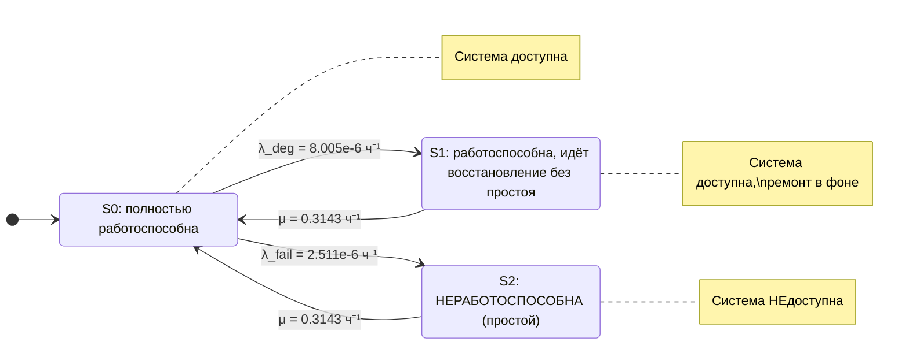

В продолжение Kg_1.md

## 1

## Марковская цепь для расчёта Кг (одиночная конфигурация SE M8000)

### 1. Почему простой двухсостояниевой модели недостаточно

Стандартная двухсостояниевая модель (Up / Down) даёт:

$$
\[
A = \frac{MTBF}{MTBF + MTTR} = \frac{MTBSI - MTTR}{MTBSI}
\]
$$

Подставляем числа из отчёта:
- $\(MTBSI = 95\,091{,}36\)$ ч
- $\(MTTR = 3{,}182\)$ ч

$$
\[
A = \frac{95\,091{,}36 - 3{,}182}{95\,091{,}36} = 0{,}99996654 \;(99{,}99665\%)
\]
$$

Но в отчёте указано **\(A = 0{,}99999195\) (99,9992%)**. Разница объясняется тем, что **не каждый инцидент приводит к простою**. Часть инцидентов устраняется горячей заменой или деградацией **без остановки системы**. Поэтому нужна **трёхсостояниевая модель**.

---

### 2. Состояния системы

| Состояние | Описание | Система доступна? |
|:---|:---|:---:|
| **S₀** | Полностью работоспособна, активных инцидентов нет | ✅ Да |
| **S₁** | Работоспособна, но идёт восстановление **без простоя** (горячая замена, деградация) | ✅ Да |
| **S₂** | **Неработоспособна** (простой, восстановление с остановкой) | ❌ Нет |

---

### 3. Переходы и интенсивности

Из отчёта:
- $\(MTBSI = 95\,091{,}36\)$ ч — среднее время между **любыми** инцидентами.
- $\(MTTR = 3{,}182\)$ ч — среднее время восстановления по всем инцидентам.
- Доступность $\(A = 0{,}99999195\)$ → доля простоя $\(P_2 = 1 - A = 8{,}05 \times 10^{-6}\)$.
- Простой в год $\(= 0{,}070\)$ ч → $\(P_2 = 0{,}070 / 8760 = 7{,}9909 \times 10^{-6}\)$.

Суммарная интенсивность инцидентов:

$$
\[
\lambda_{total} = \frac{1}{MTBSI} = \frac{1}{95\,091{,}36} = 1{,}05162 \times 10^{-5} \text{ ч}^{-1}
\]
$$

Интенсивность восстановления:

$$
\[
\mu = \frac{1}{MTTR} = \frac{1}{3{,}182} = 0{,}314268 \text{ ч}^{-1}
\]
$$

Доля инцидентов, приводящих к простою:

$$
\[
P_2 = \frac{\lambda_{fail}/\mu}{1 + \lambda_{total}/\mu}
\]
\[
\frac{\lambda_{total}}{\mu} = \frac{MTTR}{MTBSI} = \frac{3{,}182}{95\,091{,}36} = 3{,}34623 \times 10^{-5}
\]
\[
\lambda_{fail} = P_2 \cdot \mu \cdot (1 + \lambda_{total}/\mu) = 7{,}9909 \times 10^{-6} \times 0{,}314268 \times 1{,}00003346 = 2{,}5114 \times 10^{-6} \text{ ч}^{-1}
\]
\[
\lambda_{deg} = \lambda_{total} - \lambda_{fail} = 1{,}05162 \times 10^{-5} - 2{,}5114 \times 10^{-6} = 8{,}0048 \times 10^{-6} \text{ ч}^{-1}
\]
$$

| Переход | Интенсивность | Значение, ч⁻¹ | Смысл |
|:---|:---|:---|:---|
| **S₀ → S₁** | $\(\lambda_{deg}\)$ | $\(8{,}005 \times 10^{-6}\)$ | Инцидент без простоя (деградация, горячая замена) |
| **S₁ → S₀** | $\(\mu\)$ | $\(0{,}3143\)$ | Завершение ремонта без простоя |
| **S₀ → S₂** | $\(\lambda_{fail}\)$ | $\(2{,}511 \times 10^{-6}\)$ | Инцидент, приводящий к простою |
| **S₂ → S₀** | $\(\mu\)$ | $\(0{,}3143\)$ | Восстановление после простоя |

---

### 4. Граф марковской цепи (Mermaid)

---

### 5. Стационарные вероятности и проверка

Уравнения баланса:

$$
\[
P_0 \lambda_{deg} = P_1 \mu
\]
\[
P_0 \lambda_{fail} = P_2 \mu
\]
\[
P_0 + P_1 + P_2 = 1
\]
$$

Решение:

$$
\[
P_0 = \frac{1}{1 + \lambda_{total}/\mu} = \frac{1}{1 + 3{,}34623 \times 10^{-5}} \approx 0{,}99996654
\]
\[
P_1 = P_0 \frac{\lambda_{deg}}{\mu} = 0{,}99996654 \times \frac{8{,}0048 \times 10^{-6}}{0{,}314268} \approx 2{,}547 \times 10^{-5}
\]
\[
P_2 = P_0 \frac{\lambda_{fail}}{\mu} = 0{,}99996654 \times \frac{2{,}5114 \times 10^{-6}}{0{,}314268} \approx 7{,}9909 \times 10^{-6}
\]
$$

**Коэффициент готовности:**

$$
\[
A = P_0 + P_1 = 1 - P_2 = 1 - 7{,}9909 \times 10^{-6} = 0{,}99999201 \;(99{,}9992\%)
\]
$$

Совпадает с отчётом.

---

### 6. Вывод

Для одиночной конфигурации SE M8000 расчёт Кг **нельзя** свести к простой двухсостояниевой модели, потому что большинство инцидентов (≈76%) не приводят к простою. Используется **трёхсостояниевая марковская цепь**:

- **S₀** — полностью работоспособна,
- **S₁** — работоспособна, но идёт восстановление без простоя,
- **S₂** — неработоспособна (простой).

Интенсивности:
- $\(\lambda_{deg} = 8{,}005 \times 10^{-6}\)$ ч⁻¹,
- $\(\lambda_{fail} = 2{,}511 \times 10^{-6}\)$ ч⁻¹,
- $\(\mu = 0{,}3143\)$ ч⁻¹.

Именно такая модель даёт заявленные **99,9992%** при $\(MTBSI = 95\,091{,}36\) ч и \(MTTR = 3{,}182\)$ ч.
