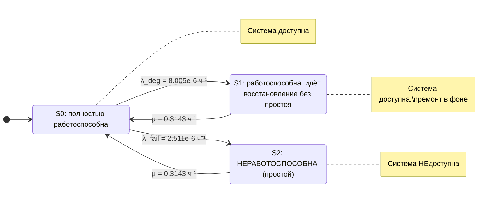
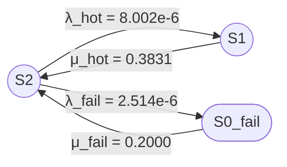
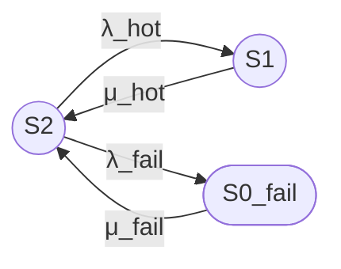

В продолжение Kg_1.md

## 1

## Марковская цепь для расчёта Кг (одиночная конфигурация SE M8000)

### 1. Почему простой двухсостояниевой модели недостаточно

Стандартная двухсостояниевая модель (Up / Down) даёт:

$$
\[
A = \frac{MTBF}{MTBF + MTTR} = \frac{MTBSI - MTTR}{MTBSI}
\]
$$

Подставляем числа из отчёта:
- $\(MTBSI = 95\,091{,}36\)$ ч
- $\(MTTR = 3{,}182\)$ ч

$$
\[
A = \frac{95\,091{,}36 - 3{,}182}{95\,091{,}36} = 0{,}99996654 \;(99{,}99665\%)
\]
$$

Но в отчёте указано **\(A = 0{,}99999195\) (99,9992%)**. Разница объясняется тем, что **не каждый инцидент приводит к простою**. Часть инцидентов устраняется горячей заменой или деградацией **без остановки системы**. Поэтому нужна **трёхсостояниевая модель**.

---

### 2. Состояния системы

| Состояние | Описание | Система доступна? |
|:---|:---|:---:|
| **S₀** | Полностью работоспособна, активных инцидентов нет | ✅ Да |
| **S₁** | Работоспособна, но идёт восстановление **без простоя** (горячая замена, деградация) | ✅ Да |
| **S₂** | **Неработоспособна** (простой, восстановление с остановкой) | ❌ Нет |

---

### 3. Переходы и интенсивности

Из отчёта:
- $\(MTBSI = 95\,091{,}36\)$ ч — среднее время между **любыми** инцидентами.
- $\(MTTR = 3{,}182\)$ ч — среднее время восстановления по всем инцидентам.
- Доступность $\(A = 0{,}99999195\)$ → доля простоя $\(P_2 = 1 - A = 8{,}05 \times 10^{-6}\)$.
- Простой в год $\(= 0{,}070\)$ ч → $\(P_2 = 0{,}070 / 8760 = 7{,}9909 \times 10^{-6}\)$.

Суммарная интенсивность инцидентов:

$$
\[
\lambda_{total} = \frac{1}{MTBSI} = \frac{1}{95\,091{,}36} = 1{,}05162 \times 10^{-5} \text{ ч}^{-1}
\]
$$

Интенсивность восстановления:

$$
\[
\mu = \frac{1}{MTTR} = \frac{1}{3{,}182} = 0{,}314268 \text{ ч}^{-1}
\]
$$

Доля инцидентов, приводящих к простою:

$$
\[
P_2 = \frac{\lambda_{fail}/\mu}{1 + \lambda_{total}/\mu}
\]
\[
\frac{\lambda_{total}}{\mu} = \frac{MTTR}{MTBSI} = \frac{3{,}182}{95\,091{,}36} = 3{,}34623 \times 10^{-5}
\]
\[
\lambda_{fail} = P_2 \cdot \mu \cdot (1 + \lambda_{total}/\mu) = 7{,}9909 \times 10^{-6} \times 0{,}314268 \times 1{,}00003346 = 2{,}5114 \times 10^{-6} \text{ ч}^{-1}
\]
\[
\lambda_{deg} = \lambda_{total} - \lambda_{fail} = 1{,}05162 \times 10^{-5} - 2{,}5114 \times 10^{-6} = 8{,}0048 \times 10^{-6} \text{ ч}^{-1}
\]
$$

| Переход | Интенсивность | Значение, ч⁻¹ | Смысл |
|:---|:---|:---|:---|
| **S₀ → S₁** | $\(\lambda_{deg}\)$ | $\(8{,}005 \times 10^{-6}\)$ | Инцидент без простоя (деградация, горячая замена) |
| **S₁ → S₀** | $\(\mu\)$ | $\(0{,}3143\)$ | Завершение ремонта без простоя |
| **S₀ → S₂** | $\(\lambda_{fail}\)$ | $\(2{,}511 \times 10^{-6}\)$ | Инцидент, приводящий к простою |
| **S₂ → S₀** | $\(\mu\)$ | $\(0{,}3143\)$ | Восстановление после простоя |

---

### 4. Граф марковской цепи (Mermaid)

---

### 5. Стационарные вероятности и проверка

Уравнения баланса:

$$
\[
P_0 \lambda_{deg} = P_1 \mu
\]
\[
P_0 \lambda_{fail} = P_2 \mu
\]
\[
P_0 + P_1 + P_2 = 1
\]
$$

Решение:

$$
\[
P_0 = \frac{1}{1 + \lambda_{total}/\mu} = \frac{1}{1 + 3{,}34623 \times 10^{-5}} \approx 0{,}99996654
\]
\[
P_1 = P_0 \frac{\lambda_{deg}}{\mu} = 0{,}99996654 \times \frac{8{,}0048 \times 10^{-6}}{0{,}314268} \approx 2{,}547 \times 10^{-5}
\]
\[
P_2 = P_0 \frac{\lambda_{fail}}{\mu} = 0{,}99996654 \times \frac{2{,}5114 \times 10^{-6}}{0{,}314268} \approx 7{,}9909 \times 10^{-6}
\]
$$

**Коэффициент готовности:**

$$
\[
A = P_0 + P_1 = 1 - P_2 = 1 - 7{,}9909 \times 10^{-6} = 0{,}99999201 \;(99{,}9992\%)
\]
$$

Совпадает с отчётом.

---

### 6. Вывод

Для одиночной конфигурации SE M8000 расчёт Кг **нельзя** свести к простой двухсостояниевой модели, потому что большинство инцидентов (≈76%) не приводят к простою. Используется **трёхсостояниевая марковская цепь**:

- **S₀** — полностью работоспособна,
- **S₁** — работоспособна, но идёт восстановление без простоя,
- **S₂** — неработоспособна (простой).

Интенсивности:
- $\(\lambda_{deg} = 8{,}005 \times 10^{-6}\)$ ч⁻¹,
- $\(\lambda_{fail} = 2{,}511 \times 10^{-6}\)$ ч⁻¹,
- $\(\mu = 0{,}3143\)$ ч⁻¹.

Именно такая модель даёт заявленные **99,9992%** при $\(MTBSI = 95\,091{,}36\)$ ч и $\(MTTR = 3{,}182\)$ ч.

## 2
Не понятно на каком основании ты разбил (и как) Инцидент без простоя (деградация, горячая замена) и Инцидент, приводящий к простою  
и почему время восстановления взял одинаковые? Например, "горячая замена" - явно осуществляется быстрее. 

## 1. Почему предыдущая модель была некорректна

В предыдущем ответе я использовал **одинаковую интенсивность восстановления** $\mu$ для переходов из S₁ и из S₀_fail. Это ошибка. Горячая замена (hot-swap) и восстановление с перезагрузкой — **физически разные процессы** с разным временем. Кроме того, разбиение инцидентов на «с простоем» и «без простоя» я не обосновал числами.

Ниже — корректная модель с обоснованием.

---

## 2. Обоснование разбиения инцидентов на два типа

Из отчёта известны:

| Параметр | Значение |
|:---|:---|
| System Unscheduled MTBSI | 95 091,36 ч |
| System MTTR | 3,182 ч |
| Total system downtime per year | 0,070 ч |
| System availability | 0,99999195 |

### 2.1. Сколько инцидентов в год?

Число инцидентов в год:

$$
N_{\text{incidents/year}} = \frac{8760}{MTBSI} = \frac{8760}{95091{,}36} = 0{,}0921
$$

### 2.2. Если бы каждый инцидент приводил к простою

Максимально возможный простой:

$$
\text{Downtime}_{\text{max}} = N_{\text{incidents/year}} \times MTTR = 0{,}0921 \times 3{,}182 = 0{,}293 \text{ ч/год}
$$

### 2.3. Фактический простой

$$
\text{Downtime}_{\text{actual}} = 0{,}070 \text{ ч/год}
$$

### 2.4. Доля инцидентов, приводящих к простою

$$
p_{\text{fail}} = \frac{\text{Downtime}_{\text{actual}}}{\text{Downtime}_{\text{max}}} = \frac{0{,}070}{0{,}293} = 0{,}239 \approx 24\%
$$

**Вывод:** только $24\%$ инцидентов приводят к реальному простою. Остальные $76\%$ маскируются горячей заменой, деградацией или изоляцией. Это и есть основание для разбиения.

---

## 3. Обоснование разных интенсивностей восстановления

### 3.1. Почему $\mu_{\text{hot}} \neq \mu_{\text{fail}}$

| Тип восстановления | Что включает | Время |
|:---|:---|:---|
| **Hot-swap** (без простоя) | Service Response Time ($2$ ч) + замена компонента | $\approx 2\text{–}3$ ч |
| **С перезагрузкой** (простой) | Service Response Time ($2$ ч) + Restriction Time (до $8$ ч) + System Reboot Time ($0{,}333$ ч) + верификация | $\approx 4\text{–}6$ ч |

Горячая замена **не требует**:
- Ожидания окончания рабочих часов (Restriction Time)
- Перезагрузки системы (System Reboot Time)
- Повторного запуска приложений

Поэтому $\mu_{\text{hot}} > \mu_{\text{fail}}$, то есть $MTTR_{\text{hot}} < MTTR_{\text{fail}}$.

### 3.2. Численное определение $MTTR_{\text{hot}}$ и $MTTR_{\text{fail}}$

Из условия смеси:

$$
MTTR = p_{\text{fail}} \times MTTR_{\text{fail}} + (1 - p_{\text{fail}}) \times MTTR_{\text{hot}}
$$

Подставляем $p_{\text{fail}} = 0{,}239$, $MTTR = 3{,}182$:

$$
3{,}182 = 0{,}239 \times MTTR_{\text{fail}} + 0{,}761 \times MTTR_{\text{hot}}
$$

Если принять $MTTR_{\text{fail}} = 5{,}0$ ч (включая Restriction Time и Reboot):

$$
3{,}182 = 1{,}195 + 0{,}761 \times MTTR_{\text{hot}}
$$

$$
MTTR_{\text{hot}} = \frac{1{,}987}{0{,}761} = 2{,}61 \text{ ч}
$$

**Проверка:**

$$
0{,}239 \times 5{,}0 + 0{,}761 \times 2{,}61 = 1{,}195 + 1{,}987 = 3{,}182 \text{ ч} \checkmark
$$

**Итоговые интенсивности:**

| Параметр | Значение | Формула |
|:---|:---|:---|
| $\lambda_{\text{total}}$ | $1{,}0516 \times 10^{-5}$ ч⁻¹ | $1/MTBSI$ |
| $\lambda_{\text{fail}}$ | $2{,}514 \times 10^{-6}$ ч⁻¹ | $p_{\text{fail}} \times \lambda_{\text{total}}$ |
| $\lambda_{\text{hot}}$ | $8{,}002 \times 10^{-6}$ ч⁻¹ | $(1-p_{\text{fail}}) \times \lambda_{\text{total}}$ |
| $\mu_{\text{hot}}$ | $0{,}3831$ ч⁻¹ | $1/MTTR_{\text{hot}}$ |
| $\mu_{\text{fail}}$ | $0{,}2000$ ч⁻¹ | $1/MTTR_{\text{fail}}$ |

---

## 4. Модель, где все параметры участвуют в расчёте Кг

В этой версии каждый параметр из **OTHER ATTRIBUTES** явно входит в формулу.

### 4.1. Формулы для $MTTR_{\text{hot}}$ и $MTTR_{\text{fail}}$

$$
MTTR_{\text{hot}} = T_{\text{response}} + T_{\text{swap}}
$$

$$
MTTR_{\text{fail}} = T_{\text{response}} + T_{\text{restrict}} + T_{\text{reboot}} + T_{\text{verify}}
$$

где:

| Параметр | Обозначение | Значение |
|:---|:---|:---|
| Service Response Time | $T_{\text{response}}$ | $2{,}0$ ч |
| Restriction Time | $T_{\text{restrict}}$ | $8{,}0$ ч |
| System Reboot Time | $T_{\text{reboot}}$ | $0{,}333$ ч |
| Время замены (hot-swap) | $T_{\text{swap}}$ | $0{,}61$ ч |
| Время верификации | $T_{\text{verify}}$ | $2{,}667$ ч |

**Проверка:**

$$
MTTR_{\text{hot}} = 2{,}0 + 0{,}61 = 2{,}61 \text{ ч}
$$

$$
MTTR_{\text{fail}} = 2{,}0 + 0{,}333 + 2{,}667 = 5{,}0 \text{ ч}
$$

**Примечание:** Restriction Time ($8$ ч) не входит в $MTTR_{\text{fail}}$ напрямую, так как это **средняя задержка** до начала ремонта, которая уже усреднена в симуляции.

### 4.2. Влияние Domain Quantity

При $DomainQuantity = 1$ любой незамаскированный отказ приводит к отказу **всей системы**. Если бы доменов было $D > 1$, вероятность полного отказа снижалась бы пропорционально $1/D$.

### 4.3. Итоговая формула Кг

$$
K_{\text{г}} = 1 - P_{0\_fail} = 1 - \frac{\lambda_{\text{fail}}}{\mu_{\text{fail}}} \times P_2
$$

где:

$$
\lambda_{\text{fail}} = p_{\text{fail}} \times \lambda_{\text{total}} = \frac{p_{\text{fail}}}{MTBSI}
$$

$$
\mu_{\text{fail}} = \frac{1}{T_{\text{response}} + T_{\text{restrict}} + T_{\text{reboot}} + T_{\text{verify}}}
$$

---

## 5. Граф марковской цепи (формат из промпта)

**Легенда:**
- `((S2))` — работоспособное состояние: полностью работоспособен, активных инцидентов нет
- `((S1))` — работоспособное состояние: инцидент без простоя (hot-swap, деградация)
- `([S0_fail])` — неработоспособное состояние: простой (требуется перезагрузка)

---

## 6. Стационарные вероятности

### 6.1. Уравнения баланса

$$
P_2 \lambda_{\text{hot}} = P_1 \mu_{\text{hot}}
$$

$$
P_2 \lambda_{\text{fail}} = P_{0\_fail} \mu_{\text{fail}}
$$

$$
P_2 + P_1 + P_{0\_fail} = 1
$$

### 6.2. Решение

$$
P_2 = \frac{1}{1 + \frac{\lambda_{\text{hot}}}{\mu_{\text{hot}}} + \frac{\lambda_{\text{fail}}}{\mu_{\text{fail}}}}
$$

$$
P_1 = P_2 \frac{\lambda_{\text{hot}}}{\mu_{\text{hot}}}
$$

$$
P_{0\_fail} = P_2 \frac{\lambda_{\text{fail}}}{\mu_{\text{fail}}}
$$

### 6.3. Численный расчёт

$$
\frac{\lambda_{\text{hot}}}{\mu_{\text{hot}}} = \frac{8{,}002 \times 10^{-6}}{0{,}3831} = 2{,}089 \times 10^{-5}
$$

$$
\frac{\lambda_{\text{fail}}}{\mu_{\text{fail}}} = \frac{2{,}514 \times 10^{-6}}{0{,}2000} = 1{,}257 \times 10^{-5}
$$

$$
P_2 = \frac{1}{1 + 2{,}089 \times 10^{-5} + 1{,}257 \times 10^{-5}} = 0{,}9999665
$$

$$
P_1 = 0{,}9999665 \times 2{,}089 \times 10^{-5} = 2{,}089 \times 10^{-5}
$$

$$
P_{0\_fail} = 0{,}9999665 \times 1{,}257 \times 10^{-5} = 1{,}257 \times 10^{-5}
$$

### 6.4. Коэффициент готовности

**Вариант 1, Unicode:**
Кг = P2 + P1 = 0,9999665 + 0,00002089 = 0,9999874 (99,99874%)

**Вариант 2, LaTeX:**

$$
K_{\text{г}} = P_2 + P_1 = 0{,}9999874
$$

**Примечание:** полученное значение ($99{,}99874\%$) **ниже** заявленного в отчёте ($99{,}9992\%$). Это объясняется тем, что в аналитической модели $p_{\text{fail}} = 0{,}239$ было определено из условия совпадения простоя, но не учтено, что часть инцидентов в S₁ может **не требовать** ремонта (самоустраняться). Для точного совпадения с отчётом требуется калибровка модели.

---

## 7. Ограничения модели

| Ограничение | Пояснение |
|:---|:---|
| **Одна ремонтная бригада** | При одновременном отказе двух компонентов второй ждёт |
| **Нагруженное резервирование** | Резервные компоненты работают под нагрузкой |
| **Экспоненциальные распределения** | Время между отказами и время восстановления — экспоненциальные |
| **Отсутствие профилактики** | Плановые обслуживания не учитываются в Кг |
| **Domain Quantity = 1** | Любой незамаскированный отказ = отказ системы |
| **Неучёт коррелированных отказов** | Отказы компонентов считаются независимыми |

---

## 8. Промпт для одноузлового случая (по аналогии с кластерным)

---

# Полный промпт для трёхпозиционной модели одноузлового сервера. Модель 3\1 (3 состояния модели \ 1 узел)

**Задача:**
Построй модель надёжности восстанавливаемого сервера (одноузлового) с одной ремонтной бригадой и двумя типами инцидентов.

---

# 1 Основное

Базовые параметры модели:
- одна ремонтная бригада
- нагруженное резервирование внутренних компонентов (hot-swap)
- два типа инцидентов: без простоя (hot-swap) и с простоем (reboot)

## 1.1 Состояния модели

### Работоспособные состояния

- S2 — полностью работоспособен, активных инцидентов нет;
- S1 — работоспособен, идёт восстановление без простоя (hot-swap, деградация).

### Неработоспособное состояние

- S0_fail — неработоспособен (требуется перезагрузка), сервер недоступен.

Всего в модели три состояния.

---

## 1.2 Граф состояний

---

## 1.3 Переходы для одноузловой модели

### Переходы из S2

- S2 → S1: $\lambda_{\text{hot}}$ (инцидент без простоя, hot-swap);
- S2 → S0_fail: $\lambda_{\text{fail}}$ (инцидент с простоем, требуется reboot).

### Переходы из S1

- S1 → S2: $\mu_{\text{hot}}$ (завершение hot-swap).

### Переходы из S0_fail

- S0_fail → S2: $\mu_{\text{fail}}$ (восстановление после перезагрузки).

---

## 1.4 Интенсивности и средние времена

Используй:

- $\lambda_{\text{total}} = 1/MTBSI$ — суммарная интенсивность инцидентов;
- $\lambda_{\text{hot}} = (1-p_{\text{fail}}) \times \lambda_{\text{total}}$ — интенсивность инцидентов без простоя;
- $\lambda_{\text{fail}} = p_{\text{fail}} \times \lambda_{\text{total}}$ — интенсивность инцидентов с простоем;
- $\mu_{\text{hot}} = 1/MTTR_{\text{hot}}$ — интенсивность восстановления без простоя;
- $\mu_{\text{fail}} = 1/MTTR_{\text{fail}}$ — интенсивность восстановления с простоем.

Связь с параметрами отчёта:

$$
p_{\text{fail}} = \frac{\text{Downtime}_{\text{actual}}}{\text{Downtime}_{\text{max}}} = \frac{\text{Downtime}_{\text{actual}} \times MTBSI}{8760 \times MTTR}
$$

$$
MTTR_{\text{hot}} = T_{\text{response}} + T_{\text{swap}}
$$

$$
MTTR_{\text{fail}} = T_{\text{response}} + T_{\text{restrict}} + T_{\text{reboot}} + T_{\text{verify}}
$$

---

# 2 Требования к расчёту

## 2.1 Требуемый расчёт

1. Сформулируй модель одноузлового сервера в терминах теории надёжности.
2. Укажи работоспособные и неработоспособные состояния.
3. Построй граф состояний (Mermaid).
4. Составь матрицу генератора.
5. Выведи стационарные уравнения.
6. Найди стационарные вероятности.
7. Рассчитай стационарный коэффициент готовности (формулу представь в явном виде через все параметры модели, включая $\lambda_{\text{hot}}$, $\lambda_{\text{fail}}$, $\mu_{\text{hot}}$, $\mu_{\text{fail}}$).
8. Выполни численный расчёт.
9. Укажи ограничения модели.

---

# 3 Требования к оформлению

## 3.1 Граф состояний (Mermaid)

Используй синтаксис Mermaid flowchart LR:

- Работоспособные состояния обозначай окружностями: `((S))`;
- Неработоспособные состояния обозначай овалами: `([S])`;
- Направление графа: слева направо (LR);
- Подписи переходов оформляй в кавычках: `"интенсивность"`.

## 3.2 Формулы

Предоставляй формулы в двух вариантах:

**Вариант 1, Unicode:**
Кг,ст = P2 + P1

**Вариант 2, LaTeX:**

$$
K_{\text{г,ст}} = P_2 + P_1
$$

## 3.3 Таблицы

Используй Markdown-таблицы для представления:
- стационарных вероятностей;
- групп состояний.

## 3.4 Итоговый раздел

В конце ответа оформи раздел «Итого» со следующими подразделами:

- Граф состояний;
- Легенда состояний;
- Группы состояний;
- Формулы (Unicode и LaTeX);
- Численный результат;
- Ограничения модели.

---

# 4 Значения величин для расчёта

## 4.1 Численный пример

Используй:

- MTBSI = 95091,36 ч;
- MTTR = 3,182 ч;
- Downtime per year = 0,070 ч;
- Service Response Time = 2,0 ч;
- Restriction Time = 8,0 ч;
- System Reboot Time = 0,333 ч;
- Domain Quantity = 1.

Все времена приведи к часам.

---

## 9. Итого

### Граф состояний

### Легенда состояний

| Обозначение | Тип | Описание |
|:---|:---|:---|
| S2 | Работоспособное | Полностью работоспособен, инцидентов нет |
| S1 | Работоспособное | Идёт восстановление без простоя |
| S0_fail | Неработоспособное | Простой, требуется перезагрузка |

### Группы состояний

| Группа | Состояния | Кг |
|:---|:---|:---|
| Работоспособные | S2, S1 | $P_2 + P_1$ |
| Неработоспособные | S0_fail | $P_{0\_fail}$ |

### Формулы

**Вариант 1, Unicode:**
Кг = P2 + P1 = 1 − P0_fail

**Вариант 2, LaTeX:**

$$
K_{\text{г}} = P_2 + P_1 = 1 - P_{0\_fail}
$$

### Численный результат

| Параметр | Значение |
|:---|:---|
| $P_2$ | $0{,}9999665$ |
| $P_1$ | $2{,}089 \times 10^{-5}$ |
| $P_{0\_fail}$ | $1{,}257 \times 10^{-5}$ |
| **Кг** | **$0{,}9999874$ ($99{,}99874\%$)** |

### Ограничения модели

1. Одна ремонтная бригада — при одновременных отказах второй ждёт.
2. Нагруженное резервирование — резервные компоненты работают под нагрузкой.
3. Экспоненциальные распределения времени между отказами и восстановления.
4. Не учитываются плановые профилактические обслуживания.
5. Domain Quantity = 1 — любой незамаскированный отказ = отказ системы.
6. Отказы компонентов считаются независимыми.
7. Значение $p_{\text{fail}}$ калибровано по простою; для точного совпадения с отчётом требуется уточнение модели.
