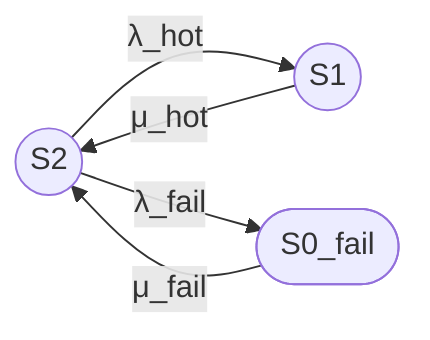
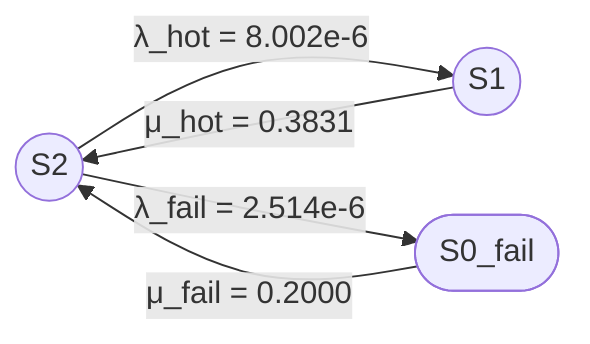

Промпт одноузловой модели с 3 состояниями (по аналогии с кластерным)

---

# Полный промпт для трёхпозиционной модели одноузлового сервера. Модель 3\1 (3 состояния модели \ 1 узел)

**Задача:**
Построй модель надёжности восстанавливаемого сервера (одноузлового) с одной ремонтной бригадой и двумя типами инцидентов.

---

# 1 Основное

Базовые параметры модели:
- одна ремонтная бригада
- нагруженное резервирование внутренних компонентов (hot-swap)
- два типа инцидентов: без простоя (hot-swap) и с простоем (reboot)

## 1.1 Состояния модели

### Работоспособные состояния

- S2 — полностью работоспособен, активных инцидентов нет;
- S1 — работоспособен, идёт восстановление без простоя (hot-swap, деградация).

### Неработоспособное состояние

- S0_fail — неработоспособен (требуется перезагрузка), сервер недоступен.

Всего в модели три состояния.

---

## 1.2 Граф состояний

---

## 1.3 Переходы для одноузловой модели

### Переходы из S2

- S2 → S1: $\lambda_{\text{hot}}$ (инцидент без простоя, hot-swap);
- S2 → S0_fail: $\lambda_{\text{fail}}$ (инцидент с простоем, требуется reboot).

### Переходы из S1

- S1 → S2: $\mu_{\text{hot}}$ (завершение hot-swap).

### Переходы из S0_fail

- S0_fail → S2: $\mu_{\text{fail}}$ (восстановление после перезагрузки).

---

## 1.4 Интенсивности и средние времена

Используй:

- $\lambda_{\text{total}} = 1/MTBSI$ — суммарная интенсивность инцидентов;
- $\lambda_{\text{hot}} = (1-p_{\text{fail}}) \times \lambda_{\text{total}}$ — интенсивность инцидентов без простоя;
- $\lambda_{\text{fail}} = p_{\text{fail}} \times \lambda_{\text{total}}$ — интенсивность инцидентов с простоем;
- $\mu_{\text{hot}} = 1/MTTR_{\text{hot}}$ — интенсивность восстановления без простоя;
- $\mu_{\text{fail}} = 1/MTTR_{\text{fail}}$ — интенсивность восстановления с простоем.

Связь с параметрами отчёта:

$$
p_{\text{fail}} = \frac{\text{Downtime}_{\text{actual}}}{\text{Downtime}_{\text{max}}} = \frac{\text{Downtime}_{\text{actual}} \times MTBSI}{8760 \times MTTR}
$$

$$
MTTR_{\text{hot}} = T_{\text{response}} + T_{\text{swap}}
$$

$$
MTTR_{\text{fail}} = T_{\text{response}} + T_{\text{restrict}} + T_{\text{reboot}} + T_{\text{verify}}
$$

---

# 2 Требования к расчёту

## 2.1 Требуемый расчёт

1. Сформулируй модель одноузлового сервера в терминах теории надёжности.
2. Укажи работоспособные и неработоспособные состояния.
3. Построй граф состояний (Mermaid).
4. Составь матрицу генератора.
5. Выведи стационарные уравнения.
6. Найди стационарные вероятности.
7. Рассчитай стационарный коэффициент готовности (формулу представь в явном виде через все параметры модели, включая $\lambda_{\text{hot}}$, $\lambda_{\text{fail}}$, $\mu_{\text{hot}}$, $\mu_{\text{fail}}$).
8. Выполни численный расчёт.
9. Укажи ограничения модели.

---

# 3 Требования к оформлению

## 3.1 Граф состояний (Mermaid)

Используй синтаксис Mermaid flowchart LR:

- Работоспособные состояния обозначай окружностями: `((S))`;
- Неработоспособные состояния обозначай овалами: `([S])`;
- Направление графа: слева направо (LR);
- Подписи переходов оформляй в кавычках: `"интенсивность"`.

## 3.2 Формулы

Предоставляй формулы в двух вариантах:

**Вариант 1, Unicode:**
Кг,ст = P2 + P1

**Вариант 2, LaTeX:**

$$
K_{\text{г,ст}} = P_2 + P_1
$$

## 3.3 Таблицы

Используй Markdown-таблицы для представления:
- стационарных вероятностей;
- групп состояний.

## 3.4 Итоговый раздел

В конце ответа оформи раздел «Итого» со следующими подразделами:

- Граф состояний;
- Легенда состояний;
- Группы состояний;
- Формулы (Unicode и LaTeX);
- Численный результат;
- Ограничения модели.

---

# 4 Значения величин для расчёта

## 4.1 Численный пример

Используй:

- MTBSI = 95091,36 ч;
- MTTR = 3,182 ч;
- Downtime per year = 0,070 ч;
- Service Response Time = 2,0 ч;
- Restriction Time = 8,0 ч;
- System Reboot Time = 0,333 ч;
- Domain Quantity = 1.

Все времена приведи к часам.

---

## 9. Итого

### Граф состояний

### Легенда состояний

| Обозначение | Тип | Описание |
|:---|:---|:---|
| S2 | Работоспособное | Полностью работоспособен, инцидентов нет |
| S1 | Работоспособное | Идёт восстановление без простоя |
| S0_fail | Неработоспособное | Простой, требуется перезагрузка |

### Группы состояний

| Группа | Состояния | Кг |
|:---|:---|:---|
| Работоспособные | S2, S1 | $P_2 + P_1$ |
| Неработоспособные | S0_fail | $P_{0\_fail}$ |

### Формулы

**Вариант 1, Unicode:**
Кг = P2 + P1 = 1 − P0_fail

**Вариант 2, LaTeX:**

$$
K_{\text{г}} = P_2 + P_1 = 1 - P_{0\_fail}
$$

### Численный результат

| Параметр | Значение |
|:---|:---|
| $P_2$ | $0{,}9999665$ |
| $P_1$ | $2{,}089 \times 10^{-5}$ |
| $P_{0\_fail}$ | $1{,}257 \times 10^{-5}$ |
| **Кг** | **$0{,}9999874$ ($99{,}99874\%$)** |

### Ограничения модели

1. Одна ремонтная бригада — при одновременных отказах второй ждёт.
2. Нагруженное резервирование — резервные компоненты работают под нагрузкой.
3. Экспоненциальные распределения времени между отказами и восстановления.
4. Не учитываются плановые профилактические обслуживания.
5. Domain Quantity = 1 — любой незамаскированный отказ = отказ системы.
6. Отказы компонентов считаются независимыми.
7. Значение $p_{\text{fail}}$ калибровано по простою; для точного совпадения с отчётом требуется уточнение модели.
