## 1 ris

Рисунок 3 показывает базовую модель **Type 0** для нерезервированного компонента $\(N=K\)$. Рисунок 4 показывает более богатую модель **Type 3** для резервированной пары \(N=2,\ K=1\): recovery вызывает interruption, но штатный repair/reintegration после перехода в деградированный режим не должен останавливать сервис.

Сразу важное разграничение: **Figure 4 — это не Type 4, а Type 3**. В нём `AR1` имеет reward $\(0\)$, потому что recovery nontransparent, но `PF1` — состояние доступного деградированного режима с reward \(1\); сервис продолжает работать во время ожидания и штатного ремонта первого отказавшего компонента.

## Как читать рисунки

В RAScad состояние Markov-цепи имеет reward:

$$
\[
r_s =
\begin{cases}
1, & \text{пользовательская функция доступна};\\
0, & \text{пользовательская функция недоступна}.
\end{cases}
\]
$$

Для Type 0:

$$
\[
N=K,
\]
$$

то есть потеря компонента означает потерю требуемой функции.

Для Figure 4 / Type 3:

$$
\[
N=2,\qquad K=1.
\]
$$

Следовательно:

- пока работает хотя бы один из двух компонентов, функция может быть доступна;
- после первого permanent fault система переходит в `PF1` — работает в degraded mode;
- после второго permanent fault возникает `PF2` — требование \(K=1\) больше не выполняется, сервис недоступен;
- recovery nontransparent, поэтому состояния automatic recovery вносят вклад в downtime;
- repair transparent, поэтому сам штатный ремонт первого отказавшего компонента не обязан создавать downtime.

## Рисунок 3: Type 0

### Смысл Figure 3

Figure 3 в статье — это Markov Model Type 0 для блока без резерва. В отличие от Type 3 здесь нет:

- `PF1` как доступного degraded state;
- `Latent1` как состояния скрытой потери резерва;
- второго отказа как отдельного события потери последнего работающего экземпляра;
- логики $\(N\)$-out-of-$\(K\)$.

Отказ единственного обязательного компонента переводит систему в ветвь восстановления или ремонта с reward $\(0\)$.

Ниже — структурная перерисовка Figure 3 в Mermaid. Она передаёт логику модели: normal operation, permanent fault, transient fault, recovery и service error. Названия состояний даны в более читаемом виде, чем в оригинальной диаграмме.

```mermaid
stateDiagram-v2
    direction LR

    [*] --> Ok

    state "Ok: компонент исправен; r = 1" as Ok
    state "TF: transient fault; r = 0" as TF
    state "AR: automatic recovery / restart; r = 0" as AR
    state "PF: permanent fault; ремонт требуется; r = 0" as PF
    state "SE: service error; неверная диагностика или repair; r = 0" as SE

    Ok --> TF: transient failure rate
    TF --> AR: запуск recovery
    AR --> Ok: recovery успешен
    AR --> PF: recovery не устранил отказ

    Ok --> PF: permanent fault; MTBF
    PF --> Ok: correct diagnosis, corrective action, verification
    PF --> SE: incorrect diagnosis or corrective action
    SE --> Ok: повторный repair; MTTRFID
```



### Интерпретация переходов Type 0

#### Нормальная работа

```text
Ok, r = 1
```

Компонент функционирует. Для блока без резерва это единственное штатное доступное состояние.

#### Permanent fault

```text
Ok → PF
```

Возникает hard failure, требующий физического ремонта либо замены FRU. Так как $\(N=K\)$, исправного резервного экземпляра нет. Следовательно, пока компонент не восстановлен, пользовательская функция недоступна.

#### Transient fault

```text
Ok → TF → AR → Ok
```

Transient fault может быть вызван, например, software defect, power surge, environmental factor либо иной временной ошибкой. Если automatic recovery успешно — система возвращается в `Ok`; если нет, transient path превращается в более тяжёлый отказной путь, требующий ремонта.

#### Service error

```text
PF → SE → Ok
```

Repair не всегда завершается успехом с первого раза. В статье это учитывается через probability of correct diagnosis $\(P_{cd}\)$ и среднее время устранения последствий неправильной диагностики \(MTTRFID\).

Идея Type 0 проста:

$$
\[
\text{failure}
\Rightarrow
\text{service unavailable until recovery or repair}.
\]
$$

## Рисунок 4: Type 3

### Назначение Figure 4

Figure 4 — это **Markov Model Type 3** для случая:

$$
\[
N=2,\qquad K=1,
\]
$$

при комбинации:

$$
\[
\text{nontransparent recovery}
+
\text{transparent repair}.
\]
$$

То есть:

- при отказе recovery/failover временно нарушает пользовательскую доступность;
- после успешного recovery система работает на одном экземпляре;
- ремонт и reintegration первого отказавшего компонента в штатном случае происходят без дополнительного interruption;
- доступность сохраняется, но отказоустойчивость временно снижена.

### Состояния Figure 4

| Состояние | Смысл | Reward |
|---|---|---:|
| `Ok` | Оба компонента исправны, нормальный режим | 1 |
| `AR1` | Automatic recovery после первого обнаруженного отказа | 0 |
| `PF1` | Один permanent fault; второй компонент обеспечивает работу | 1 |
| `Latent1` | Один permanent fault не обнаружен; резерв скрыто утрачен | 1 |
| `TF1` | Первый transient fault | 0 в течение recovery-path |
| `SPF` | Recovery неуспешен, возникло single-point failure condition | 0 |
| `PF2` | Второй permanent fault при уже деградированной системе | 0 |
| `TF2` | Transient fault, возникший при уже имеющемся permanent fault | 0 в течение recovery-path |
| `ServiceError` | Неправильная диагностика/замена; extended downtime | 0 |

### Mermaid-перерисовка Figure 4

```mermaid
stateDiagram-v2
    direction LR

    [*] --> Ok

    state "Ok: два исправных компонента; r = 1" as Ok
    state "AR1: recovery после первого обнаруженного отказа; r = 0" as AR1
    state "PF1: один permanent fault; degraded mode; r = 1" as PF1
    state "Latent1: скрытый permanent fault; r = 1" as Latent1
    state "TF1: первый transient fault; r = 0" as TF1
    state "AR2: recovery при transient fault в degraded mode; r = 0" as AR2
    state "PF2: второй permanent fault; r = 0" as PF2
    state "TF2: transient fault при уже имеющемся permanent fault; r = 0" as TF2
    state "SPF: automatic recovery неуспешен; r = 0" as SPF
    state "ServiceError: incorrect diagnosis or repair; r = 0" as ServiceError

    Ok --> AR1: detected permanent fault
    Ok --> Latent1: undetected permanent fault
    Ok --> TF1: first transient fault

    Latent1 --> AR1: latent fault detected after MTTDLF

    TF1 --> AR1: automatic recovery begins

    AR1 --> PF1: recovery succeeds
    AR1 --> SPF: recovery fails; Pspf

    PF1 --> Ok: successful repair after MTTM + Tresp
    PF1 --> ServiceError: incorrect diagnosis or corrective action
    ServiceError --> Ok: repeat repair; MTTRFID

    PF1 --> PF2: second permanent fault
    PF1 --> TF2: transient fault on remaining component

    Latent1 --> PF2: second permanent fault
    Latent1 --> TF2: transient fault on remaining component

    TF2 --> AR2: automatic recovery begins
    AR2 --> PF1: recovery succeeds
    AR2 --> SPF: recovery fails

    SPF --> PF2: service remains unavailable; repair required
    PF2 --> Ok: immediate service action and successful repair
```



Mermaid поддерживает state diagrams через `stateDiagram-v2`, состояния с алиасами и подписи переходов после двоеточия — поэтому этот код можно использовать в GitHub Markdown или Mermaid Live Editor. [mermaid](https://mermaid.ai/open-source/syntax/stateDiagram.html)

## Основные траектории Figure 4

### Обнаруженный permanent fault

```text
Ok → AR1 → PF1 → Ok
```

Развёрнуто:

```text
Ok
 │
 │ detected permanent fault
 ▼
AR1
 │
 ├── automatic recovery succeeded
 ▼
PF1
 │
 │ repair after logistics delay
 │ MTTM + Tresp
 ▼
Ok
```

Здесь важна семантика `AR1` и `PF1`.

```text
AR1: r = 0
PF1: r = 1
```

То есть пользователь замечает interruption во время automatic recovery. Но после успешного recovery сервис снова доступен, хотя работает с единственным оставшимся исправным компонентом.

Если это двухузловой кластер, путь можно интерпретировать так:

```text
Node A отказал
   │
   ▼
Failover / restart / reconfiguration
   │
   ▼
Node B обслуживает приложение
   │
   ▼
Node A ремонтируется и возвращается в конфигурацию
```

### Необнаруженный permanent fault

```text
Ok → Latent1 → AR1 → PF1
```

```text
Ok
 │
 │ permanent fault remains undetected
 ▼
Latent1
 │
 │ elapsed time: MTTDLF
 ▼
AR1
 │
 ▼
PF1
```

`Latent1` опасно тем, что пользовательский сервис ещё доступен, но резерв уже потерян. Снаружи система выглядит работоспособной:

$$
\[
r_{\text{Latent1}}=1.
\]
$$

Однако фактическое состояние отказоустойчивости уже изменилось:

$$
\[
N_{\text{working}}=1,\qquad K=1.
\]
$$

Следующий отказ может сразу привести к полной недоступности.

### Первый transient fault

```text
Ok → TF1 → AR1 → Ok
```

Если recovery проходит успешно, permanent repair не требуется:

```text
Ok
 │
 │ transient fault
 ▼
TF1
 │
 │ automatic recovery
 ▼
AR1
 │
 └── successful recovery
       │
       ▼
      Ok
```

Но Type 3 означает nontransparent recovery, поэтому даже успешно устранённый transient fault создаёт downtime на время restart, recovery или failover.

### Второй permanent fault

```text
PF1 → PF2
```

или:

```text
Latent1 → PF2
```

В обоих случаях условие работоспособности нарушено:

$$
\[
N_{\text{working}}=0 < K=1.
\]
$$

Поэтому `PF2` имеет reward \(0\). В статье подчёркивается, что в `PF2` сервисный вызов инициируется немедленно: ждать планового окна \(MTTM\) нельзя, поскольку система уже недоступна.

### Transient fault в degraded mode

```text
PF1 → TF2 → AR2 → PF1
```

Это важнейший сценарий для оценки degraded risk.

```text
PF1
 │
 │ transient fault единственного оставшегося узла
 ▼
TF2
 │
 │ automatic recovery
 ▼
AR2
 │
 ├── successful recovery
 ▼
PF1

AR2
 │
 └── recovery failure
       ▼
      SPF
```

Даже если второй сбой transient и успешно устраняется, услуга временно недоступна, потому что работает только один оставшийся компонент, а recovery nontransparent.

### Неуспешный automatic recovery

```text
AR1 → SPF
```

или:

```text
AR2 → SPF.
```

В статье вероятность этого сценария задаётся параметром probability of SPF during AR:

$$
\[
P_{spf}.
\]
$$

Смысл: automatic recovery может не вернуть систему в ожидаемый degraded operational state. Например, возможно повреждение данных, неуспешный reboot, некорректное failover состояние либо другой сценарий, после которого требуется более тяжёлое восстановление.

### Ошибочный ремонт

```text
PF1 → ServiceError → Ok
```

В штатном Type 3 маршруте система из `PF1` должна вернуться в `Ok` после ремонта. Но если диагностика неверна либо corrective action не устранила исходную проблему, модель переводит систему в `ServiceError`.

Параметры:

$$
\[
P_{cd}
=
\Pr(\text{correct diagnosis and correction}),
\]
$$


$$
\[
MTTRFID
=
\text{mean time to repair after incorrect diagnosis}.
\]
$$

Именно этот путь отражает важную эксплуатационную реальность: downtime и длительность восстановления часто определяются не только ремонтопригодностью FRU, но и качеством диагностики, процедурой troubleshooting и корректностью сервисного действия.

## Как из Figure 4 получить Type 4

Figure 4 описывает Type 3, поэтому после `PF1` штатный ремонт не вводит отдельного состояния downtime. Для преобразования в **Type 4** нужно добавить между `PF1` и `Ok` состояние nontransparent repair/reintegration:

```mermaid
stateDiagram-v2
    direction LR

    state "PF1: degraded mode; service Up; r = 1" as PF1
    state "M1: repair/reintegration interruption; r = 0" as M1
    state "Ok: оба компонента исправны; r = 1" as Ok
    state "ServiceError: extended repair downtime; r = 0" as ServiceError

    PF1 --> M1: repair/reintegration requires outage
    M1 --> Ok: correct diagnosis, repair and reintegration
    M1 --> ServiceError: incorrect diagnosis or corrective action
    ServiceError --> M1: repeated maintenance action
```



Это изменение означает:


$$
\[
\text{Type 3}
=
\text{nontransparent recovery}
+
\text{transparent repair},
\]
$$
$$
\[
\text{Type 4}
=
\text{nontransparent recovery}
+
\text{nontransparent repair}.
\]
$$

В Type 4 после успешного failover пользователь может сначала наблюдать downtime из-за `AR1`, затем сервис работает в `PF1`, а позднее появляется второй downtime, когда начинается `M1`.

Однако `M1` не обязан включать весь календарный период ремонта. Его длительность определяется тем, какие части maintenance lifecycle действительно требуют остановки пользовательской функции:

- при hot-plug без dynamic reconfiguration — возможно, только restart и reintegration;
- при non-hot-pluggable component — shutdown, physical replacement, boot, verification и reintegration;
- при cluster-wide reconfiguration — период, в который невозможно сохранить active service на оставшемся узле.

## 2

Да. Сначала уточнение: в статье не используется запись `N^Quantity`. Корректная исходная формулировка авторов:

> “Let \(N\) represents Quantity and \(K\) represents Minimum Quantity Required.”

То есть \(N\) — это `Quantity`, а \(K\) — `Minimum Quantity Required`. В Mermaid и в русской интерпретации лучше писать именно так:

\[
N = \text{Quantity}, \qquad K = \text{Minimum Quantity Required}.
\]

## Оригинальные подписи рисунков

| Оригинальная подпись | Перевод |
|---|---|
| `Figure 3. Markov Model Type 0` | Рисунок 3. Марковская модель типа 0 |
| `Figure 4. Markov Model Type 3` | Рисунок 4. Марковская модель типа 3 |

Тип 0 используется, когда:

\[
N=K.
\]

То есть резервирования нет: все установленные экземпляры необходимы для обеспечения функции.

Для Type 1–Type 4 используется условие:

\[
N>K.
\]

То есть экземпляров больше, чем минимально необходимо; присутствует резервирование.

В Figure 4 авторы для иллюстрации задают:

\[
N=2,\qquad K=1.
\]

Перевод:

> Имеются два экземпляра компонента; для работоспособности системы нужен как минимум один.

Это симметричная схема `2-out-of-1`, то есть два однотипных компонента, из которых достаточно одного работающего.

## Базовые обозначения

| Оригинал | Перевод | Точное значение в RAScad |
|---|---|---|
| `Quantity` | Количество экземпляров | Сколько однотипных FRU или компонентов содержится в рассматриваемом блоке |
| `Minimum Quantity Required` | Минимально требуемое количество экземпляров | Сколько исправных экземпляров необходимо для сохранения функции блока |
| `N` | Количество экземпляров | Формальное обозначение `Quantity` |
| `K` | Минимально требуемое количество | Формальное обозначение `Minimum Quantity Required` |
| `N = K` | Нет резервирования | Отказ любого требуемого экземпляра нарушает работу блока |
| `N > K` | Есть резервирование | Некоторое число отказов может быть пережито без потери функции |
| `N - K > 1` | Запас резервирования больше одного экземпляра | RAScad повторяет группы состояний первого, второго и последующих отказов |
| `1` внутри состояния | Работоспособное состояние | Reward rate равен 1: функция доступна пользователю |
| `0` внутри состояния | Неработоспособное состояние | Reward rate равен 0: функция недоступна пользователю |

Формально availability вычисляется по всем состояниям цепи:

\[
A=\sum_{s \in S}\pi_s r_s,
\]

где:

- \(\pi_s\) — вероятность нахождения в состоянии \(s\);
- \(r_s\) — reward rate состояния: 1 или 0.

## Оригинальные подписи Figure 4

Ниже приведены обозначения состояний Figure 4 / Markov Model Type 3 и их смысл. Английские краткие имена сохранены в том виде, который используется авторами.

| Оригинальная подпись | Развёртка | Перевод | Смысл |
|---|---|---|---|
| `Ok` | Normal/operational state | Нормальное работоспособное состояние | Оба компонента исправны; система доступна |
| `TF1` | Transient Fault 1 | Первый временный отказ | Первый transient fault, например ошибка ПО, power surge, кратковременное нарушение состояния |
| `AR1` | Automatic Recovery 1 | Первое автоматическое восстановление | Recovery/failover после первого обнаруженного отказа |
| `PF1` | Permanent Fault 1 | Первый постоянный отказ | Один компонент отказал окончательно; система работает на оставшемся экземпляре |
| `Latent1` | Latent Fault 1 | Первый скрытый отказ | Один компонент уже отказал, но отказ ещё не обнаружен |
| `SPF` | Single Point of Failure state | Состояние единичной точки отказа | Recovery не завершился штатно; система становится недоступной |
| `PF2` | Permanent Fault 2 | Второй постоянный отказ | Второй отказ в деградированном режиме; при \(N=2,\ K=1\) сервис потерян |
| `TF2` | Transient Fault 2 | Второй временный отказ | Transient fault, возникший при уже имеющемся permanent fault |
| `ServiceError` | Service Error state | Состояние сервисной ошибки | Последствие неверной диагностики или некорректного corrective action |

Числа `1` и `2` в `TF1`, `PF1`, `TF2`, `PF2` обозначают не номер физического узла `Node 1` / `Node 2`, а порядковый уровень отказного состояния:

- `1` — первый отказ при наличии достаточного резерва;
- `2` — следующий отказ, когда система уже находится в degraded mode.

Для \(N=2,\ K=1\):

```text
Ok       = оба компонента доступны
PF1      = один компонент отказал, один работает
PF2      = оба компонента отказали
```

## Оригинальные параметры и перевод

### Параметры отказов

| Оригинал | Перевод | Значение |
|---|---|---|
| `MTBF` | Mean Time Between Failures | Средняя наработка между постоянными отказами |
| `Transient Failure Rate` | Интенсивность временных отказов | Частота transient faults; в статье задаётся в FIT |
| `FIT` | Failures In Time | Отказы на \(10^9\) часов |
| `Plf` | Probability of Latent Fault | Вероятность скрытого отказа |
| `MTTDLF` | Mean Time To Detect Latent Fault | Среднее время до обнаружения скрытого отказа |

Для первого permanent fault исходный смысл переходов такой:

```text
Ok → AR1
```

если отказ обнаружен,

и:

```text
Ok → Latent1
```

если permanent fault не обнаружен и становится latent fault.

Упрощённо это можно представить как разветвление:

\[
\Pr(\text{detected permanent fault}) = 1-P_{lf},
\]

\[
\Pr(\text{latent permanent fault}) = P_{lf}.
\]

### Параметры automatic recovery

| Оригинал | Перевод | Значение |
|---|---|---|
| `Automatic Recovery (AR)` | Автоматическое восстановление | Автоматический recovery/failover после обнаруженного отказа |
| `Transparent` | Прозрачное восстановление | Нет downtime, видимого пользователю |
| `Nontransparent` | Непрозрачное восстановление | Recovery создаёт downtime |
| `AR/Failover Time` | Время автоматического восстановления / переключения | Задаваемое пользователем время interruption, связанное с AR |
| `Pspf` | Probability of SPF during AR | Вероятность возникновения SPF при automatic recovery |
| `Tspf` | SPF State Recovery Time | Время восстановления из состояния SPF |

Для Figure 4 логика первого detected permanent fault:

```text
Ok → AR1
```

После этого:

```text
AR1 → PF1
```

если automatic recovery успешен,

либо:

```text
AR1 → SPF
```

если recovery неудачен.

В Type 3 состояние `AR1` имеет reward 0, поскольку это `Nontransparent recovery`. Состояние `PF1` имеет reward 1: recovery уже завершён, и система работает на оставшемся компоненте.

### Параметры сервиса и ремонта

| Оригинал | Перевод | Значение |
|---|---|---|
| `MTTM` | Mean Time To Maintenance | Среднее время до начала обслуживания; service restriction time |
| `Tresp` | Service Response Time | Время ожидания прибытия сервисной службы |
| `MTTR Part 1: Diagnosis Time` | Время диагностики | Время идентификации неисправного компонента |
| `MTTR Part 2: Corrective Action Time` | Время корректирующего действия | Время замены или устранения неисправности |
| `MTTR Part 3: Verification Time` | Время верификации | Время проверки replacement component либо восстановления данных |
| `Pcd` | Probability of Correct Diagnosis | Вероятность правильной диагностики и корректной замены |
| `MTTRFID` | Mean Time To Repair From Incorrect Diagnosis | Среднее время устранения ошибки после неверной диагностики |
| `Reintegration Time` | Время reintegration | Время возврата repaired/replacement component в рабочую конфигурацию |
| `Tboot` | Reboot Time | Время перезагрузки системы |

В тексте статьи путь ремонта из `PF1` описан так:

```text
PF1 → Ok
```

после логистической задержки:

\[
MTTM+T_{resp},
\]

если repair успешен.

Если диагностика или corrective action неуспешны:

```text
PF1 → ServiceError.
```

После дополнительного времени:

\[
MTTRFID,
\]

система возвращается к нормальной работе.

## Figure 4 с английскими подписями и переводом

Ниже — Mermaid-версия, в которой английские оригинальные обозначения сохранены внутри состояний, а после тире дан русский перевод.

```mermaid
stateDiagram-v2
    direction LR

    [*] --> Ok

    state "Ok — нормальное работоспособное состояние; r = 1" as Ok
    state "TF1 — первый временный отказ; r = 0" as TF1
    state "AR1 — первое автоматическое восстановление; r = 0" as AR1
    state "PF1 — первый постоянный отказ; degraded mode; r = 1" as PF1
    state "Latent1 — первый скрытый отказ; r = 1" as Latent1
    state "TF2 — второй временный отказ; r = 0" as TF2
    state "AR2 — recovery при отказе в degraded mode; r = 0" as AR2
    state "PF2 — второй постоянный отказ; r = 0" as PF2
    state "SPF — single point of failure state; r = 0" as SPF
    state "ServiceError — сервисная ошибка; r = 0" as ServiceError

    Ok --> AR1: detected permanent fault
    Ok --> Latent1: undetected permanent fault
    Ok --> TF1: first transient fault

    Latent1 --> AR1: latent fault detected after MTTDLF

    TF1 --> AR1: automatic recovery
    AR1 --> PF1: recovery succeeds
    AR1 --> SPF: recovery fails; Pspf

    PF1 --> Ok: successful repair after MTTM + Tresp
    PF1 --> ServiceError: incorrect diagnosis or corrective action
    ServiceError --> Ok: repair from incorrect diagnosis; MTTRFID

    PF1 --> PF2: second permanent fault
    PF1 --> TF2: transient fault in degraded mode

    Latent1 --> PF2: second permanent fault
    Latent1 --> TF2: transient fault in degraded mode

    TF2 --> AR2: automatic recovery
    AR2 --> PF1: recovery succeeds
    AR2 --> SPF: recovery fails

    SPF --> PF2: service unavailable; repair required
    PF2 --> Ok: immediate service action and successful repair
```



## Важная оговорка о точности Figure 3

Текст статьи подробно объясняет назначение Type 0, Type 3 и всех параметров, а также явно описывает переходы Figure 4. Но в текстовом извлечении PDF графические подписи внутри Figure 3 и Figure 4 распознаются не полностью: часть формульных labels является растровой графикой, а не текстовым слоем документа.

Поэтому следует различать:

- подписи, которые приведены выше как **дословные термины статьи**: `Quantity`, `Minimum Quantity Required`, `Ok`, `TF1`, `AR1`, `PF1`, `Latent1`, `SPF`, `PF2`, `TF2`, `ServiceError`, `MTTM`, `Tresp`, `MTTDLF`, `Pspf`, `MTTRFID` и другие;
- точное типографическое размещение параметров у конкретных стрелок на исходном рисунке;
- Mermaid-перерисовку, которая воспроизводит описанную авторами семантику цепи, но не претендует на побуквенную факсимильную копию схемы IEEE.

Если вам нужна именно факсимильная транскрипция каждой подписи у стрелок — включая все дроби, индексы, степени и вероятности — лучше прислать отдельно увеличенные изображения Figure 3 и Figure 4. Тогда можно будет построить Mermaid-версию с полным соответствием каждой стрелке оригинала.

