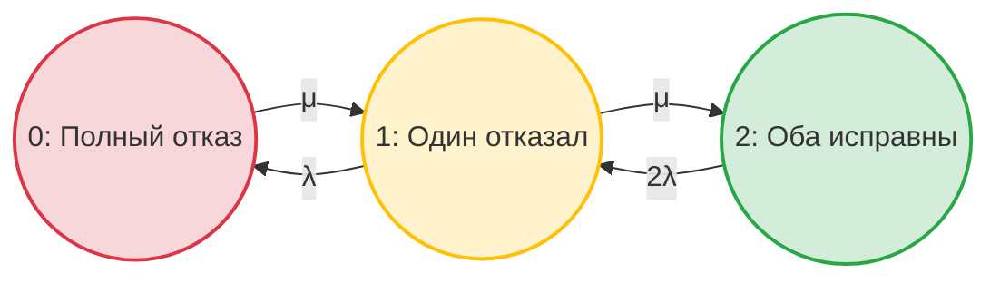
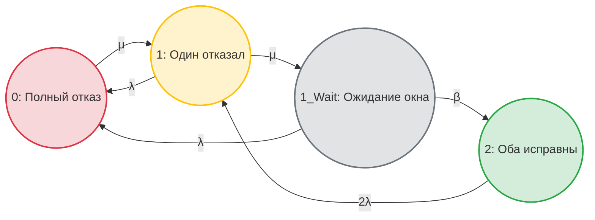
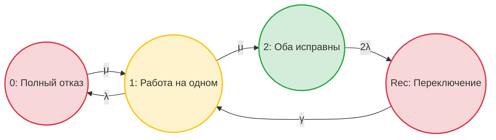
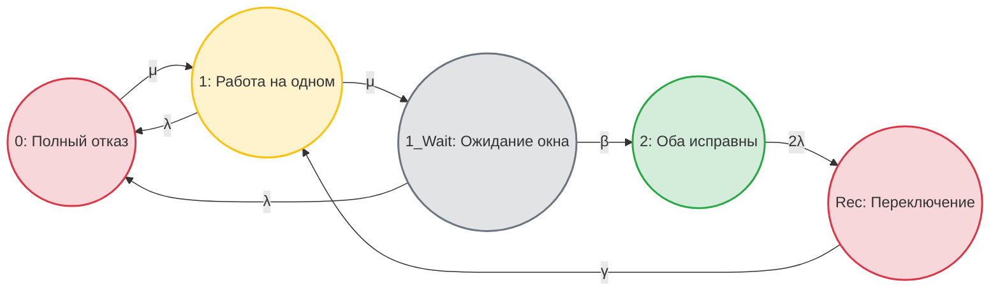

## term
- Permanent faults, [Resource Management for Improving Overall Reliability of Multi-Processor Systems-on-Chip](https://www.researchgate.net/publication/347529856_Resource_Management_for_Improving_Overall_Reliability_of_Multi-Processor_Systems-on-Chip)
- Fault Tolerance in Distributed System https://www.geeksforgeeks.org/computer-networks/fault-tolerance-in-distributed-system/
  - Transient Faults: Кратковременные сбои — это типы неисправностей, которые возникают один раз, а затем исчезают. Такие сбои не наносят системе значительного вреда, но их очень трудно обнаружить или локализовать. 
  - Intermittent Faults: Периодические сбои — это тип неисправностей, которые возникают снова и снова. Например, однажды возникшая неисправность исчезает, а затем появляется снова. Примером периодического сбоя является зависание работающего компьютера.
  - Permanent Faults: Постоянные неисправности — это типы неисправностей, которые остаются в системе до тех пор, пока компонент не будет заменен другим.

## 2
1. Transparent recovery, transparent repair
2. Transparent recovery, nontransparent repair
3. Nontransparent recovery, transparent repair
4. Nontransparent recovery, nontransparent repair

В контексте отказоустойчивости систем и моделирования надежности (в частности, в инструменте RAScad для архитектуры систем высокой доступности при N=2, K=1), термины Recovery (Восстановление) и Repair (Ремонт) разделяют на два принципиальных этапа:

   1. Recovery (Восстановление сервиса): Как система реагирует в момент сбоя одного из элементов. Если восстановление прозрачное, система продолжает работать без прерывания функций для пользователя (failover происходит мгновенно). Если непрозрачное — происходит кратковременный сбой, деградация или перезагрузка, заметная пользователю.
   2. Repair (Ремонт / Замена компонента): Как происходит возврат поврежденного компонента в строй. Если ремонт прозрачный, компонент чинится/заменяется «на лету» (hot-swap) и возвращается в систему без остановки сервиса. Если непрозрачный — чтобы вернуть отремонтированный элемент в работу, требуется плановая остановка, ручное переключение или перезагрузка всей системы.

Поскольку система требует хотя бы одного работающего компонента из двух (N=2, K=1), рассмотрим, как ведут себя все четыре марковские модели (состояния, переходы и готовность $A_i$):

------------------------------
## 1. Transparent recovery, transparent repair
Идеальный сценарий (Полная автоматизация и бесшовность).

* В момент сбоя (Recovery): Когда первый компонент отказывает, система мгновенно и незаметно для пользователя переключается на резервный. Работа продолжается без прерываний.
* В процессе ремонта (Repair): Отказавший компонент автоматически (или силами техподдержки методом «горячей замены») ремонтируется и возвращается в строй. Процесс ввода компонента обратно в кластер не мешает текущей работе.
* Поведение Марковской цепи: Система переходит из состояния «оба работают» (2) в состояние «один отказал, но сервис работает» (1) незаметно. Из состояния (1) она так же плавно возвращается в состояние (2) после ремонта. Полный отказ системы происходит только тогда, когда второй компонент ломается до того, как успели отремонтировать первый (переход в состояние 0).

## 2. Transparent recovery, nontransparent repair
Сбой незаметен, но починка требует ручного вмешательства или остановки.

* В момент сбоя (Recovery): Резервирование отрабатывает идеально. Пользователь не замечает, что один из двух узлов вышел из строя. Система стабильна, но работает без защиты (остался один узел).
* В процессе ремонта (Repair): Физический ремонт или программная инициализация узла выполнены, но чтобы вернуть его в активный режим работы (синхронизировать данные, заново включить в балансировку), требуется запланированное техническое окно, перезагрузка или ручное переключение оператором, которое прервет текущую работу.
* Поведение Марковской цепи: Модель учитывает дополнительное время задержки (или переходное состояние «ожидание окна обслуживания») для возврата из состояния (1) в состояние (2). Возврат в исходное избыточное состояние не происходит автоматически по факту физического ремонта.

## 3. Nontransparent recovery, transparent repair
Сбой вызывает прерывание, но починка и возврат в строй происходят на лету.

* В момент сбоя (Recovery): При отказе активного компонента происходит кратковременное падение сервиса или сессии пользователя. Например, требуется время на перезапуск ПО на резервном узле, или пользователю выдается ошибка и требуется повторный вход (failover с прерыванием).
* В процессе ремонта (Repair): Как только первый отказавший компонент отремонтирован, он автоматически, бесшовно и незаметно для текущих процессов подключается обратно в систему в качестве нового резерва.
* Поведение Марковской цепи: Переход из состояния (2) в состояние (1) сопровождается временным нахождением в промежуточном состоянии «сбоя/переключения» (где доступность падает). Однако путь назад из (1) в (2) происходит напрямую и быстро, так как интенсивность ремонта не ограничена административными задержками.

## 4. Nontransparent recovery, nontransparent repair
Худший (или наименее автоматизированный) сценарий.

* В момент сбоя (Recovery): Отказ компонента приводит к заметному для пользователя сбою, падению производительности или необходимости ручного переключения на резерв (manual failover).
* В процессе ремонта (Repair): Когда компонент починили, его невозможно вернуть в систему без повторной остановки сервиса. Требуется явное административное вмешательство и остановка оставшегося в живых компонента для восстановления избыточности.
* Поведение Марковской цепи: Граф Маркова здесь самый сложный для расчета коэффициента готовности $A_i$. Он содержит штрафные задержки и промежуточные состояния падения доступности как при движении «вниз» (при поломке), так и при движении «вверх» (при попытке восстановить исходную двух узловую конфигурацию).

## 2a

Чтобы лучше понять, как работают эти четыре марковских сценария в моделировании надежности (например, в RAScad), рассмотрим подробные примеры из разных сфер ИТ и инженерии.
Везде предполагается базовая архитектура N=2, K=1: есть два одинаковых компонента, система работает, пока жив хотя бы один из них.

------------------------------
## Сценарий 1: Transparent recovery, transparent repair
«Полный автомат». Идеальная система, работающая 24/7 без человеческого внимания к деталям.

* Пример 1: Веб-кластер со сквозной репликацией сессий.
У вас есть два веб-сервера за балансировщиком нагрузки. Данные пользователей (корзины покупок, авторизация) синхронизируются между серверами в реальном времени.
* Прозрачное восстановление: Один сервер внезапно сгорает. Балансировщик мгновенно перестает слать туда трафик и направляет запросы на второй. Пользователи на сайте не замечают ничего, даже страница не выдает ошибку, так как второй сервер уже знает их сессии.
   * Прозрачный ремонт: Инженер дата-центра выдергивает сгоревший сервер, вставляет новый (hot-swap) и накатывает на него образ системы. Сервер автоматически вступает в кластер, затягивает данные и начинает принимать трафик. Пользователи опять ничего не замечают.
* Пример 2: RAID-1 (Зеркалирование жестких дисков) на лету.
В сервере установлены два диска, на которые параллельно пишутся данные.
* Прозрачное восстановление: Один диск физически ломается. Сервер продолжает читать и писать данные со второго диска без зависаний ОС и без перезагрузок.
   * Прозрачный ремонт: Системный администратор вытаскивает сломанный диск из корзины сервера на горячую, вставляет новый. RAID-контроллер автоматически запускает процесс восстановления (rebuild), копируя данные со здорового диска на новый в фоновом режиме. Производительность сервера может незначительно снизиться, но остановки сервиса нет.

------------------------------
## Сценарий 2: Transparent recovery, nontransparent repair
«Тихий сбой, громкая починка». Отказ проходит бесшовно, но возврат к избыточности требует остановки.

* Пример 1: Кластер баз данных с «замороженной» схемой репликации.
Два сервера БД работают в связке Master-Slave (Основной и Резервный).
* Прозрачное восстановление: Master-сервер падает. Резервный Slave мгновенно берет на себя роль главного. Приложения переключаются за миллисекунды, пользователи не видят ошибок.
   * Непрозрачный ремонт: Сгоревший сервер починили, но чтобы безопасно накатить на него накопившиеся за время простоя терабайты логов и вернуть в режим Master-Master (или Master-Slave) без риска рассинхронизации данных (split-brain), инженерам приходится переводить всю систему в режим «только чтение» (Read-Only) на 2 часа или полностью перезапускать кластер в техническое окно.
* Пример 2: Высоковольтные промышленные блоки питания с ручной балансировкой.
Медицинский томограф питается от двух блоков, каждый из которых может тянуть нагрузку в одиночку.
* Прозрачное восстановление: Первый блок перегорает. Второй мгновенно подхватывает нагрузку, томограф продолжает сканирование пациента без прерывания процедуры.
   * Непрозрачный ремонт: Чтобы безопасно вытащить сгоревший блок и вставить новый, инженерам по технике безопасности требуется полностью обесточить весь томограф, так как в стойке нет изоляции для «горячей замены». Больнице приходится отменять записи пациентов на время ремонта.

------------------------------
## Сценарий 3: Nontransparent recovery, transparent repair
«Громкий сбой, тихая починка». При аварии всё «падает», но ремонт и ввод в строй проходят незаметно.

* Пример 1: IP-телефония (VoIP) с резервированием без сохранения сессий.
В офисе стоят два сервера обработки звонков.
* Непрозрачное восстановление: Активный сервер отключается. Все текущие разговоры сотрудников в эту секунду сбрасываются и прерываются. Телефоны в течение 10–15 секунд понимают, что связи нет, и перерегистрируются на втором (резервном) сервере. Сотрудникам приходится набирать номера заново.
   * Прозрачный ремонт: Первый сервер перезагружают или чинят по питанию. Как только он загружается, он сообщает резервному серверу: «Я в сети, готов страховать». Он возвращается в строй автоматически и бесшовно, ни один идущий в этот момент разговор не прерывается.
* Пример 2: Игровой сервер с перезапуском комнат.
Мультиплеерная игра работает на двух серверах авторизации и лобби.
* Непрозрачное восстановление: При падении сервера игроки видят надпись «Соединение разорвано» и вылетают в главное меню. Система перенаправляет их на второй сервер, где им приходится логиниться заново и заходить в новые матчи (прогресс текущей недоигранной сессии потерян).
   * Прозрачный ремонт: Упавший сервер автоматически чинится скриптом самодиагностики (например, перезапускается зависший Docker-контейнер). Он поднимается и тихо встает рядом со вторым сервером, готовый принимать новых игроков без какого-либо влияния на тех, кто играет прямо сейчас.

------------------------------
## Сценарий 4: Nontransparent recovery, nontransparent repair
«Худший случай / Ручной режим». И авария, и восстановление требуют остановки системы.

* Пример 1: Монолитное ПО с привязкой к оборудованию (Legacy-системы).
Два сервера (Основной и Холодный резерв) обслуживают старую систему бухучета предприятия. Синхронизация между ними делается раз в сутки вручную.
* Непрозрачное восстановление: Основной сервер ломается. Всё встает. Бухгалтеры не могут работать. Сисадмин идет в серверную, вручную перетыкает сетевые кабели в резервный сервер, восстанавливает вчерашний бэкап данных. Система запускается спустя 5 часов простоя, данные за текущий день потеряны.
   * Непрозрачный ремонт: Основной сервер починили (заменили материнскую плату). Чтобы вернуть его на место главного, администратор должен снова вечером остановить работу резервного сервера, сделать с него актуальный слепок базы данных, перенести на основной сервер и запустить его. Происходит второе за неделю плановое отключение сервиса.
* Пример 2: Резервирование критических магистральных трубопроводов с ручными задвижками.
Система подачи охлаждающей жидкости на заводе состоит из двух труб (А и Б), но автоматики на них нет.
* Непрозрачное восстановление: Трубу А прорывает. Давление падает, система охлаждения сигнализирует об аварии. Операторы полностью останавливают производственный цех, чтобы избежать перегрева, и идут вручную перекрывать вентили на трубе А и открывать их на трубе Б.
   * Непрозрачный ремонт: Пока цех работает на трубе Б, ремонтная бригада заваривает трубу А. Чтобы снова переключиться на основную трубу А (например, потому что труба Б имеет меньший диаметр и не предназначена для долгой эксплуатации), завод нужно снова на час остановить, перекрыть вентили в обратном порядке и запустить систему заново.

## 2b

Чтобы лучше понять, как работают эти четыре марковских сценария в моделировании надежности (например, в RAScad), рассмотрим подробные примеры из разных сфер ИТ и инженерии.
Везде предполагается базовая архитектура N=2, K=1: есть два одинаковых компонента, система работает, пока жив хотя бы один из них.

------------------------------
## Сценарий 1: Transparent recovery, transparent repair
«Полный автомат». Идеальная система, работающая 24/7 без человеческого внимания к деталям.

* Пример 1: Веб-кластер со сквозной репликацией сессий.
У вас есть два веб-сервера за балансировщиком нагрузки. Данные пользователей (корзины покупок, авторизация) синхронизируются между серверами в реальном времени.
* Прозрачное восстановление: Один сервер внезапно сгорает. Балансировщик мгновенно перестает слать туда трафик и направляет запросы на второй. Пользователи на сайте не замечают ничего, даже страница не выдает ошибку, так как второй сервер уже знает их сессии.
   * Прозрачный ремонт: Инженер дата-центра выдергивает сгоревший сервер, вставляет новый (hot-swap) и накатывает на него образ системы. Сервер автоматически вступает в кластер, затягивает данные и начинает принимать трафик. Пользователи опять ничего не замечают.
* Пример 2: RAID-1 (Зеркалирование жестких дисков) на лету.
В сервере установлены два диска, на которые параллельно пишутся данные.
* Прозрачное восстановление: Один диск физически ломается. Сервер продолжает читать и писать данные со второго диска без зависаний ОС и без перезагрузок.
   * Прозрачный ремонт: Системный администратор вытаскивает сломанный диск из корзины сервера на горячую, вставляет новый. RAID-контроллер автоматически запускает процесс восстановления (rebuild), копируя данные со здорового диска на новый в фоновом режиме. Производительность сервера может незначительно снизиться, но остановки сервиса нет.

------------------------------
## Сценарий 2: Transparent recovery, nontransparent repair
«Тихий сбой, громкая починка». Отказ проходит бесшовно, но возврат к избыточности требует остановки.

* Пример 1: Кластер баз данных с «замороженной» схемой репликации.
Два сервера БД работают в связке Master-Slave (Основной и Резервный).
* Прозрачное восстановление: Master-сервер падает. Резервный Slave мгновенно берет на себя роль главного. Приложения переключаются за миллисекунды, пользователи не видят ошибок.
   * Непрозрачный ремонт: Сгоревший сервер починили, но чтобы безопасно накатить на него накопившиеся за время простоя терабайты логов и вернуть в режим Master-Master (или Master-Slave) без риска рассинхронизации данных (split-brain), инженерам приходится переводить всю систему в режим «только чтение» (Read-Only) на 2 часа или полностью перезапускать кластер в техническое окно.
* Пример 2: Высоковольтные промышленные блоки питания с ручной балансировкой.
Медицинский томограф питается от двух блоков, каждый из которых может тянуть нагрузку в одиночку.
* Прозрачное восстановление: Первый блок перегорает. Второй мгновенно подхватывает нагрузку, томограф продолжает сканирование пациента без прерывания процедуры.
   * Непрозрачный ремонт: Чтобы безопасно вытащить сгоревший блок и вставить новый, инженерам по технике безопасности требуется полностью обесточить весь томограф, так как в стойке нет изоляции для «горячей замены». Больнице приходится отменять записи пациентов на время ремонта.

------------------------------
## Сценарий 3: Nontransparent recovery, transparent repair
«Громкий сбой, тихая починка». При аварии всё «падает», но ремонт и ввод в строй проходят незаметно.

* Пример 1: IP-телефония (VoIP) с резервированием без сохранения сессий.
В офисе стоят два сервера обработки звонков.
* Непрозрачное восстановление: Активный сервер отключается. Все текущие разговоры сотрудников в эту секунду сбрасываются и прерываются. Телефоны в течение 10–15 секунд понимают, что связи нет, и перерегистрируются на втором (резервном) сервере. Сотрудникам приходится набирать номера заново.
   * Прозрачный ремонт: Первый сервер перезагружают или чинят по питанию. Как только он загружается, он сообщает резервному серверу: «Я в сети, готов страховать». Он возвращается в строй автоматически и бесшовно, ни один идущий в этот момент разговор не прерывается.
* Пример 2: Игровой сервер с перезапуском комнат.
Мультиплеерная игра работает на двух серверах авторизации и лобби.
* Непрозрачное восстановление: При падении сервера игроки видят надпись «Соединение разорвано» и вылетают в главное меню. Система перенаправляет их на второй сервер, где им приходится логиниться заново и заходить в новые матчи (прогресс текущей недоигранной сессии потерян).
   * Прозрачный ремонт: Упавший сервер автоматически чинится скриптом самодиагностики (например, перезапускается зависший Docker-контейнер). Он поднимается и тихо встает рядом со вторым сервером, готовый принимать новых игроков без какого-либо влияния на тех, кто играет прямо сейчас.

------------------------------
## Сценарий 4: Nontransparent recovery, nontransparent repair
«Худший случай / Ручной режим». И авария, и восстановление требуют остановки системы.

* Пример 1: Монолитное ПО с привязкой к оборудованию (Legacy-системы).
Два сервера (Основной и Холодный резерв) обслуживают старую систему бухучета предприятия. Синхронизация между ними делается раз в сутки вручную.
* Непрозрачное восстановление: Основной сервер ломается. Всё встает. Бухгалтеры не могут работать. Сисадмин идет в серверную, вручную перетыкает сетевые кабели в резервный сервер, восстанавливает вчерашний бэкап данных. Система запускается спустя 5 часов простоя, данные за текущий день потеряны.
   * Непрозрачный ремонт: Основной сервер починили (заменили материнскую плату). Чтобы вернуть его на место главного, администратор должен снова вечером остановить работу резервного сервера, сделать с него актуальный слепок базы данных, перенести на основной сервер и запустить его. Происходит второе за неделю плановое отключение сервиса.
* Пример 2: Резервирование критических магистральных трубопроводов с ручными задвижками.
Система подачи охлаждающей жидкости на заводе состоит из двух труб (А и Б), но автоматики на них нет.
* Непрозрачное восстановление: Трубу А прорывает. Давление падает, система охлаждения сигнализирует об аварии. Операторы полностью останавливают производственный цех, чтобы избежать перегрева, и идут вручную перекрывать вентили на трубе А и открывать их на трубе Б.
   * Непрозрачный ремонт: Пока цех работает на трубе Б, ремонтная бригада заваривает трубу А. Чтобы снова переключиться на основную трубу А (например, потому что труба Б имеет меньший диаметр и не предназначена для долгой эксплуатации), завод нужно снова на час остановить, перекрыть вентили в обратном порядке и запустить систему заново.

------------------------------
Если вы переносите эти сценарии в дифференциальные уравнения Маркова в RAScad, дайте знать — мы можем составить матрицы переходов для каждого из этих четырех вариантов.

## 2c

# Моделирование надежности систем высокой доступности (N=2, K=1) в RAScad

При анализе архитектур высокой доступности (High Availability) с избыточностью $N=2, K=1$ (система из двух компонентов, работоспособная при наличии хотя бы одного исправного элемента), коэффициенты готовности $A_i$ рассчитываются на основе четырех типов Марковских цепей. 

Тип модели определяется комбинацией двух параметров: **Scenario Режима Восстановления (Recovery)** и **Scenario Режима Ремонта (Repair)**.

## Базовые параметры и обозначения

* $\lambda$ — интенсивность отказов одного компонента.
* $\mu$ — интенсивность физического ремонта одного компонента.
* $\gamma$ — интенсивность автоматического/ручного переключения (восстановления сервиса) после явного сбоя.
* $\beta$ — интенсивность административных процедур по согласованию и активации отремонтированного узла (окно обслуживания).

---

## 1. Transparent recovery, transparent repair

Идеальный бесшовный сценарий. Сбои и ввод элементов в строй происходят мгновенно в фоновом режиме, не прерывая сессию пользователя.

### Граф состояний (Mermaid)

### Дифференциальные уравнения Колмогорова

$$
\begin{aligned}
\frac{dP_2(t)}{dt} &= -2\lambda P_2(t) + \mu P_1(t) \\
\frac{dP_1(t)}{dt} &= 2\lambda P_2(t) - (\lambda + \mu) P_1(t) + \mu P_0(t) \\
\frac{dP_0(t)}{dt} &= \lambda P_1(t) - \mu P_0(t)
\end{aligned}
$$

*Коэффициент готовности:* $A = P_2 + P_1$

---

## 2. Transparent recovery, nontransparent repair

Резервирование отрабатывает мгновенно, но ввод отремонтированного компонента обратно в кластер требует остановки или переключения всей системы (требуется окно обслуживания $\beta$).

### Граф состояний (Mermaid)

### Дифференциальные уравнения Колмогорова

$$
\begin{aligned}
\frac{dP_2(t)}{dt} &= -2\lambda P_2(t) + \beta P_{1W}(t) \\
\frac{dP_1(t)}{dt} &= 2\lambda P_2(t) - (\lambda + \mu) P_1(t) + \mu P_0(t) \\
\frac{dP_{1W}(t)}{dt} &= \mu P_1(t) - (\lambda + \beta) P_{1W}(t) \\
\frac{dP_0(t)}{dt} &= \lambda P_1(t) + \lambda P_{1W}(t) - \mu P_0(t)
\end{aligned}
$$

*Коэффициент готовности:* $A = P_2 + P_1 + P_{1W}$

---

## 3. Nontransparent recovery, transparent repair

Авария узла приводит к кратковременному падению или деградации сервиса (появление состояния `Rec` с интенсивностью перехода $\gamma$). Однако починенный узел возвращается в работу «на лету» без дополнительных задержек.

### Граф состояний (Mermaid)

### Дифференциальные уравнения Колмогорова

$$
\begin{aligned}
\frac{dP_2(t)}{dt} &= -2\lambda P_2(t) + \mu P_1(t) \\
\frac{dP_{Rec}(t)}{dt} &= 2\lambda P_2(t) - \gamma P_{Rec}(t) \\
\frac{dP_1(t)}{dt} &= \gamma P_{Rec}(t) - (\lambda + \mu) P_1(t) + \mu P_0(t) \\
\frac{dP_0(t)}{dt} &= \lambda P_1(t) - \mu P_0(t)
\end{aligned}
$$

*Коэффициент готовности:* $A = P_2 + P_1$ *(Состояние `Rec` не входит в готовность, так как пользователь видит ошибку)*

---

## 4. Nontransparent recovery, nontransparent repair

Наименее автоматизированный сценарий (зачастую ручной режим обслуживания). Система прерывает сессию при сбое и требует повторного планового отключения для возврата отремонтированного узла в строй.

### Граф состояний (Mermaid)

### Дифференциальные уравнения Колмогорова

$$
\begin{aligned}
\frac{dP_2(t)}{dt} &= -2\lambda P_2(t) + \beta P_{1W}(t) \\
\frac{dP_{Rec}(t)}{dt} &= 2\lambda P_2(t) - \gamma P_{Rec}(t) \\
\frac{dP_1(t)}{dt} &= \gamma P_{Rec}(t) - (\lambda + \mu) P_1(t) + \mu P_0(t) \\
\frac{dP_{1W}(t)}{dt} &= \mu P_1(t) - (\lambda + \beta) P_{1W}(t) \\
\frac{dP_0(t)}{dt} &= \lambda P_1(t) + \lambda P_{1W}(t) - \mu P_0(t)
\end{aligned}
$$

*Коэффициент готовности:* $A = P_2 + P_1 + P_{1W}$

## 2d
 "требуется окно обслуживания β"

В контексте моделирования надежности (в частности, в RAScad) параметр $\beta$ (интенсивность административного восстановления / ввода в строй) отвечает за время, которое система проводит в уязвимом состоянии 1_Wait после того, как узел был физически отремонтирован.
Физический ремонт завершен ($\mu$), железо исправно, но узел еще не защищает систему, потому что он не подключен к общей работе. Ему требуется окно обслуживания (Maintenance Window) или административное действие.
Ниже приведено детальное описание того, почему возникает эта задержка, и конкретные примеры.

------------------------------

## Почему возникает задержка $\beta$?
В реальных Enterprise-системах инженеры редко включают отремонтированный узел в рабочую среду сразу же по окончании ремонта. Это связано с тремя факторами:

   1. Риск повторного сбоя (Борьба со «Split-brain» и конфликтами): Синхронизация данных или запуск кластерных служб в середине рабочего дня могут перегрузить сеть, вызвать конфликты версий (split-brain) или кратковременно заблокировать базу данных.
   2. Человеческий фактор и регламенты: Любые изменения в промышленной среде требуют согласования (Change Management). Нельзя просто «нажать кнопку» в 14:00, если регламент разрешает изменения только ночью.
   3. Накопление дельты данных: Пока узел лежал, активный узел ушел далеко вперед по транзакциям. Чтобы догнать его, требуется контролируемый процесс репликации, который безопасно проводить только при минимальной нагрузке.

------------------------------
## Примеры сценариев с «окном обслуживания $\beta$»## 1. Базы данных и тяжелая репликация (FinTech / ERP)

* Контекст: Кластер из двух серверов баз данных Oracle. Один сервер (Node 1) вышел из строя из-за сбоя оперативной памяти. Система прозрачно переключилась на Node 2.
* Физический ремонт ($\mu$): Техник приехал в дата-центр через 3 часа, заменил планку памяти и включил сервер. Сервер загрузился, операционная система работает.
* Ожидание окна ($\beta$): На Node 1 нужно накатить терабайты пропущенных логов транзакций и ввести его обратно в кластер. Процесс синхронизации нагрузит дисковую подсистему Node 2 на 80%. Если сделать это днем, клиенты банка столкнутся с задержками платежей.
* Действие $\beta$: Администраторы ждут планового технического окна (с 02:00 до 04:00 ночи). Только в это время они запускают скрипт финального объединения кластера.
* В модели: Время с момента включения сервера днем до ночной активации — это нахождение в состоянии 1_Wait. Если в этот промежуток (вечером, в пик нагрузки) откажет Node 2, банк уйдет в полный даунтайм, так как Node 1 еще не был введен в строй.

## 2. Промышленная автоматизация и энергетика (АСУ ТП)

* Контекст: На нефтеперерабатывающем заводе работают два дублирующих друг друга контроллера управления задвижками.
* Физический ремонт ($\mu$): В одном контроллере сгорел сетевой модуль. Дежурный инженер за 20 минут заменил модуль на новый из ЗИП (запасных частей).
* Ожидание окна ($\beta$): По правилам безопасности предприятия, любое переключение и инициализация управляющих промышленных сетей могут вызвать ложное срабатывание триггеров защиты (аварийную остановку линии).
* Действие $\beta$: Завод ждет технологического перерыва между сменами или специального разрешения от главного инженера, которое подписывается в конце недели. Только тогда контроллер верифицируют, заливают в него логику и переводят в режим «Hot Standby» (горячий резерв).

## 3. Облачная инфраструктура и Enterprise-сети (Cisco / VMware)

* Контекст: Имеется два магистральных коммутатора ядра сети в офисе крупной корпорации. На одном из них упала прошивка (firmware crash).
* Физический ремонт ($\mu$): Системный администратор удаленно перепрошил коммутатор, сбросил настройки и накатил базовый конфиг. Коммутатор готов к работе.
* Ожидание окна ($\beta$): При включении коммутатора обратно в топологию начнет перестраиваться сетевой протокол STP (Spanning Tree Protocol) или таблицы маршрутизации OSPF. Это может вызвать потерю пакетов в сети на 5–10 секунд.
* Действие $\beta$: Коммутатор оставляют подключенным, но с погашенными портами (shutdown). Ждут пятницы, 22:00, когда все сотрудники уйдут домой. В это время порты включают (no shutdown), сеть кратковременно штормит, но это никому не мешает. Коммутатор возвращается в исходное избыточное состояние.

------------------------------
## Как это влияет на математику Марковской модели?
Если бы ремонт был transparent (прозрачным), узел возвращался бы в строй со скоростью $\mu$ (как только починили — сразу работает).
При nontransparent ремонте эффективная скорость возврата в исходное безопасное состояние падает. Интенсивность $\beta$ рассчитывается как:
$$\beta = \frac{1}{T_{wait}}$$ 
где $T_{wait}$ — среднее время ожидания одобрения или наступления технического окна. Если окна происходят раз в сутки, то $T_{wait} \approx 12$ часов.
Хотите ли вы посмотреть, как сильно параметр $\beta$ снижает итоговый коэффициент готовности системы на конкретном численном примере в Python?

## 2e

Вы абсолютно правы: в большинстве простых инженерных расчетов действительно используют одно общее время восстановления — среднее время восстановления всей системы (MTTR — Mean Time To Restoration), которое по умолчанию включает в себя и диагностику, и доставку запчастей, и сам ремонт, и конфигурацию. [1] 
Однако в специализированном академическом софте и Enterprise-моделировании (таком как RAScad) эти этапы разделяют умышленно. Это делается из-за жестких математических ограничений Марковских моделей и ради точного учета бизнес-рисков.

------------------------------
## Причина №1: Ограничение Марковских цепей (Экспоненциальное распределение)
Марковские модели работают только со случайными величинами, которые имеют экспоненциальное распределение (свойство «отсутствия памяти»). [2, 3] 

* Физический ремонт ($\mu$): Сломалось железо. Время до его починки случайно (мастер может справиться за 20 минут, а может провозиться 3 часа). Это хорошо описывается экспоненциальным законом.
* Окно обслуживания ($\beta$): Это детерминированное (фиксированное) событие. Если политика компании запрещает трогать серверы до 22:00 пятницы, то задержка не является «случайным процессом починки».

Если объединить их в одну переменную, закон распределения времени перестанет быть экспоненциальным. Математический аппарат Маркова сломается, и расчеты коэффициента готовности ($A_i$) дадут огромную погрешность. Чтобы этого избежать, фиксированную административную задержку превращают в отдельное искусственное состояние со своей интенсивностью $\beta$. [1, 4] 
## Причина №2: Разделение ответственности и уязвимости системы
Пока узел физически сломан, у вас нет запчастей. Но как только узел отремонтирован и находится в состоянии 1_Wait, у вас появляется пространство для маневра на случай катастрофы.

* Если в этот момент начнет падать живой (второй) узел, администратор имеет право нарушить регламент, экстренно запустить отремонтированный первый узел в 15:00 дня и спасти компанию от даунтайма.
* Разделение этапов позволяет RAScad рассчитать риск: «Какова вероятность, что второй узел откажет именно в тот промежуток, когда первый уже физически починен, но регламент еще запрещает его включать?» [5, 6] 

------------------------------
## Ссылки и подтверждения в литературе и стандартах
Существует множество авторитетных источников, подтверждающих необходимость разделения физического ремонта и логистических/административных задержек:

   1. Международный стандарт ГОСТ Р МЭК 61703 (IEC 61703):
   В стандартах надежности (RAMS) понятие «Время восстановления» (Restoration Time) строго делится на подкатегории. Выделяются Technical Repair Time (чистое время работы отверткой и тестером) и Administrative/Logistic Delays (ожидание разрешений, документов, наступления окон обслуживания). Стандарт рекомендует моделировать их раздельно, так как у них разная природа. [1, 7] 
   2. Научные работы по оптимизации ТОиР (Maintenance Planning):
   В исследованиях на ScienceDirect (например, [«Optimization of maintenance planning in power distribution...»](https://www.sciencedirect.com/science/article/pii/S2211467X26001598)) прямо указывается: «Включение логистических и вспомогательных состояний в Марковские модели дает полную картину окон обслуживания, вместо того чтобы фокусироваться исключительно на физическом времени ремонта». [4] 
   3. Исследования Joint Optimization (Совместная оптимизация):
   В статье [«Joint optimization of multi-window maintenance and spare part...»](https://www.sciencedirect.com/science/article/abs/pii/S0951832021005159) описывается, что откладывание ввода отремонтированного узла в строй до «предопределенного окна» (postponed renewal) — это стандартная промышленная практика для минимизации производственных потерь, требующая отдельного математического анализа. [5] 

## Резюме
Обычно на практике люди действительно говорят «сервер восстанавливали 5 часов» (все вместе). Но в RAScad их разделяют, чтобы:

   1. Математика Маркова не выдавала ошибок из-за склеивания случайного ремонта и запланированного окна.
   2. Руководство могло увидеть в отчетах: «Мы теряем доступность не потому, что инженеры медленно чинят ($\mu$), а потому, что наши внутренние регламенты согласования окон ($\beta$) слишком бюрократизированы». [1, 8] 

Хотите, я помогу составить матрицу переходов для симулятора, где наглядно видно разницу в итоговой доступности при разном времени ожидания окна $\beta$?

[1] [https://www.academia.edu](https://www.academia.edu/107052532/System_Reliability_Availability_and_Maintainability)  
[2] [https://ru.wikipedia.org](https://ru.wikipedia.org/wiki/%D0%A6%D0%B5%D0%BF%D1%8C_%D0%9C%D0%B0%D1%80%D0%BA%D0%BE%D0%B2%D0%B0)  
[3] [https://www.researchgate.net](https://www.researchgate.net/publication/338122911_Probabilistic_Assessment_of_Two-Unit_Parallel_System_with_Correlated_Lifetime_under_Inspection_Using_Regenerative_Point_Technique)  
[4] [https://www.sciencedirect.com](https://www.sciencedirect.com/science/article/pii/S2211467X26001598)  
[5] [https://www.sciencedirect.com](https://www.sciencedirect.com/science/article/abs/pii/S0951832021005159)  
[6] [https://www.sciencedirect.com](https://www.sciencedirect.com/science/article/pii/S0278612524001286)  
[7] [https://standards.iteh.ai](https://standards.iteh.ai/catalog/standards/clc/fca33546-920c-466d-b454-08b98abebd83/en-61703-2016)  
[8] [https://www.researchgate.net](https://www.researchgate.net/publication/330451238_Reliability_availability_and_maintainability_analysis_of_a_cement_plant_a_case_study)

## 2f

В инженерной практике и ИТ-документации концепции разделения прозрачности восстановления (Recovery) и ремонта (Repair) встречаются в архитектурных руководствах, паттернах отказоустойчивости корпоративных вендоров и материалах по Site Reliability Engineering (SRE).
Ниже приведены реальные примеры из индустрии со ссылками на первоисточники, иллюстрирующие каждый из четырех сценариев:

------------------------------
## Сценарий 1. Transparent recovery, transparent repair (Прозрачно / Прозрачно)
Этот сценарий — золотой стандарт для отказоустойчивых систем (Fault-Tolerant), где и переключение, и ввод в строй полностью автоматизированы.

* Пример: Протоколы защиты оптических и DWDM-сетей (1:1 / 1+1 Path Protection).
* Суть: В магистральных сетях связи используются технологии автоматического обхода обрывов кабеля (например, механизмы защиты в оптических mesh-сетях).
   * Transparent Recovery: При физическом обрыве оптического волокна трафик мгновенно (менее чем за 50 мс) перенаправляется по резервному маршруту. Пользователи не замечают разрыва сессий.
   * Transparent Repair: Отремонтированный или замененный линк автоматически тестируется оборудованием и бесшовно возвращается в пул доступных путей без остановки передачи данных.
   * Документация / Подтверждение: Описание таких алгоритмов восстановления на лету приведено в исследовании на [ResearchGate о DWDM сетях и времени восстановления](https://www.researchgate.net/publication/3898768_Wavelength_Usage_Efficiency_versus_Recovery_Time_in_Path-Protected_DWDM_Mesh_Networks). [1] 

------------------------------
## Сценарий 2. Transparent recovery, nontransparent repair (Прозрачно / Непрозрачно)
Сбой скрывается от пользователя, но повторная синхронизация или замена узла требует его изоляции (вывода из работы) во избежание «шторма» или перегрузки.

* Пример: Обслуживание и осушение (Draining) сетевых коммутаторов в дата-центрах Google.
* Суть: Эксплуатация крупных сетевых фабрик корпоративного уровня.
   * Transparent Recovery: При выходе из строя линейной платы коммутатора или целого шасси протоколы маршрутизации (BGP/ECMP) уводят трафик на параллельные пути. Сервисы продолжают отвечать без прерывания.
   * Nontransparent Repair: Чтобы физически извлечь сгоревшую плату и вставить новую, техник не может сделать это «вслепую» прямо во время работы. В UI управления инфраструктурой заложена жесткая процедура — chassis drain (изоляция и осушение трафика). Инженер обязан нажать кнопку, дождаться, пока узел полностью отключится от сети, произвести ремонт, выполнить тесты и только затем инициировать процедуру планового возврата в строй, которая временно меняет топологию сети.
   * Документация / Подтверждение: Пошаговое описание этой неавтоматической практики ремонта (Toil Elimination) описано в официальной книге [Google SRE Workbook — Глава «Eliminating Toil»](https://sre.google/workbook/eliminating-toil/). [2] 

------------------------------
## Сценарий 3. Nontransparent recovery, transparent repair (Непрозрачно / Прозрачно)
Сбой приводит к деградации или падению сессий (пользователь видит ошибку), но система чинит себя сама и возвращается в идеальное состояние автоматически.

* Пример: Поведение параллельных файловых систем (Lustre / BeeGFS) в суперкомпьютерах (HPC).
* Суть: Хранилища данных, обслуживающие тысячи вычислительных узлов.
   * Nontransparent Recovery: При падении одного из серверов хранения (OSS) текущие тяжелые операции ввода-вывода (I/O) зависают или аварийно прерываются с ошибкой тайм-аута. Приложения на суперкомпьютере вынуждены встать на паузу или перезапустить расчеты с последнего чекпоинта.
   * Transparent Repair: Внутри систем Lustre работает компонент LFSCK (Lustre File System Check). Он автоматически и в фоновом режиме сканирует поврежденные распределенные объекты, восстанавливает согласованность метаданных и возвращает упавший узел обратно в строй без какого-либо привлечения администраторов или остановки других здоровых частей системы.
   * Документация / Подтверждение: Анализ этих паттернов «неидеального» восстановления подробно разобран в научной работе на ACM Digital Library: A Study of Failure Recovery of High-Performance Parallel File Systems. [3] 

------------------------------
## Сценарий 4. Nontransparent recovery, nontransparent repair (Непрозрачно / Непрозрачно)
Худший или наименее автоматизированный сценарий, характерный для критических инцидентов с повреждением данных, где автоматика бессильна и на обоих этапах нужен оператор.

* Пример: Восстановление после катастрофического повреждения данных (State Corruption) и операторских ошибок.
* Суть: Ситуации, когда из-за бага, взлома или ошибки администратора была повреждена база данных (или конфигурация всей инфраструктуры), и репликация просто скопировала эту ошибку на резервный узел.
   * Nontransparent Recovery: Происходит полный отказ сервиса. Автоматический failover не помогает, так как резервный узел содержит ту же самую испорченную базу данных. Пользователи видят экран ошибки (Crash).
   * Nontransparent Repair: Чтобы починить систему, операторам приходится использовать специализированные тяжелые архитектурные паттерны вроде System-Wide Undo (глобальный откат состояния). Администратор вручную изолирует систему, запускает процедуру отката временной шкалы назад (Timeline Rollback), изолированно применяет ретроактивные исправления (Retroactive Repairs) и только после полной ручной проверки и повторной остановки-запуска вводит кластер обратно в эксплуатацию.
   * Документация / Подтверждение: Математическое и концептуальное обоснование необходимости ручного隔離 (изолированного) ремонта при повреждениях состояний подробно изложено в фундаментальной работе Калифорнийского университета в Беркли (UC Berkeley): [Repairing Past Errors with System-Wide Undo](http://roc.cs.berkeley.edu/papers/brown-dissertation-TR.pdf). [4] 

------------------------------
Если вы готовите документацию для репозитория, эти примеры можно оформить в виде таблицы со ссылками для каждого раздела README.md. Нужна ли помощь в форматировании сравнительной таблицы с этими ссылками?

[1] [https://www.researchgate.net](https://www.researchgate.net/publication/3898768_Wavelength_Usage_Efficiency_versus_Recovery_Time_in_Path-Protected_DWDM_Mesh_Networks)  
[2] [https://sre.google](https://sre.google/workbook/eliminating-toil/)  
[3] [https://dl.acm.org](https://dl.acm.org/doi/fullHtml/10.1145/3483447)  
[4] [https://roc.cs.berkeley.edu](http://roc.cs.berkeley.edu/papers/brown-dissertation-TR.pdf)

- https://share.google/aimode/DxWcq5ZGe9T54wLTt
- https://www.geeksforgeeks.org/computer-networks/fault-tolerance-in-distributed-system/
- https://www.scirp.org/journal/paperinformation?paperid=18548
- https://www.researchgate.net/publication/347529856_Resource_Management_for_Improving_Overall_Reliability_of_Multi-Processor_Systems-on-Chip
