## 1 Latent

"Необнаруженная постоянная неисправность (латентная неисправность) переводит систему в другой ухудшенный режим – латентный состояние неисправности"

Фраза в переводе действительно требует уточнения. **«Необнаруженная постоянная неисправность» не обнаруживается в тот момент, когда она возникает. Она обнаруживается позже — по событию, проверке или диагностике, которые выявляют, что один из резервных компонентов уже вышел из строя.**

Более точный перевод фрагмента статьи:

> Необнаруженный постоянный отказ переводит систему в другое деградированное состояние — состояние скрытого отказа (`Latent1`). После обнаружения скрытого отказа система снова должна пройти процедуру automatic recovery.

В английской терминологии *latent fault* — это неисправность, которая уже существует, но пока не вызывает ошибки или не нарушает предоставляемую услугу. [engineering.purdue](https://engineering.purdue.edu/FTC/handouts/References/fault-tolerance-basics_book_saltzer-kaashoek_2009.pdf)

## Что означает «необнаруженная»

Нужно различать три события:

$$
\[
\text{fault occurrence}
\rightarrow
\text{fault detection}
\rightarrow
\text{fault diagnosis / repair}.
\]
$$

Перевод:

1. возникновение неисправности;
2. обнаружение факта неисправности;
3. локализация неисправного компонента и его ремонт.

В случае latent fault первое событие уже произошло, но второе ещё не произошло:

```text
Компонент отказал
        │
        │ отказ не обнаружен
        ▼
Система продолжает работу на резерве
        │
        │ позже отказ обнаружен
        ▼
Recovery / reconfiguration / repair
```

То есть «необнаруженная» относится не к невозможности обнаружения вообще, а к **задержке между возникновением отказа и его обнаружением**.

## Пример для двух компонентов

Пусть:

$$
\[
N=2,\qquad K=1.
\]
$$

Есть два компонента, но для работы достаточно одного.

### Нормальное состояние

```text
Component A = работает
Component B = работает
Service = доступен
```

Это состояние `Ok`.

### Отказ A без обнаружения

```text
Component A = отказал
Component B = работает
Service = доступен
```

Если система ещё не знает об отказе A, она переходит в `Latent1`.

С точки зрения пользовательской доступности:

$$
\[
r_{\text{Latent1}}=1.
\]
$$

Но с точки зрения резервирования состояние уже ухудшилось:

$$
\[
\text{было: } 2 \text{ исправных компонента},
\]
$$

и

$$
\[
\text{стало: } 1 \text{ исправный компонент}.
\]
$$

Поэтому `Latent1` — это не «система сломалась», а:

> система продолжает работать, но скрыто потеряла один уровень резервирования.

В предыдущей формулировке «переводит систему в другой ухудшенный режим» слово **«ухудшенный»** лучше заменить на **«деградированный»**, а «латентный состояние неисправности» — на **«состояние скрытого отказа»**.

## Как latent fault обнаруживается

Механизм обнаружения может быть разным. В статье детальный алгоритм обнаружения не моделируется; моделируется сам факт того, что отказ был обнаружен или остался скрытым. Поэтому конкретный detector зависит от архитектуры системы.

### Периодический self-test

Компонент или контроллер периодически проверяется:

```text
A отказал
  │
  │ до следующего self-test
  ▼
Latent1
  │
  │ self-test обнаружил неисправность
  ▼
AR1
```

Время между отказом и проверкой моделируется параметром:

$$
\[
MTTDLF
\]
$$

— `Mean Time To Detect Latent Fault`, среднее время до обнаружения скрытого отказа. 

### Диагностическая проверка при обращении

Компонент может не использоваться постоянно, но его состояние проверяется при:

- обращении к нему;
- переключении нагрузки;
- чтении резервной копии;
- попытке failover;
- выполнении maintenance test;
- запуске системной диагностики.

Например, резервный контроллер не участвует в обычной обработке, но при попытке переключить на него нагрузку выясняется, что он неисправен.

### Мониторинг состояния

Обнаружение может произойти по:

- heartbeat timeout;
- отсутствию telemetry;
- аппаратному sensor alarm;
- ошибкам ECC;
- CRC/checksum error;
- watchdog;
- невозможности завершить команду;
- превышению порогов температуры, напряжения или корректируемых ошибок;
- диагностическому сообщению firmware или operating system.

### Обнаружение по второму событию

Иногда первый отказ не выявляется сам по себе, а обнаруживается, когда происходит второе событие:

```text
A отказал, но это не замечено
        │
        ▼
Latent1
        │
B получает нагрузку или возникает второй fault
        │
        ▼
Система обнаруживает, что A уже недоступен
```

В таком случае второе событие может одновременно:

- раскрыть существующий latent fault;
- инициировать recovery;
- показать, что резерв был неработоспособен;
- привести к полной потере услуги, если оставшийся компонент тоже не может продолжать работу.

## Как это отражено в Figure 4

Для Type 3 статья описывает переход:

```text
Ok → Latent1
```

если постоянный отказ не обнаружен, а затем:

```text
Latent1 → AR1
```

когда скрытый отказ обнаруживается после задержки \(MTTDLF\). 

Полная логика:

```mermaid
stateDiagram-v2
    direction LR

    state "Ok: оба компонента исправны; service Up; r = 1" as Ok
    state "Latent1: один permanent fault скрыт; второй компонент работает; r = 1" as Latent1
    state "AR1: automatic recovery после обнаружения скрытого отказа; r = 0" as AR1
    state "PF1: degraded mode после recovery; r = 1" as PF1
    state "SPF: recovery неуспешен; service Down; r = 0" as SPF

    Ok --> Latent1: permanent fault occurs but is not detected
    Latent1 --> AR1: latent fault detected after MTTDLF
    AR1 --> PF1: recovery succeeds
    AR1 --> SPF: recovery fails
```



Здесь `Latent1` имеет reward \(1\), потому что второй компонент ещё обслуживает функцию. `AR1` имеет reward \(0\), потому что в рассматриваемом типе модели automatic recovery nontransparent и создаёт interruption.

## Чем latent fault отличается от permanent fault

Это не два взаимоисключающих типа в одной классификации.

**Permanent** описывает длительность существования неисправности:

> неисправность сохраняется до ремонта, замены или иного corrective action.

**Latent** описывает её наблюдаемость:

> неисправность существует, но пока не обнаружена системой или обслуживающим персоналом.

Поэтому один и тот же отказ может быть одновременно:

$$
\[
\text{permanent}+\text{latent}.
\]
$$

Например:

```text
Permanent fault:
компонент физически неисправен и сам не восстановится.

Latent fault:
система ещё не выявила, что компонент неисправен.
```

После обнаружения он становится:

```text
detected permanent fault.
```

Иными словами, правильная классификация для Figure 4:

| Состояние | Тип неисправности | Обнаружена? | Сервис |
|---|---|---:|---|
| `Ok` | Нет неисправности | — | Доступен |
| `Latent1` | Permanent | Нет | Доступен на оставшемся компоненте |
| `AR1` | Permanent fault уже обнаружен | Да | Временно недоступен из-за recovery |
| `PF1` | Permanent | Да и локализована | Доступен в degraded mode |
| `PF2` | Второй permanent fault | Да или обнаружена через событие | Недоступен |

## Может ли быть необнаруженная непостоянная неисправность?

Да. Более того, это нормальная ситуация для transient и intermittent faults. Но в терминах статьи нужно аккуратно различать **fault**, **error** и **failure**.

### Необнаруженный transient fault

Да, возможен:

```text
Transient fault возник
        │
        │ ошибка не была обнаружена
        │ и исчезла сама
        ▼
Система вернулась к нормальной работе
```

Например:

- одиночный битовый сбой, исправленный ECC;
- transient memory error, не достигший уровня uncorrectable error;
- кратковременный power disturbance;
- потерянный сетевой пакет;
- временный сбой устройства, исчезнувший после retry;
- кратковременная ошибка, замаскированная резервированием.

В этом случае fault существовал короткое время, но не создал observable error либо service failure.

Для такой ситуации нет необходимости вводить состояние `Latent1`, если fault исчез до обнаружения и не оставил скрытого повреждения.

### Необнаруженный intermittent fault

Тоже возможен:

```text
Компонент иногда ошибается
        │
        ├── ошибка проявилась, но не была правильно диагностирована
        ├── следующий тест прошёл успешно
        └── проблема временно исчезла
```

Intermittent fault циклически переходит между проявлением и временным нормальным поведением. В отличие от permanent fault, он может исчезать и возвращаться без замены компонента.

Например:

- плохой контакт;
- температурно-зависимый сбой;
- редкая ошибка памяти;
- нестабильный источник питания;
- firmware bug, проявляющийся только при определённой нагрузке;
- периодический сбой канала связи.

### Почему статья связывает Latent1 именно с permanent fault

В Figure 4 `Latent1` возникает из перехода:

```text
Ok → Latent1: undetected permanent fault
```

Это сделано потому, что модель анализирует резервирование. Для availability резервированного блока наиболее опасен сценарий:

1. один компонент окончательно вышел из строя;
2. система продолжает работать на резерве;
3. отказ первого компонента ещё не обнаружен;
4. второй компонент отказывает;
5. выясняется, что резерв уже был потерян;
6. система становится недоступной.

Именно поэтому в модели отдельно задано время обнаружения скрытого отказа \(MTTDLF\). Transient fault, который исчез до обнаружения и не оставил последствий, обычно не создаёт такой длительно сохраняющейся потери резервирования.

## Как смоделировать необнаруженный transient fault

Если transient fault может оставлять скрытое повреждение, его можно моделировать отдельным состоянием:

```mermaid
stateDiagram-v2
    direction LR

    state "Ok: нормальная работа; r = 1" as Ok
    state "TF1: transient fault; r = 0" as TF1
    state "LatentTransient: transient fault не обнаружен, скрытое последствие; r = 1" as LatentTransient
    state "AR: automatic recovery; r = 0" as AR
    state "Recovered: transient fault устранён; r = 1" as Recovered
    state "Failure: скрытое повреждение стало активным; r = 0" as Failure

    Ok --> TF1: transient fault occurs
    TF1 --> Recovered: fault detected and recovery succeeds
    TF1 --> Ok: fault disappears before detection
    TF1 --> LatentTransient: fault not detected; residual damage remains
    LatentTransient --> AR: latent consequence detected
    LatentTransient --> Failure: second fault or activation of damage
    AR --> Recovered: recovery succeeds
    AR --> Failure: recovery fails
    Recovered --> Ok: return to normal
```



Но это уже **расширение модели RAScad**, а не буквальная структура Figure 4. В исходной модели `Latent1` предназначен для скрытого permanent fault резервированного компонента.

## Исправленная формулировка

Вместо:

> Необнаруженная постоянная неисправность переводит систему в другой ухудшенный режим — латентный состояние неисправности.

лучше написать:

> Если постоянный отказ одного из резервированных компонентов не обнаружен, система переходит в состояние скрытого отказа (`Latent1`). Для пользователя сервис может оставаться доступным благодаря оставшемуся исправному компоненту, однако резервирование фактически утрачено. После обнаружения скрытого отказа система должна пройти процедуру automatic recovery. Интервал до обнаружения моделируется параметром \(MTTDLF\).

И отдельно:

> «Необнаруженная» означает не невозможность обнаружения, а то, что между возникновением отказа и его выявлением существует задержка. Скрытым может быть и transient/intermittent fault, но в Figure 4 состояние `Latent1` используется специально для permanent fault, который уже существует, но ещё не обнаружен.
> 

## 2.1
- «rolling» («катящийся», «непрерывный», «поэтапный»).
- «латентный» - скрытый (неявный, невидимый)
 
