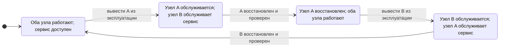

## 1

Статья Tang, Zhu и Andrada описывает RAScad как ранний вариант model-driven engineering для RAM/RAS: инженер собирает параметризованную архитектурную модель системы, а инструмент автоматически компилирует её в RBD и цепи Маркова для расчёта доступности и надёжности. Ниже — содержательный пересказ и подборка наиболее близких работ, включая несколько открыто доступных полных текстов. 

## Суть статьи

Авторы решают практическую проблему: проектировщики серверов знают архитектуру, резервирование, MTBF/MTTR, сценарии восстановления и обслуживания, но обычно не владеют Markov/Semi-Markov моделированием на уровне, достаточном для ручного построения моделей. Ручная подготовка цепей Маркова при наличии резервирования, диагностики, логистики, неполного восстановления и повторных отказов трудоёмка и легко приводит к ошибкам. 

RAScad — внутренний web-based инструмент Sun Microsystems для моделирования **reliability, availability and serviceability** на стадии проектирования серверных и систем хранения. В его составе были два модуля:

- **Model Generator (MG)** — специализированный генератор моделей для инженера-проектировщика. Он принимает описание RAS-архитектуры на инженерном языке и автоматически создаёт математические модели
- **Graphical Model Builder (GMB)** — графический редактор для эксперта по надёжности, позволяющий вручную строить RBD, Markov и semi-Markov модели
- Оба типа моделей можно комбинировать в одной расчётной схеме. 
Главная идея MG: не заставлять пользователя непосредственно задавать состояния и переходы CTMC, а предоставить промежуточный предметно-ориентированный слой описания системы.

## Как работает RAScad

### Входная модель

Пользователь строит иерархию diagram/block:

- **diagram** представляет систему или подсистему;
- **block** представляет компонент или FRU — например CPU module, power supply, system board, RAID, boot drive;
- блок может содержать поддиаграмму, поэтому вся модель имеет древовидную структуру.

Для каждого блока задаются инженерные параметры, в частности:

- количество экземпляров \(N\) и минимально требуемое количество \(K\);
- MTBF для постоянных отказов;
- интенсивность transient failures;
- времена диагностики, corrective action и verification;
- время реакции сервисной службы \(T_{resp}\);
- вероятность правильной диагностики \(P_{cd}\);
- вероятность скрытого отказа \(P_{lf}\) и время его выявления MTTDLF;
- время автоматического восстановления/failover;
- вероятность возникновения single point of failure в процессе recovery;
- параметры service restriction, логистики, ремонта и reintegration. 
Это важно: RAScad моделирует не только «компонент отказал — компонент починили», а полный операционный путь отказа: обнаружение, автоматическое восстановление, деградацию, вызов сервиса, ожидание, замену, ошибочную диагностику, повторное восстановление и возврат компонента в систему.

### Генерация математической модели

Преобразование устроено так:

1. Каждый diagram переводится в **последовательную RBD** из входящих блоков.
2. Каждый block переводится в **Markov chain**.
3. Если block содержит subdiagram, его Markov-модель соединяется с подчинённой RBD.
4. Итоговая модель образует иерархию RBD и Markov chains. 
При допущении независимости разных типов компонентов доступность диаграммы вычисляется как:

$$
\[
A_{system} = \prod_{i=1}^{n} A_i
\]
$$

где $A_i$ — доступность блока. Однако сам \(A_i\) в общем случае не сводится к простой формуле: он берётся из автоматически сгенерированной Markov-модели, учитывающей отказ, восстановление, резервирование и сервисные сценарии.

### Типы генерируемых Markov-моделей

Для нерезервированного блока, когда \(N = K\), строится базовая **Markov Model Type 0**.

Для резервированного блока, когда \(N > K\), выбор Markov-модели определяется двумя свойствами:

| Recovery после отказа | Repair/reintegration | Генерируемый тип |
|---|---|---|
| Transparent | Transparent | Type 1 |
| Transparent | Nontransparent | Type 2 |
| Nontransparent | Transparent | Type 3 |
| Nontransparent | Nontransparent | Type 4 |

Под *transparent* авторы понимают операцию без недоступности для пользователя. Например, отказ одного из \(N+1\) блоков питания при power sharing может быть transparent. Перезагрузка сервера для deconfigure отказавшего CPU — пример nontransparent recovery. Замена hot-plug компонента с dynamic reconfiguration может быть transparent repair; замена, требующая выключения или перезагрузки, — nontransparent. 

## Что именно учитывается

В наиболее содержательной модели Type 3 — nontransparent recovery и transparent repair — присутствуют состояния:

- нормальная работа `Ok`;
- transient fault;
- permanent fault в деградированном режиме;
- latent fault;
- automatic recovery;
- single-point-of-failure state;
- service error при неправильной диагностике либо некорректном corrective action;
- состояния второго отказа в режиме деградации.

Тем самым доступность зависит не только от $\lambda$ и $\mu$, но и от реальной логики эксплуатации: как быстро выявляется скрытый отказ, есть ли риск неудачного failover, когда инициируется сервис, сколько длится доставка/реакция, насколько ремонт достоверен и требуется ли останов системы для reintegration. 
RAScad выдаёт:

- стационарную availability;
- failure and recovery rates;
- интервальные показатели для \((0,T)\);
- MTTF;
- reliability at mission time \(T\);
- interval failure rate;
- hazard rate. 

Авторы подчёркивают, что MG предназначен для сравнительной оценки проектных архитектур, а не для буквального предсказания полевой доступности. Они сообщают о валидации против SHARPE, MEADEP и данных двух серверов Sun Enterprise 10000 за 15 месяцев; для приведённых MG-моделей относительная ошибка годового downtime была менее 0,2%. 

## Ограничения и значение

Ключевые ограничения подхода:

- разные типы компонентов предполагаются независимыми;
- однотипные резервные компоненты считаются симметричными, то есть функционально эквивалентными и с одинаковой интенсивностью отказов;
- уровень детализации — FRU;

С современной точки зрения RAScad интересен как предшественник связки:

$$
\[
\text{Architecture / engineering DSL}
\rightarrow
\text{formal dependability model}
\rightarrow
\text{numerical assessment}
\]
$$

То есть это не просто RBD/CTMC-редактор, а ранняя цепочка model transformation. Для вашей линии Semantic-OpEx особенно ценна идея отделить семантическую инженерную модель — компонент, FRU, резервирование, recovery, repair, logistics — от вычислительного представления CTMC/RBD. В современной реализации этот слой естественно развивать как онтологию RAS-архитектуры с трассировкой «требование → архитектурный элемент → сценарий отказа → формальная модель → KPI availability».

## Похожие статьи

| Работа | Сходство с RAScad | Открытый доступ |
|---|---|---|
| [Liceaga & Siewiorek, “Towards Automatic Markov Reliability Modeling of Computer Architectures” (1986)](https://ntrs.nasa.gov/citations/19860021844) | Самая близкая ранняя предшествующая работа. Программа NASA ARM принимает описание Processor–Memory–Switch архитектуры, поведения компонентов, fault-tolerance strategies и operational requirements, после чего строит Markov-модель reliability/availability. Та же цель: убрать ручное построение состояний и переходов, сделать анализ доступным не только специалистам по Марковским моделям | Полный PDF открыт на NASA NTRS; это работа правительства США, допускающая публичное использование.  [ntrs.nasa](https://ntrs.nasa.gov/citations/19860021844) |
| [Sally A. Musick, “Automated Generation of Reliability Models”](https://ieeexplore.ieee.org/document/196407/) | Более ранняя линия rule-based генерации semi-Markov моделей. В инструменте ASSIST пользователь задаёт правила поведения/переходов, после чего программа рекурсивно строит модель. В отличие от RAScad, входная абстракция ближе к правилам переходов, а не к GUI-описанию RAS-архитектуры через FRU, MTBF, MTTR, recovery и repair | Есть запись IEEE; открытая легальная авторская копия не подтверждена.  [ieeexplore.ieee](https://ieeexplore.ieee.org/iel2/721/5034/00196407.pdf) |
| [Guo & Yang, “Automatic Creation of Markov Models for Reliability Assessment of Safety Instrumented Systems” (2008)](https://www.sciencedirect.com/science/article/abs/pii/S0951832007001238) | Прямой отраслевой аналог для safety instrumented systems. Общая идея — автоматизировать формирование Markov-модели для ремонтируемой, динамической системы; отличие — акцент на functional safety/SIS, а не на серверной RAS-архитектуре | В сети доступна страница издателя с аннотацией; полный текст зависит от доступа к журналу.  [sciencedirect](https://www.sciencedirect.com/science/article/abs/pii/S0951832007001238) |
| [Brameret, Rauzy & Roussel, “Automated Generation of Partial Markov Chain from High Level Descriptions” (2015)](https://www.altarica-association.org/Documentation/pdf/BrameretRauzyRoussel2015-GenerationPartialMarkovChains.pdf) | Современное развитие главной идеи RAScad: высокоуровневая модель AltaRica автоматически превращается в CTMC. Основная добавленная проблема — state-space explosion. Авторы строят не всю цепь, а релевантную частичную CTMC, используя вариант алгоритма Дейкстры и вероятностную меру релевантности состояний | Полный PDF доступен открыто.  [altarica-association](https://www.altarica-association.org/Documentation/pdf/BrameretRauzyRoussel2015-GenerationPartialMarkovChains.pdf) |
| [Kaukewitsch, Papist, Zeller & Rothfelder, “Automatic Generation of RAMS Analyses from Model-based Functional Descriptions using UML State Machines” (2020)](https://arxiv.org/abs/2005.01993) | Ближайший современный MBSE-аналог. Поведение компонентов, включая корректное и отказное, задаётся UML state machines; на этой основе автоматически формируются dependability artifacts и fault trees. Отличие от RAScad: основной результат — fault-tree-oriented анализ, а не параметризованные availability CTMC/RBD для FRU | Полный текст свободно доступен на arXiv; статья также связана с публикацией RAMS 2020.  [web3.arxiv](https://web3.arxiv.org/abs/2005.01993) |

## С чего начать чтение

Если ваша цель — построить современный метод автоматической генерации моделей доступности, я бы расположил работы в таком порядке:

1. **Tang, Zhu, Andrada (2002)** — предметная RAS-семантика: FRU, redundancy, latent fault, recovery, logistics, reintegration, imperfect repair.
2. **Liceaga & Siewiorek (1986)** — ранняя фундаментальная постановка автоматического построения availability/reliability Markov models из архитектуры и стратегий fault tolerance. [ntrs.nasa](https://ntrs.nasa.gov/citations/19860021844)
3. **Brameret, Rauzy & Roussel (2015)** — решение ключевого практического барьера: взрыва пространства состояний при генерации CTMC из высокоуровневой модели. [altarica-association](https://www.altarica-association.org/Documentation/pdf/BrameretRauzyRoussel2015-GenerationPartialMarkovChains.pdf)
4. **Kaukewitsch et al. (2020)** — путь интеграции dependability analysis с SysML/UML и MBSE-процессом. [web3.arxiv](https://web3.arxiv.org/abs/2005.01993)
5. **Guo & Yang (2008)** — перенос идеи в контекст SIS, где особенно важны диагностика, тестирование, proof tests и safety integrity. [sciencedirect](https://www.sciencedirect.com/science/article/abs/pii/S0951832007001238)

Для дальнейшего развития RAScad-подхода наиболее перспективна связка: онтология компонентов и RAS-механизмов → DSL/knowledge graph конфигурации → генератор GSPN/CTMC/RBD → расчёт availability, downtime, risk importance и чувствительности параметров.

## 1a

## Важная техническая поправка

В статье Tang, Zhu и Andrada обозначения $\lambda$ и $\mu$ не выступают как единственный полный набор параметров модели. Это было моё сжатое обобщение типичной CTMC-логики:

- $\lambda$ — интенсивность отказа;
- $\mu$ — интенсивность восстановления/ремонта.

Однако RAScad работает существенно богаче, чем модель вида «один отказ с интенсивностью $\lambda$ — один ремонт с интенсивностью $\mu$».

Авторы используют иерархическое описание FRU и отдельные параметры для:

- MTBF постоянных отказов;
- интенсивности transient failures;
- времени диагностики;
- времени corrective action;
- времени verification;
- service response time \(T_{resp}\);
- service restriction / mean time to maintenance \(MTTM\);
- вероятности корректной диагностики \(P_{cd}\);
- вероятности latent fault \(P_{lf}\);
- времени выявления скрытого отказа;
- времени automatic recovery/failover;
- вероятности single-point failure в recovery-процессе;
- времени reboot и reintegration. 

Поэтому точнее писать не «доступность зависит не только от $\lambda$ и $\mu$», а так:

```markdown
Таким образом, расчётная доступность определяется не только интенсивностями отказов
и восстановления, но и архитектурой резервирования, механизмами обнаружения отказов,
сценариями automatic recovery, временем сервисной логистики, качеством диагностики,
возможностью online repair и правилами reintegration компонентов.
```

Или в более формальном стиле:

```markdown
В RAScad доступность является результатом не простой двухпараметрической модели
$(\lambda,\mu)$, а параметризованной иерархической RBD/CTMC-модели, учитывающей
отказы, резервирование, latent faults, recovery, logistics, repair и reintegration.
```

## Что означает “field availability”

Фраза из статьи:

> “The tool is not intended for use to predict actual field availability performed by a system.”

написана несколько неуклюже даже по-английски. Вероятнее всего, авторы имели в виду **actual field availability performance** — то есть фактически наблюдаемую доступность развёрнутой системы в реальных условиях эксплуатации.

Корректные русские варианты:

- **фактическая эксплуатационная доступность**;
- **наблюдаемая доступность в реальной эксплуатации**;
- **доступность, измеренная по эксплуатационным данным**;
- **фактический уровень доступности системы у заказчика**.

Слово «полевой» здесь лучше не использовать: в русском инженерном языке оно вызывает ассоциации с полевыми испытаниями, военной техникой или работой вне стационара. В англоязычной RAS-практике *field data* и *field availability* обычно противопоставляются данным и показателям, полученным в модели, лаборатории, на стенде или в ходе design assessment.

## Почему RAScad не предназначен для точного прогноза эксплуатации

Авторы не говорят, что RAScad бесполезен для реальных систем. Напротив, они сообщают, что сверяли результаты с SHARPE, MEADEP и данными эксплуатации двух серверов Sun Enterprise 10000 за 15 месяцев. Но целевое назначение MG — не прогнозировать будущий фактический uptime конкретного экземпляра системы, а **сравнивать проектные RAS-архитектуры до их выпуска**. 

Разница принципиальна.

| Расчётная доступность RAScad | Фактическая эксплуатационная доступность |
|---|---|
| Рассчитывается по архитектуре и заданным параметрам модели | Измеряется по журналам событий, обращениям в сервис, telemetry и данным SLA за конкретный период |
| Отвечает на вопрос: «Как изменится availability, если добавить резервирование, hot plug, dynamic reconfiguration или иной recovery scenario?» | Отвечает на вопрос: «Сколько фактически времени данная система была доступна для пользователей?» |
| Использует модельные допущения об отказах, ремонтах, симметрии резервирования и независимости компонентных типов | Включает реальные нагрузки, программные дефекты, эксплуатационные процедуры, человеческие ошибки, задержки поставки, организационные ограничения, непредусмотренные зависимости и редкие события |
| Полезна для architecture trade-off analysis | Полезна для SLA, service management, reliability growth, incident analysis и корректировки RAS-параметров |

Например, RAScad может показать, что переход от nontransparent repair к hot-swap плюс dynamic reconfiguration уменьшает ожидаемый downtime при отказе блока питания. Но модель не обязана точно предсказывать, какой будет доступность конкретного сервиса через год: фактический результат также зависит от качества firmware, фактического времени поставки FRU, зрелости сервисной организации, ошибочных замен, workload, политики обновлений, коррелированных отказов и множества других факторов.

При этом часть эксплуатационного контекста RAScad уже учитывает — например, service response time, service restriction time, вероятность ошибочной диагностики и логистические задержки. Поэтому это не «чистая inherent availability», основанная только на intrinsic failure/repair rates. Однако значения этих параметров в RAScad всё равно задаются как проектные предположения или сценарии анализа, а не извлекаются автоматически из полной статистики будущей эксплуатации. 

## Улучшенная формулировка

Я бы заменил прежний фрагмент на следующий:

> Авторы подчёркивают, что Model Generator предназначен прежде всего для сравнительной оценки проектных RAS-архитектур, а не для точного прогноза фактической эксплуатационной доступности конкретной развёрнутой системы. Модель позволяет оценить влияние резервирования, обнаружения отказов, automatic recovery, логистических задержек, ремонта и reintegration на ожидаемую доступность. Однако реальная наблюдаемая доступность у заказчика зависит также от фактической среды эксплуатации, workload, качества ПО и firmware, сервисных процессов, организационных задержек, ошибок персонала и других факторов, которые не могут быть полностью представлены в проектной модели.

Более краткая версия для README:

> RAScad предназначен для анализа и сравнения проектных RAS-архитектур. Он оценивает расчётную доступность при заданных допущениях, но не претендует на точный прогноз фактической эксплуатационной доступности конкретной системы.


info
- CTMC-logic https://en.wikipedia.org/wiki/Continuous-time_Markov_chain
- https://www.columbia.edu/~ks20/stochastic-I/stochastic-I-CTMC.pdf
- Логический подход к спецификации мультиагентных систем с вероятностным поведением https://textarchive.ru/c-1380697-pall.html

## 2 Model

Ниже — объяснение Markov Model Type 0–Type 4 из статьи **Automatic Generation of Availability Models in RAScad**. Главное уточнение: **nontransparent repair не означает автоматически, что кластер недоступен всё время ремонта одного узла**; это означает, что ремонт либо reintegration вызывает недоступность на уровне выбранной границы моделируемой системы и пользовательской услуги.

## Основа классификации

RAScad строит отдельную Markov-модель для каждого MG-block — компонента или группы одинаковых компонентов. Затем доступность блока \(A_i\) включается в иерархическую RBD-модель системы.

Для каждого Markov-состояния задан reward rate:

$$
\[
r_s =
\begin{cases}
1, & \text{система доступна пользователю},\\
0, & \text{система недоступна пользователю}.
\end{cases}
\]
$$

При стационарном распределении состояний \(\pi_s\) доступность блока:

$$
\[
A_i=\sum_{s \in S}\pi_s r_s.
\]
$$

Если верхнеуровневый diagram моделируется как последовательная RBD из \(n\) блоков, то при принятом авторами допущении независимости типов компонентов:

$$
\[
A_{\text{diagram}}=\prod_{i=1}^{n} A_i.
\]
$$

Тип Markov-модели выбирается прежде всего по соотношению:

- \(N\) — количество экземпляров компонента;
- \(K\) — минимально необходимое количество исправных экземпляров.

Если \(N=K\), резерва нет и применяется **Type 0**. Если \(N>K\), есть резервирование и RAScad выбирает один из **Type 1–Type 4** по комбинации свойств recovery и repair. 

## Сравнение Type 0–Type 4

| Тип | Условие | Recovery | Repair / reintegration | Главный смысл |
|---|---:|---|---|---|
| **Type 0** | \(N=K\) | Не определяет отдельную 2×2-категорию | Не определяет отдельную 2×2-категорию | Нерезервированный компонент: его отказ лишает систему требуемой функции |
| **Type 1** | \(N>K\) | Transparent | Transparent | Отказ скрывается резервированием; failover и обслуживание не прерывают сервис |
| **Type 2** | \(N>K\) | Transparent | Nontransparent | Первый отказ скрывается, но замена/reintegration может потребовать interruption |
| **Type 3** | \(N>K\) | Nontransparent | Transparent | После отказа требуется user-visible recovery, но ремонт и возврат компонента могут выполняться online |
| **Type 4** | \(N>K\) | Nontransparent | Nontransparent | И recovery, и ремонт/reintegration способны вызвать interruption |

Авторы прямо связывают Type 1–Type 4 с четырьмя комбинациями transparent/nontransparent recovery и repair. Они также отмечают, что сложность автоматически генерируемой модели возрастает от Type 1 к Type 4. 

## Type 0: нерезервированный компонент

### Условие

$$
\[
N=K.
\]
$$

Например:

- один boot drive;
- один system board;
- единственный обязательный controller;
- один нерезервированный PSU;
- один критический компонент, для которого отказ любого экземпляра означает потерю требуемой функции.

В такой архитектуре нет состояния «деградированный, но доступный режим вследствие потери одного из резервов». Если компонент с точки зрения RBD обязателен, его permanent fault создаёт состояние недоступности до успешного восстановления или ремонта.

### Логика Type 0

Концептуально Type 0 можно представить так:

```text
                   permanent fault
Ok / Up  ─────────────────────────────────► Down: repair required
   │                                             │
   │ transient fault                             │ diagnosis
   ▼                                             │ corrective action
Recovery / restart                               │ verification
   │                                             ▼
   ├── recovery succeeds ─────────────────────► Ok / Up
   │
   └── recovery fails ────────────────────────► extended downtime
                                                  │
                                                  └── successful repair ─► Ok / Up
```

Здесь availability особенно чувствительна к:

- MTBF постоянного отказа;
- интенсивности transient faults;
- времени восстановления или reboot;
- времени диагностики;
- времени corrective action;
- времени verification;
- service response time;
- вероятности правильной диагностики;
- времени устранения последствий неверной диагностики.

В Type 0 любой ремонтный цикл связан с критичным компонентом: нет рабочего резерва, на котором система могла бы продолжать обслуживание. 

## Type 1–Type 4: резервированный блок

Для объяснения статьи используется пример:

$$
\[
N=2,\qquad K=1.
\]
$$

То есть в группе есть два одинаковых компонента, а для сохранения функции достаточно одного. После первого отказа система может оставаться доступной, но она переходит в degraded mode: запас отказоустойчивости исчерпан либо уменьшен.

Для \(N-K>1\) RAScad автоматически повторяет соответствующие группы состояний, например состояния первого отказа, latent fault, automatic recovery и degraded permanent fault. Графически авторы показывают пример Type 3; остальные типы определяются той же логикой, но с другим назначением состояний recovery и repair как up/down. 

### Type 1: transparent recovery + transparent repair

```text
Ok / two components available
   │
   │ first component failure
   ▼
PF1 / degraded but Up
   │
   │ online diagnosis, repair, replacement, reintegration
   ▼
Ok / both components available
```

В идеальном штатном сценарии:

- первый отказ не вызывает downtime;
- automatic recovery/failover не виден пользователю;
- компонент можно заменить online;
- reintegration не требует остановки либо restart;
- система сохраняет сервис во время обслуживания.

Типичный инженерный образ — hot-plug компонент плюс dynamic reconfiguration, когда replacement FRU может быть добавлен в работающую конфигурацию без interruption.

Однако Type 1 не означает абсолютную доступность. Downtime всё ещё возможен, например:

- при втором отказе до завершения ремонта;
- при hidden/latent failure, из-за которого резерв уже утрачен;
- при неуспешном automatic recovery;
- при возникновении single-point failure;
- при ошибочной диагностике или некорректном corrective action. 

### Type 2: transparent recovery + nontransparent repair

```text
Ok
   │
   │ first fault; failover/recovery succeeds transparently
   ▼
PF1 / degraded but Up
   │
   │ logistics, waiting, preparation for maintenance
   │ system may remain Up
   ▼
Repair / reintegration interruption
   │
   ▼
Ok
```

Первый отказ здесь может быть скрыт от пользователя: резервный компонент принимает нагрузку либо функция сохраняется на оставшемся экземпляре.

Но возвращение repair/replacement component в рабочую конфигурацию не является прозрачным. Возможные причины, прямо обсуждаемые в статье:

- component hot-pluggable, но **dynamic reconfiguration отсутствует**;
- новый компонент можно физически установить без выключения, но система должна быть перезапущена, чтобы распознать и reintegrate его;
- component не является hot-pluggable;
- для замены требуется power-off соответствующей системы. 

Ключевое следствие: Type 2 не означает, что сервис недоступен на всём интервале от первого отказа до завершения ремонта. После первого отказа система может продолжать обслуживать нагрузку в `PF1`. Downtime возникает в момент или на период операции, которая действительно требует interruption.

### Type 3: nontransparent recovery + transparent repair

Type 3 — единственный из Type 1–Type 4, который статья раскрывает через подробную диаграмму состояний.

```text
Ok
 │
 ├── detected permanent fault ──► AR1 ──► PF1 ──► Ok
 │                                  │
 │                                  └────► SPF
 │
 ├── undetected permanent fault ─► Latent1 ─► AR1
 │
 └── transient fault ───────────► TF1 ─────► AR1
```

Смысл состояний:

| Состояние | Интерпретация |
|---|---|
| `Ok` | Нормальная работа, оба экземпляра доступны |
| `AR1` | Automatic recovery после первого обнаруженного отказа |
| `PF1` | Один permanent fault, но система доступна в degraded mode |
| `Latent1` | Один permanent fault не обнаружен; сервис ещё работает, но резерв скрыто утрачен |
| `TF1` | Первый transient fault |
| `SPF` | Неуспешный recovery переводит систему в single-point-of-failure state |
| `PF2` | Второй permanent fault при уже деградированной системе |
| `TF2` | Transient fault на фоне уже имеющегося permanent fault |
| `ServiceError` | Последствие ошибочной диагностики либо неверной corrective action |

В Type 3 detected permanent fault запускает `AR1`. Если automatic recovery успешен, система достигает `PF1`: она вновь доступна, но на одном оставшемся компоненте. Если recovery неуспешен, возникает `SPF`, то есть состояние недоступности на время, заданное параметром \(T_{spf}\). 

Существенное свойство Type 3:

- `AR1` связан с downtime, поскольку recovery **nontransparent**;
- после успешного recovery состояние `PF1` доступно пользователю;
- ремонт `PF1` и возврат replacement component могут быть transparent;
- следовательно, пользователь замечает interruption при failover/reboot, но не обязательно при последующей физической замене FRU.

Пример из статьи: при отказе CPU automatic recovery может реализовываться reboot для deconfigure неисправного CPU. Сервер затем продолжает работу на оставшихся CPU, но reboot уже вызвал user-visible interruption. 

### Type 4: nontransparent recovery + nontransparent repair

```text
Ok
 │
 │ first fault
 ▼
Recovery interruption
 │
 ▼
PF1 / degraded but Up
 │
 │ planned or immediate maintenance
 ▼
Repair / reintegration interruption
 │
 ▼
Ok
```

Type 4 объединяет два независимых источника недоступности:

1. interruption во время automatic recovery/failover;
2. interruption во время repair/reintegration.

Это не обязательно означает два длинных простоя. Первый interruption может быть коротким reboot/failover, а второй — отдельным коротким restart при reintegration. Но если компонент не hot-pluggable и его физическая замена требует выключения, второй downtime может быть существенно длиннее. 

## Что именно означает nontransparent repair

### Короткий ответ

Нет, **не обязательно весь период ремонта одного узла или компонента равен недоступности кластера**.

В терминологии статьи *nontransparent repair* означает, что ремонт и/или последующий reintegration не могут быть выполнены полностью без interruption **на границе доступности, выбранной для модели**. Иными словами, какая-то часть процесса технического обслуживания имеет reward \(0\): пользовательская функция в этот момент недоступна. 

### Ремонтный процесс состоит из частей

В RAScad ремонтный цикл не является одной неделимой величиной. Для блока задаются, в частности:

$$
\[
T_{\text{repair}} =
T_{\text{diagnosis}} +
T_{\text{corrective action}} +
T_{\text{verification}},
\]
$$

а также отдельно учитываются:

$$
\[
T_{\text{logistics}} =
MTTM + T_{resp}.
\]
$$

Где:

- \(MTTM\) — service restriction time: среднее ожидание перед вызовом сервиса или плановым обслуживанием;
- \(T_{resp}\) — время прибытия/реакции сервисной службы;
- diagnosis — выявление неисправного FRU;
- corrective action — замена либо исправление;
- verification — проверка, что replacement component функционирует, либо восстановление утраченных данных;
- reintegration time — отдельно задаваемое время, связанное с возвратом компонента в конфигурацию;
- reboot time — отдельный глобальный параметр. 

Поэтому необходимо различать:

$$
\[
T_{\text{maintenance campaign}}
\neq
T_{\text{user-visible downtime}}.
\]
$$

### Сценарий A: hot-plug, но нет dynamic reconfiguration

```text
Система в PF1, сервис продолжает работать
        │
        ├── ожидание обслуживания
        ├── прибытие сервиса
        ├── физическая замена hot-plug FRU
        │
        └── restart для reintegration
                 │
                 └── user-visible downtime
```

Здесь component можно извлечь и установить при работающей системе, но без dynamic reconfiguration операционная система либо firmware не вводят новый компонент в конфигурацию online.

В таком случае nontransparent может быть именно короткий restart/reintegration. Весь период логистики и подготовки к ремонту не обязан быть downtime: система может оставаться в `PF1`, то есть работать с меньшей резервированностью.

### Сценарий B: компонент не hot-pluggable

```text
Система в PF1
        │
        ├── ожидание детали и инженера: система может оставаться Up
        │
        └── scheduled maintenance window
                 │
                 ├── power-off
                 ├── физическая замена
                 ├── power-on / boot
                 ├── verification
                 └── reintegration
```

Здесь downtime обычно включает как минимум ту часть corrective action, которую невозможно выполнить под питанием, а также boot и reintegration. Но даже здесь не обязательно в downtime входят:

- ожидание инженера;
- доставка запчасти;
- планирование окна работ;
- диагностика, если её удалось выполнить заранее при работающей системе.

### Сценарий C: кластер как граница системы

Особенно важно не смешивать:

- **недоступность одного узла**;
- **недоступность кластера**;
- **недоступность пользовательского приложения**.

Если отказавший узел можно остановить, заменить и перезапустить, а приложение в это время обслуживается peer node, nontransparent repair узла может быть **transparent на уровне услуги**.

Например:

```text
Node A: failed, under maintenance
Node B: active, serves application traffic

Application service: Up
Cluster capacity/redundancy: degraded
Node A: Down
```

Для модели, границей которой является пользовательский сервис, такой ремонт должен интерпретироваться как transparent, пока:

- failover прошёл без потери пользовательской функции;
- активный узел продолжает обслуживать нагрузку;
- maintenance не требует остановить активный узел;
- отсутствует cluster-wide restart;
- нет потери quorum, split-brain, shared-storage interruption или иной общей зависимости.

Напротив, repair является nontransparent для пользовательского сервиса, если reintegration требует, например:

- cluster-wide restart;
- остановки active service;
- interruption shared storage;
- остановки control plane, влияющей на обслуживание;
- синхронного reboot нескольких узлов;
- перехода, который не может быть выполнен rolling manner.

### Ограничение статьи

Следует учитывать, что авторы прямо указывают: генерация моделей для **primary–standby** и **primary–secondary**, включая cluster architectures, в тот момент ещё находилась в работе. Основной объект MG — симметричные резервированные FRU одного типа, с одинаковой интенсивностью отказа. Поэтому нельзя механически приравнять Type 2 или Type 4 к современному двухузловому HA-cluster без уточнения:

- что именно является компонентом;
- где проведена граница модели;
- что считается доступностью: node, cluster, VM, database, business service или application endpoint;
- какой режим failover и reintegration допускает платформа.

Практически корректная формулировка такова:

> Nontransparent repair означает, что хотя бы часть repair/reintegration создаёт недоступность моделируемой пользовательской функции. Это не означает, что система либо кластер недоступны на всём интервале ожидания запчасти, диагностики и ремонта одного компонента; состав downtime определяется архитектурой, hot-plug capability, dynamic reconfiguration и выбранной границей доступности.

## 3

Для двух узлового кластера для режима 4:
1 Состояние оба работают.
2 Один сломался, кластер не доступен (переключение на резерв),
3 Завершено переключение, кластер доступен (исправный узел) и одновременно идет ремонт
4 Ремонт закончен идет перезагрузка (перенастройка) и кластер недоступен.
5 Перезагрузка завершена и кластер доступен (оба исправных узла)


Ваша последовательность для упрощённого **Type 4** логически верна: после первого обнаруженного отказа сервис кратковременно недоступен из-за nontransparent recovery, затем работает в деградированном режиме, а позже получает второе interruption при nontransparent repair/reintegration. Но это лишь основной успешный сценарий; полная цепь должна также учитывать latent fault, transient fault, неуспешный recovery, второй отказ в degraded mode и ошибку диагностики.

Важно: ниже показана **адаптация Type 4 к двухузловой системе**. В исходной статье подробно нарисован Type 3, а Type 4 задаётся комбинацией «nontransparent recovery + nontransparent repair». Кроме того, исходный RAScad моделировал симметричные резервированные FRU; специализированная генерация для primary–standby/primary–secondary clusters у авторов тогда ещё обозначалась как work in progress.

## Ваша базовая цепь

Если считать, что:

- есть два взаимозаменяемых узла;
- \(N=2\), \(K=1\);
- услуга доступна, если работает хотя бы один узел;
- отказ первого узла обнаруживается;
- переключение на второй узел требует interruption;
- repair/reintegration первого узла требует отдельного interruption,

то ваша логика имеет следующий вид.

| Шаг | Состояние | Доступность услуги |
|---:|---|---|
| 1 | Два узла исправны, услуга работает | Up |
| 2 | Первый узел отказал; идёт failover / automatic recovery | Down |
| 3 | Failover завершён; один узел обслуживает услугу, второй ремонтируется или ожидает ремонта | Up, но деградированная отказоустойчивость |
| 4 | Начат repair/reintegration, требующий restart или остановки | Down |
| 5 | Repair/reintegration завершены; оба узла снова доступны | Up |

В условных обозначениях:

$$
\[
S_0
\rightarrow
AR_1
\rightarrow
D_1
\rightarrow
M_1
\rightarrow
S_0
\]
$$

где:

- $\(S_0\)$ — оба узла исправны;
- $\(AR_1\)$ — recovery/failover после первого отказа;
- \(D_1\) — degraded mode: один узел доступен;
- \(M_1\) — maintenance outage: ремонт или reintegration требуют interruption.

## Mermaid: базовый сценарий

```mermaid
stateDiagram-v2
    direction LR

    [*] --> S0

    state "S0: два узла исправны; услуга доступна; r = 1" as S0
    state "AR1: failover / automatic recovery; r = 0" as AR1
    state "D1: один узел работает; второй неисправен или ремонтируется; r = 1" as D1
    state "M1: repair/reintegration требует interruption; r = 0" as M1

    S0 --> AR1: обнаружен отказ первого узла
    AR1 --> D1: failover успешно завершён
    D1 --> M1: scheduled repair/reintegration
    M1 --> S0: узел восстановлен и reintegrated
```



В GitHub Mermaid для state machine используется синтаксис `stateDiagram-v2`; начальное состояние обозначается `[*]`, а подпись перехода задаётся после двоеточия. [mermaid](https://mermaid.ai/open-source/syntax/stateDiagram.html)

## Что именно означает шаг 4

Ваше понимание шага 4 корректно, но его стоит сделать точнее:

> Nontransparent repair означает не обязательно «кластер не работает всё время ремонта», а то, что в repair/reintegration lifecycle есть интервал, на котором пользовательская услуга недоступна.

Возможны два принципиально разных случая.

### Hot-plug, но нет dynamic reconfiguration

Неисправный узел или FRU можно физически заменить при работающей системе, однако для его включения в рабочую конфигурацию нужен restart, reload configuration либо иной interruption.

```text
D1: сервис работает на оставшемся узле
  │
  ├── ожидание инженера / запчасти
  ├── диагностика
  ├── физическая замена
  │
  └── restart или reintegration
          │
          └── короткий downtime M1
```

В этом случае:

$$
\[
D_{\text{user}}
\approx
T_{\text{reintegration}}
+
T_{\text{restart}}
+
T_{\text{verification, if blocking}}.
\]
$$

Ожидание запчасти, сервисная логистика и часть диагностических работ могут проходить, пока услуга остаётся доступной на втором узле.

### Компонент или узел нельзя обслужить online

Если для замены требуется power-off, остановка соответствующей платформы, выключение shared subsystem либо cluster-wide restart, user-visible downtime обычно длиннее:

```text
D1: сервис доступен на оставшемся узле
  │
  ├── ожидание maintenance window
  │
  └── maintenance outage M1
          │
          ├── остановка
          ├── физическая замена
          ├── запуск
          ├── verification
          └── reintegration
```

Тогда:

$$
\[
D_{\text{user}}
\approx
T_{\text{shutdown}}
+
T_{\text{offline corrective action}}
+
T_{\text{boot}}
+
T_{\text{verification}}
+
T_{\text{reintegration}}.
\]
$$

Но даже в этом случае downtime не обязательно включает время ожидания инженера, доставки детали или согласования окна обслуживания. Пока система находится в \(D_1\), сервис ещё может работать, хотя риск полного отказа повышен.

## Полная цепь Type 4

Для более реалистичной модели нужно добавить несколько ветвей, которые в статье явно показаны для Type 3 и логически переносятся на Type 4.

```mermaid
stateDiagram-v2
    direction LR

    [*] --> S0

    state "S0: оба узла исправны; service Up; r = 1" as S0
    state "AR1: recovery после первого обнаруженного отказа; r = 0" as AR1
    state "D1: деградированный режим; один узел обслуживает сервис; r = 1" as D1
    state "L1: latent fault; один узел уже отказал, но это ещё не обнаружено; r = 1" as L1
    state "M1: repair/reintegration первого узла; r = 0" as M1
    state "SE: ошибочная диагностика или неверный repair; r = 0" as SE
    state "AR2: recovery при втором отказе; r = 0" as AR2
    state "F2: потерян последний рабочий узел; service Down; r = 0" as F2
    state "SPF: recovery/failover неуспешен; service Down; r = 0" as SPF

    S0 --> AR1: обнаруженный permanent fault
    S0 --> L1: permanent fault не обнаружен

    AR1 --> D1: recovery успешен
    AR1 --> SPF: recovery неуспешен

    L1 --> AR1: latent fault обнаружен
    L1 --> F2: второй permanent fault
    L1 --> AR2: transient fault оставшегося узла

    D1 --> M1: planned repair/reintegration
    M1 --> S0: correct diagnosis и successful repair
    M1 --> SE: incorrect diagnosis или incorrect corrective action
    SE --> M1: повторный repair/reintegration

    D1 --> F2: второй permanent fault
    D1 --> AR2: transient fault оставшегося узла

    AR2 --> D1: recovery успешен
    AR2 --> SPF: recovery неуспешен

    SPF --> F2: требуется repair для восстановления сервиса
    F2 --> M1: immediate service action
```



Эта схема намеренно разделяет два разных смысла «система неисправна»:

- `D1` и `L1` — сервис ещё доступен, но запас отказоустойчивости утрачен;
- `AR1`, `AR2`, `M1`, `SE`, `SPF`, `F2` — состояния с user-visible downtime.

## Дополнительные варианты режима 4

В исходной классификации нет Type 5, Type 6 и так далее: существуют только четыре комбинации прозрачности recovery и repair. Но внутри **Type 4** есть много разных траекторий состояния.

| Вариант | Путь в Markov-цепи | Что означает |
|---|---|---|
| Штатный первый отказ | $\(S_0 \rightarrow AR_1 \rightarrow D_1\)$ | Failover/recovery успешен, но пользователь видел краткий downtime |
| Успешный плановый ремонт | $\(D_1 \rightarrow M_1 \rightarrow S_0\$) | Услуга была доступна в деградированном режиме, затем остановлена на время nontransparent repair/reintegration |
| Скрытый отказ | $\(S_0 \rightarrow L_1\)$ | Один узел уже потерян, но отказ не обнаружен; сервис работает, резерв фактически отсутствует |
| Выявление latent fault | $\(L_1 \rightarrow AR_1 \rightarrow D_1\)$ | После позднего обнаружения всё равно требуется recovery, который в Type 4 nontransparent |
| Второй permanent fault | $\(D_1 \rightarrow F_2\) либо \(L_1 \rightarrow F_2\)$ | Последний функционирующий узел отказал; сервис теряет доступность до восстановления |
| Transient fault в degraded mode | $\(D_1 \rightarrow AR_2 \rightarrow D_1\)$ | Даже кратковременный сбой единственного оставшегося узла вызывает interruption |
| Неуспешный failover | $\(AR_1 \rightarrow SPF\) или \(AR_2 \rightarrow SPF\)$ | Recovery не завершился штатно; требуется более тяжёлое восстановление |
| Ошибка диагностики | $\(M_1 \rightarrow SE \rightarrow M_1\)$ | Неправильно определён отказавший элемент либо выполнена неверная corrective action; downtime продлевается |
| Негорячая замена | $\(D_1 \rightarrow M_1 \rightarrow S_0\)$ | В \(M_1\) входят shutdown, физическая замена, boot, verification и reintegration |
| Hot-plug без online reintegration | $\(D_1 \rightarrow M_1 \rightarrow S_0\)$ | В \(M_1\) может входить только короткий restart/reconfiguration для ввода replacement node/FRU в рабочую схему |

## Важная граница модели

Для кластера нельзя автоматически считать, что `M1` — это недоступность всей услуги. Всё зависит от того, что именно в модели считается системой.

### Если граница — узел

```text
Node A: ремонтируется, Down
Node B: работает, Up
Clustered application: может быть Up
```

Тогда repair Node A может быть nontransparent на уровне узла, но transparent на уровне прикладной услуги.

### Если граница — пользовательский сервис

```text
Node A: ремонтируется
Node B: работает
Application endpoint: доступен
```

Тогда у repair будет reward \(1\), пока не происходит событие, нарушающее доступность сервиса:

- restart active node;
- cluster-wide restart;
- остановка shared storage;
- потеря quorum;
- interruption виртуального IP/load balancer;
- несовместимость конфигурации при reintegration;
- необходимость остановить активную роль для возврата repaired node.

Следовательно, для сервисной модели Type 4 нужно применять только тогда, когда recovery **и** repair/reintegration действительно вызывают interruption, видимое потребителю услуги. Если же repair первого узла выполняется полностью rolling-образом, а приложение непрерывно обслуживается вторым узлом, то с точки зрения пользовательского SLA это ближе к **Type 3**: nontransparent recovery, но transparent repair.

## 3.1
**Rolling-образом** означает поочерёдно, с сохранением работоспособности сервиса: сначала обслуживают, заменяют или перезапускают один узел, пока другой продолжает принимать нагрузку; затем, после проверки первого, переходят ко второму.

Это также называют:

- rolling maintenance — поочерёдное обслуживание;
- rolling restart — поочерёдная перезагрузка;
- rolling upgrade/update — поочерёдное обновление;
- последовательное обслуживание без остановки всей услуги.

## Простой пример

Пусть есть два узла `A` и `B`, а пользовательский сервис может работать на любом одном из них.

```text
Исходно:
A = работает
B = работает
Сервис = доступен

Шаг 1: обслуживание A
A = выведен из обслуживания, ремонтируется или перезапускается
B = работает и обслуживает пользователей
Сервис = доступен

Шаг 2: A возвращён и проверен
A = работает
B = работает
Сервис = доступен

Шаг 3: обслуживание B
A = работает и обслуживает пользователей
B = выведен из обслуживания, ремонтируется или перезапускается
Сервис = доступен
```

В Mermaid это можно представить так:



Для пользователя при таком процессе последовательность выглядит так:

$$
\[
\text{Service Up}
\rightarrow
\text{Service Up}
\rightarrow
\text{Service Up}
\rightarrow
\text{Service Up}.
\]
$$

Меняется не доступность услуги, а **уровень резервирования**: пока один узел обслуживается, второй становится single point of failure.

## Отличие от одновременного обслуживания

| Подход | Что происходит | Доступность пользовательского сервиса |
|---|---|---|
| Rolling maintenance | Узлы обслуживаются последовательно; работающий узел принимает нагрузку | Обычно сохраняется |
| Concurrent maintenance | Оба узла либо общая зависимость обслуживаются одновременно | Обычно сервис недоступен |
| Cluster-wide restart | Останавливается весь кластер или active service | Сервис недоступен |
| Rolling restart | Узлы перезапускаются по одному после успешного failover | Обычно сохраняется |
| Recreate deployment | Старые экземпляры остановлены до запуска новых | Возможен или гарантирован downtime |

В Kubernetes термин *rolling update* означает постепенную замену экземпляров приложения: новые экземпляры запускаются и становятся ready до вывода старых, поэтому приложение остаётся доступным в процессе обновления. [kubernetes](https://kubernetes.io/docs/tutorials/kubernetes-basics/update/update-intro/)

## Связь с Type 3 и Type 4

Для вашей модели нужно различать **физическую операцию с узлом** и **доступность пользовательской услуги**.

### Rolling repair как transparent repair

Если отказавший узел `A` ремонтируется, а узел `B` продолжает обслуживать приложение, то ремонт выполняется rolling-образом:

```text
A = ремонтируется / перезагружается / reintegrates
B = активен
Приложение = доступно
```

С точки зрения SLA услуги это:

$$
\[
r_{\text{repair}} = 1.
\]
$$

То есть repair является **transparent**, даже если сам узел `A` в этот момент недоступен. Такая ситуация ближе к Type 3, если failover был user-visible, либо к Type 1, если и failover, и repair прошли без interruption.

### Nontransparent repair

Repair остаётся **nontransparent**, если для возврата `A` необходимо прервать именно пользовательский сервис. Например:

- требуется остановить active node `B`;
- требуется cluster-wide restart;
- надо остановить shared storage;
- виртуальный IP либо load balancer не переживает reintegration;
- потеря quorum не позволяет оставить сервис на одном узле;
- приложение не поддерживает rolling rejoin;
- для обновления требуется одновременно остановить все экземпляры;
- изменения схемы, протокола или версии несовместимы между старым и новым узлом.

Тогда:

```text
A = repaired
B = остановлен или не может обслуживать сервис
Кластер = выполняет restart/reconfiguration
Приложение = недоступно
```

Именно тогда шаг `D1 → M1` в ранее показанной Type 4-цепи имеет reward:

$$
\[
r_{M1}=0.
\]
$$

## Критическое замечание для двух узлов

Двухузловой кластер можно обслуживать rolling-образом только при выполнении дополнительных условий:

1. Один оставшийся узел способен выдержать всю рабочую нагрузку.
2. Режим single-node operation допустим для приложения.
3. Нет строгого требования quorum из двух голосов без witness/third vote.
4. Failover действительно завершён и приложение health-check прошло.
5. Shared storage, сеть, DNS/VIP и control plane сохраняют работоспособность.
6. Операция ремонта не требует остановки общего компонента.
7. Во время ремонта принимается повышенный риск: второй отказ приведёт к потере сервиса.

Иными словами, rolling maintenance обычно обеспечивает:

$$
\[
\text{Availability} \approx 1,
\]
$$

но временно снижает:

$$
\[
\text{Redundancy}:
\quad
N=2,\ K=1
\rightarrow
N_{\text{available}}=1,\ K=1.
\]
$$

Сервис остаётся доступным, однако теряет запас устойчивости. Поэтому с точки зрения availability ремонт может быть transparent, а с точки зрения риска и resilience это всё равно критический деградированный режим.


