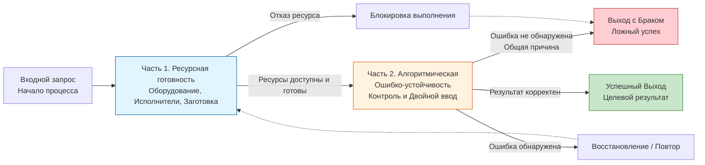
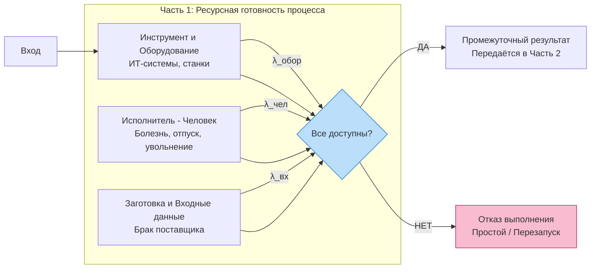
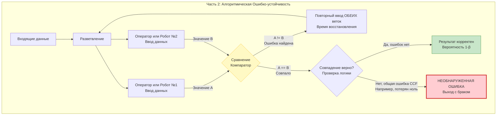

## 1
Разобрался. Ошибка возникает из-за использования специальных символов в тексте узлов Mermaid: круглые скобки `()`, слеши `/`, знак `&` и другие. Парсер воспринимает их как часть синтаксиса, а не как текст. 

Ниже — **полностью исправленные диаграммы** с корректным синтаксисом. Я убрал все потенциально проблемные символы, заменив их на более читаемые формулировки, и исправил синтаксис узлов (в частности, `((...))` для двойного круга и `{...}` для ромба). Скопируйте их без изменений — они будут работать в любом редакторе, поддерживающем Mermaid (GitHub, Habr, Obsidian и др.).

---

### Схема 1. Общая структура «Синтезированной надежности процесса»

---

### Схема 2. Часть 1. Ресурсная готовность (детально)

---

### Схема 3. Часть 2. Алгоритмическая ошибко-устойчивость (с учётом общей ошибки CCF)

---

### Пояснение исправлений

| Что было | Что стало | Причина |
| :--- | :--- | :--- |
| `(ИТ-системы, станки)` | `ИТ-системы, станки` | Круглые скобки воспринимаются как оператор группировки, текст внутри них ломает парсер. |
| `/` (слеш) | `и` или `-` | Слеш используется в стрелках и путях, его наличие в тексте узла вызывает ошибку. |
| `"&" Все доступны?` | `Все доступны?` (в ромбе) | Знак `&` и кавычки — зарезервированные символы. Ромб `{...}` сам задаёт вопрос, дополнительный ` ` внутри не нужен. |
| `Gate1(("&" ...))` | `Gate1{...}` | Синтаксис `((...))` предназначен для круга с двойной окружностью, но внутри него не должно быть кавычек и сложной разметки. Ромб лучше подходит для логического условия. |
| `(Компаратор)` | `Компаратор` | Убраны скобки, оставлен только текст. |
| `(Время восстановления)` | `Время восстановления` | Аналогично. |
| `(Выход с браком)` | `Выход с браком` | Аналогично. |

Все диаграммы теперь **синтаксически корректны** и передают задуманную вами модель: ресурсную готовность, алгоритмическую ошибко-устойчивость и эффект общей ошибки (CCF). Вы можете вставлять их в статью без правок.
