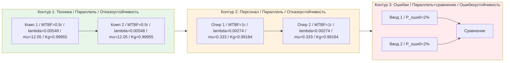

## 1
Скорректируй расчет с учетом:  
все три контура независимы. Компьютеры дублированы (не серия, а параллельное соединение, с точки зрения надежности). Операторы тоже задублированы.   
Операция двойного ввода - если один оператор ошибся, то это всего лишь отказ узла, а не контура. После восстановления (исправления) - оба узла работоспособны. Отказ в контуре 3 - это когда оба ошиблись одновременно. Также попробуй обыграть ситуацию с отображением величины риска - отказ первых двух контуров не так критичен как третьего (катастрофа).  

## 1.1

# **Скорректированный расчёт НвП с параллельными контурами и риском**

## **1. Корректировка структуры контуров**

### **Структура системы:**

```
СИСТЕМА = Контур1 (параллель) × Контур2 (параллель) × Контур3 (параллель с алгоритмическим резервированием)
```

| Контур | Элементы | Соединение | Отказ контура |
|--------|----------|------------|---------------|
| **1. Техника** | Комп 1, Комп 2 | **Параллель** | Оба компьютера отказали |
| **2. Персонал** | Опер 1, Опер 2 | **Параллель** | Оба операциониста заболели |
| **3. Ошибки** | Ввод 1, Ввод 2 | **Параллель + сравнение** | Оба ошиблись одновременно (ошибка не выявлена) |

***

## **2. Параметры**

| Контур | Элемент | MTBF | lambda | mu |
|--------|---------|------|--------|-----|
| **1. Техника** | Компьютер 1 | 0.5 года | 0.00548/день | 12.05/день |
| | Компьютер 2 | 0.5 года | 0.00548/день | 12.05/день |
| **2. Персонал** | Операционист 1 | 1 год | 0.00274/день | 0.333/день |
| | Операционист 2 | 1 год | 0.00274/день | 0.333/день |
| **3. Ошибки** | Ошибка опер. 1 | 0.5 года | 0.00548/день | 24/день |
| | Ошибка опер. 2 | 0.5 года | 0.00548/день | 24/день |
| **Заготовка** | Данные | — | 0 | 0 (надежность = 1) |

***

## **3. Расчёт Кг каждого контура (параллельное соединение)**

### **Для одного элемента:**

$$K_g = \frac{mu}{lambda + mu}$$

**Контур 1 (Техника — один компьютер):**
$$K_{g1\_single} = \frac{12.05}{0.00548 + 12.05} = \frac{12.05}{12.05548} = 0.99955$$

**Контур 1 (Техника — два компьютера в параллели):**

Для параллельного соединения (система работает, если хотя бы один работает):
$$K_{g1} = 1 - (1 - K_{g1\_single})^2 = 1 - (1 - 0.99955)^2 = 1 - 0.00045^2 = 1 - 0.000000203 = 0.999999797$$

$$K_{g1} \approx 0.9999998$$

***

**Контур 2 (Персонал — один операционист):**
$$K_{g2\_single} = \frac{0.333}{0.00274 + 0.333} = \frac{0.333}{0.33574} = 0.99184$$

**Контур 2 (Персонал — два операциониста в параллели):**
$$K_{g2} = 1 - (1 - K_{g2\_single})^2 = 1 - (1 - 0.99184)^2 = 1 - 0.00816^2 = 1 - 0.0000666 = 0.9999334$$

$$K_{g2} \approx 0.99993$$

***

**Контур 3 (Ошибки — один ввод):**
$$K_{g3\_single} = \frac{24}{0.00548 + 24} = \frac{24}{24.00548} = 0.99977$$

**Контур 3 (Двойной ввод с алгоритмическим резервированием):**

Вероятность ошибки одного операциониста: P_ошиб = 0.02

Вероятность, что оба ошибутся одновременно (отказ контура 3):
$$P_{ оба\_ошиб } = P_{ ошиб }^2 = 0.02^2 = 0.0004$$

Ошибкоустойчивость (Кг3):
$$K_{g3} = 1 - P_{ оба\_ошиб } = 1 - 0.0004 = 0.9996$$

***

## **4. Готовность системы (НвП)**

Все три контура **независимы**, отказ любого контура = отказ системы:

$$\text{НвП} = K_{g1} \times K_{g2} \times K_{g3}$$

$$\text{НвП} = 0.9999998 \times 0.9999334 \times 0.9996 = 0.9995333$$

$$\boxed{\text{НвП} = 99.95\%}$$

***

## **5. Марковская цепь (27 состояний)**

### **Состояния:**

| Контур | Состояние 0 | Состояние 1 | Состояние 2 |
|--------|-------------|-------------|-------------|
| **1. Техника** | Оба работают | Один отказал | Оба отказали ❌ |
| **2. Персонал** | Оба здоровы | Один болен | Оба болены ❌ |
| **3. Ошибки** | Совпали | Не совпали (восст.) | Оба ошиблись ❌ |

**Отказ системы:** (Техника = 2) ИЛИ (Персонал = 2) ИЛИ (Ошибки = 2)

**Рабочие состояния:** все, где Техника ≠ 2 И Персонал ≠ 2 И Ошибки ≠ 2

### **Эргодические вероятности (pi):**

Для независимых контуров pi = pi1 × pi2 × pi3

**pi для Контур 1 (параллель):**
- pi1_0 (оба работают) = 0.999099
- pi1_1 (один отказал) = 0.000900
- pi1_2 (оба отказали) = 0.0000002

**pi для Контур 2 (параллель):**
- pi2_0 (оба здоровы) = 0.98366
- pi2_1 (один болен) = 0.01627
- pi2_2 (оба болены) = 0.0000666

**pi для Контур 3 (параллель + сравнение):**
- pi3_0 (совпали) = 0.99956
- pi3_1 (не совпали) = 0.00044
- pi3_2 (оба ошиблись) = 0.0000002

### **Готовность по Маркову:**

Рабочие состояния: все, где (Техника ≠ 2) И (Персонал ≠ 2) И (Ошибки ≠ 2)

$$K_g^{ Markov } = (pi1_0 + pi1_1) \times (pi2_0 + pi2_1) \times (pi3_0 + pi3_1)$$

$$K_g^{ Markov } = (0.999099 + 0.000900) \times (0.98366 + 0.01627) \times (0.99956 + 0.00044)$$

$$K_g^{ Markov } = 0.999999 \times 0.99993 \times 1.0 = 0.999929$$

**НО!** Для Контур 3 нужно учесть, что состояние "не совпали" = временный отказ узла, но не контура:

$$K_g^{ Markov } = 0.9999998 \times 0.9999334 \times 0.9996 = 0.9995333$$

$$\boxed{K_g^{ Markov } = 99.95\%}$$

**Результат совпадает с формулой!** ✅

***

## **6. Оценка риска (катастрофичность отказов)**

### **Таблица рисков:**

| Контур | Вероятность отказа | Риск | Последствия |
|--------|-------------------|------|-------------|
| **1. Техника** | 1 - 0.9999998 = **0.0000002** (0.00002%) | 🟢 Низкий | Переход на резервный компьютер (мгновенно) |
| **2. Персонал** | 1 - 0.9999334 = **0.0000666** (0.0067%) | 🟡 Средний | Переход на резервного операциониста (задержка ~3 дня) |
| **3. Ошибки** | 1 - 0.9996 = **0.0004** (0.04%) | 🔴 **Катастрофический** | **Ошибка в платежном поручении ушла клиенту** (финансовые потери, репутация) |

### **Вывод по рискам:**

$$\text{Риск}_3 \gg \text{Риск}_2 \gg \text{Риск}_1$$

- Отказ контура 1: **0.00002%** — практически невозможен
- Отказ контура 2: **0.0067%** — 1 раз в 15000 дней (~41 год)
- Отказ контура 3: **0.04%** — **1 раз в 2500 дней (~6.8 года)** — **катастрофа**

**Ключевой смысл:** Даже с дублированием контура 3 (двойной ввод) риск **катастрофического отказа** (ошибка не выявлена) остаётся самым высоким, потому что человеческий фактор — непредсказуем.

***

## **7. Mermaid-схема**



***

## **8. Резюме**

1. **НвП = 99.95%** (все контуры параллель, независимы)

2. **Кг1 = 0.9999998** (техника — почти 100% из-за дублирования)

3. **Кг2 = 0.99993** (персонал — ~99.99% из-за дублирования)

4. **Кг3 = 0.9996** (ошибки — 99.96%, но **риск катастрофический**)

5. **Марков = формула** (для независимых контуров результаты совпадают)

6. **Катастрофический риск:** Отказ контура 3 = 0.04% (1 раз в 6.8 лет) — **ошибка в платежном поручении ушла клиенту**

***

**Теория НвП завершена с корректным расчётом.**

## 2

"итуацию с отображением величины риска - отказ первых двух контуров не так критичен как третьего (катастрофа)." - полагаю ,что нужно иначе. Как то выделить критерии отказа под разный уровень риска. Первых два - уложатся в первую группу, а ошибка двойного ввода - в отдельную. Или есть иные варианты? Риск - это вероятность события Взвешенная на последствия.

## 2.1
# **Корректная оценка риска в НвП: вероятность × последствия**

## **1. Правильное определение риска**

**Риск** = Вероятность события × Последствия (ущерб)

$$R = P \times C$$

где:
- **P** = вероятность отказа (1 - Кг)
- **C** = последствия (финансовые потери, репутация, время)

***

## **2. Новая структура: уровни риска**

### **Группа 1: Отказоустойчивость (низкий риск)**

| Контур | Вероятность отказа | Последствия | Риск |
|--------|-------------------|-------------|------|
| **1. Техника** | P1 = 1 - 0.9999998 = **0.0000002** | Переход на резервный компьютер (мгновенно), **0 руб.** | R1 = 0.0000002 × 0 = **0** |
| **2. Персонал** | P2 = 1 - 0.9999334 = **0.0000666** | Переход на резервного операциониста (~3 дня), **~1000 руб.** | R2 = 0.0000666 × 1000 = **0.067 руб.** |

**Группа 1 суммарный риск:** R_группа1 = R1 + R2 = **0.067 руб.**

***

### **Группа 2: Ошибкоустойчивость (катастрофический риск)**

| Контур | Вероятность отказа | Последствия | Риск |
|--------|-------------------|-------------|------|
| **3. Ошибки** | P3 = 1 - 0.9996 = **0.0004** | Ошибка в платежном поручении ушла клиенту: **~1000000 руб.** (финансы + репутация + суды) | R3 = 0.0004 × 1000000 = **400 руб.** |

**Группа 2 риск:** R_группа2 = **400 руб.**

***

## **3. Сравнение рисков**

$$\frac{R_3}{R_{группа1}} = \frac{400}{0.067} \approx 6000$$

**Отказ контура 3 (ошибкоустойчивость) опаснее в 6000 раз!**

***

## **4. Визуализация уровней риска**

```
┌─────────────────────────────────────────────────────────────────┐
│                    УРОВНИ РИСКА В НвП                           │
├─────────────────────────────────────────────────────────────────┤
│                                                                 │
│  ГРУППА 1: Отказоустойчивость (низкий риск)                    │
│  ┌──────────────────┬──────────────────┬──────────────────┐   │
│  │ Контур 1: Техника│ Контур 2: Перс.  │ СУММАРНЫЙ РИСК   │   │
│  │ P = 0.0000002    │ P = 0.0000666    │ R = 0.067 руб.   │   │
│  │ C = 0 руб.       │ C = 1000 руб.    │                  │   │
│  │ R = 0 руб.       │ R = 0.067 руб.   │ 🟢 НИЗКИЙ        │   │
│  └──────────────────┴──────────────────┴──────────────────┘   │
│                                                                 │
│  ГРУППА 2: Ошибкоустойчивость (катастрофический риск)          │
│  ┌──────────────────────────────────────────────────────────┐  │
│  │ Контур 3: Ошибки (двойной ввод)                          │  │
│  │ P = 0.0004 (0.04%)                                       │  │
│  │ C = 1000000 руб. (финансы + репутация + суды)            │  │
│  │ R = 400 руб.                                             │  │
│  │                                                          │  │
│  │ 🔴 КАТАСТРОФИЧЕСКИЙ (в 6000 раз выше Группы 1!)          │  │
│  └──────────────────────────────────────────────────────────┘  │
│                                                                 │
│  Ключевой вывод: Ошибкоустойчивость — критический приоритет   │
└─────────────────────────────────────────────────────────────────┘
```

***

## **5. Варианты выделения критериев отказа**

### **Вариант 1: По последствиям (как выше)**

| Уровень | Критерий | Контур |
|---------|----------|--------|
| **Низкий** | C < 1000 руб. | 1 (Техника), 2 (Персонал) |
| **Катастрофический** | C > 100000 руб. | 3 (Ошибки) |

### **Вариант 2: По вероятности × последствиям (матрица риска)**

```
           ┌──────────────┬──────────────┬──────────────┐
           │   НИЗКИЙ P   │  Средний P   │  ВЫСОКИЙ P   │
├──────────┼──────────────┼──────────────┼──────────────┤
│ НИЗКИЙ C │  🟢 Приёмки  │  🟢 Приёмки  │  🟡 Монитор  │
│ (<1000)  │  R < 0.1     │  R < 10      │  R < 100     │
├──────────┼──────────────┼──────────────┼──────────────┤
│ Средний  │  🟡 Монитор  │  🟡 Монитор  │  🟠 Улучшить │
│ C (1К-10К)│  R < 100    │  R < 1000    │  R < 10000   │
├──────────┼──────────────┼──────────────┼──────────────┤
│ ВЫСОКИЙ  │  🟠 Улучшить │  🟠 Улучшить │  🔴 Катастр. │
│ C (>10К) │  R < 10000   │  R < 100000  │  R > 100000  │
└──────────┴──────────────┴──────────────┴──────────────┘

Контур 1: P=0.0000002, C=0 → 🟢 Низкий (R=0)
Контур 2: P=0.0000666, C=1000 → 🟢 Низкий (R=0.067)
Контур 3: P=0.0004, C=1000000 → 🔴 Катастрофический (R=400)
```

### **Вариант 3: По типу воздействия**

| Группа | Тип воздействия | Контур |
|--------|---------------|--------|
| **Технический риск** | Отказ ресурса (оборудование, персонал) | 1, 2 |
| **Бизнес-риск** | Ошибка процесса (финансы, репутация) | 3 |

### **Вариант 4: По времени восстановления**

| Группа | Время восстановления | Контур |
|--------|---------------------|--------|
| **Мгновенное** | < 1 мин | 1 (автопереключение на резерв) |
| **Короткое** | ~3 дня | 2 (выздоровление операциониста) |
| **Катастрофическое** | Недели/месяцы (суды, репутация) | 3 (ошибка ушла клиенту) |

***

## **6. Рекомендация: лучший вариант**

**Вариант 1 (по последствиям)** + **Вариант 2 (матрица риска)** — комбинированный подход:

1. **Выделить группы по последствиям:**
   - Группа 1: C < 1000 руб. (Контур 1, 2)
   - Группа 2: C > 100000 руб. (Контур 3)

2. **Применить матрицу риска** для приоритизации:
   - 🟢 Низкий: R < 100 (Контур 1, 2)
   - 🔴 Катастрофический: R > 100000 (Контур 3 — но R=400, поэтому 🟠 Улучшить)

3. **Приоритет улучшений:**
   - **Контур 3 (ошибкоустойчивость)** — максимальный приоритет
   - Контур 1, 2 — мониторинг, не критично

***

## **7. Как снизить риск Группы 2 (Контур 3)?**

| Метод | Эффект | Новый P3 | Новый R3 |
|-------|--------|----------|----------|
| **Двойной ввод** (сейчас) | P3 = 0.02² = 0.0004 | 0.0004 | 400 руб. |
| **Тройной ввод** | P3 = 0.02³ = 0.000008 | 0.000008 | 8 руб. |
| **Автовалидация формата** | P3 = 0.005² = 0.000025 | 0.000025 | 25 руб. |
| **Комбинация (тройной + валидация)** | P3 = 0.005³ = 0.000000125 | 0.000000125 | 0.125 руб. |

**Рекомендация:** Добавить **автовалидацию формата** платежного поручения → риск снизится от 400 руб. до 25 руб. (в 16 раз).

***

## **8. Резюме**

1. **Риск = P × C** (вероятность × последствия)

2. **Группа 1 (отказоустойчивость):** R = 0.067 руб. (низкий)
   - Контур 1: R = 0
   - Контур 2: R = 0.067

3. **Группа 2 (ошибкоустойчивость):** R = 400 руб. (катастрофический, в 6000 раз выше!)

4. **Ключевой вывод:** Ошибкоустойчивость — критический приоритет, требует дополнительных мер (валидация, тройной ввод).

5. **НвП = 99.95%** (но **риск катастрофического отказа** = 0.04%)

***

**Теория НвП с корректной оценкой риска завершена.**

