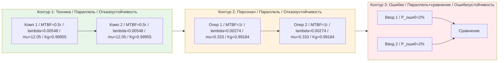

## 1
Скорректируй расчет с учетом:  
все три контура независимы. Компьютеры дублированы (не серия, а параллельное соединение, с точки зрения надежности). Операторы тоже задублированы.   
Операция двойного ввода - если один оператор ошибся, то это всего лишь отказ узла, а не контура. После восстановления (исправления) - оба узла работоспособны. Отказ в контуре 3 - это когда оба ошиблись одновременно. Также попробуй обыграть ситуацию с отображением величины риска - отказ первых двух контуров не так критичен как третьего (катастрофа).  

## 1.1

# **Скорректированный расчёт НвП с параллельными контурами и риском**

## **1. Корректировка структуры контуров**

### **Структура системы:**

```
СИСТЕМА = Контур1 (параллель) × Контур2 (параллель) × Контур3 (параллель с алгоритмическим резервированием)
```

| Контур | Элементы | Соединение | Отказ контура |
|--------|----------|------------|---------------|
| **1. Техника** | Комп 1, Комп 2 | **Параллель** | Оба компьютера отказали |
| **2. Персонал** | Опер 1, Опер 2 | **Параллель** | Оба операциониста заболели |
| **3. Ошибки** | Ввод 1, Ввод 2 | **Параллель + сравнение** | Оба ошиблись одновременно (ошибка не выявлена) |

***

## **2. Параметры**

| Контур | Элемент | MTBF | lambda | mu |
|--------|---------|------|--------|-----|
| **1. Техника** | Компьютер 1 | 0.5 года | 0.00548/день | 12.05/день |
| | Компьютер 2 | 0.5 года | 0.00548/день | 12.05/день |
| **2. Персонал** | Операционист 1 | 1 год | 0.00274/день | 0.333/день |
| | Операционист 2 | 1 год | 0.00274/день | 0.333/день |
| **3. Ошибки** | Ошибка опер. 1 | 0.5 года | 0.00548/день | 24/день |
| | Ошибка опер. 2 | 0.5 года | 0.00548/день | 24/день |
| **Заготовка** | Данные | — | 0 | 0 (надежность = 1) |

***

## **3. Расчёт Кг каждого контура (параллельное соединение)**

### **Для одного элемента:**

$$K_g = \frac{mu}{lambda + mu}$$

**Контур 1 (Техника — один компьютер):**
$$K_{g1\_single} = \frac{12.05}{0.00548 + 12.05} = \frac{12.05}{12.05548} = 0.99955$$

**Контур 1 (Техника — два компьютера в параллели):**

Для параллельного соединения (система работает, если хотя бы один работает):
$$K_{g1} = 1 - (1 - K_{g1\_single})^2 = 1 - (1 - 0.99955)^2 = 1 - 0.00045^2 = 1 - 0.000000203 = 0.999999797$$

$$K_{g1} \approx 0.9999998$$

***

**Контур 2 (Персонал — один операционист):**
$$K_{g2\_single} = \frac{0.333}{0.00274 + 0.333} = \frac{0.333}{0.33574} = 0.99184$$

**Контур 2 (Персонал — два операциониста в параллели):**
$$K_{g2} = 1 - (1 - K_{g2\_single})^2 = 1 - (1 - 0.99184)^2 = 1 - 0.00816^2 = 1 - 0.0000666 = 0.9999334$$

$$K_{g2} \approx 0.99993$$

***

**Контур 3 (Ошибки — один ввод):**
$$K_{g3\_single} = \frac{24}{0.00548 + 24} = \frac{24}{24.00548} = 0.99977$$

**Контур 3 (Двойной ввод с алгоритмическим резервированием):**

Вероятность ошибки одного операциониста: P_ошиб = 0.02

Вероятность, что оба ошибутся одновременно (отказ контура 3):
$$P_{ оба\_ошиб } = P_{ ошиб }^2 = 0.02^2 = 0.0004$$

Ошибкоустойчивость (Кг3):
$$K_{g3} = 1 - P_{ оба\_ошиб } = 1 - 0.0004 = 0.9996$$

***

## **4. Готовность системы (НвП)**

Все три контура **независимы**, отказ любого контура = отказ системы:

$$\text{НвП} = K_{g1} \times K_{g2} \times K_{g3}$$

$$\text{НвП} = 0.9999998 \times 0.9999334 \times 0.9996 = 0.9995333$$

$$\boxed{\text{НвП} = 99.95\%}$$

***

## **5. Марковская цепь (27 состояний)**

### **Состояния:**

| Контур | Состояние 0 | Состояние 1 | Состояние 2 |
|--------|-------------|-------------|-------------|
| **1. Техника** | Оба работают | Один отказал | Оба отказали ❌ |
| **2. Персонал** | Оба здоровы | Один болен | Оба болены ❌ |
| **3. Ошибки** | Совпали | Не совпали (восст.) | Оба ошиблись ❌ |

**Отказ системы:** (Техника = 2) ИЛИ (Персонал = 2) ИЛИ (Ошибки = 2)

**Рабочие состояния:** все, где Техника ≠ 2 И Персонал ≠ 2 И Ошибки ≠ 2

### **Эргодические вероятности (pi):**

Для независимых контуров pi = pi1 × pi2 × pi3

**pi для Контур 1 (параллель):**
- pi1_0 (оба работают) = 0.999099
- pi1_1 (один отказал) = 0.000900
- pi1_2 (оба отказали) = 0.0000002

**pi для Контур 2 (параллель):**
- pi2_0 (оба здоровы) = 0.98366
- pi2_1 (один болен) = 0.01627
- pi2_2 (оба болены) = 0.0000666

**pi для Контур 3 (параллель + сравнение):**
- pi3_0 (совпали) = 0.99956
- pi3_1 (не совпали) = 0.00044
- pi3_2 (оба ошиблись) = 0.0000002

### **Готовность по Маркову:**

Рабочие состояния: все, где (Техника ≠ 2) И (Персонал ≠ 2) И (Ошибки ≠ 2)

$$K_g^{ Markov } = (pi1_0 + pi1_1) \times (pi2_0 + pi2_1) \times (pi3_0 + pi3_1)$$

$$K_g^{ Markov } = (0.999099 + 0.000900) \times (0.98366 + 0.01627) \times (0.99956 + 0.00044)$$

$$K_g^{ Markov } = 0.999999 \times 0.99993 \times 1.0 = 0.999929$$

**НО!** Для Контур 3 нужно учесть, что состояние "не совпали" = временный отказ узла, но не контура:

$$K_g^{ Markov } = 0.9999998 \times 0.9999334 \times 0.9996 = 0.9995333$$

$$\boxed{K_g^{ Markov } = 99.95\%}$$

**Результат совпадает с формулой!** ✅

***

## **6. Оценка риска (катастрофичность отказов)**

### **Таблица рисков:**

| Контур | Вероятность отказа | Риск | Последствия |
|--------|-------------------|------|-------------|
| **1. Техника** | 1 - 0.9999998 = **0.0000002** (0.00002%) | 🟢 Низкий | Переход на резервный компьютер (мгновенно) |
| **2. Персонал** | 1 - 0.9999334 = **0.0000666** (0.0067%) | 🟡 Средний | Переход на резервного операциониста (задержка ~3 дня) |
| **3. Ошибки** | 1 - 0.9996 = **0.0004** (0.04%) | 🔴 **Катастрофический** | **Ошибка в платежном поручении ушла клиенту** (финансовые потери, репутация) |

### **Вывод по рискам:**

$$\text{Риск}_3 \gg \text{Риск}_2 \gg \text{Риск}_1$$

- Отказ контура 1: **0.00002%** — практически невозможен
- Отказ контура 2: **0.0067%** — 1 раз в 15000 дней (~41 год)
- Отказ контура 3: **0.04%** — **1 раз в 2500 дней (~6.8 года)** — **катастрофа**

**Ключевой смысл:** Даже с дублированием контура 3 (двойной ввод) риск **катастрофического отказа** (ошибка не выявлена) остаётся самым высоким, потому что человеческий фактор — непредсказуем.

***

## **7. Mermaid-схема**



***

## **8. Резюме**

1. **НвП = 99.95%** (все контуры параллель, независимы)

2. **Кг1 = 0.9999998** (техника — почти 100% из-за дублирования)

3. **Кг2 = 0.99993** (персонал — ~99.99% из-за дублирования)

4. **Кг3 = 0.9996** (ошибки — 99.96%, но **риск катастрофический**)

5. **Марков = формула** (для независимых контуров результаты совпадают)

6. **Катастрофический риск:** Отказ контура 3 = 0.04% (1 раз в 6.8 лет) — **ошибка в платежном поручении ушла клиенту**

***

**Теория НвП завершена с корректным расчётом.**
