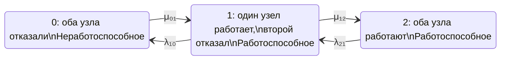

## 1
Расчет надежности цепями маркова отказоустойчивого кластера.  
Для расчета стационарного коэффициента готовности кластера составляем матрицу переходов  
Узлы графа: 
- 0 – все узлы кластера отказали
- 1 – один работает, второй отказал
- 2 – оба узла кластера работают

Работоспособные состояния кластера: 1 и 2, состояния отказа кластера 0.  
Матрица переходов: 
- из 0 в 1: µ01
- из 1 в 2: µ12
- из 2 в 1: λ21
- из 1 в 0: λ10

Задача: 
1. Формализовать условие в принятых в теории надёжности формулировках.
2. граф отразить в mermaid, матрицу переходов в показать как на графе (снизу), так отдельно и в формате csv. 
Вывести систему дифференциальных управлений и формулу стационарного коэффициента готовности.
3. Подобрать ссылки аналогичных расчетов надежности.

## 1.1 perplexity

## 1. Формализация модели

Рассматривается **восстанавливаемый отказоустойчивый кластер типа 1 из 2**, состоящий из двух одинаковых узлов. Кластер считается работоспособным, если работает хотя бы один узел.

Примем следующие предположения:

- процесс изменения состояния — однородная непрерывная марковская цепь с конечным числом состояний;
- интенсивности отказов и восстановлений постоянны во времени;
- времена до отказа и восстановления имеют экспоненциальные распределения;
- отказы узлов независимы;
- общий отказ, отказ сети, системы хранения, кворума и другие отказы по общей причине не учитываются;
- восстановление выполняется одним ремонтным каналом;
- в состоянии 1 восстанавливается отказавший узел;
- после восстановления одного узла система переходит в состояние 2;
- кластер находится в состоянии отказа только при отказе обоих узлов.

Такие допущения соответствуют стандартному подходу к однородным марковским моделям надежности. ГОСТ Р МЭК 61165—2019 рассматривает состояния системы как комбинации состояний элементов, а переходы — как результаты отказов и восстановлений; для стационарного анализа интенсивности переходов принимаются постоянными. [meganorm](https://meganorm.ru/Data/716/71631.pdf)

Обозначения:

- $\(0\)$ — оба узла отказали;
- $\(1\)$ — один узел работоспособен, второй отказал;
- $\(2\)$ — оба узла работоспособны;
- $\(\lambda_{21}\)$ — интенсивность перехода из состояния 2 в состояние 1;
- $\(\lambda_{10}\)$ — интенсивность перехода из состояния 1 в состояние 0;
- $\(\mu_{01}\)$ — интенсивность восстановления из состояния 0 в состояние 1;
- $\(\mu_{12}\)$ — интенсивность восстановления из состояния 1 в состояние 2.

В данной постановке \(\lambda_{21}\) и \(\lambda_{10}\) могут быть заданы независимо. Однако для физически симметричных независимых узлов обычно:

$$
\[
\lambda_{21}=2\lambda,
\qquad
\lambda_{10}=\lambda,
\]
$$

где $\(\lambda\)$ — интенсивность отказа одного узла.

Если ремонт выполняется одним каналом с одинаковой интенсивностью $\(\mu\)$, то обычно:

$$
\[
\mu_{01}=\mu_{12}=\mu.
\]
$$

Важно не смешивать интенсивности переходов между агрегированными состояниями с интенсивностью отказа одного узла: переход $\(2\to1\)$ включает отказ любого из двух работающих узлов и поэтому имеет множитель 2.

## 2. Граф состояний Mermaid



Множества состояний:

$$
\[
\Omega_g=\{1,2\},
\qquad
\Omega_f=\{0\}.
\]
$$

Стационарный коэффициент готовности определяется как сумма стационарных вероятностей работоспособных состояний:

$$
\[
K_{\mathrm{г,ст}}=P_1+P_2.
\]
$$

Именно такой способ определения используется в марковских моделях: коэффициент готовности равен сумме вероятностей всех работоспособных состояний. [relind](https://relind.ru/Ch2/P21.html)

### Матрица интенсивностей переходов

При порядке состояний $\((0,1,2)\)$ и использовании вектора-строки вероятностей

$$
\[
\mathbf P(t)=
\begin{bmatrix}
P_0(t)&P_1(t)&P_2(t)
\end{bmatrix}
\]
$$

матрица генератора имеет вид:

$$
\[
Q=
\begin{bmatrix}
-\mu_{01} & \mu_{01} & 0\\
\lambda_{10} & -(\lambda_{10}+\mu_{12}) & \mu_{12}\\
0 & \lambda_{21} & -\lambda_{21}
\end{bmatrix}.
\]
$$

Диагональные элементы равны минусу суммы интенсивностей исходящих переходов:

$$
\[
q_{ii}=-\sum_{j\ne i}q_{ij}.
\]
$$

Тогда уравнение Колмогорова записывается как:

$$
\[
\frac{d\mathbf P(t)}{dt}=\mathbf P(t)Q.
\]
$$

### Матрица в CSV

```csv
from,to,transition_rate
0,0,-mu01
0,1,mu01
0,2,0
1,0,lambda10
1,1,-(lambda10+mu12)
1,2,mu12
2,0,0
2,1,lambda21
2,2,-lambda21
```

В табличной форме сам генератор:

```csv
state,0,1,2
0,-mu01,mu01,0
1,lambda10,-(lambda10+mu12),mu12
2,0,lambda21,-lambda21
```

### Система дифференциальных уравнений

Из правила «приток минус отток» получаем:

$$
\[
\frac{dP_0(t)}{dt}
=
-\mu_{01}P_0(t)
+\lambda_{10}P_1(t),
\]
$$

и

$$
\[
\frac{dP_1(t)}{dt}
=
\mu_{01}P_0(t)
-\left(\lambda_{10}+\mu_{12}\right)P_1(t)
+\lambda_{21}P_2(t),
\]
$$

и

$$
\[
\frac{dP_2(t)}{dt}
=
\mu_{12}P_1(t)
-\lambda_{21}P_2(t).
\]
$$

Условие нормировки:

$$
\[
P_0(t)+P_1(t)+P_2(t)=1.
\]
$$

Если кластер первоначально полностью работоспособен, то начальные условия:

$$
\[
P_0(0)=0,\qquad P_1(0)=0,\qquad P_2(0)=1.
\]
$$

Нестационарный коэффициент готовности:

$$
\[
K_{\mathrm{г}}(t)=P_1(t)+P_2(t)
=1-P_0(t).
\]
$$

### Стационарное решение

В стационарном режиме:

$$
\[
\frac{dP_i(t)}{dt}=0.
\]
$$

Поэтому:

$$
\[
0=-\mu_{01}P_0+\lambda_{10}P_1,
\]
$$

и

$$
\[
0=\mu_{01}P_0
-\left(\lambda_{10}+\mu_{12}\right)P_1
+\lambda_{21}P_2,
\]
$$

и
$$
\[
0=\mu_{12}P_1-\lambda_{21}P_2,
\]
$$

и

$$
\[
P_0+P_1+P_2=1.
\]
$$

Из первого и третьего уравнений:

$$
\[
P_1=\frac{\mu_{01}}{\lambda_{10}}P_0,
\]
$$

и

$$
\[
P_2=\frac{\mu_{12}}{\lambda_{21}}P_1
=
\frac{\mu_{01}\mu_{12}}
{\lambda_{10}\lambda_{21}}P_0.
\]
$$

После нормировки:

$$
\[
P_0=
\frac{\lambda_{10}\lambda_{21}}
{\lambda_{10}\lambda_{21}
+\mu_{01}\lambda_{21}
+\mu_{01}\mu_{12}},
\]
$$

и

$$
\[
P_1=
\frac{\mu_{01}\lambda_{21}}
{\lambda_{10}\lambda_{21}
+\mu_{01}\lambda_{21}
+\mu_{01}\mu_{12}},
\]
$$

и

$$
\[
P_2=
\frac{\mu_{01}\mu_{12}}
{\lambda_{10}\lambda_{21}
+\mu_{01}\lambda_{21}
+\mu_{01}\mu_{12}}.
\]
$$

Следовательно, стационарный коэффициент готовности кластера равен:

$$
\[
\boxed{
K_{\mathrm{г,ст}}
=
P_1+P_2
=
\frac{\mu_{01}\left(\lambda_{21}+\mu_{12}\right)}
{\lambda_{10}\lambda_{21}
+\mu_{01}\lambda_{21}
+\mu_{01}\mu_{12}}
}
\]
$$

а коэффициент неготовности:

$$
\[
\boxed{
U_{\mathrm{ст}}=P_0
=
\frac{\lambda_{10}\lambda_{21}}
{\lambda_{10}\lambda_{21}
+\mu_{01}\lambda_{21}
+\mu_{01}\mu_{12}}
}
\]
$$

Проверка:

$$
\[
K_{\mathrm{г,ст}}+U_{\mathrm{ст}}=1.
\]
$$

## 3. Частный симметричный случай

Для двух одинаковых независимых узлов и одного ремонтного канала:

$$
\[
\lambda_{21}=2\lambda,\qquad
\lambda_{10}=\lambda,\qquad
\mu_{01}=\mu_{12}=\mu.
\]
$$

Тогда:

$$
\[
Q=
\begin{bmatrix}
-\mu & \mu & 0\\
\lambda & -(\lambda+\mu) & \mu\\
0 & 2\lambda & -2\lambda
\end{bmatrix}.
\]
$$
Стационарные вероятности:

$$
\[
P_0=
\frac{2\lambda^2}
{2\lambda^2+2\lambda\mu+\mu^2},
\]
$$

и

$$
\[
P_1=
\frac{2\lambda\mu}
{2\lambda^2+2\lambda\mu+\mu^2},
\]
$$

и 

$$
\[
P_2=
\frac{\mu^2}
{2\lambda^2+2\lambda\mu+\mu^2}.
\]
$$

Стационарный коэффициент готовности:

$$
\[
\boxed{
K_{\mathrm{г,ст}}
=
\frac{2\lambda\mu+\mu^2}
{2\lambda^2+2\lambda\mu+\mu^2}
}
\]
$$

или, через отношение $\(x=\lambda/\mu\)$:

$$
\[
\boxed{
K_{\mathrm{г,ст}}
=
\frac{1+2x}{1+2x+2x^2}
}
\]
$$

При $\(\lambda\ll\mu\)$ коэффициент неготовности приближенно равен:

$$
\[
U_{\mathrm{ст}}
\approx
2\left(\frac{\lambda}{\mu}\right)^2.
\]
$$

Это показывает эффект резервирования: при независимых отказах вероятность нахождения обоих узлов в отказавшем состоянии имеет второй порядок по отношению $\(\lambda/\mu\)$.

## 4. Терминологические замечания

В формулировке задачи лучше использовать не «работает/отказал», а:

- **работоспособное состояние** — состояние, в котором кластер способен выполнять заданную функцию;
- **неработоспособное состояние** — состояние, в котором кластер не способен выполнять заданную функцию;
- **интенсивность отказа** — параметр перехода в состояние с ухудшением работоспособности;
- **интенсивность восстановления** — параметр перехода из неработоспособного или деградированного состояния в более работоспособное состояние;
- **стационарный коэффициент готовности** — установившаяся вероятность нахождения системы в работоспособном состоянии.

По ГОСТ Р МЭК 61165—2019 стационарный коэффициент готовности также называется асимптотическим коэффициентом готовности; эти обозначения имеют одинаковое числовое значение. [meganorm](https://meganorm.ru/Data/716/71631.pdf)

Следует отдельно зафиксировать, что в модели не учитываются:

- отказ по общей причине;
- отказ коммутатора, сети или системы хранения;
- ошибки программного обеспечения;
- зависимые отказы;
- задержка обнаружения отказа;
- переключение на резерв;
- ограничение кворума;
- одновременный отказ двух узлов.

Для реального кластера часто требуется расширить граф дополнительными состояниями: «отказ обнаружен», «идет переключение», «узел изолирован», «ремонт выполняется», «восстановление завершено, но узел еще не введен в кластер».

## 5. Аналогичные расчеты и источники

- [ГОСТ Р МЭК 61165—2019 «Надежность в технике. Применение марковских методов»](https://meganorm.ru/Data/716/71631.pdf) — основной нормативный источник. Содержит правила построения диаграмм состояний, матричное и дифференциальное описание марковских моделей, а также пример системы типа «1 из 2» с активным резервом. [meganorm](https://meganorm.ru/Data/716/71631.pdf)

- [Марковские модели надежности](https://relind.ru/Ch2/P21.html) — подробное изложение построения графа состояний, уравнений Колмогорова, стационарных вероятностей и расчета коэффициента готовности как суммы вероятностей работоспособных состояний. [relind](https://relind.ru/Ch2/P21.html)

- [Метод расчета стационарного коэффициента готовности сложной технической системы](https://journal.gubkin.ru/journals/automation/2023/3-596/61-64/) — российская публикация о расчете стационарного коэффициента готовности по однородному марковскому процессу, включая случай интервально заданных интенсивностей переходов. [journal.gubkin](https://journal.gubkin.ru/journals/automation/2023/3-596/61-64/)

- [Markov Availability of Repairable System Calculator](https://metricgate.com/docs/markov-availability-repairable-system/) — аналогичная трехсостоящая модель для системы «1 из 2» с одним ремонтным каналом. В ней используются состояния по числу отказавших узлов, переход $\(0\to1\)$ имеет интенсивность $\(2\lambda\)$, а готовность равна сумме вероятностей состояний с нулем и одним отказавшим узлом. [metricgate](https://metricgate.com/docs/markov-availability-repairable-system/)

- [ГОСТ 27.002-89 «Надежность в технике. Основные понятия. Термины и определения»](http://expromtrans.ru/assets/images/uploads/gost-27-002-89.pdf) — источник терминологии для коэффициента готовности, работоспособности, восстановления и других показателей надежности. [expromtrans](http://expromtrans.ru/assets/images/uploads/gost-27-002-89.pdf)

Для представленной модели наиболее корректная итоговая запись:

$$
\[
\boxed{
K_{\mathrm{г,ст}}
=
\frac{\mu_{01}(\lambda_{21}+\mu_{12})}
{\lambda_{10}\lambda_{21}
+\mu_{01}\lambda_{21}
+\mu_{01}\mu_{12}}
}
\]
$$

при условии, что марковская цепь является восстанавливаемой и из каждого состояния существует путь в любое другое состояние.
