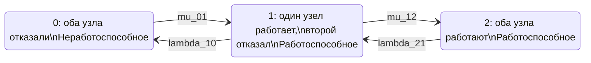

## 2
повтор без \boxed и т.п.

# Расчет надежности отказоустойчивого кластера методом цепей Маркова

## 1. Формализация модели

Рассматривается восстанавливаемый отказоустойчивый кластер типа «1 из 2», состоящий из двух одинаковых узлов.

Кластер считается работоспособным, если работает хотя бы один узел.

Примем следующие допущения:

- процесс изменения состояния является однородной непрерывной марковской цепью;
- интенсивности отказов и восстановления постоянны во времени;
- времена до отказа и восстановления имеют экспоненциальное распределение;
- отказы узлов независимы;
- отказы по общей причине не учитываются;
- восстановление выполняется одним ремонтным каналом;
- после восстановления отказавшего узла кластер возвращается в состояние полной работоспособности;
- кластер находится в состоянии отказа только при отказе обоих узлов.

В терминах теории надежности состояния системы можно определить следующим образом:

- состояние 0 — оба узла неработоспособны; состояние отказа кластера;
- состояние 1 — один узел работоспособен, второй неработоспособен; работоспособное деградированное состояние;
- состояние 2 — оба узла работоспособны; полностью работоспособное состояние.

Обозначения интенсивностей переходов:

- `lambda_21` — интенсивность отказа одного из двух работающих узлов, переход `2 -> 1`;
- `lambda_10` — интенсивность отказа оставшегося работающего узла, переход `1 -> 0`;
- `mu_01` — интенсивность восстановления одного узла, переход `0 -> 1`;
- `mu_12` — интенсивность восстановления второго узла, переход `1 -> 2`.

В общем случае эти интенсивности можно задавать независимо.

Для двух одинаковых независимых узлов обычно принимают:

```text
lambda_21 = 2 * lambda
lambda_10 = lambda
```

где `lambda` — интенсивность отказа одного узла.

Если используется один ремонтный канал с одинаковой интенсивностью восстановления, то:

```text
mu_01 = mu_12 = mu
```

Множитель 2 в выражении `lambda_21 = 2 * lambda` появляется потому, что из состояния 2 отказать может любой из двух работающих узлов.

## 2. Граф состояний



Множество работоспособных состояний:

```text
Omega_g = {1, 2}
```

Множество неработоспособных состояний:

```text
Omega_f = {0}
```

Стационарный коэффициент готовности определяется как сумма стационарных вероятностей работоспособных состояний:

```text
K_g_st = P_1 + P_2
```

## 3. Матрица интенсивностей переходов

Порядок состояний:

```text
(0, 1, 2)
```

Вектор вероятностей состояний представим в виде строки:

```text
P(t) = [P_0(t), P_1(t), P_2(t)]
```

Матрица генератора непрерывной марковской цепи имеет вид:

```text
Q = [
    [-mu_01,                         mu_01,                  0],
    [ lambda_10, -(lambda_10 + mu_12),             mu_12],
    [        0,                    lambda_21,       -lambda_21]
]
```

Диагональные элементы матрицы равны минусу суммы интенсивностей исходящих переходов из соответствующего состояния.

В табличной форме:

| Состояние | 0 | 1 | 2 |
|---|---:|---:|---:|
| 0 | `-mu_01` | `mu_01` | `0` |
| 1 | `lambda_10` | `-(lambda_10 + mu_12)` | `mu_12` |
| 2 | `0` | `lambda_21` | `-lambda_21` |

Для вектора вероятностей-строки уравнение Колмогорова имеет вид:

```text
dP(t) / dt = P(t) * Q
```

## 4. Матрица в формате CSV

```csv
state,0,1,2
0,-mu_01,mu_01,0
1,lambda_10,-(lambda_10 + mu_12),mu_12
2,0,lambda_21,-lambda_21
```

CSV с отдельными переходами:

```csv
from_state,to_state,transition_rate
0,0,-mu_01
0,1,mu_01
0,2,0
1,0,lambda_10
1,1,-(lambda_10 + mu_12)
1,2,mu_12
2,0,0
2,1,lambda_21
2,2,-lambda_21
```

## 5. Система дифференциальных уравнений

Пусть:

- `P_0(t)` — вероятность нахождения кластера в состоянии 0;
- `P_1(t)` — вероятность нахождения кластера в состоянии 1;
- `P_2(t)` — вероятность нахождения кластера в состоянии 2.

Тогда система уравнений Колмогорова имеет вид:

```text
dP_0(t) / dt =
    -mu_01 * P_0(t)
    + lambda_10 * P_1(t)
```

```text
dP_1(t) / dt =
    mu_01 * P_0(t)
    - (lambda_10 + mu_12) * P_1(t)
    + lambda_21 * P_2(t)
```

```text
dP_2(t) / dt =
    mu_12 * P_1(t)
    - lambda_21 * P_2(t)
```

Условие нормировки вероятностей:

```text
P_0(t) + P_1(t) + P_2(t) = 1
```

Если кластер в начальный момент полностью работоспособен, начальные условия имеют вид:

```text
P_0(0) = 0
P_1(0) = 0
P_2(0) = 1
```

Нестационарный коэффициент готовности:

```text
K_g(t) = P_1(t) + P_2(t)
```

Поскольку единственным неработоспособным состоянием является состояние 0, можно записать:

```text
K_g(t) = 1 - P_0(t)
```

## 6. Стационарные вероятности

В стационарном режиме производные вероятностей равны нулю:

```text
dP_0(t) / dt = 0
dP_1(t) / dt = 0
dP_2(t) / dt = 0
```

Система стационарных уравнений:

```text
0 = -mu_01 * P_0 + lambda_10 * P_1
```

```text
0 = mu_01 * P_0
    - (lambda_10 + mu_12) * P_1
    + lambda_21 * P_2
```

```text
0 = mu_12 * P_1 - lambda_21 * P_2
```

```text
P_0 + P_1 + P_2 = 1
```

Из первого и третьего уравнений:

```text
P_1 = (mu_01 / lambda_10) * P_0
```

```text
P_2 = (mu_12 / lambda_21) * P_1
```

или:

```text
P_2 =
    (mu_01 * mu_12)
    / (lambda_10 * lambda_21)
    * P_0
```

Стационарные вероятности равны:

```text
P_0 =
    (lambda_10 * lambda_21)
    /
    (lambda_10 * lambda_21
     + mu_01 * lambda_21
     + mu_01 * mu_12)
```

```text
P_1 =
    (mu_01 * lambda_21)
    /
    (lambda_10 * lambda_21
     + mu_01 * lambda_21
     + mu_01 * mu_12)
```

```text
P_2 =
    (mu_01 * mu_12)
    /
    (lambda_10 * lambda_21
     + mu_01 * lambda_21
     + mu_01 * mu_12)
```

## 7. Стационарный коэффициент готовности

Кластер работоспособен в состояниях 1 и 2. Поэтому:

```text
K_g_st = P_1 + P_2
```

После подстановки стационарных вероятностей:

```text
K_g_st =
    mu_01 * (lambda_21 + mu_12)
    /
    (lambda_10 * lambda_21
     + mu_01 * lambda_21
     + mu_01 * mu_12)
```

Таким образом, итоговая формула имеет вид:

```text
K_g_st =
    [mu_01 * (lambda_21 + mu_12)]
    /
    [lambda_10 * lambda_21
     + mu_01 * lambda_21
     + mu_01 * mu_12]
```

Стационарный коэффициент неготовности:

```text
U_st = P_0
```

то есть:

```text
U_st =
    (lambda_10 * lambda_21)
    /
    (lambda_10 * lambda_21
     + mu_01 * lambda_21
     + mu_01 * mu_12)
```

Проверка:

```text
K_g_st + U_st = 1
```

## 8. Частный случай двух одинаковых узлов

Для двух одинаковых независимых узлов и одного ремонтного канала принимаем:

```text
lambda_21 = 2 * lambda
lambda_10 = lambda
mu_01 = mu_12 = mu
```

Матрица генератора:

```text
Q = [
    [-mu,       mu,       0],
    [ lambda, -(lambda + mu), mu],
    [ 0,        2*lambda, -2*lambda]
]
```

Стационарные вероятности:

```text
P_0 =
    2 * lambda^2
    /
    (2 * lambda^2 + 2 * lambda * mu + mu^2)
```

```text
P_1 =
    2 * lambda * mu
    /
    (2 * lambda^2 + 2 * lambda * mu + mu^2)
```

```text
P_2 =
    mu^2
    /
    (2 * lambda^2 + 2 * lambda * mu + mu^2)
```

Стационарный коэффициент готовности:

```text
K_g_st =
    (2 * lambda * mu + mu^2)
    /
    (2 * lambda^2 + 2 * lambda * mu + mu^2)
```

Если обозначить:

```text
x = lambda / mu
```

то формула принимает вид:

```text
K_g_st =
    (1 + 2*x)
    /
    (1 + 2*x + 2*x^2)
```

При условии `lambda << mu` коэффициент неготовности приближенно равен:

```text
U_st ≈ 2 * (lambda / mu)^2
```

Это демонстрирует эффект резервирования: при независимых отказах вероятность одновременного отказа двух узлов имеет второй порядок по отношению `lambda / mu`.

## 9. Область применимости модели

Представленная модель не учитывает:

- отказы по общей причине;
- отказ сети или коммутатора;
- отказ системы хранения;
- потерю кворума;
- задержку обнаружения отказа;
- время переключения;
- зависимые отказы узлов;
- ошибки программного обеспечения;
- ограничения по ремонтному персоналу;
- невозможность восстановления после некоторых отказов.

Для практического расчета надежности реального кластера граф следует расширить состояниями, описывающими обнаружение отказа, переключение, изоляцию узла, восстановление и повторное включение узла в кластер.

Также необходимо явно указать, что именно означает состояние 1. Если один работающий узел способен полноценно обслуживать нагрузку, состояние 1 является работоспособным. Если при одном отказавшем узле нарушаются требования к производительности, резервированию или кворуму, состояние 1 следует считать неработоспособным либо выделить отдельный показатель деградированной готовности.

## 10. Аналогичные расчеты

- [ГОСТ Р МЭК 61165—2019 «Надежность в технике. Применение марковских методов»](https://meganorm.ru/Data/716/71631.pdf) — нормативная основа для построения марковских моделей надежности, диаграмм состояний, матриц переходов и уравнений Колмогорова. [meganorm](https://meganorm.ru/Data/716/71631.pdf)

- [Марковские модели надежности](https://relind.ru/Ch2/P21.html) — описание непрерывных марковских процессов, стационарных вероятностей и расчета коэффициента готовности ремонтируемых систем. [relind](https://relind.ru/Ch2/P21.html)

- [Метод расчета стационарного коэффициента готовности сложной технической системы](https://journal.gubkin.ru/journals/automation/2023/3-596/61-64/) — пример расчета стационарного коэффициента готовности технической системы на основе марковской модели. [journal.gubkin](https://journal.gubkin.ru/journals/automation/2023/3-596/61-64/)

- [Markov Availability of Repairable System Calculator](https://metricgate.com/docs/markov-availability-repairable-system/) — аналогичная трехсостоящая модель системы «1 из 2» с отказами и восстановлением. [metricgate](https://metricgate.com/docs/markov-availability-repairable-system/)

- [ГОСТ 27.002-89 «Надежность в технике. Основные понятия. Термины и определения»](http://expromtrans.ru/assets/images/uploads/gost-27-002-89.pdf) — нормативные определения работоспособности, готовности и показателей надежности. [expromtrans](http://expromtrans.ru/assets/images/uploads/gost-27-002-89.pdf)
