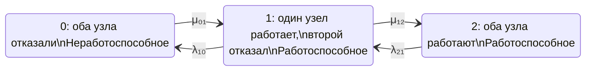

## ver3

## 1. Формализация модели

Рассматривается восстанавливаемый отказоустойчивый кластер типа 1 из 2, состоящий из двух одинаковых узлов. Кластер считается работоспособным, если работает хотя бы один узел.

Примем следующие предположения:

- процесс изменения состояния — однородная непрерывная марковская цепь с конечным числом состояний;
- интенсивности отказов и восстановлений постоянны во времени;
- времена до отказа и восстановления имеют экспоненциальные распределения;
- отказы узлов независимы;
- общий отказ, отказ сети, системы хранения, кворума и другие отказы по общей причине не учитываются;
- восстановление выполняется одним ремонтным каналом;
- в состоянии 1 восстанавливается отказавший узел;
- после восстановления одного узла система переходит в состояние 2;
- кластер находится в состоянии отказа только при отказе обоих узлов.

Такие допущения соответствуют стандартному подходу к однородным марковским моделям надежности. ГОСТ Р МЭК 61165—2019 рассматривает состояния системы как комбинации состояний элементов, а переходы — как результаты отказов и восстановлений; для стационарного анализа интенсивности переходов принимаются постоянными. [meganorm](https://meganorm.ru/Data/716/71631.pdf)

Обозначения:

- 0 — оба узла отказали;
- 1 — один узел работоспособен, второй отказал;
- 2 — оба узла работоспособны;
- λ₂₁ — интенсивность перехода из состояния 2 в состояние 1;
- λ₁₀ — интенсивность перехода из состояния 1 в состояние 0;
- μ₀₁ — интенсивность восстановления из состояния 0 в состояние 1;
- μ₁₂ — интенсивность восстановления из состояния 1 в состояние 2.

В данной постановке λ₂₁ и λ₁₀ могут быть заданы независимо. Однако для физически симметричных независимых узлов обычно:

λ₂₁ = 2λ,

λ₁₀ = λ,

где λ — интенсивность отказа одного узла.

Если ремонт выполняется одним каналом с одинаковой интенсивностью μ, то обычно:

μ₀₁ = μ₁₂ = μ.

Важно не смешивать интенсивности переходов между агрегированными состояниями с интенсивностью отказа одного узла: переход 2 → 1 включает отказ любого из двух работающих узлов и поэтому имеет множитель 2.

## 2. Граф состояний



Множества состояний:

Ωг = {1, 2},

Ωн = {0}.

Стационарный коэффициент готовности определяется как сумма стационарных вероятностей работоспособных состояний:

Кг,ст = P₁ + P₂.

Именно такой способ определения используется в марковских моделях: коэффициент готовности равен сумме вероятностей всех работоспособных состояний. [relind](https://relind.ru/Ch2/P21.html)

### Матрица интенсивностей переходов

При порядке состояний (0, 1, 2) и использовании вектора-строки вероятностей

P(t) = [P₀(t) P₁(t) P₂(t)]

матрица генератора имеет вид:

Q =

[ -μ₀₁                     μ₀₁                  0                ]

[ λ₁₀        -(λ₁₀ + μ₁₂)                 μ₁₂                ]

[ 0                         λ₂₁                -λ₂₁             ]

Диагональные элементы равны минусу суммы интенсивностей исходящих переходов:

qᵢᵢ = -Σ qᵢⱼ, при j ≠ i.

Тогда уравнение Колмогорова записывается как:

dP(t) / dt = P(t)Q.

### Матрица в CSV

```csv
state,0,1,2
0,-μ₀₁,μ₀₁,0
1,λ₁₀,-(λ₁₀ + μ₁₂),μ₁₂
2,0,λ₂₁,-λ₂₁
```

CSV с отдельными переходами:

```csv
from,to,transition_rate
0,0,-μ₀₁
0,1,μ₀₁
0,2,0
1,0,λ₁₀
1,1,-(λ₁₀ + μ₁₂)
1,2,μ₁₂
2,0,0
2,1,λ₂₁
2,2,-λ₂₁
```

### Система дифференциальных уравнений

Из правила «приток минус отток» получаем:

dP₀(t) / dt = -μ₀₁P₀(t) + λ₁₀P₁(t).

dP₁(t) / dt = μ₀₁P₀(t) - (λ₁₀ + μ₁₂)P₁(t) + λ₂₁P₂(t).

dP₂(t) / dt = μ₁₂P₁(t) - λ₂₁P₂(t).

Условие нормировки:

P₀(t) + P₁(t) + P₂(t) = 1.

Если кластер первоначально полностью работоспособен, то начальные условия:

P₀(0) = 0,

P₁(0) = 0,

P₂(0) = 1.

Нестационарный коэффициент готовности:

Кг(t) = P₁(t) + P₂(t) = 1 - P₀(t).

### Стационарное решение

В стационарном режиме:

dPᵢ(t) / dt = 0.

Поэтому:

0 = -μ₀₁P₀ + λ₁₀P₁,

0 = μ₀₁P₀ - (λ₁₀ + μ₁₂)P₁ + λ₂₁P₂,

0 = μ₁₂P₁ - λ₂₁P₂,

P₀ + P₁ + P₂ = 1.

Из первого и третьего уравнений:

P₁ = (μ₀₁ / λ₁₀)P₀,

P₂ = (μ₁₂ / λ₂₁)P₁.

Следовательно:

P₂ = (μ₀₁μ₁₂ / λ₁₀λ₂₁)P₀.

После нормировки:

P₀ = λ₁₀λ₂₁ / (λ₁₀λ₂₁ + μ₀₁λ₂₁ + μ₀₁μ₁₂),

P₁ = μ₀₁λ₂₁ / (λ₁₀λ₂₁ + μ₀₁λ₂₁ + μ₀₁μ₁₂),

P₂ = μ₀₁μ₁₂ / (λ₁₀λ₂₁ + μ₀₁λ₂₁ + μ₀₁μ₁₂).

Следовательно, стационарный коэффициент готовности кластера равен:

Кг,ст = P₁ + P₂

Кг,ст = μ₀₁(λ₂₁ + μ₁₂) / (λ₁₀λ₂₁ + μ₀₁λ₂₁ + μ₀₁μ₁₂).

а коэффициент неготовности:

Uст = P₀

Uст = λ₁₀λ₂₁ / (λ₁₀λ₂₁ + μ₀₁λ₂₁ + μ₀₁μ₁₂).

Проверка:

Кг,ст + Uст = 1.

## 3. Частный симметричный случай

Для двух одинаковых независимых узлов и одного ремонтного канала:

λ₂₁ = 2λ,

λ₁₀ = λ,

μ₀₁ = μ₁₂ = μ.

Тогда:

Q =

[ -μ                μ                0             ]

[ λ             -(λ + μ)            μ             ]

[ 0                 2λ             -2λ             ]

Стационарные вероятности:

P₀ = 2λ² / (2λ² + 2λμ + μ²),

P₁ = 2λμ / (2λ² + 2λμ + μ²),

P₂ = μ² / (2λ² + 2λμ + μ²).

Стационарный коэффициент готовности:

Кг,ст = (2λμ + μ²) / (2λ² + 2λμ + μ²).

Если обозначить x = λ / μ, то:

Кг,ст = (1 + 2x) / (1 + 2x + 2x²).

При λ ≪ μ коэффициент неготовности приближенно равен:

Uст ≈ 2(λ / μ)².

Это показывает эффект резервирования: при независимых отказах вероятность нахождения обоих узлов в отказавшем состоянии имеет второй порядок по отношению λ / μ.

## 4. Терминологические замечания

В формулировке задачи лучше использовать не «работает/отказал», а:

- работоспособное состояние — состояние, в котором кластер способен выполнять заданную функцию;
- неработоспособное состояние — состояние, в котором кластер не способен выполнять заданную функцию;
- интенсивность отказа — параметр перехода в состояние с ухудшением работоспособности;
- интенсивность восстановления — параметр перехода из неработоспособного или деградированного состояния в более работоспособное состояние;
- стационарный коэффициент готовности — установившаяся вероятность нахождения системы в работоспособном состоянии.

По ГОСТ Р МЭК 61165—2019 стационарный коэффициент готовности также называется асимптотическим коэффициентом готовности; эти обозначения имеют одинаковое числовое значение. [meganorm](https://meganorm.ru/Data/716/71631.pdf)

Следует отдельно зафиксировать, что в модели не учитываются:

- отказ по общей причине;
- отказ коммутатора, сети или системы хранения;
- зависимые отказы;
- задержка обнаружения отказа;
- переключение на резерв;
- ограничение кворума;
- одновременный отказ двух узлов.

Для реального кластера часто требуется расширить граф дополнительными состояниями: «отказ обнаружен», «идет переключение», «узел изолирован», «ремонт выполняется», «восстановление завершено, но узел еще не введен в кластер».

## 5. Аналогичные расчеты и источники

- [ГОСТ Р МЭК 61165—2019 «Надежность в технике. Применение марковских методов»](https://meganorm.ru/Data/716/71631.pdf) — основной нормативный источник. Содержит правила построения диаграмм состояний, уравнений Колмогорова, матриц переходов и расчета стационарных показателей надежности. [meganorm](https://meganorm.ru/Data/716/71631.pdf)

- [Марковские модели надежности](https://relind.ru/Ch2/P21.html) — изложение построения графа состояний, уравнений Колмогорова, стационарных вероятностей и расчета коэффициента готовности как суммы вероятностей работоспособных состояний. [relind](https://relind.ru/Ch2/P21.html)

- [Метод расчета стационарного коэффициента готовности сложной технической системы](https://journal.gubkin.ru/journals/automation/2023/3-596/61-64/) — российская публикация о расчете стационарного коэффициента готовности технической системы на основе марковской модели. [journal.gubkin](https://journal.gubkin.ru/journals/automation/2023/3-596/61-64/)

- [Markov Availability of Repairable System Calculator](https://metricgate.com/docs/markov-availability-repairable-system/) — аналогичная трехсостоящая модель для системы «1 из 2» с отказами и восстановлением. [metricgate](https://metricgate.com/docs/markov-availability-repairable-system/)

- [ГОСТ 27.002-89 «Надежность в технике. Основные понятия. Термины и определения»](http://expromtrans.ru/assets/images/uploads/gost-27-002-89.pdf) — источник терминологии для коэффициента готовности, работоспособности, восстановления и других показателей надежности. [expromtrans](http://expromtrans.ru/assets/images/uploads/gost-27-002-89.pdf)

Для представленной модели наиболее корректная итоговая запись:

Кг,ст = μ₀₁(λ₂₁ + μ₁₂) / (λ₁₀λ₂₁ + μ₀₁λ₂₁ + μ₀₁μ₁₂).

При симметричных параметрах:

λ₂₁ = 2λ,

λ₁₀ = λ,

μ₀₁ = μ₁₂ = μ,

получаем:

Кг,ст = (2λμ + μ²) / (2λ² + 2λμ + μ²).
