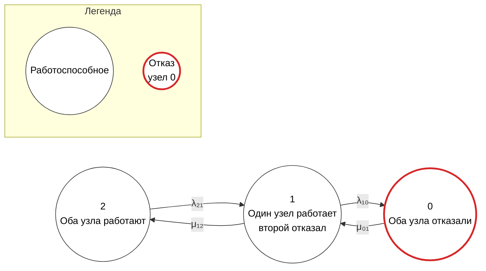

## 1

```mermaid
stateDiagram-v2
    direction LR

    state "2: оба узла работают" as S2
    state "1: один узел работает,\nвторой отказал" as S1
    state "0: оба узла отказали" as S0

    S2 --> S1: λ₂₁
    S1 --> S2: μ₁₂
    S1 --> S0: λ₁₀
    S0 --> S1: μ₀₁

    classDef working fill:#ffffff,stroke:#333333,stroke-width:1px
    classDef failed fill:#ffffff,stroke:#d62728,stroke-width:3px,color:#000000

    class S2,S1 working
    class S0 failed

    legend
        L1[Работоспособное состояние]:::working
        L2[Отказ: состояние 0]:::failed
```

Однако `stateDiagram-v2` не всегда корректно поддерживает отдельный блок легенды и применение `classDef` к элементам легенды в GitHub Mermaid. Поэтому для более надежного отображения в GitHub лучше использовать `flowchart`.



В этой версии:

- состояния расположены слева направо в порядке `2 → 1 → 0`;
- каждое состояние представлено окружностью;
- состояния 2 и 1 имеют обычный контур;
- состояние 0 имеет красный контур;
- внизу размещена легенда;
- легенда показывает, что обычный контур означает работоспособное состояние, а красный контур — отказ.
