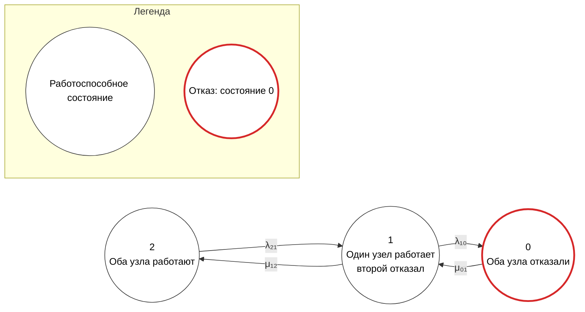
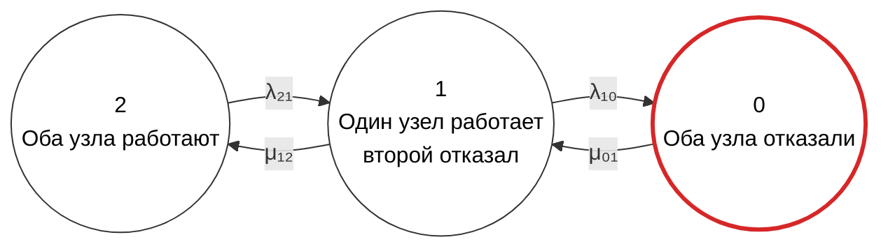
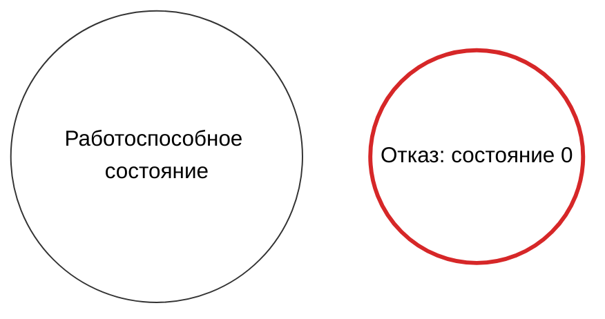

## 2

Ошибка вызвана строками легенды в `stateDiagram-v2`:

```mermaid
L1[Работоспособное состояние]:::working
L2[Отказ: состояние 0]:::failed
```

Синтаксис `:::class` после узлов поддерживается в `flowchart`, но не поддерживается таким образом в `stateDiagram-v2`. Поэтому парсер воспринимает `:::` как неожиданный разделитель стиля.

Используйте `flowchart`, где окружности, классы стилей и легенда поддерживаются надежнее.



Если GitHub располагает легенду не снизу, а сбоку, используйте более надежный вариант с двумя Mermaid-блоками.

### Основной граф



### Легенда



В этом варианте:

- основной граф направлен слева направо;
- узлы расположены в порядке `2 → 1 → 0`;
- все состояния имеют форму окружности;
- состояния 1 и 2 имеют обычный контур;
- состояние 0 имеет красный контур;
- легенда не использует `stateDiagram-v2`;
- синтаксис `:::` не применяется, поэтому ошибка `STYLE_SEPARATOR` не возникает.
