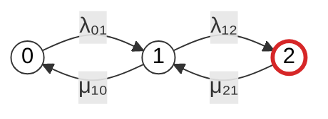
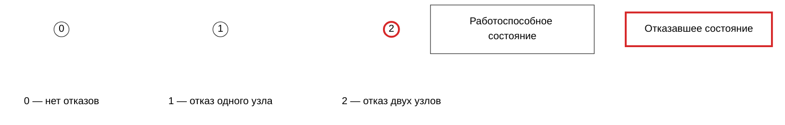

## 2
на основе prompt2

# Расчет надежности отказоустойчивого кластера методом цепей Маркова

## 1. Формализация модели

Рассматривается восстанавливаемый отказоустойчивый кластер типа «1 из 2», состоящий из двух одинаковых узлов.

Состояние марковской модели определяется количеством отказавших узлов:

- состояние 0 — отказов нет, оба узла работоспособны;
- состояние 1 — отказал один узел, один узел остается работоспособным;
- состояние 2 — отказали оба узла.

Кластер считается работоспособным, если работает хотя бы один узел. Поэтому:

$$
\Omega_g = \{0,1\}
$$

Множество неработоспособных состояний:

$$
\Omega_f = \{2\}
$$

В модели учитываются следующие переходы:

- из состояния 0 в состояние 1 — отказ одного из двух работоспособных узлов;
- из состояния 1 в состояние 2 — отказ оставшегося работоспособного узла;
- из состояния 1 в состояние 0 — восстановление отказавшего узла;
- из состояния 2 в состояние 1 — восстановление одного из двух отказавших узлов.

Модель является однородной непрерывной марковской цепью, если интенсивности переходов не зависят от времени. Такой подход применяется в ГОСТ Р МЭК 61165—2019 для анализа безотказности, готовности, ремонтопригодности и безопасности систем. [docs.cntd](https://docs.cntd.ru/document/1200167576)

### Обозначения интенсивностей

Используем следующие обозначения:

- $\lambda_{01}$ — интенсивность перехода из состояния 0 в состояние 1;
- $\lambda_{12}$ — интенсивность перехода из состояния 1 в состояние 2;
- $\mu_{10}$ — интенсивность перехода из состояния 1 в состояние 0;
- $\mu_{21}$ — интенсивность перехода из состояния 2 в состояние 1.

Для двух одинаковых независимых узлов с интенсивностью отказа одного узла $\lambda$ обычно:

$$
\lambda_{01} = 2\lambda
$$

$$
\lambda_{12} = \lambda
$$

Если восстановление выполняется одним ремонтным каналом с интенсивностью $\mu$, то:

$$
\mu_{10} = \mu
$$

$$
\mu_{21} = \mu
$$

Если в состоянии 2 работают два независимых ремонтных канала, то переход $2 \to 1$ может иметь интенсивность:

$$
\mu_{21} = 2\mu
$$

В дальнейшем сначала рассматривается общий случай с независимыми параметрами $\lambda_{01}$, $\lambda_{12}$, $\mu_{10}$ и $\mu_{21}$.

## 2. Граф состояний Mermaid

В узлах графа используются только цифры. Описания состояний вынесены в отдельную легенду.

Состояния расположены слева направо в порядке:

$$
0 \rightarrow 1 \rightarrow 2
$$



Состояния 0 и 1 являются работоспособными, поэтому они имеют обычный темный контур. Состояние 2 является отказавшим, поэтому оно выделено красным контуром.

## 3. Легенда Mermaid

Легенда приведена отдельным Mermaid-блоком. В ней указаны значения состояний и цветовая семантика контуров.



Смысл легенды:

- обычный темный контур — работоспособное состояние;
- красный контур — отказавшее состояние;
- 0 — нет отказов;
- 1 — отказ одного узла;
- 2 — отказ двух узлов.

## 4. Матрица интенсивностей переходов

Используем порядок состояний:

$$
(0,1,2)
$$

Вектор вероятностей состояний представим в виде строки:

$$
\mathbf{P}(t) =
\begin{bmatrix}
P_0(t) & P_1(t) & P_2(t)
\end{bmatrix}
$$

Матрица генератора непрерывной марковской цепи:

$$
Q =
\begin{bmatrix}
-\lambda_{01} & \lambda_{01} & 0 \\
\mu_{10} & -(\mu_{10}+\lambda_{12}) & \lambda_{12} \\
0 & \mu_{21} & -\mu_{21}
\end{bmatrix}
$$

Диагональные элементы равны минусу суммы интенсивностей исходящих переходов из соответствующего состояния.

Для вектора вероятностей-строки уравнение Колмогорова имеет вид:

$$
\frac{d\mathbf{P}(t)}{dt} = \mathbf{P}(t)Q
$$

### Матрица в таблице Markdown

| Состояние | 0 | 1 | 2 |
|---|---:|---:|---:|
| 0 | $-\lambda_{01}$ | $\lambda_{01}$ | 0 |
| 1 | $\mu_{10}$ | $-(\mu_{10}+\lambda_{12})$ | $\lambda_{12}$ |
| 2 | 0 | $\mu_{21}$ | $-\mu_{21}$ |

### Матрица в формате CSV

```csv
state,0,1,2
0,-λ₀₁,λ₀₁,0
1,μ₁₀,-(μ₁₀ + λ₁₂),λ₁₂
2,0,μ₂₁,-μ₂₁
```

CSV с отдельными переходами:

```csv
from,to,transition_rate
0,0,-λ₀₁
0,1,λ₀₁
0,2,0
1,0,μ₁₀
1,1,-(μ₁₀ + λ₁₂)
1,2,λ₁₂
2,0,0
2,1,μ₂₁
2,2,-μ₂₁
```

## 5. Система дифференциальных уравнений

Пусть:

- $P_0(t)$ — вероятность нахождения кластера в состоянии 0;
- $P_1(t)$ — вероятность нахождения кластера в состоянии 1;
- $P_2(t)$ — вероятность нахождения кластера в состоянии 2.

По правилу «приток минус отток» получаем:

$$
\frac{dP_0(t)}{dt}
=
-\lambda_{01}P_0(t)
+\mu_{10}P_1(t)
$$

$$
\frac{dP_1(t)}{dt}
=
\lambda_{01}P_0(t)
-(\mu_{10}+\lambda_{12})P_1(t)
+\mu_{21}P_2(t)
$$

$$
\frac{dP_2(t)}{dt}
=
\lambda_{12}P_1(t)
-\mu_{21}P_2(t)
$$

Условие нормировки:

$$
P_0(t)+P_1(t)+P_2(t)=1
$$

Если в начальный момент оба узла работоспособны, то начальные условия имеют вид:

$$
P_0(0)=1
$$

$$
P_1(0)=0
$$

$$
P_2(0)=0
$$

Нестационарный коэффициент готовности:

$$
K_{\mathrm{г}}(t)=P_0(t)+P_1(t)
$$

Поскольку единственным неработоспособным состоянием является состояние 2:

$$
K_{\mathrm{г}}(t)=1-P_2(t)
$$

## 6. Стационарные вероятности

В стационарном режиме производные вероятностей равны нулю:

$$
\frac{dP_0(t)}{dt}=0
$$

$$
\frac{dP_1(t)}{dt}=0
$$

$$
\frac{dP_2(t)}{dt}=0
$$

Система стационарных уравнений:

$$
0=-\lambda_{01}P_0+\mu_{10}P_1
$$

$$
0=\lambda_{01}P_0-(\mu_{10}+\lambda_{12})P_1+\mu_{21}P_2
$$

$$
0=\lambda_{12}P_1-\mu_{21}P_2
$$

$$
P_0+P_1+P_2=1
$$

Из первого уравнения:

$$
P_1=\frac{\lambda_{01}}{\mu_{10}}P_0
$$

Из третьего уравнения:

$$
P_2=\frac{\lambda_{12}}{\mu_{21}}P_1
$$

Следовательно:

$$
P_2=
\frac{\lambda_{01}\lambda_{12}}
{\mu_{10}\mu_{21}}P_0
$$

После применения условия нормировки получаем:

$$
P_0=
\frac{\mu_{10}\mu_{21}}
{\mu_{10}\mu_{21}
+\lambda_{01}\mu_{21}
+\lambda_{01}\lambda_{12}}
$$

$$
P_1=
\frac{\lambda_{01}\mu_{21}}
{\mu_{10}\mu_{21}
+\lambda_{01}\mu_{21}
+\lambda_{01}\lambda_{12}}
$$

$$
P_2=
\frac{\lambda_{01}\lambda_{12}}
{\mu_{10}\mu_{21}
+\lambda_{01}\mu_{21}
+\lambda_{01}\lambda_{12}}
$$

## 7. Стационарный коэффициент готовности

Кластер работоспособен в состояниях 0 и 1. Поэтому:

$$
K_{\mathrm{г,ст}}=P_0+P_1
$$

После подстановки стационарных вероятностей:

$$
K_{\mathrm{г,ст}}
=
\frac{\mu_{10}\mu_{21}+\lambda_{01}\mu_{21}}
{\mu_{10}\mu_{21}
+\lambda_{01}\mu_{21}
+\lambda_{01}\lambda_{12}}
$$

Вынеся $\mu_{21}$ в числителе:

$$
K_{\mathrm{г,ст}}
=
\frac{\mu_{21}(\mu_{10}+\lambda_{01})}
{\mu_{10}\mu_{21}
+\lambda_{01}\mu_{21}
+\lambda_{01}\lambda_{12}}
$$

Коэффициент неготовности:

$$
U_{\mathrm{ст}}=P_2
$$

и

$$
U_{\mathrm{ст}}
=
\frac{\lambda_{01}\lambda_{12}}
{\mu_{10}\mu_{21}
+\lambda_{01}\mu_{21}
+\lambda_{01}\lambda_{12}}
$$

Проверка:

$$
K_{\mathrm{г,ст}}+U_{\mathrm{ст}}=1
$$

Условием существования единственного стационарного распределения для этой конечной модели является возможность восстановления из каждого состояния и связность цепи. При положительных значениях $\lambda_{01}$, $\lambda_{12}$, $\mu_{10}$ и $\mu_{21}$ любое состояние достижимо из любого другого через последовательность переходов.

## 8. Частный случай двух одинаковых узлов

Для двух одинаковых независимых узлов:

$$
\lambda_{01}=2\lambda
$$

$$
\lambda_{12}=\lambda
$$

Для одного ремонтного канала:

$$
\mu_{10}=\mu_{21}=\mu
$$

Матрица генератора:

$$
Q =
\begin{bmatrix}
-2\lambda & 2\lambda & 0 \\
\mu & -(\mu+\lambda) & \lambda \\
0 & \mu & -\mu
\end{bmatrix}
$$

Стационарные вероятности:

$$
P_0=
\frac{\mu^2}
{\mu^2+2\lambda\mu+2\lambda^2}
$$

$$
P_1=
\frac{2\lambda\mu}
{\mu^2+2\lambda\mu+2\lambda^2}
$$

$$
P_2=
\frac{2\lambda^2}
{\mu^2+2\lambda\mu+2\lambda^2}
$$

Стационарный коэффициент готовности:

$$
K_{\mathrm{г,ст}}
=
\frac{\mu^2+2\lambda\mu}
{\mu^2+2\lambda\mu+2\lambda^2}
$$

Коэффициент неготовности:

$$
U_{\mathrm{ст}}
=
\frac{2\lambda^2}
{\mu^2+2\lambda\mu+2\lambda^2}
$$

Если обозначить:

$$
x=\frac{\lambda}{\mu}
$$

то:

$$
K_{\mathrm{г,ст}}
=
\frac{1+2x}
{1+2x+2x^2}
$$

При $\lambda \ll \mu$:

$$
U_{\mathrm{ст}}
\approx
2\left(\frac{\lambda}{\mu}\right)^2
$$

Следовательно, при независимых отказах и быстром восстановлении вероятность одновременного отказа обоих узлов имеет второй порядок по отношению $\lambda/\mu$.

Если для состояния 2 используются два независимых ремонтных канала, то $\mu_{21}=2\mu$, и формулу необходимо пересчитать с учетом этого изменения. Нельзя применять результат для одного ремонтного канала без изменения матрицы переходов.

## 9. Ограничения модели

Модель не учитывает:

- отказ по общей причине;
- отказ сети или коммутатора;
- отказ системы хранения;
- потерю кворума;
- задержку обнаружения отказа;
- время переключения;
- зависимые отказы;
- ошибки программного обеспечения;
- неоднородные ремонтные процедуры;
- ограничение ремонтного персонала, если оно отличается от принятого одного ремонтного канала;
- неэкспоненциальные распределения времени отказа или восстановления.

Для реального кластера могут потребоваться дополнительные состояния:

- отказ обнаружен;
- выполняется переключение;
- узел изолирован;
- выполняется диагностика;
- выполняется ремонт;
- узел восстановлен, но еще не возвращен в кластер;
- кластер работает в режиме потери кворума или ограниченной производительности.

Особенно важно заранее определить, считается ли состояние 1 работоспособным. В настоящей модели оно считается работоспособным, поскольку один узел продолжает выполнять заданную функцию кластера.

## 10. Аналогичные расчеты и источники

- [ГОСТ Р МЭК 61165—2019 «Надежность в технике. Применение марковских методов»](https://docs.cntd.ru/document/1200167576) — нормативное руководство по применению марковских методов для анализа безотказности, готовности, ремонтопригодности и безопасности. Стандарт определяет состояния системы, переходы, интенсивности переходов и правила построения марковских моделей. [docs.cntd](https://docs.cntd.ru/document/1200167576)

- [Марковские модели надежности](https://relind.ru/Ch2/P21.html) — описание построения пространства состояний, матрицы интенсивностей, уравнений Колмогорова, стационарных вероятностей и расчета коэффициента готовности как суммы вероятностей работоспособных состояний. [relind](https://relind.ru/Ch2/P21.html)

- [Markov Availability of Repairable System Calculator](https://metricgate.com/docs/markov-availability-repairable-system/) — пример трехсостоящей модели для активной схемы «1 из 2» с одним ремонтным каналом. В источнике состояния определяются числом отказавших узлов, а готовность равна сумме вероятностей состояний с нулем и одним отказавшим узлом. [metricgate](https://metricgate.com/docs/markov-availability-repairable-system/)

- [The Mathematical Model and Numerical Solution of Instantaneous Availabilities for the Two-Unit Series Repairable System and Parallel Repairable System with Three States](https://pdfs.semanticscholar.org/b595/e58d614ed5bf11933d645267e04ed81446a1.pdf) — пример построения трехсостоящей марковской модели ремонтируемой двухэлементной системы. [pdfs.semanticscholar](https://pdfs.semanticscholar.org/b595/e58d614ed5bf11933d645267e04ed81446a1.pdf)

## Итоговая формула

Для представленной модели наиболее корректная итоговая запись:

$$
K_{\mathrm{г,ст}}
=
\frac{\mu_{21}(\mu_{10}+\lambda_{01})}
{\mu_{10}\mu_{21}
+\lambda_{01}\mu_{21}
+\lambda_{01}\lambda_{12}}
$$

Эквивалентная форма:

$$
K_{\mathrm{г,ст}}
=
1-
\frac{\lambda_{01}\lambda_{12}}
{\mu_{10}\mu_{21}
+\lambda_{01}\mu_{21}
+\lambda_{01}\lambda_{12}}
$$

Коэффициент неготовности:

$$
U_{\mathrm{ст}}
=
\frac{\lambda_{01}\lambda_{12}}
{\mu_{10}\mu_{21}
+\lambda_{01}\mu_{21}
+\lambda_{01}\lambda_{12}}
$$

Для симметричного случая с одним ремонтным каналом:

$$
\lambda_{01}=2\lambda,
\qquad
\lambda_{12}=\lambda,
\qquad
\mu_{10}=\mu_{21}=\mu
$$

получаем:

$$
K_{\mathrm{г,ст}}
=
\frac{\mu^2+2\lambda\mu}
{\mu^2+2\lambda\mu+2\lambda^2}
$$

и:

$$
U_{\mathrm{ст}}
=
\frac{2\lambda^2}
{\mu^2+2\lambda\mu+2\lambda^2}
$$

Для представленной модели это наиболее корректная итоговая запись, поскольку состояния нумеруются по числу отказавших узлов: 0 — отказов нет, 1 — отказ одного узла, 2 — отказ двух узлов.
