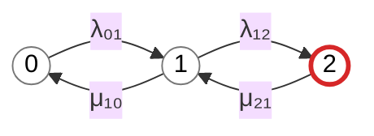
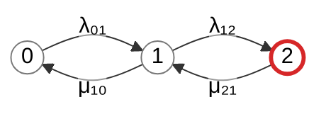

## 2

\frac  - все равно некорректно, поэтому сделаем: Оформи в режиме GitHub Markdown, формулы без LaTeX-обертки

также замечания:
λ₀₁ и другие на схеме mermaid имеют фон (серый). Нужно убрать фон.
Легенда приведена отдельным Mermaid-блоком - но должно быть:
два кружка - один серым контуром, другой с красным и подписью Работоспособное состояние и Отказавшее состояние (соответсвенно).
Ниже:
в столбик подпись состояний (без графики):
0 — нет отказов;
1 — отказ одного узла;
2 — отказ двух узлов.


## 2.1

Принято. Используем следующие правила оформления.

## Итоговый режим оформления

> Оформи в режиме GitHub Markdown, формулы без LaTeX-обертки.

Это означает:

- не использовать `$$`;
- не использовать `$...$`;
- не использовать `\(...\)` и `\[...\]`;
- не использовать `\frac`;
- не использовать `\boxed`;
- не использовать другие LaTeX-команды;
- формулы записывать линейным текстом;
- использовать Unicode-символы `λ`, `μ`, `₀`, `₁`, `₂`;
- формулы при необходимости можно помещать в обычные блоки кода.

Например:

```text
Кг,ст = μ₂₁(μ₁₀ + λ₀₁) /
        (μ₁₀μ₂₁ + λ₀₁μ₂₁ + λ₀₁λ₁₂)
```

## Исправленный основной граф Mermaid

У подписей переходов был серый фон, потому что Mermaid автоматически оформляет текстовые метки на стрелках как отдельные элементы. Чтобы убрать фон, добавим CSS-стиль для `.edgeLabel`.



Для GitHub-совместимого Mermaid наиболее надежный способ убрать серый фон подписей — добавить в Markdown перед графом следующий HTML/CSS-фрагмент:

```html
<style>
.edgeLabel {
    background-color: transparent !important;
}

.edgeLabel rect {
    fill: transparent !important;
    stroke: transparent !important;
}

.labelBkg {
    fill: transparent !important;
}
</style>
```

Если GitHub удаляет пользовательские `<style>`-теги, применяйте вариант графа без фона через настройки Mermaid:



Если конкретный GitHub-рендерер все равно показывает фон, можно записывать интенсивности непосредственно на стрелках через отдельные подписи или использовать короткие обозначения без текстовых edge labels. Но сначала следует применять настройку `edgeLabelBackground`.

## Исправленная легенда Mermaid

Легенда должна содержать:

1. два кружка;
2. первый кружок с серым контуром;
3. второй кружок с красным контуром;
4. подпись «Работоспособное состояние» для серого кружка;
5. подпись «Отказавшее состояние» для красного кружка;
6. ниже — вертикальный список расшифровки состояний без графических элементов.

```mermaid
%%{init: {"theme": "base", "themeVariables": {"background": "#ffffff", "primaryColor": "#ffffff", "primaryTextColor": "#000000", "lineColor": "#ffffff"}}}%%
flowchart TB
    W(( ))
    W_TEXT["Работоспособное состояние"]

    F(( ))
    F_TEXT["Отказавшее состояние"]

    W --- W_TEXT
    F --- F_TEXT

    S0["0 — нет отказов"]
    S1["1 — отказ одного узла"]
    S2["2 — отказ двух узлов"]

    W --> F
    F --> S0
    S0 --> S1
    S1 --> S2

    classDef working fill:#ffffff,stroke:#777777,stroke-width:2px,color:#000000
    classDef failed fill:#ffffff,stroke:#d62728,stroke-width:2px,color:#000000
    classDef text fill:#ffffff,stroke:#ffffff,color:#000000

    class W working
    class F failed
    class W_TEXT,F_TEXT,S0,S1,S2 text

    linkStyle 0,1,2,3,4 stroke:transparent,fill:none
```

Однако для легенды без нежелательных соединительных линий надежнее использовать два кружка и подписи как независимые узлы:


При необходимости выравнивание элементов легенды можно выполнять с помощью невидимых связей:

```mermaid
%%{init: {"theme": "base", "themeVariables": {"background": "#ffffff", "primaryColor": "#ffffff", "primaryTextColor": "#000000", "lineColor": "#ffffff"}}}%%
flowchart TB
    W(( ))
    W_TEXT["Работоспособное состояние"]
    F(( ))
    F_TEXT["Отказавшее состояние"]

    S0["0 — нет отказов"]
    S1["1 — отказ одного узла"]
    S2["2 — отказ двух узлов"]

    W --- W_TEXT
    F --- F_TEXT
    W --> F
    F --> S0
    S0 --> S1
    S1 --> S2

    classDef working fill:#ffffff,stroke:#777777,stroke-width:2px,color:#000000
    classDef failed fill:#ffffff,stroke:#d62728,stroke-width:2px,color:#000000
    classDef text fill:#ffffff,stroke:#ffffff,color:#000000

    class W working
    class F failed
    class W_TEXT,F_TEXT,S0,S1,S2 text

    linkStyle 0,1,2,3,4 stroke:transparent,fill:none
```

## Рекомендуемый вариант легенды

Для GitHub лучше использовать следующий вариант:

```mermaid
flowchart TB
    W(( ))
    F(( ))

    W_TEXT["Работоспособное состояние"]
    F_TEXT["Отказавшее состояние"]

    S0["0 — нет отказов"]
    S1["1 — отказ одного узла"]
    S2["2 — отказ двух узлов"]

    W --- W_TEXT
    F --- F_TEXT

    classDef working fill:#ffffff,stroke:#777777,stroke-width:2px,color:#000000
    classDef failed fill:#ffffff,stroke:#d62728,stroke-width:2px,color:#000000
    classDef text fill:#ffffff,stroke:#ffffff,color:#000000

    class W working
    class F failed
    class W_TEXT,F_TEXT,S0,S1,S2 text

    linkStyle 0,1 stroke:transparent,fill:none
```

Ниже Mermaid-блока разместите обычным Markdown-текстом:

```text
0 — нет отказов;
1 — отказ одного узла;
2 — отказ двух узлов.
```

Но поскольку требуется, чтобы эти подписи находились внутри отдельного Mermaid-блока, используйте полный вариант:

```mermaid
flowchart TB
    W(( ))
    W_TEXT["Работоспособное состояние"]

    F(( ))
    F_TEXT["Отказавшее состояние"]

    S0["0 — нет отказов"]
    S1["1 — отказ одного узла"]
    S2["2 — отказ двух узлов"]

    W --- W_TEXT
    F --- F_TEXT
    W --> F
    F --> S0
    S0 --> S1
    S1 --> S2

    classDef working fill:#ffffff,stroke:#777777,stroke-width:2px,color:#000000
    classDef failed fill:#ffffff,stroke:#d62728,stroke-width:2px,color:#000000
    classDef text fill:#ffffff,stroke:#ffffff,color:#000000

    class W working
    class F failed
    class W_TEXT,F_TEXT,S0,S1,S2 text

    linkStyle 0,1,2,3,4 stroke:transparent,fill:none
```

В дальнейших ответах буду использовать:

> GitHub Markdown, формулы без LaTeX-обертки, Mermaid с прозрачным фоном подписей переходов и отдельной легендой из двух кружков с серым и красным контурами, после которых вертикально указаны состояния 0, 1 и 2.
