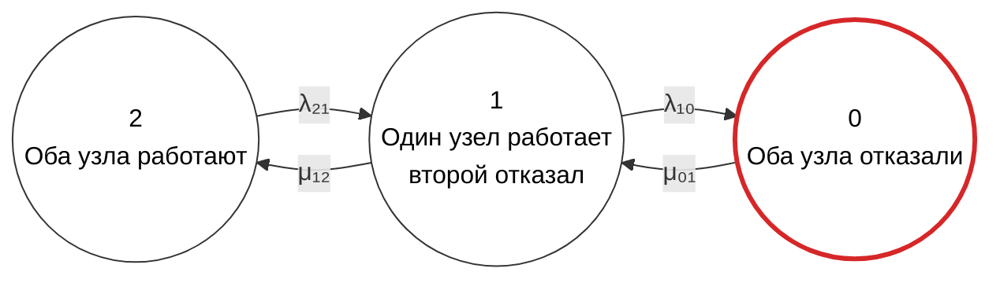
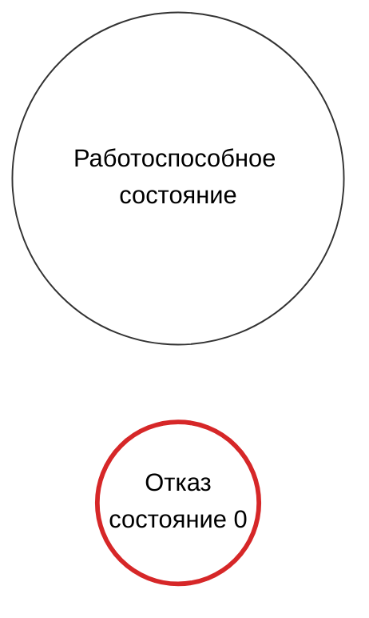

## 1
см. исходный prompt в cluster1 и результат в cluster_ver3

# Промпт для расчета надежности кластера

```text
Рассчитай надежность отказоустойчивого кластера методом непрерывных однородных цепей Маркова.

## Исходная модель

Рассматривается восстанавливаемый отказоустойчивый кластер типа «1 из 2», состоящий из двух одинаковых узлов.

Состояния графа:

- состояние 0 — оба узла кластера отказали;
- состояние 1 — один узел работает, второй отказал;
- состояние 2 — оба узла кластера работают.

Работоспособные состояния кластера:

- состояние 1;
- состояние 2.

Состояние отказа кластера:

- состояние 0.

Переходы между состояниями:

- из состояния 2 в состояние 1: интенсивность отказа λ₂₁;
- из состояния 1 в состояние 0: интенсивность отказа λ₁₀;
- из состояния 0 в состояние 1: интенсивность восстановления μ₀₁;
- из состояния 1 в состояние 2: интенсивность восстановления μ₁₂.

Если это необходимо для анализа, отдельно рассмотри частный случай двух одинаковых независимых узлов:

- λ₂₁ = 2λ;
- λ₁₀ = λ;
- μ₀₁ = μ₁₂ = μ.

## Задачи

1. Формализуй условие задачи в терминах теории надежности.

2. Явно укажи:
   - какие состояния являются работоспособными;
   - какое состояние является неработоспособным;
   - какие допущения используются;
   - что означают интенсивности λ₂₁, λ₁₀, μ₀₁ и μ₁₂;
   - при каких условиях существует стационарное распределение.

3. Построй граф состояний в Mermaid.

4. Представь матрицу интенсивностей переходов:
   - в виде математической матрицы;
   - в табличной форме Markdown;
   - в формате CSV.

5. Выведи систему дифференциальных уравнений Колмогорова для вероятностей состояний P₀(t), P₁(t) и P₂(t).

6. Укажи условие нормировки вероятностей.

7. Укажи начальные условия для случая, когда в начальный момент оба узла работоспособны.

8. Выведи нестационарный коэффициент готовности Kг(t).

9. Выведи стационарные уравнения и реши их относительно P₀, P₁ и P₂.

10. Выведи формулу стационарного коэффициента готовности кластера:

    Kг,ст = P₁ + P₂.

11. Выведи коэффициент неготовности:

    Uст = P₀.

12. Выполни проверку:

    Kг,ст + Uст = 1.

13. Рассмотри частный симметричный случай:

    λ₂₁ = 2λ,
    λ₁₀ = λ,
    μ₀₁ = μ₁₂ = μ.

14. Для частного случая выведи:
    - матрицу генератора;
    - стационарные вероятности;
    - стационарный коэффициент готовности;
    - коэффициент неготовности;
    - приближение при λ << μ.

15. Приведи ссылки на аналогичные расчеты:
    - нормативные документы ГОСТ и IEC;
    - материалы по марковским моделям надежности;
    - публикации по расчету стационарного коэффициента готовности;
    - примеры систем типа «1 из 2» с восстановлением.

## Требования к графу Mermaid

Используй Mermaid, совместимый с GitHub.

Предпочтительно используй `flowchart`, а не `stateDiagram-v2`, если это обеспечивает более надежное отображение окружностей, стилей и легенды.

Граф должен иметь направление слева направо.

Порядок состояний строго слева направо:

    2 → 1 → 0

Состояния должны быть представлены окружностями.

Требования к состояниям:

- состояние 2 — слева;
- состояние 1 — в центре;
- состояние 0 — справа;
- состояния 2 и 1 — работоспособные;
- состояние 0 — отказавшее.

Переходы и подписи:

- `2 --> 1: λ₂₁`;
- `1 --> 2: μ₁₂`;
- `1 --> 0: λ₁₀`;
- `0 --> 1: μ₀₁`.

Для окружностей используй синтаксис Mermaid вида:

    S2(("2<br/>Оба узла работают"))

    S1(("1<br/>Один узел работает<br/>второй отказал"))

    S0(("0<br/>Оба узла отказали"))

Используй стили:

- работоспособные состояния — обычный темный контур;
- состояние отказа 0 — красный контур;
- заливку по возможности оставь белой;
- текст должен оставаться черным.

Пример основного графа:



Под графом добавь легенду.

В легенде должны быть указаны:

- «Работоспособное состояние» — с обычным контуром;
- «Отказ, состояние 0» — с красным контуром.

Легенду можно оформить отдельным Mermaid-блоком, расположенным после основного графа, если включение легенды в один граф нарушает направление расположения состояний.

Для легенды допустимо использовать:



Если легенда включается в тот же Mermaid-граф, размести ее снизу относительно основного графа и не допускай, чтобы она нарушала порядок узлов `2 → 1 → 0`.

## Требования к формулам

Используй математические формулы в синтаксисе, который поддерживается GitHub Markdown и GitHub MathJax.

Разрешается использовать:

- `$ ... $` для встроенных формул;
- `$$ ... $$` для отдельных формул;
- `\( ... \)` для встроенных формул;
- `\[ ... \]` для отдельных формул;
- стандартные поддерживаемые LaTeX-команды;
- `\frac`;
- `\lambda`;
- `\mu`;
- `\sum`;
- `\mathrm`;
- `\text`;
- нижние и верхние индексы;
- `\begin{aligned}`;
- `\begin{bmatrix}`;
- `\begin{cases}`.

Не используй:

- `\boxed`;
- `\fbox`;
- `\framebox`;
- `\color`;
- `\require`;
- `\newcommand`;
- пользовательские LaTeX-макросы;
- команды, зависящие от внешних пакетов;
- неподдерживаемые расширения LaTeX;
- конструкции, которые GitHub не отображает корректно.

Главное правило:

Не использовать `\boxed` и другие неподдерживаемые GitHub команды, даже если они заключены в `$...$`, `$$...$$`, `\(...\)` или `\[...\]`.

Допустимый пример:

$$
K_{\mathrm{г,ст}} =
\frac{\mu_{01}(\lambda_{21}+\mu_{12})}
{\lambda_{10}\lambda_{21}
+\mu_{01}\lambda_{21}
+\mu_{01}\mu_{12}}
$$

Недопустимый пример:

$$
\boxed{
K_{\mathrm{г,ст}} =
\frac{\mu_{01}(\lambda_{21}+\mu_{12})}
{\lambda_{10}\lambda_{21}
+\mu_{01}\lambda_{21}
+\mu_{01}\mu_{12}}
}
$$

Не заключай обычный текст, таблицы, Mermaid-код или CSV в математические delimiters.

## Требования к Markdown

Ответ оформи как GitHub-совместимый технический Markdown.

Используй:

- заголовки Markdown;
- маркированные списки;
- нумерованные списки;
- таблицы Markdown;
- блоки кода Mermaid;
- блоки кода CSV;
- математические блоки `$$ ... $$` только для формул.

Не используй неподдерживаемые HTML-теги.

Не используй сложные LaTeX-конструкции вне математических блоков.

Не используй `\boxed` и другие неподдерживаемые GitHub конструкции.

## Обязательная итоговая формулировка

В конце ответа обязательно добавь раздел с названием:

## Итоговая формула

В этом разделе обязательно напиши:

Для представленной модели наиболее корректная итоговая запись:

$$
K_{\mathrm{г,ст}} =
\frac{\mu_{01}(\lambda_{21}+\mu_{12})}
{\lambda_{10}\lambda_{21}
+\mu_{01}\lambda_{21}
+\mu_{01}\mu_{12}}
$$

Для симметричного случая:

$$
\lambda_{21}=2\lambda,
\qquad
\lambda_{10}=\lambda,
\qquad
\mu_{01}=\mu_{12}=\mu
$$

и:

$$
K_{\mathrm{г,ст}} =
\frac{2\lambda\mu+\mu^2}
{2\lambda^2+2\lambda\mu+\mu^2}
$$

Не заключай эти формулы в `\boxed` или другие рамочные конструкции.
```
