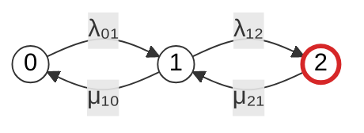
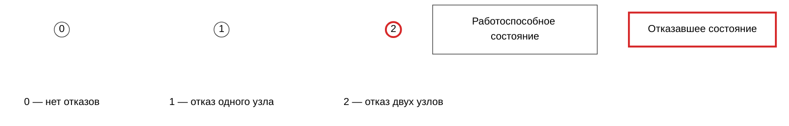
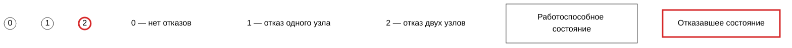

## 1

# Промпт для расчета надежности кластера

```text
Рассчитай надежность восстанавливаемого отказоустойчивого кластера методом непрерывных однородных цепей Маркова.

## 1. Исходная модель

Рассматривается кластер из двух одинаковых узлов с восстановлением.

Состояния марковской модели определяются числом отказавших узлов:

- состояние 0 — отказов нет, оба узла работоспособны;
- состояние 1 — отказал один узел, один узел работоспособен;
- состояние 2 — отказали два узла, оба узла неработоспособны.

Кластер считается работоспособным в состояниях 0 и 1, поскольку хотя бы один узел продолжает работу.

Состояние 2 является неработоспособным состоянием кластера.

Переходы между состояниями:

- 0 → 1 — отказ одного из двух работоспособных узлов;
- 1 → 2 — отказ оставшегося работоспособного узла;
- 1 → 0 — восстановление отказавшего узла;
- 2 → 1 — восстановление одного из двух отказавших узлов.

## 2. Обозначения интенсивностей

Используй следующие обозначения:

- λ₀₁ — интенсивность перехода 0 → 1, то есть отказа одного из двух работающих узлов;
- λ₁₂ — интенсивность перехода 1 → 2, то есть отказа оставшегося работающего узла;
- μ₁₀ — интенсивность перехода 1 → 0, то есть восстановления отказавшего узла;
- μ₂₁ — интенсивность перехода 2 → 1, то есть восстановления одного из двух отказавших узлов.

Для двух одинаковых независимых узлов с интенсивностью отказа одного узла λ обычно:

λ₀₁ = 2λ,

λ₁₂ = λ.

Если восстановление выполняется одним ремонтным каналом с интенсивностью μ, то обычно:

μ₂₁ = μ,

μ₁₀ = μ.

Если восстановление выполняется двумя независимыми ремонтными каналами, интенсивность перехода 2 → 1 может иметь вид:

μ₂₁ = 2μ.

Не подменяй заданные агрегированные интенсивности λ₀₁, λ₁₂, μ₁₀ и μ₂₁ интенсивностями одного узла без отдельного объяснения.

## 3. Задачи

1. Формализуй условие в терминах теории надежности.

2. Укажи:
   - состав системы;
   - смысл каждого состояния;
   - работоспособные состояния;
   - неработоспособное состояние;
   - используемые допущения;
   - смысл каждой интенсивности перехода;
   - условия существования стационарного распределения.

3. Построй граф состояний в Mermaid.

4. Представь матрицу интенсивностей переходов:
   - в виде математической матрицы;
   - в таблице Markdown;
   - в формате CSV.

5. Выведи систему дифференциальных уравнений Колмогорова для вероятностей P₀(t), P₁(t) и P₂(t).

6. Укажи условие нормировки вероятностей.

7. Укажи начальные условия для случая, когда оба узла работоспособны:

P₀(0) = 1,

P₁(0) = 0,

P₂(0) = 0.

8. Выведи нестационарный коэффициент готовности:

Kг(t) = P₀(t) + P₁(t).

9. Выведи стационарные уравнения.

10. Найди стационарные вероятности P₀, P₁ и P₂.

11. Выведи формулу стационарного коэффициента готовности:

Kг,ст = P₀ + P₁.

12. Выведи коэффициент неготовности:

Uст = P₂.

13. Проверь соотношение:

Kг,ст + Uст = 1.

14. Рассмотри частный случай двух одинаковых независимых узлов:

λ₀₁ = 2λ,

λ₁₂ = λ,

μ₂₁ = μ,

μ₁₀ = μ.

15. Для частного случая выведи:
   - матрицу генератора;
   - стационарные вероятности;
   - стационарный коэффициент готовности;
   - коэффициент неготовности;
   - приближение при λ << μ.

16. Приведи ссылки на аналогичные расчеты:
   - ГОСТ и IEC по применению марковских методов;
   - материалы по марковским моделям надежности;
   - публикации по стационарному коэффициенту готовности;
   - примеры восстанавливаемых систем «1 из 2».

## 4. Требования к основному графу Mermaid

Используй Mermaid, совместимый с GitHub.

Предпочтительно используй `flowchart`, а не `stateDiagram-v2`, чтобы надежнее поддерживались окружности и стили.

Граф должен иметь направление слева направо.

Порядок состояний строго слева направо:

0 → 1 → 2

В узлах графа Mermaid указывай только цифры:

- узел `0` содержит только `0`;
- узел `1` содержит только `1`;
- узел `2` содержит только `2`.

Не добавляй в узлы описания состояний, например:

- «нет отказов»;
- «отказ одного узла»;
- «отказ двух узлов».

Описания должны находиться только в отдельной легенде.

Используй круглые узлы:



Требования к стилям:

- состояния 0 и 1 — работоспособные, обычный темный контур;
- состояние 2 — неработоспособное, красный контур;
- заливка узлов — белая;
- текст — черный;
- узлы должны оставаться круглыми;
- направление графа — `LR`.

## 5. Требования к легенде Mermaid

Легенду представь отдельным Mermaid-блоком после основного графа.

В легенде обязательно укажи:

- `0 — нет отказов`;
- `1 — отказ одного узла`;
- `2 — отказ двух узлов`.

В легенде также отрази цветовую семантику:

- обычный темный контур — работоспособное состояние;
- красный контур — отказавшее состояние.

Используй отдельный Mermaid-блок, например:



Если Mermaid-рендерер некорректно обрабатывает скрытые связи `linkStyle`, используй более простой вариант без скрытых связей:



Не используй в легенде синтаксис `:::class`, если он вызывает ошибку в используемом Mermaid-рендерере. Используй объявления вида:

```text
classDef ...
class node_id class_name
```

## 6. Требования к формулам

Используй математические конструкции, поддерживаемые GitHub Markdown, включая:

- `$ ... $`;
- `$$ ... $$`;
- `\( ... \)`;
- `\[ ... \]`;
- стандартные LaTeX-команды;
- `\frac`;
- `\lambda`;
- `\mu`;
- `\mathrm`;
- `\text`;
- `\sum`;
- `\begin{aligned}`;
- `\begin{bmatrix}`;
- `\begin{cases}`.

Формулы можно заключать в математические delimiters GitHub.

Не используй:

- `\boxed`;
- рамочные конструкции;
- декоративное выделение формул;
- пользовательские макросы;
- внешние LaTeX-пакеты;
- нестандартные команды;
- команды, не требуемые для содержания формулы.

Главное правило:

> Используй GitHub-совместимые математические delimiters и поддерживаемые LaTeX-команды, но не используй `\boxed` и другие рамочные или декоративные конструкции, даже если они корректно отображаются в GitHub.

Допустимый стиль формулы:

```markdown
$$
K_{\mathrm{г,ст}} =
\frac{\mu_{21}(\lambda_{01}+\mu_{10})+\mu_{10}\mu_{21}}
{\lambda_{01}\lambda_{12}
+\lambda_{12}\mu_{10}
+\mu_{10}\mu_{21}}
$$
```

Не используй рамку вокруг формулы.

## 7. Требования к матрице генератора

Используй порядок состояний:

(0, 1, 2).

Для вектора вероятностей-строки:

P(t) = [P₀(t), P₁(t), P₂(t)]

используй матрицу:

```text
Q =
[
    [-λ₀₁,                 λ₀₁,                 0],
    [ μ₁₀,         -(μ₁₀ + λ₁₂),             λ₁₂],
    [ 0,                    μ₂₁,             -μ₂₁]
]
```

Уравнение Колмогорова:

```text
dP(t) / dt = P(t)Q
```

Система дифференциальных уравнений должна соответствовать именно этому порядку состояний:

```text
dP₀(t) / dt = -λ₀₁P₀(t) + μ₁₀P₁(t)

dP₁(t) / dt =
    λ₀₁P₀(t)
    - (μ₁₀ + λ₁₂)P₁(t)
    + μ₂₁P₂(t)

dP₂(t) / dt =
    λ₁₂P₁(t)
    - μ₂₁P₂(t)
```

## 8. Обязательная итоговая формулировка

В конце ответа добавь раздел:

## Итоговая формула

В этом разделе обязательно напиши:

Для представленной модели наиболее корректная итоговая запись:

$$
K_{\mathrm{г,ст}} =
\frac{\mu_{21}(\lambda_{01}+\mu_{10})+\mu_{10}\mu_{21}}
{\lambda_{01}\lambda_{12}
+\lambda_{12}\mu_{10}
+\mu_{10}\mu_{21}}
$$

Эквивалентная форма:

$$
K_{\mathrm{г,ст}} =
1 -
\frac{\lambda_{01}\lambda_{12}}
{\lambda_{01}\lambda_{12}
+\lambda_{12}\mu_{10}
+\mu_{10}\mu_{21}}
$$

Коэффициент неготовности:

$$
U_{\mathrm{ст}} =
\frac{\lambda_{01}\lambda_{12}}
{\lambda_{01}\lambda_{12}
+\lambda_{12}\mu_{10}
+\mu_{10}\mu_{21}}
$$

Для симметричного случая:

$$
\lambda_{01}=2\lambda,
\qquad
\lambda_{12}=\lambda,
\qquad
\mu_{10}=\mu_{21}=\mu
$$

получаем:

$$
K_{\mathrm{г,ст}} =
1 -
\frac{2\lambda^2}
{2\lambda^2+\lambda\mu+2\mu^2}
$$

или:

$$
K_{\mathrm{г,ст}} =
\frac{\lambda\mu+2\mu^2}
{2\lambda^2+\lambda\mu+2\mu^2}
$$

Не используй `\boxed` и другие рамочные или декоративные конструкции вокруг этих формул.
```

