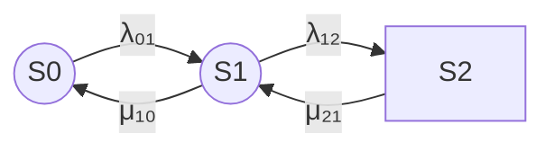
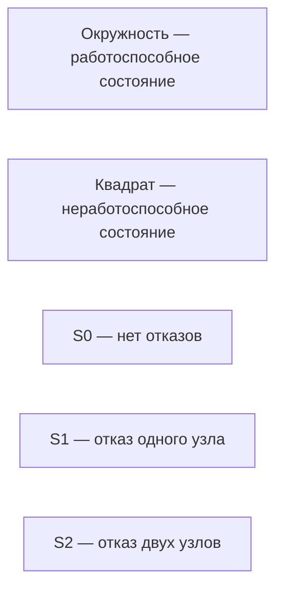

## ver3
Замечания к ver2

Код mermaid должен легко читаться, поэтому:
- Вместо цифр 0 (и др.) будем использовать S0, т.е. в mermaid не нужно именовать узлы (используем id S0 и т.п.)
- убираем все цветовые стили, а состояния исправные – окружностью, а отказа – квадратом.

В легенду делаем не графическую, а текстовую, в ней словами пишем:
- окружность – работоспособное, 
- квадрат – неработоспособное,

и далее подпись каждого состояния:
- S0 – нет отказов и т.п.
  
Исправь промпт и ответ по нему

# Исправленный промпт

```text
Рассчитай надежность восстанавливаемого отказоустойчивого кластера методом непрерывных однородных цепей Маркова.

## 1. Исходная модель

Рассматривается кластер из двух одинаковых узлов с восстановлением.

Состояния марковской модели определяются числом отказавших узлов:

- S0 — отказов нет, оба узла работоспособны;
- S1 — отказал один узел, один узел остается работоспособным;
- S2 — отказали оба узла, оба узла неработоспособны.

Кластер считается работоспособным в состояниях S0 и S1, поскольку хотя бы один узел продолжает работу.

Состояние S2 является неработоспособным состоянием кластера.

Переходы между состояниями:

- S0 → S1 — отказ одного из двух работоспособных узлов;
- S1 → S2 — отказ оставшегося работоспособного узла;
- S1 → S0 — восстановление отказавшего узла;
- S2 → S1 — восстановление одного из двух отказавших узлов.

## 2. Обозначения интенсивностей

Используй следующие обозначения:

- λ₀₁ — интенсивность перехода S0 → S1;
- λ₁₂ — интенсивность перехода S1 → S2;
- μ₁₀ — интенсивность перехода S1 → S0;
- μ₂₁ — интенсивность перехода S2 → S1.

Для двух одинаковых независимых узлов с интенсивностью отказа одного узла λ обычно:

λ₀₁ = 2λ,

λ₁₂ = λ.

Если восстановление выполняется одним ремонтным каналом с интенсивностью μ, то обычно:

μ₁₀ = μ,

μ₂₁ = μ.

Если в состоянии S2 работают два независимых ремонтных канала, то переход S2 → S1 может иметь интенсивность:

μ₂₁ = 2μ.

Не подменяй заданные агрегированные интенсивности λ₀₁, λ₁₂, μ₁₀ и μ₂₁ интенсивностями одного узла без отдельного объяснения.

## 3. Задачи

1. Формализуй условие в терминах теории надежности.

2. Укажи:
   - состав системы;
   - смысл каждого состояния;
   - работоспособные состояния;
   - неработоспособное состояние;
   - используемые допущения;
   - смысл каждой интенсивности перехода;
   - условия существования стационарного распределения.

3. Построй граф состояний в Mermaid.

4. Представь матрицу интенсивностей переходов:
   - в виде математической матрицы;
   - в таблице Markdown;
   - в формате CSV.

5. Выведи систему дифференциальных уравнений Колмогорова для вероятностей P₀(t), P₁(t) и P₂(t).

6. Укажи условие нормировки вероятностей.

7. Укажи начальные условия для случая, когда оба узла работоспособны:

P₀(0) = 1,

P₁(0) = 0,

P₂(0) = 0.

8. Выведи нестационарный коэффициент готовности:

Кг(t) = P₀(t) + P₁(t).

9. Выведи стационарные уравнения.

10. Найди стационарные вероятности P₀, P₁ и P₂.

11. Выведи формулу стационарного коэффициента готовности:

Кг,ст = P₀ + P₁.

12. Выведи коэффициент неготовности:

Uст = P₂.

13. Проверь соотношение:

Кг,ст + Uст = 1.

14. Рассмотри частный случай двух одинаковых независимых узлов:

λ₀₁ = 2λ,

λ₁₂ = λ,

μ₁₀ = μ₂₁ = μ.

15. Для частного случая выведи:
   - матрицу генератора;
   - стационарные вероятности;
   - стационарный коэффициент готовности;
   - коэффициент неготовности;
   - приближение при λ << μ.

16. Приведи ссылки на аналогичные расчеты:
   - ГОСТ и IEC по применению марковских методов;
   - материалы по марковским моделям надежности;
   - публикации по стационарному коэффициенту готовности;
   - примеры восстанавливаемых систем «1 из 2».

## 4. Требования к формулам

Оформи ответ в режиме GitHub Markdown, формулы без LaTeX-обертки.

Это означает:

- не использовать `$$`;
- не использовать `$...$`;
- не использовать `\(...\)`;
- не использовать `\[...\]`;
- не использовать `\frac`;
- не использовать `\boxed`;
- не использовать другие LaTeX-команды;
- не использовать LaTeX-обертки вокруг формул;
- записывать формулы линейным текстом;
- использовать Unicode-символы λ, μ, ₀, ₁, ₂.

Пример допустимой записи:

Кг,ст = μ₂₁(μ₁₀ + λ₀₁) /
        (μ₁₀μ₂₁ + λ₀₁μ₂₁ + λ₀₁λ₁₂)

Для матриц используй обычный текст или таблицу Markdown, например:

Q =

[ -λ₀₁,                  λ₀₁,                 0 ]

[  μ₁₀,       -(μ₁₀ + λ₁₂),              λ₁₂ ]

[     0,                  μ₂₁,            -μ₂₁ ]

## 5. Требования к основному графу Mermaid

Используй Mermaid, совместимый с GitHub.

Для читаемости в Mermaid используй идентификаторы узлов:

- S0;
- S1;
- S2.

Не добавляй текстовые имена к идентификаторам. Используй непосредственно идентификаторы S0, S1 и S2.

Граф должен иметь направление слева направо.

Порядок состояний строго слева направо:

S0 → S1 → S2

Состояния S0 и S1 являются работоспособными и должны быть представлены окружностями.

Состояние S2 является неработоспособным и должно быть представлено квадратом.

Не используй:

- цветовые стили;
- `classDef`;
- `class`;
- `style`;
- заливку;
- красные или серые контуры;
- дополнительные текстовые описания внутри узлов.

Используй простые формы Mermaid:

- окружность: `S0((S0))`;
- квадрат: `S2[S2]`.

Пример основного графа:



Если фон подписей переходов отображается серым, не добавляй цветовые стили. Сохрани простой Mermaid-код. При необходимости используй стандартную настройку Mermaid для прозрачного фона подписей, только если она поддерживается используемым рендерером.

## 6. Требования к легенде Mermaid

Легенда должна быть отдельным Mermaid-блоком.

Легенда не должна быть графической схемой состояний.

В легенде словами укажи:

- окружность — работоспособное состояние;
- квадрат — неработоспособное состояние.

Ниже отдельными строками укажи расшифровку состояний:

- S0 — нет отказов;
- S1 — отказ одного узла;
- S2 — отказ двух узлов.

Для легенды используй текстовые Mermaid-узлы без графических элементов, например:


Не используй в легенде:

- цветовые стили;
- `classDef`;
- `class`;
- `style`;
- цветные контуры;
- дополнительные окружности и квадраты;
- стрелки между строками, если они не нужны для компоновки.

Если для вертикального расположения Mermaid требует связей, используй невидимые связи и `linkStyle`:



## 7. Требования к матрице генератора

Используй порядок состояний:

S0, S1, S2.

Для вектора вероятностей:

P(t) = [P₀(t), P₁(t), P₂(t)]

используй матрицу:

Q =

[ -λ₀₁,                  λ₀₁,                 0 ]

[  μ₁₀,       -(μ₁₀ + λ₁₂),              λ₁₂ ]

[     0,                  μ₂₁,            -μ₂₁ ]

Уравнение Колмогорова:

dP(t) / dt = P(t)Q

Система дифференциальных уравнений:

dP₀(t) / dt = -λ₀₁P₀(t) + μ₁₀P₁(t)

dP₁(t) / dt =
    λ₀₁P₀(t)
    - (μ₁₀ + λ₁₂)P₁(t)
    + μ₂₁P₂(t)

dP₂(t) / dt =
    λ₁₂P₁(t)
    - μ₂₁P₂(t)

## 8. Обязательная итоговая формулировка

В конце ответа добавь раздел:

## Итоговая формула

В этом разделе обязательно напиши:

Для представленной модели наиболее корректная итоговая запись:

Кг,ст = μ₂₁(μ₁₀ + λ₀₁) /
        (μ₁₀μ₂₁ + λ₀₁μ₂₁ + λ₀₁λ₁₂)

Эквивалентная форма:

Кг,ст = 1 -
        λ₀₁λ₁₂ /
        (μ₁₀μ₂₁ + λ₀₁μ₂₁ + λ₀₁λ₁₂)

Коэффициент неготовности:

Uст = λ₀₁λ₁₂ /
      (μ₁₀μ₂₁ + λ₀₁μ₂₁ + λ₀₁λ₁₂)

Для симметричного случая:

λ₀₁ = 2λ,

λ₁₂ = λ,

μ₁₀ = μ₂₁ = μ.

Получаем:

Кг,ст = (μ² + 2λμ) /
        (μ² + 2λμ + 2λ²)

Uст = 2λ² /
      (μ² + 2λμ + 2λ²)

Не используй LaTeX-обертки и команды `\frac`, `\boxed` или другие LaTeX-команды.
```

```

# Ответ по исправленному промпту

## 1. Формализация модели

Рассматривается восстанавливаемый отказоустойчивый кластер типа «1 из 2», состоящий из двух одинаковых узлов.

Состояния марковской модели определяются числом отказавших узлов:

- S0 — отказов нет, оба узла работоспособны;
- S1 — отказал один узел, один узел остается работоспособным;
- S2 — отказали оба узла, оба узла неработоспособны.

Кластер считается работоспособным в состояниях S0 и S1, поскольку хотя бы один узел продолжает работу.

Состояние S2 является неработоспособным состоянием кластера.

Такой подход соответствует применению марковских методов к анализу готовности и ремонтируемых систем. В ГОСТ Р МЭК 61165—2019 коэффициент готовности определяется через вероятности работоспособных состояний системы. [docs.cntd](https://docs.cntd.ru/document/1200167576)

## 2. Обозначения интенсивностей

Используются следующие интенсивности переходов:

- λ₀₁ — интенсивность перехода S0 → S1;
- λ₁₂ — интенсивность перехода S1 → S2;
- μ₁₀ — интенсивность перехода S1 → S0;
- μ₂₁ — интенсивность перехода S2 → S1.

Для двух одинаковых независимых узлов с интенсивностью отказа одного узла λ:

λ₀₁ = 2λ

λ₁₂ = λ

Для одного ремонтного канала с интенсивностью восстановления μ:

μ₁₀ = μ

μ₂₁ = μ

Если из состояния S2 одновременно могут восстанавливаться два узла в рамках двух независимых ремонтных каналов, то интенсивность перехода S2 → S1 может быть принята равной 2μ.

## 3. Граф состояний

В графе используются только идентификаторы S0, S1 и S2. Состояния S0 и S1 представлены окружностями, а состояние S2 — квадратом.


Порядок состояний слева направо:

S0 → S1 → S2.

## 4. Текстовая легенда


Смысл состояний:

- S0 — нет отказов;
- S1 — отказ одного узла;
- S2 — отказ двух узлов.

## 5. Матрица интенсивностей переходов

Используется порядок состояний S0, S1, S2.

Вектор вероятностей:

P(t) = [P₀(t), P₁(t), P₂(t)]

Матрица генератора:

Q =

[ -λ₀₁,                  λ₀₁,                 0 ]

[  μ₁₀,       -(μ₁₀ + λ₁₂),              λ₁₂ ]

[     0,                  μ₂₁,            -μ₂₁ ]

Уравнение Колмогорова:

dP(t) / dt = P(t)Q

### Матрица в таблице Markdown

| Состояние | S0 | S1 | S2 |
|---|---:|---:|---:|
| S0 | -λ₀₁ | λ₀₁ | 0 |
| S1 | μ₁₀ | -(μ₁₀ + λ₁₂) | λ₁₂ |
| S2 | 0 | μ₂₁ | -μ₂₁ |

### Матрица в CSV

```csv
state,S0,S1,S2
S0,-λ₀₁,λ₀₁,0
S1,μ₁₀,-(μ₁₀ + λ₁₂),λ₁₂
S2,0,μ₂₁,-μ₂₁
```

CSV с отдельными переходами:

```csv
from,to,transition_rate
S0,S0,-λ₀₁
S0,S1,λ₀₁
S0,S2,0
S1,S0,μ₁₀
S1,S1,-(μ₁₀ + λ₁₂)
S1,S2,λ₁₂
S2,S0,0
S2,S1,μ₂₁
S2,S2,-μ₂₁
```

## 6. Система дифференциальных уравнений

dP₀(t) / dt = -λ₀₁P₀(t) + μ₁₀P₁(t)

dP₁(t) / dt =
    λ₀₁P₀(t)
    - (μ₁₀ + λ₁₂)P₁(t)
    + μ₂₁P₂(t)

dP₂(t) / dt =
    λ₁₂P₁(t)
    - μ₂₁P₂(t)

Условие нормировки:

P₀(t) + P₁(t) + P₂(t) = 1

Если в начальный момент оба узла работоспособны:

P₀(0) = 1

P₁(0) = 0

P₂(0) = 0

Нестационарный коэффициент готовности:

Кг(t) = P₀(t) + P₁(t)

Поскольку S2 — единственное неработоспособное состояние:

Кг(t) = 1 - P₂(t)

## 7. Стационарные вероятности

В стационарном режиме производные вероятностей равны нулю.

Система стационарных уравнений:

0 = -λ₀₁P₀ + μ₁₀P₁

0 = λ₀₁P₀ - (μ₁₀ + λ₁₂)P₁ + μ₂₁P₂

0 = λ₁₂P₁ - μ₂₁P₂

P₀ + P₁ + P₂ = 1

Из первого уравнения:

P₁ = λ₀₁P₀ / μ₁₀

Из третьего уравнения:

P₂ = λ₁₂P₁ / μ₂₁

Стационарные вероятности:

P₀ = μ₁₀μ₂₁ /
     (μ₁₀μ₂₁ + λ₀₁μ₂₁ + λ₀₁λ₁₂)

P₁ = λ₀₁μ₂₁ /
     (μ₁₀μ₂₁ + λ₀₁μ₂₁ + λ₀₁λ₁₂)

P₂ = λ₀₁λ₁₂ /
     (μ₁₀μ₂₁ + λ₀₁μ₂₁ + λ₀₁λ₁₂)

## 8. Стационарный коэффициент готовности

Кластер работоспособен в состояниях S0 и S1:

Кг,ст = P₀ + P₁

После подстановки стационарных вероятностей:

Кг,ст =
    (μ₁₀μ₂₁ + λ₀₁μ₂₁) /
    (μ₁₀μ₂₁ + λ₀₁μ₂₁ + λ₀₁λ₁₂)

Эквивалентная запись:

Кг,ст =
    μ₂₁(μ₁₀ + λ₀₁) /
    (μ₁₀μ₂₁ + λ₀₁μ₂₁ + λ₀₁λ₁₂)

Коэффициент неготовности:

Uст = P₂

Uст =
    λ₀₁λ₁₂ /
    (μ₁₀μ₂₁ + λ₀₁μ₂₁ + λ₀₁λ₁₂)

Проверка:

Кг,ст + Uст = 1

## 9. Частный симметричный случай

Для двух одинаковых независимых узлов и одного ремонтного канала:

λ₀₁ = 2λ

λ₁₂ = λ

μ₁₀ = μ₂₁ = μ

Матрица генератора:

Q =

[ -2λ,        2λ,        0 ]

[  μ,       -(μ + λ),     λ ]

[  0,          μ,        -μ ]

Стационарные вероятности:

P₀ = μ² /
     (μ² + 2λμ + 2λ²)

P₁ = 2λμ /
     (μ² + 2λμ + 2λ²)

P₂ = 2λ² /
     (μ² + 2λμ + 2λ²)

Стационарный коэффициент готовности:

Кг,ст =
    (μ² + 2λμ) /
    (μ² + 2λμ + 2λ²)

Коэффициент неготовности:

Uст =
    2λ² /
    (μ² + 2λμ + 2λ²)

При λ << μ:

Uст ≈ 2(λ / μ)²

Если обозначить x = λ / μ, то:

Кг,ст = (1 + 2x) / (1 + 2x + 2x²)

## 10. Ограничения модели

Модель не учитывает:

- отказ по общей причине;
- отказ сети или коммутатора;
- отказ системы хранения;
- потерю кворума;
- задержку обнаружения отказа;
- время переключения;
- зависимые отказы;
- ошибки программного обеспечения;
- неэкспоненциальные распределения времени отказа и восстановления;
- дополнительные состояния, связанные с диагностикой и возвратом узла в кластер.

Для реального кластера может потребоваться добавить состояния «отказ обнаружен», «выполняется переключение», «узел изолирован», «выполняется ремонт» и «узел возвращен в кластер».

## 11. Аналогичные расчеты и источники

- [ГОСТ Р МЭК 61165—2019 «Надежность в технике. Применение марковских методов»](https://docs.cntd.ru/document/1200167576) — нормативное руководство по применению марковских методов для анализа безотказности, готовности, ремонтопригодности и безопасности. [docs.cntd](https://docs.cntd.ru/document/1200167576)

- [ГОСТ Р МЭК 61165—2019, текст стандарта](https://files.stroyinf.ru/Data2/1/4293727/4293727169.pdf) — содержит положения о расчете коэффициента готовности как суммы вероятностей работоспособных состояний. [files.stroyinf](https://files.stroyinf.ru/Data2/1/4293727/4293727169.pdf)

- [Марковские модели надежности](https://relind.ru/Ch2/P21.html) — описание пространства состояний, матрицы интенсивностей, уравнений Колмогорова и стационарных вероятностей. [relind](https://relind.ru/Ch2/P21.html)

- [Markov Availability of Repairable System Calculator](https://metricgate.com/docs/markov-availability-repairable-system/) — аналогичная трехсостоящая модель ремонтируемой системы «1 из 2». [metricgate](https://metricgate.com/docs/markov-availability-repairable-system/)

- [Mermaid Flowcharts Syntax](https://mermaid.ai/open-source/syntax/flowchart.html) — описание синтаксиса узлов, стрелок и форм узлов Mermaid. Для окружностей используется форма `((...))`, а для прямоугольных узлов — форма `[...]`. [mermaid](https://mermaid.ai/open-source/syntax/flowchart.html)

## Итоговая формула

Для представленной модели наиболее корректная итоговая запись:

Кг,ст =
    μ₂₁(μ₁₀ + λ₀₁) /
    (μ₁₀μ₂₁ + λ₀₁μ₂₁ + λ₀₁λ₁₂)

Эквивалентная форма:

Кг,ст = 1 -
    λ₀₁λ₁₂ /
    (μ₁₀μ₂₁ + λ₀₁μ₂₁ + λ₀₁λ₁₂)

Коэффициент неготовности:

Uст =
    λ₀₁λ₁₂ /
    (μ₁₀μ₂₁ + λ₀₁μ₂₁ + λ₀₁λ₁₂)

Для симметричного случая:

λ₀₁ = 2λ

λ₁₂ = λ

μ₁₀ = μ₂₁ = μ

получаем:

Кг,ст =
    (μ² + 2λμ) /
    (μ² + 2λμ + 2λ²)

Uст =
    2λ² /
    (μ² + 2λμ + 2λ²)

В этой версии:

- формулы не содержат LaTeX-оберток;
- в Mermaid используются читаемые идентификаторы S0, S1 и S2;
- состояния S0 и S1 представлены окружностями;
- состояние S2 представлено квадратом;
- цветовые стили удалены;
- легенда является текстовой;
- `linkStyle` используется только для скрытия вспомогательных связей в легенде.
