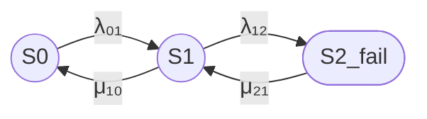

prompt1.md  
**Базовый промпт для модели надёжности простейшего кластера. Требования**  
Рассчитай стационарный коэффициент готовности восстанавливаемого отказоустойчивого кластера методом непрерывной однородной цепи Маркова.

# 1 Основные требования
## 1.1 Исходная модель

Рассматривается кластер из двух одинаковых узлов с восстановлением.

Состояния марковской модели определяются числом отказавших узлов:

- S0 — отказов нет, оба узла работоспособны;
- S1 — отказал один узел, один узел остается работоспособным;
- S2_fail — отказали оба узла, оба узла неработоспособны.

Кластер считается работоспособным в состояниях S0 и S1.

Состояние S2_fail является неработоспособным состоянием кластера. Для неработоспособных состояний добавляй окончание «_fail».

Переходы между состояниями:

- S0 → S1 — отказ одного из двух работоспособных узлов;
- S1 → S2_fail — отказ оставшегося работоспособного узла;
- S1 → S0 — восстановление отказавшего узла;
- S2_fail → S1 — восстановление одного из двух отказавших узлов.

## 1.2 Обозначения интенсивностей

Используй следующие обозначения:

- λ₀₁ — интенсивность перехода S0 → S1;
- λ₁₂ — интенсивность перехода S1 → S2_fail;
- μ₁₀ — интенсивность перехода S1 → S0;
- μ₂₁ — интенсивность перехода S2_fail → S1.

Для двух одинаковых независимых узлов с интенсивностью отказа одного узла λ:

λ₀₁ = 2λ,

λ₁₂ = λ.

Для одного ремонтного канала с интенсивностью восстановления μ:

μ₁₀ = μ,

μ₂₁ = μ.

Если в состоянии S2_fail используются два независимых ремонтных канала, допускается принять μ₂₁ = 2μ, но этот вариант рассмотри отдельно (если явно будет указано в промпт).

## 1.3 Требуемый результат

Нужно получить только стационарный коэффициент готовности кластера.

Не выводи:

- нестационарный коэффициент готовности;
- функции P₀(t), P₁(t), P₂(t);
- решения системы во времени;
- коэффициент неготовности, если он не нужен для вывода коэффициента готовности;
- приближенные формулы, если они не нужны для основного результата.

Кратко привести стационарные вероятности как промежуточный этап вывода.

## 1.4 Требования к расчету

1. Кратко сформулируй модель в терминах теории надежности.

2. Укажи:
   - работоспособные состояния;
   - неработоспособное состояние;
   - интенсивности переходов;
   - используемые допущения.

3. Построй граф состояний в Mermaid.

4. Выведи матрицу интенсивностей переходов в порядке состояний S0, S1, S2_fail.

5. Выведи стационарные уравнения.

6. Найди стационарные вероятности.

7. Получи стационарный коэффициент готовности:

Кг,ст = P₀ + P₁.

8. Рассмотри частный случай:

λ₀₁ = 2λ,

λ₁₂ = λ,

μ₁₀ = μ₂₁ = μ.

9. В конце добавь раздел "Итого":

В нем приведи 
- граф,
- легенду
- итоговую формулу формулу для симметричного частного случая
- пример расчета. Для примера расчета задай:
  - MTBF = 30000 часов
  - MTTR = 24 часа  

## 2 Требования к Mermaid

Используй Mermaid, совместимый с GitHub.

Для состояний используй идентификаторы:

- S0;
- S1;
- S2_fail.

Визуальное обозначение узлов должно соответствовать следующим правилам:

- `((S))` — работоспособное состояние (окружность);
- `([S])` — отказавшее состояние (овал);

Основной граф должен иметь направление слева направо:

S0 → S1 → S2_fail.

Используй следующий стиль записи:

```



Не используй:

- цветовые стили;
- `classDef`;
- `class`;
- `style`;
- заливку;
- красные или серые контуры;
- текстовые описания внутри узлов;
- дополнительные Mermaid-узлы для легенды.

## 3 Требования к легенде

Легенда должна быть обычным Markdown-текстом, а не Mermaid.

После графа добавь:

- `((S))` — работоспособное состояние, окружность;
- `([S])` — отказавшее состояние;
- S0 — нет отказов;
- S1 — отказ одного узла;
- S2_fail — отказ двух узлов.


## 4 Требования к формулам

Оформи ответ в режиме GitHub Markdown, формулы без LaTeX-обертки.

Не используй:

- `$$`;
- `$...$`;
- `\(...\)`;
- `\[...\]`;
- `\frac`;
- `\boxed`;
- другие LaTeX-команды и LaTeX-обертки.

Формулы записывай линейным текстом с использованием Unicode-символов:

- λ;
- μ;
- ₀;
- ₁;
- ₂.

Пример:

Кг,ст = μ₂₁(μ₁₀ + λ₀₁) /
        (μ₁₀μ₂₁ + λ₀₁μ₂₁ + λ₀₁λ₁₂)


