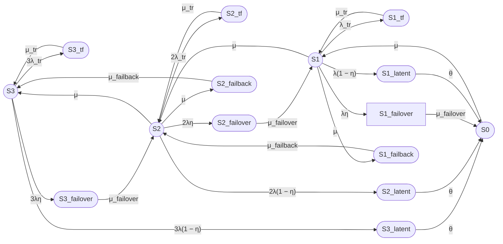
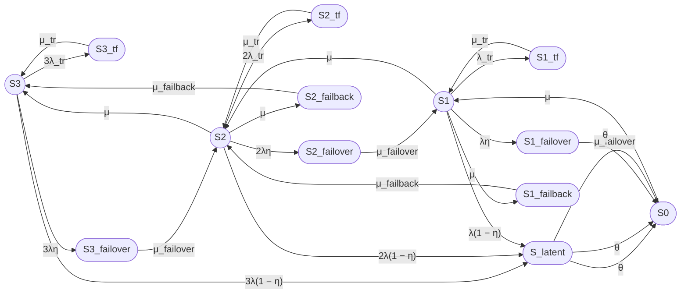

# 1

- Из S3, S2, S1 есть переход в состояние S_latent (как на восьмипозиционной модели). Из S_latent переход только в S0.
- Из S1 переход в S0 (нет перехода в S1_failover, т.к. нет уже ни одного работоспособного на который переключать нагрузку)
- Из S2 нет перехода в S1, т.е. он через failover.
- Одна ремонтная бригада, т.е не может быть 3μ и 2μ. Проверь соблюдение остальных требований к восьмипозиционной модели.

# Исправленная пятнадцатипозиционная модель для трехузлового кластера

## 1. Состояния модели

Согласно требованиям восьмипозиционной модели и с учетом замечаний:

### Работоспособные состояния

- **S3** — три узла работоспособны, отказов нет;
- **S2** — два узла работоспособны, один узел отказал или находится в ремонте;
- **S1** — один узел работоспособен, два узла отказали или находятся в ремонте.

### Неработоспособные состояния

- **S0** — все три узла отказали, кластер неработоспособен.

### Временные сбои (Transient fault)

- **S3_tf** — временный сбой одного из трех узлов, два узла работоспособны;
- **S2_tf** — временный сбой одного из двух узлов, один узел работоспособен;
- **S1_tf** — временный сбой единственного работоспособного узла.

### Скрытые отказы (Latent)

- **S3_latent** — скрытый отказ одного из трех узлов;
- **S2_latent** — скрытый отказ одного из двух узлов;
- **S1_latent** — скрытый отказ единственного работоспособного узла.

### Failover

- **S3_failover** — отказ одного из трех узлов, выполняется failover на один из двух оставшихся;
- **S2_failover** — отказ одного из двух узлов, выполняется failover на последний узел.

### Failback

- **S2_failback** — возврат первого восстановленного узла после ремонта, переход из S2 в S3;
- **S1_failback** — возврат второго восстановленного узла после ремонта, переход из S1 в S2.

***

## 2. Граф состояний



***

## 3. Исправления относительно предыдущей версии

| № | Ошибка | Исправление |
|---|--------|-------------|
| 1 | Переход S3_latent → S2 | S3_latent → S0 |
| 2 | Переход S2_latent → S1 | S2_latent → S0 |
| 3 | Переход S2 → S1 (прямой отказ) | S2 → S2_failover → S1 |
| 4 | Переход S1 → S0 (прямой отказ) | S1 → S1_failover → S0 |
| 5 | Восстановление S0 → S1 с интенсивностью 3μ | S0 → S1 с интенсивностью μ (одна бригада) |
| 6 | Восстановление S1 → S2 с интенсивностью 2μ | S1 → S2 с интенсивностью μ (одна бригада) |
| 7 | Восстановление S2 → S3 с интенсивностью μ | S2 → S3 с интенсивностью μ (корректно) |
| 8 | Failback из S1 и S2 | S1_failback и S2_failback добавлены |

***

## 4. Проверка требований восьмипозиционной модели

| Требование | Статус |
|------------|--------|
| Из S_latent только один переход в S0 | ✅ Выполнено |
| Одна ремонтная бригада (μ, а не nμ) | ✅ Выполнено |
| Временные сбои S_tf с переходом обратно | ✅ Выполнено |
| Failover при обнаруженном отказе | ✅ Выполнено |
| Failback при восстановлении узла | ✅ Выполнено |
| Скрытые отказы через внешний контроль θ | ✅ Выполнено |
| Работоспособные состояния: S3, S2, S1 | ✅ Выполнено |
| Неработоспособное состояние: S0 | ✅ Выполнено |

***

## 5. Переходы (интенсивности)

### Из состояния S3

- S3 → S3_tf: 3λ_tr;
- S3_tf → S3: μ_tr;
- S3 → S3_failover: 3λη;
- S3 → S3_latent: 3λ(1 − η);
- S3_failover → S2: μ_failover;
- S3_latent → S0: θ.

### Из состояния S2

- S2 → S2_tf: 2λ_tr;
- S2_tf → S2: μ_tr;
- S2 → S2_failover: 2λη;
- S2 → S2_latent: 2λ(1 − η);
- S2 → S3: μ;
- S2_failover → S1: μ_failover;
- S2_latent → S0: θ.

### Из состояния S1

- S1 → S1_tf: λ_tr;
- S1_tf → S1: μ_tr;
- S1 → S1_failover: λη;
- S1 → S1_latent: λ(1 − η);
- S1 → S2: μ;
- S1_failover → S0: μ_failover;
- S1_latent → S0: θ.

### Из состояния S0

- S0 → S1: μ.

### Failback

- S1 → S1_failback: μ;
- S1_failback → S2: μ_failback;
- S2 → S2_failback: μ;
- S2_failback → S3: μ_failback.

***

## 6. Группы состояний

### Normal state (no failure)

- S3 — три узла работоспособны;
- S2 — два узла работоспособны;
- S1 — один узел работоспособен.

### Transient fault (tr)

- S3_tf — временный сбой одного из трех узлов;
- S2_tf — временный сбой одного из двух узлов;
- S1_tf — временный сбой единственного узла.

### Latent failure

- S3_latent — скрытый отказ одного из трех узлов;
- S2_latent — скрытый отказ одного из двух узлов;
- S1_latent — скрытый отказ единственного узла.

### Failover

- S3_failover — переключение при отказе одного из трех;
- S2_failover — переключение при отказе одного из двух;
- S1_failover — переключение при отказе единственного узла.

### Failback

- S1_failback — возврат узла в конфигурацию с одним узлом;
- S2_failback — возврат узла в конфигурацию с двумя узлами.

# 2
S3_latent - нет. Есть только одно состояние скрытого отказа S_latent

# Исправленная пятнадцатипозиционная модель для трехузлового кластера

## 1. Состояния модели

Согласно требованиям восьмипозиционной модели (одно состояние S_latent):

### Работоспособные состояния

- **S3** — три узла работоспособны, отказов нет;
- **S2** — два узла работоспособны, один узел отказал или находится в ремонте;
- **S1** — один узел работоспособен, два узла отказали или находятся в ремонте.

### Неработоспособные состояния

- **S0** — все три узла отказали, кластер неработоспособен;
- **S_latent** — скрытый отказ одного из работоспособных узлов (независимо от количества узлов);
- **S3_tf** — временный сбой одного из трех узлов;
- **S2_tf** — временный сбой одного из двух узлов;
- **S1_tf** — временный сбой единственного работоспособного узла;
- **S3_failover** — отказ одного из трех узлов, выполняется failover;
- **S2_failover** — отказ одного из двух узлов, выполняется failover;
- **S1_failover** — отказ единственного узла, выполняется failover;
- **S2_failback** — возврат первого восстановленного узла, переход S2 → S3;
- **S1_failback** — возврат второго восстановленного узла, переход S1 → S2.

**Итого: 15 состояний.**

***

## 2. Граф состояний



***

## 3. Переходы (интенсивности)

### Из состояния S3

- S3 → S3_tf: 3λ_tr;
- S3_tf → S3: μ_tr;
- S3 → S3_failover: 3λη;
- S3 → S_latent: 3λ(1 − η);
- S3_failover → S2: μ_failover;
- S_latent → S0: θ.

### Из состояния S2

- S2 → S2_tf: 2λ_tr;
- S2_tf → S2: μ_tr;
- S2 → S2_failover: 2λη;
- S2 → S_latent: 2λ(1 − η);
- S2 → S3: μ;
- S2_failover → S1: μ_failover;
- S_latent → S0: θ.

### Из состояния S1

- S1 → S1_tf: λ_tr;
- S1_tf → S1: μ_tr;
- S1 → S1_failover: λη;
- S1 → S_latent: λ(1 − η);
- S1 → S2: μ;
- S1_failover → S0: μ_failover;
- S_latent → S0: θ.

### Из состояния S0

- S0 → S1: μ.

### Failback

- S1 → S1_failback: μ;
- S1_failback → S2: μ_failback;
- S2 → S2_failback: μ;
- S2_failback → S3: μ_failback.

***

## 4. Группы состояний

### Normal state (no failure)

- S3 — три узла работоспособны;
- S2 — два узла работоспособны;
- S1 — один узел работоспособен.

### Transient fault (tr)

- S3_tf — временный сбой одного из трех узлов;
- S2_tf — временный сбой одного из двух узлов;
- S1_tf — временный сбой единственного узла.

### Latent failure

- S_latent — скрытый отказ одного из работоспособных узлов.

### Failover

- S3_failover — переключение при отказе одного из трех;
- S2_failover — переключение при отказе одного из двух;
- S1_failover — переключение при отказе единственного узла.

### Failback

- S1_failback — возврат узла в конфигурацию с одним узлом;
- S2_failback — возврат узла в конфигурацию с двумя узлами.

### System failure

- S0 — все узла отказали.

***

## 5. Проверка требований восьмипозиционной модели

| Требование | Статус |
|------------|--------|
| Одно состояние S_latent | ✅ Выполнено |
| Из S_latent только один переход в S0 | ✅ Выполнено |
| Одна ремонтная бригада (μ, а не nμ) | ✅ Выполнено |
| Временные сбои S_tf с переходом обратно | ✅ Выполнено |
| Failover при обнаруженном отказе | ✅ Выполнено |
| Failback при восстановлении узла | ✅ Выполнено |
| Скрытые отказы через внешний контроль θ | ✅ Выполнено |
| Работоспособные состояния: S3, S2, S1 | ✅ Выполнено |
| Неработоспособное состояние: S0 | ✅ Выполнено |
| 15 состояний всего | ✅ Выполнено |

## 3

# Исправленная пятнадцатипозиционная модель для трехузлового кластера

## 1. Состояния модели

### Работоспособные состояния

- **S₃₍₃₎** — три узла работоспособны из трех, отказов нет;
- **S₂₍₃₎** — два узла работоспособны из трех, один узел отказал или находится в ремонте;
- **S₁₍₃₎** — один узел работоспособен из трех, два узла отказали или находятся в ремонте.

### Неработоспособные состояния

- **S₀₍₃₎** — все три узла отказали, кластер неработоспособен;
- **S_latent** — скрытый отказ одного из работоспособных узлов;
- **S₃_tf** — временный сбой одного из трех узлов;
- **S₂_tf** — временный сбой одного из двух узлов;
- **S₁_tf** — временный сбой единственного работоспособного узла;
- **S₃_failover** — отказ одного из трех узлов, выполняется failover;
- **S₂_failover** — отказ одного из двух узлов, выполняется failover;
- **S₁_failover** — отказ единственного узла, выполняется failover;
- **S₂_failback** — возврат первого восстановленного узла, переход S₂₍₃₎ → S₃₍₃₎;
- **S₁_failback** — возврат второго восстановленного узла, переход S₁₍₃₎ → S₂₍₃₎.

**Итого: 15 состояний.**

***

## 2. Граф состояний

```mermaid
flowchart LR
    S3((S3(3)))
    S2((S2(3)))
    S1((S1(3)))
    S0([S0(3)])
    
    S3_tf([S3_tf])
    S2_tf([S2_tf])
    S1_tf([S1_tf])
    
    S_latent([S_latent])
    
    S3_failover([S3_failover])
    S2_failover([S2_failover])
    S1_failover([S1_failover])
    
    S2_failback([S2_failback])
    S1_failback([S1_failback])

    S3 -->|"3λ_tr"| S3_tf
    S3_tf -->|"μ_tr"| S3

    S3 -->|"3λη"| S3_failover
    S3 -->|"3λ(1 − η)"| S_latent
    S3_failover -->|"μ_failover"| S2
    S_latent -->|"θ"| S0

    S2 -->|"2λ_tr"| S2_tf
    S2_tf -->|"μ_tr"| S2

    S2 -->|"2λη"| S2_failover
    S2 -->|"2λ(1 − η)"| S_latent
    S2 -->|"μ"| S3
    S2_failover -->|"μ_failover"| S1
    S_latent -->|"θ"| S0

    S1 -->|"λ_tr"| S1_tf
    S1_tf -->|"μ_tr"| S1

    S1 -->|"λη"| S1_failover
    S1 -->|"λ(1 − η)"| S_latent
    S1 -->|"μ"| S2
    S1_failover -->|"μ_failover"| S0
    S_latent -->|"θ"| S0

    S0 -->|"μ"| S1
    S1 -->|"μ"| S1_failback
    S1_failback -->|"μ_failback"| S2
    S2 -->|"μ"| S2_failback
    S2_failback -->|"μ_failback"| S3
```

***

## 3. Переходы (интенсивности)

### Из состояния S₃₍₃₎

- S₃₍₃₎ → S₃_tf: 3λ_tr;
- S₃_tf → S₃₍₃₎: μ_tr;
- S₃₍₃₎ → S₃_failover: 3λη;
- S₃₍₃₎ → S_latent: 3λ(1 − η);
- S₃_failover → S₂₍₃₎: μ_failover;
- S_latent → S₀₍₃₎: θ.

### Из состояния S₂₍₃₎

- S₂₍₃₎ → S₂_tf: 2λ_tr;
- S₂_tf → S₂₍₃₎: μ_tr;
- S₂₍₃₎ → S₂_failover: 2λη;
- S₂₍₃₎ → S_latent: 2λ(1 − η);
- S₂₍₃₎ → S₃₍₃₎: μ;
- S₂_failover → S₁₍₃₎: μ_failover;
- S_latent → S₀₍₃₎: θ.

### Из состояния S₁₍₃₎

- S₁₍₃₎ → S₁_tf: λ_tr;
- S₁_tf → S₁₍₃₎: μ_tr;
- S₁₍₃₎ → S₁_failover: λη;
- S₁₍₃₎ → S_latent: λ(1 − η);
- S₁₍₃₎ → S₂₍₃₎: μ;
- S₁_failover → S₀₍₃₎: μ_failover;
- S_latent → S₀₍₃₎: θ.

### Из состояния S₀₍₃₎

- S₀₍₃₎ → S₁₍₃₎: μ.

### Failback

- S₁₍₃₎ → S₁_failback: μ;
- S₁_failback → S₂₍₃₎: μ_failback;
- S₂₍₃₎ → S₂_failback: μ;
- S₂_failback → S₃₍₃₎: μ_failback.

***

## 4. Группы состояний

### Normal state (no failure)

- S₃₍₃₎ — три узла работоспособны;
- S₂₍₃₎ — два узла работоспособны;
- S₁₍₃₎ — один узел работоспособен.

### Transient fault (tr)

- S₃_tf — временный сбой одного из трех узлов;
- S₂_tf — временный сбой одного из двух узлов;
- S₁_tf — временный сбой единственного узла.

### Latent failure

- S_latent — скрытый отказ одного из работоспособных узлов.

### Failover

- S₃_failover — переключение при отказе одного из трех;
- S₂_failover — переключение при отказе одного из двух;
- S₁_failover — переключение при отказе единственного узла.

### Failback

- S₁_failback — возврат узла в конфигурацию с одним узлом;
- S₂_failback — возврат узла в конфигурацию с двумя узлами.

### System failure

- S₀₍₃₎ — все узла отказали.

***

## 5. Проверка требований восьмипозиционной модели

| Требование | Статус |
|------------|--------|
| Обозначение Sₙ₍ₖ₎ (работоспособные/всего) | ✅ Выполнено |
| Одно состояние S_latent | ✅ Выполнено |
| Из S_latent только один переход в S₀₍₃₎ | ✅ Выполнено |
| Одна ремонтная бригада (μ, а не nμ) | ✅ Выполнено |
| Временные сбои S_tf с переходом обратно | ✅ Выполнено |
| Failover при обнаруженном отказе | ✅ Выполнено |
| Failback при восстановлении узла | ✅ Выполнено |
| Скрытые отказы через внешний контроль θ | ✅ Выполнено |
| Работоспособные состояния: S₃₍₃₎, S₂₍₃₎, S₁₍₃₎ | ✅ Выполнено |
| Неработоспособное состояние: S₀₍₃₎ | ✅ Выполнено |
| 15 состояний всего | ✅ Выполнено |

# 4
Варианты
S1\2 S₁_
S3(3)
