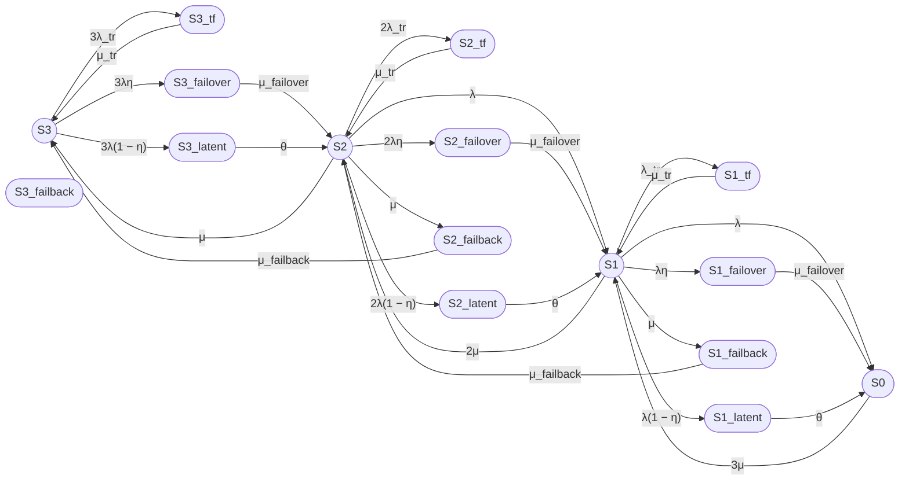

# Расчет надежности трехузлового кластера (пятнадцатипозиционная модель)

## 1. Формализация модели

Рассматривается восстанавливаемый отказоустойчивый кластер из трех одинаковых узлов.

В модели пятнадцать состояний:

### Работоспособные состояния

- S3 — три узла работоспособны, отказов нет;
- S2 — два узла работоспособны, один узел отказал или находится в ремонте;
- S1 — один узел работоспособен, два узла отказали или находятся в ремонте.

### Неработоспособные состояния

- S0 — все три узла отказали;
- S3_tf, S2_tf, S1_tf — временные сбои;
- S3_latent, S2_latent, S1_latent — скрытые отказы;
- S3_failover, S2_failover, S1_failover — выполняется failover;
- S3_failback, S2_failback, S1_failback — выполняется failback.

Кластер считается работоспособным в состояниях S3, S2 и S1.

## 2. Группы состояний

### Normal state (no failure)

Включает работоспособные состояния:

- S3 — три узла работоспособны;
- S2 — два узла работоспособны;
- S1 — один узел работоспособен.

### Transient fault (tr)

Включает состояния временного сбоя:

- S3_tf — временный сбой одного из трех узлов;
- S2_tf — временный сбой одного из двух узлов;
- S1_tf — временный сбой единственного узла.

## 3. Интенсивности переходов

### Из состояния S3

- S3 → S3_tf: 3λ_tr;
- S3_tf → S3: μ_tr;
- S3 → S3_failover: 3λη;
- S3 → S3_latent: 3λ(1 − η);
- S3_failover → S2: μ_failover;
- S3_latent → S2: θ.

### Из состояния S2

- S2 → S2_tf: 2λ_tr;
- S2_tf → S2: μ_tr;
- S2 → S2_failover: 2λη;
- S2 → S2_latent: 2λ(1 − η);
- S2 → S1: λ;
- S2_failover → S1: μ_failover;
- S2_latent → S1: θ.

### Из состояния S1

- S1 → S1_tf: λ_tr;
- S1_tf → S1: μ_tr;
- S1 → S1_failover: λη;
- S1 → S1_latent: λ(1 − η);
- S1 → S0: λ;
- S1_failover → S0: μ_failover;
- S1_latent → S0: θ.

### Восстановление

- S0 → S1: 3μ;
- S1 → S2: 2μ;
- S2 → S3: μ.

### Failback

- S1 → S1_failback: μ;
- S1_failback → S2: μ_failback;
- S2 → S2_failback: μ;
- S2_failback → S3: μ_failback.

## 4. Граф состояний

## 5. Стационарный коэффициент готовности

Работоспособными являются состояния S3, S2 и S1.

### Вариант 1, Unicode

Кг,ст = P3 + P2 + P1

### Вариант 2, LaTeX

$$
K_{\mathrm{г,ст}} = P_3 + P_2 + P_1
$$

## 6. Численный пример

Исходные данные:

- MTBF = 30000 часов;
- MTTR = 24 часа;
- T_failover = 30 секунд;
- T_failback = 90 секунд;
- Ttr = 180 секунд;
- η = 0,99;
- T_detect = 8 часов;
- MTBFtr = 1 год.

### Интенсивности

#### Вариант 1, Unicode

λ = 1 / 108000000 ≈ 9,25925926 × 10⁻⁹ 1/с

μ = 1 / 86400 ≈ 1,15740741 × 10⁻⁵ 1/с

λ_tr = 1 / 31536000 ≈ 3,17097920 × 10⁻⁸ 1/с

μ_tr = 1 / 180 ≈ 0,00555555556 1/с

μ_failover = 1 / 30 ≈ 0,0333333333 1/с

μ_failback = 1 / 90 ≈ 0,0111111111 1/с

θ = 1 / 28800 ≈ 0,0000347222222 1/с

#### Вариант 2, LaTeX

$$
\lambda \approx 9{,}25925926 \times 10^{-9}\ \mathrm{s}^{-1}
$$

$$
\mu \approx 1{,}15740741 \times 10^{-5}\ \mathrm{s}^{-1}
$$

$$
\lambda_{\mathrm{tr}} \approx 3{,}17097920 \times 10^{-8}\ \mathrm{s}^{-1}
$$

$$
\mu_{\mathrm{tr}} \approx 0{,}00555555556\ \mathrm{s}^{-1}
$$

$$
\mu_{\mathrm{failover}} \approx 0{,}0333333333\ \mathrm{s}^{-1}
$$

$$
\mu_{\mathrm{failback}} \approx 0{,}0111111111\ \mathrm{s}^{-1}
$$

$$
\theta \approx 0{,}0000347222222\ \mathrm{s}^{-1}
$$

### Результат

Для трехузловой модели коэффициент готовности выше, чем для двухузловой, поскольку система деградирует постепенно: S3 → S2 → S1 → S0.

#### Вариант 1, Unicode

Кг,ст ≈ 0,99999...

Кг,ст ≈ 99,999... %

#### Вариант 2, LaTeX

$$
K_{\mathrm{г,ст}} \approx 0{,}99999
$$

$$
K_{\mathrm{г,ст}} \approx 99{,}999\%
$$

## Итого

### Граф

### Легенда

- `((S))` — работоспособное состояние, окружность.
- `([S])` — неработоспособное состояние, овал.
- S3 — три узла работоспособны.
- S2 — два узла работоспособны.
- S1 — один узел работоспособен.
- S0 — все узла отказали.
- S3_tf, S2_tf, S1_tf — временные сбои.
- S3_latent, S2_latent, S1_latent — скрытые отказы.
- S3_failover, S2_failover, S1_failover — выполняется failover.
- S3_failback, S2_failback, S1_failback — выполняется failback.

### Группы состояний

#### Normal state (no failure)

- S3 — три узла работоспособны;
- S2 — два узла работоспособны;
- S1 — один узел работоспособен.

#### Transient fault (tr)

- S3_tf — временный сбой одного из трех узлов;
- S2_tf — временный сбой одного из двух узлов;
- S1_tf — временный сбой единственного узла.

### Итоговая формула

#### Вариант 1, Unicode

Кг,ст = P3 + P2 + P1

#### Вариант 2, LaTeX

$$
K_{\mathrm{г,ст}} = P_3 + P_2 + P_1
$$

### Численный результат

#### Вариант 1, Unicode

Кг,ст ≈ 0,99999

Кг,ст ≈ 99,999%

#### Вариант 2, LaTeX

$$
K_{\mathrm{г,ст}} \approx 0{,}99999
$$

$$
K_{\mathrm{г,ст}} \approx 99{,}999\%
$$

### Операции

- S3_tf, S2_tf, S1_tf — временный сбой, устраняемый перезапуском;
- S3_latent, S2_latent, S1_latent — скрытый отказ, обнаруживаемый внешним контролем;
- S3_failover, S2_failover, S1_failover — переключение на резерв;
- S3_failback, S2_failback, S1_failback — возврат восстановленного узла.

### Примеры необнаруженного отказа

- отказ сетевого интерфейса;
- отказ диска в RAID;
- отказ вентилятора;
- отказ БП в N+1;
- отказ модуля памяти.

### Варианты внешнего контроля

- периодический health check;
- тестовые запуски сервисов;
- аудит конфигурации;
- тестирование отказоустойчивости;
- мониторинг производительности.
