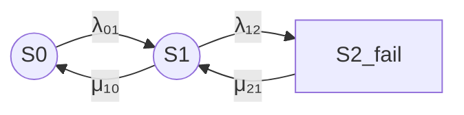

# 1. Формализация модели

Рассматривается восстанавливаемый отказоустойчивый кластер из двух одинаковых узлов.

Состояния марковской модели определяются количеством отказавших узлов:

- S0 — отказов нет, оба узла работоспособны;
- S1 — отказал один узел, один узел остается работоспособным;
- S2_fail — отказали оба узла, оба узла неработоспособны.

Кластер считается работоспособным в состояниях S0 и S1.

Состояние S2_fail является неработоспособным состоянием кластера.

Используется непрерывная однородная цепь Маркова с постоянными интенсивностями переходов. Предполагается, что времена до отказа и восстановления имеют экспоненциальные распределения, отказы узлов независимы, используется один ремонтный канал, а отказы по общей причине, задержки обнаружения, переключения и возврата узла в кластер не учитываются.

Марковский подход применяется для анализа готовности, ремонтопригодности и других показателей надежности восстанавливаемых систем. [normativ](https://normativ.su/catalog/standart/1001/440636/)

# 2. Интенсивности переходов

Используются следующие обозначения:

- λ₀₁ — интенсивность перехода S0 → S1;
- λ₁₂ — интенсивность перехода S1 → S2_fail;
- μ₁₀ — интенсивность перехода S1 → S0;
- μ₂₁ — интенсивность перехода S2_fail → S1.

Физический смысл переходов:

- S0 → S1 — отказ одного из двух работоспособных узлов;
- S1 → S2_fail — отказ оставшегося работоспособного узла;
- S1 → S0 — восстановление отказавшего узла;
- S2_fail → S1 — восстановление одного из двух отказавших узлов.

Для двух одинаковых независимых узлов с интенсивностью отказа одного узла λ:

λ₀₁ = 2λ

λ₁₂ = λ

Для одного ремонтного канала с интенсивностью восстановления μ:

μ₁₀ = μ

μ₂₁ = μ

Если в состоянии S2_fail используются два независимых ремонтных канала, то отдельно можно принять:

μ₂₁ = 2μ

В настоящем расчете используется основной вариант с одним ремонтным каналом.

# 3. Граф состояний

В Mermaid используются идентификаторы состояний S0, S1 и S2_fail.

Состояния S0 и S1 являются работоспособными и обозначены окружностями. Состояние S2_fail является неработоспособным и обозначено квадратом.

# 4. Текстовая легенда

- `((S))` — работоспособное состояние, окружность.
- `[S]` — неработоспособное состояние, квадрат.
- S0 — нет отказов.
- S1 — отказ одного узла.
- S2_fail — отказ двух узлов.

# 5. Матрица интенсивностей переходов

Используется порядок состояний:

S0, S1, S2_fail.

Матрица генератора:

Q =

[ -λ₀₁,                    λ₀₁,                    0 ]

[  μ₁₀,         -(μ₁₀ + λ₁₂),                 λ₁₂ ]

[     0,                    μ₂₁,                -μ₂₁ ]

В этой матрице диагональный элемент -λ₀₁ в строке S0 и столбце S0 не означает переход S0 → S0. Это диагональный элемент генератора, равный минусу суммы интенсивностей исходящих переходов из состояния S0.

Элемент λ₀₁ в строке S0 и столбце S1 соответствует переходу S0 → S1.

Табличное представление:

| Исходное состояние | S0 | S1 | S2_fail |
|---|---:|---:|---:|
| S0 | -λ₀₁ | λ₀₁ | 0 |
| S1 | μ₁₀ | -(μ₁₀ + λ₁₂) | λ₁₂ |
| S2_fail | 0 | μ₂₁ | -μ₂₁ |

# 6. Стационарные уравнения

В стационарном режиме производные вероятностей состояний равны нулю.

Стационарные уравнения:

0 = -λ₀₁P₀ + μ₁₀P₁

0 = λ₀₁P₀ - (μ₁₀ + λ₁₂)P₁ + μ₂₁P₂

0 = λ₁₂P₁ - μ₂₁P₂

Условие нормировки:

P₀ + P₁ + P₂ = 1

Здесь:

- P₀ — стационарная вероятность состояния S0;
- P₁ — стационарная вероятность состояния S1;
- P₂ — стационарная вероятность состояния S2_fail.

Из первого уравнения:

P₁ = λ₀₁P₀ / μ₁₀

Из третьего уравнения:

P₂ = λ₁₂P₁ / μ₂₁

С учетом условия нормировки стационарные вероятности равны:

P₀ = μ₁₀μ₂₁ /
     (μ₁₀μ₂₁ + λ₀₁μ₂₁ + λ₀₁λ₁₂)

P₁ = λ₀₁μ₂₁ /
     (μ₁₀μ₂₁ + λ₀₁μ₂₁ + λ₀₁λ₁₂)

P₂ = λ₀₁λ₁₂ /
     (μ₁₀μ₂₁ + λ₀₁μ₂₁ + λ₀₁λ₁₂)

# 7. Стационарный коэффициент готовности

Кластер является работоспособным в состояниях S0 и S1.

Поэтому стационарный коэффициент готовности равен:

Кг,ст = P₀ + P₁

Подставляя стационарные вероятности:

Кг,ст =
    (μ₁₀μ₂₁ + λ₀₁μ₂₁) /
    (μ₁₀μ₂₁ + λ₀₁μ₂₁ + λ₀₁λ₁₂)

После вынесения μ₂₁ в числителе:

Кг,ст =
    μ₂₁(μ₁₀ + λ₀₁) /
    (μ₁₀μ₂₁ + λ₀₁μ₂₁ + λ₀₁λ₁₂)

# 8. Симметричный частный случай

Для двух одинаковых независимых узлов:

λ₀₁ = 2λ

λ₁₂ = λ

Для одного ремонтного канала:

μ₁₀ = μ₂₁ = μ

Тогда стационарный коэффициент готовности равен:

Кг,ст =
    μ(μ + 2λ) /
    (μ² + 2λμ + 2λ²)

или:

Кг,ст =
    (μ² + 2λμ) /
    (μ² + 2λμ + 2λ²)

# Итоговая формула

Для представленной модели наиболее корректная итоговая запись:

Кг,ст =
    μ₂₁(μ₁₀ + λ₀₁) /
    (μ₁₀μ₂₁ + λ₀₁μ₂₁ + λ₀₁λ₁₂)

Для симметричного случая:

λ₀₁ = 2λ

λ₁₂ = λ

μ₁₀ = μ₂₁ = μ

Тогда:

Кг,ст =
    (μ² + 2λμ) /
    (μ² + 2λμ + 2λ²)
