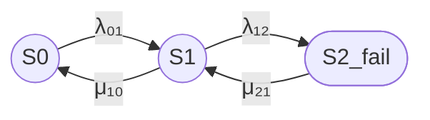

prompt1_res2.md

# Стационарный коэффициент готовности кластера

## 1. Формализация модели

Рассматривается восстанавливаемый отказоустойчивый кластер из двух одинаковых узлов.

Состояния марковской модели определяются числом отказавших узлов:

- S0 — отказов нет, оба узла работоспособны;
- S1 — отказал один узел, один узел остается работоспособным;
- S2_fail — отказали оба узла, оба узла неработоспособны.

Кластер считается работоспособным в состояниях S0 и S1, поскольку в каждом из них работает хотя бы один узел.

Состояние S2_fail является неработоспособным состоянием кластера.

Используется непрерывная однородная цепь Маркова. Предполагается, что:

- интенсивности отказов и восстановления постоянны во времени;
- времена до отказа и восстановления имеют экспоненциальные распределения;
- отказы узлов независимы;
- восстановление выполняется одним ремонтным каналом;
- отказы по общей причине, отказ сети, потеря кворума, задержки обнаружения и переключения не учитываются.

Марковские методы применяются для анализа готовности, ремонтопригодности и других показателей надежности восстанавливаемых систем. [protect.gost](https://protect.gost.ru/gost/details/ccf715c0-edc9-4095-ba04-8bcc7e19c444)

## 2. Интенсивности переходов

Используются следующие обозначения:

- λ₀₁ — интенсивность перехода S0 → S1;
- λ₁₂ — интенсивность перехода S1 → S2_fail;
- μ₁₀ — интенсивность перехода S1 → S0;
- μ₂₁ — интенсивность перехода S2_fail → S1.

Физический смысл переходов:

- S0 → S1 — отказ одного из двух работоспособных узлов;
- S1 → S2_fail — отказ оставшегося работоспособного узла;
- S1 → S0 — восстановление отказавшего узла;
- S2_fail → S1 — восстановление одного из двух отказавших узлов.

Для двух одинаковых независимых узлов с интенсивностью отказа одного узла λ:

λ₀₁ = 2λ

λ₁₂ = λ

Для одного ремонтного канала с интенсивностью восстановления μ:

μ₁₀ = μ

μ₂₁ = μ

Если в состоянии S2_fail используются два независимых ремонтных канала, то переход S2_fail → S1 может иметь интенсивность μ₂₁ = 2μ. Этот вариант здесь отдельно не рассчитывается.

## 3. Граф состояний

В Mermaid используются идентификаторы S0, S1 и S2_fail.

Состояния S0 и S1 обозначены окружностями как работоспособные. Состояние S2_fail обозначено овалом как неработоспособное.

Порядок состояний слева направо:

S0 → S1 → S2_fail.

## 4. Текстовая легенда

- `((S))` — работоспособное состояние, окружность.
- `([S])` — отказавшее состояние, овал.
- S0 — нет отказов.
- S1 — отказ одного узла.
- S2_fail — отказ двух узлов.

## 5. Матрица интенсивностей переходов

Используется порядок состояний S0, S1, S2_fail.

Матрица генератора:

Q =

[ -λ₀₁,                    λ₀₁,                    0 ]

[  μ₁₀,         -(μ₁₀ + λ₁₂),                 λ₁₂ ]

[     0,                    μ₂₁,                -μ₂₁ ]

Диагональный элемент -λ₀₁ в строке S0 и столбце S0 не означает отдельный переход S0 → S0. Это диагональный элемент генератора, равный минусу суммы интенсивностей исходящих переходов из состояния S0.

Элемент λ₀₁ в строке S0 и столбце S1 соответствует переходу S0 → S1.

Табличное представление:

| Исходное состояние | S0 | S1 | S2_fail |
|---|---:|---:|---:|
| S0 | -λ₀₁ | λ₀₁ | 0 |
| S1 | μ₁₀ | -(μ₁₀ + λ₁₂) | λ₁₂ |
| S2_fail | 0 | μ₂₁ | -μ₂₁ |

## 6. Стационарные уравнения

В стационарном режиме производные вероятностей состояний равны нулю.

Стационарные уравнения:

0 = -λ₀₁P₀ + μ₁₀P₁

0 = λ₀₁P₀ - (μ₁₀ + λ₁₂)P₁ + μ₂₁P₂

0 = λ₁₂P₁ - μ₂₁P₂

Условие нормировки:

P₀ + P₁ + P₂ = 1

Здесь:

- P₀ — стационарная вероятность состояния S0;
- P₁ — стационарная вероятность состояния S1;
- P₂ — стационарная вероятность состояния S2_fail.

Из первого уравнения:

P₁ = λ₀₁P₀ / μ₁₀

Из третьего уравнения:

P₂ = λ₁₂P₁ / μ₂₁

Стационарные вероятности:

P₀ = μ₁₀μ₂₁ /
     (μ₁₀μ₂₁ + λ₀₁μ₂₁ + λ₀₁λ₁₂)

P₁ = λ₀₁μ₂₁ /
     (μ₁₀μ₂₁ + λ₀₁μ₂₁ + λ₀₁λ₁₂)

P₂ = λ₀₁λ₁₂ /
     (μ₁₀μ₂₁ + λ₀₁μ₂₁ + λ₀₁λ₁₂)

## 7. Стационарный коэффициент готовности

Кластер работоспособен в состояниях S0 и S1:

Кг,ст = P₀ + P₁

После подстановки стационарных вероятностей:

Кг,ст =
    (μ₁₀μ₂₁ + λ₀₁μ₂₁) /
    (μ₁₀μ₂₁ + λ₀₁μ₂₁ + λ₀₁λ₁₂)

После вынесения μ₂₁ в числителе:

Кг,ст =
    μ₂₁(μ₁₀ + λ₀₁) /
    (μ₁₀μ₂₁ + λ₀₁μ₂₁ + λ₀₁λ₁₂)

## 8. Симметричный частный случай

Для двух одинаковых независимых узлов:

λ₀₁ = 2λ

λ₁₂ = λ

Для одного ремонтного канала:

μ₁₀ = μ₂₁ = μ

Тогда:

Кг,ст =
    μ(μ + 2λ) /
    (μ² + 2λμ + 2λ²)

или:

Кг,ст =
    (μ² + 2λμ) /
    (μ² + 2λμ + 2λ²)

## Итого

### Граф

### Легенда

- `((S))` — работоспособное состояние, окружность.
- `([S])` — отказавшее состояние, овал.
- S0 — нет отказов.
- S1 — отказ одного узла.
- S2_fail — отказ двух узлов.

### Итоговая формула для симметричного случая

Кг,ст =
    (μ² + 2λμ) /
    (μ² + 2λμ + 2λ²)

## Пример расчета

Задано:

- MTBF = 30000 часов;
- MTTR = 24 часа.

Для одного узла принимаем:

λ = 1 / MTBF

μ = 1 / MTTR

Следовательно:

λ = 1 / 30000 = 0,0000333333 1/час

μ = 1 / 24 = 0,0416666667 1/час

Отношение интенсивностей:

λ / μ = MTTR / MTBF

λ / μ = 24 / 30000 = 0,0008

Для симметричного кластера:

Кг,ст =
    (μ² + 2λμ) /
    (μ² + 2λμ + 2λ²)

После деления числителя и знаменателя на μ²:

Кг,ст =
    (1 + 2x) /
    (1 + 2x + 2x²)

где:

x = λ / μ = 0,0008

Подстановка:

Кг,ст =
    (1 + 2 × 0,0008) /
    (1 + 2 × 0,0008 + 2 × 0,0008²)

Кг,ст =
    1,0016 /
    1,00160128

Результат:

Кг,ст ≈ 0,99999872

В процентах:

Кг,ст ≈ 99,999872%

Таким образом, при MTBF одного узла 30000 часов, MTTR 24 часа и одном ремонтном канале стационарный коэффициент готовности двухузлового кластера составляет примерно 0,99999872, или 99,999872%.

Здесь MTBF используется как средняя наработка между отказами ремонтируемого узла, а MTTR — как среднее время восстановления. Для классической двухсостоящей ремонтируемой системы связь с коэффициентом готовности имеет вид MTBF / (MTBF + MTTR); в данном расчете для кластера применяется трехсостоящая марковская модель резервированной системы. [atlassian](https://www.atlassian.com/incident-management/kpis/common-metrics)

Для представленной модели наиболее корректная итоговая запись:

Кг,ст =
    μ₂₁(μ₁₀ + λ₀₁) /
    (μ₁₀μ₂₁ + λ₀₁μ₂₁ + λ₀₁λ₁₂)

Для симметричного случая:

λ₀₁ = 2λ

λ₁₂ = λ

μ₁₀ = μ₂₁ = μ

Кг,ст =
    (μ² + 2λμ) /
    (μ² + 2λμ + 2λ²)
