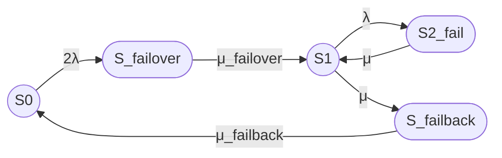

# Промпт для пятисостоящей модели надежности кластера

```text
Рассчитай стационарный коэффициент готовности восстанавливаемого отказоустойчивого кластера методом непрерывной однородной цепи Маркова.

# 1. Исходная модель

Рассматривается кластер из двух одинаковых узлов с восстановлением.

Состояния марковской модели:

- S0 — оба узла работоспособны, отказов нет;
- S_failover — отказ одного из двух узлов, выполняется процедура failover;
- S1 — один узел работоспособен, кластер работает в деградированной конфигурации;
- S2_fail — оба узла отказали, кластер неработоспособен;
- S_failback — выполняется процедура failback, то есть ввод восстановленного узла в штатную конфигурацию.

Кластер считается работоспособным только в состояниях S0 и S1.

Состояния S_failover, S2_fail и S_failback считаются неработоспособными, поскольку в этих состояниях выполняются переходные или аварийные процедуры.

Не добавляй окончание `_fail` к состояниям S_failover и S_failback: слово `fail` уже является частью их названий.

# 2. Переходы между состояниями

Используй только следующие переходы:

- S0 → S_failover — отказ одного из двух работоспособных узлов и начало процедуры failover;
- S_failover → S1 — завершение failover и переход к работоспособной конфигурации с одним работающим узлом;
- S1 → S2_fail — отказ оставшегося работоспособного узла;
- S2_fail → S1 — восстановление одного из двух отказавших узлов;
- S1 → S_failback — начало процедуры failback, то есть начало ввода восстановленного узла в кластер;
- S_failback → S0 — завершение процедуры failback и переход к полной работоспособности.

Интенсивности переходов:

- S0 → S_failover: 2λ;
- S_failover → S1: μ_failover;
- S1 → S2_fail: λ;
- S2_fail → S1: μ;
- S1 → S_failback: μ;
- S_failback → S0: μ_failback.

Прямые переходы отсутствуют:

- S0 → S1;
- S1 → S0.

Не добавляй другие переходы, если это прямо не требуется для обсуждения ограничений модели.

# 3. Обозначения интенсивностей

Используй следующие обозначения:

- λ — интенсивность отказа одного узла;
- 2λ — интенсивность отказа одного из двух работоспособных узлов в состоянии S0;
- μ_failover — интенсивность завершения процедуры failover;
- μ — интенсивность восстановления узла;
- μ — интенсивность начала процедуры failback после восстановления узла;
- μ_failback — интенсивность завершения процедуры failback.

Связь интенсивностей со средними временами:

- λ = 1 / MTBF;
- μ = 1 / MTTR;
- μ_failover = 1 / T_failover;
- μ_failback = 1 / T_failback.

В данной модели используется одинаковое обозначение μ для:

- перехода S2_fail → S1;
- перехода S1 → S_failback.

Это является допущением исходной модели и должно быть явно указано в ответе.

# 4. Исходные данные для примера

Для численного примера используй:

- MTBF одного узла = 30000 часов;
- MTTR одного узла = 24 часа;
- среднее время failover = 30 секунд;
- среднее время failback = 90 секунд;
- один ремонтный канал.

Все времена перед расчетом интенсивностей приведи к одной единице времени. Поскольку failover и failback заданы в секундах, для численного расчета используй секунды.

Переведи:

- MTBF из часов в секунды;
- MTTR из часов в секунды;
- failover оставь в секундах;
- failback оставь в секундах.

Затем рассчитай:

- λ;
- μ;
- μ_failover;
- μ_failback.

# 5. Требуемый результат

Основной результат — стационарный коэффициент готовности кластера.

Работоспособные состояния:

- S0;
- S1.

Поэтому:

Кг,ст = P₀ + P₁

где:

- P₀ — стационарная вероятность состояния S0;
- P₁ — стационарная вероятность состояния S1.

Не выводи:

- нестационарный коэффициент готовности;
- функции вероятностей во времени;
- решения системы во времени;
- отдельный коэффициент неготовности, если он не нужен для вывода Кг,ст;
- приближенные формулы, если они не нужны для основного результата.

Допускается кратко привести стационарные вероятности как промежуточный этап вывода.

# 6. Формализация в терминах теории надежности

Кратко укажи:

- состав системы;
- смысл всех пяти состояний;
- работоспособные состояния;
- неработоспособные состояния;
- используемые допущения;
- смысл каждой интенсивности;
- отсутствие прямых переходов S0 → S1 и S1 → S0.

Отдельно укажи, что failover и failback в данной модели считаются неработоспособными состояниями. Это консервативная трактовка, поскольку в некоторых реальных системах обслуживание может продолжаться во время этих процедур.

# 7. Требования к графу Mermaid

Используй Mermaid, совместимый с GitHub.

Граф должен иметь направление слева направо:

S0 → S_failover → S1 → S2_fail

Состояние S_failback также включи в граф. Для наглядности размести его ниже или над состоянием S1, но сохрани основную последовательность состояний слева направо.

Используй только идентификаторы узлов:

- S0;
- S_failover;
- S1;
- S2_fail;
- S_failback.

Не добавляй текстовые описания внутри узлов.

Визуальные обозначения:

- `((S))` — работоспособное состояние, окружность;
- `([S])` — неработоспособное состояние, овал.

Используй следующий граф:



Не используй:

- цветовые стили;
- `classDef`;
- `class`;
- `style`;
- заливку;
- цветные контуры;
- дополнительные Mermaid-узлы для легенды;
- текстовые описания внутри узлов.

# 8. Требования к текстовой легенде

Легенда должна быть обычным Markdown-текстом, а не Mermaid.

Используй следующий формат:

- `((S))` — работоспособное состояние, окружность;
- `([S])` — неработоспособное состояние, овал;
- S0 — оба узла работоспособны, отказов нет;
- S_failover — выполняется процедура failover;
- S1 — один узел работоспособен, кластер работает в деградированной конфигурации;
- S2_fail — оба узла отказали;
- S_failback — выполняется процедура failback.

# 9. Требования к матрице интенсивностей

Используй порядок состояний:

S0, S_failover, S1, S2_fail, S_failback.

Матрица генератора должна соответствовать следующим переходам:

Q =

[ -2λ,       2λ,                  0,          0,                  0 ]

[  0, -μ_failover,     μ_failover,          0,                  0 ]

[  0,          0,        -(λ + μ),          λ,                  μ ]

[  0,          0,               μ,         -μ,                  0 ]

[ μ_failback,  0,               0,          0,      -μ_failback ]

Поясни, что диагональные элементы — это не переходы состояния в само себя, а отрицательные суммы интенсивностей исходящих переходов.

Например:

- -2λ в строке S0 — диагональный элемент;
- 2λ в строке S0 и столбце S_failover — интенсивность перехода S0 → S_failover;
- λ в строке S1 и столбце S2_fail — интенсивность перехода S1 → S2_fail;
- μ в строке S2_fail и столбце S1 — интенсивность перехода S2_fail → S1.

# 10. Требования к стационарным уравнениям

Введи вероятности:

- P₀ — вероятность S0;
- P_failover — вероятность S_failover;
- P₁ — вероятность S1;
- P₂ — вероятность S2_fail;
- P_failback — вероятность S_failback.

Выведи стационарные уравнения:

0 = -2λP₀ + μ_failback P_failback

0 = 2λP₀ - μ_failover P_failover

0 = μ_failover P_failover - (λ + μ)P₁ + μP₂

0 = λP₁ - μP₂

0 = μP₁ - μ_failback P_failback

Условие нормировки:

P₀ + P_failover + P₁ + P₂ + P_failback = 1

# 11. Требования к стационарному решению

Найди стационарные вероятности.

Для сокращения записи можешь использовать знаменатель D:

D =
    2λ² μ_failback μ_failover
    + 2λ μ² μ_failback
    + 2λ μ² μ_failover
    + 2λ μ μ_failback μ_failover
    + μ² μ_failback μ_failover

Стационарные вероятности:

P₀ =
    μ² μ_failback μ_failover /
    D

P_failover =
    2λ μ² μ_failback /
    D

P₁ =
    2λ μ² μ_failover /
    D

P₂ =
    2λ² μ_failback μ_failover /
    D

P_failback =
    2λ μ² μ_failover /
    D

Проверь согласованность этих выражений с матрицей переходов и условием нормировки.

# 12. Формула стационарного коэффициента готовности

Используй определение:

Кг,ст = P₀ + P₁

После подстановки вероятностей получи:

Кг,ст =
    μ² μ_failback μ_failover
    + 2λ μ² μ_failover
    /
    D

или в более компактной записи:

Кг,ст =
    μ² μ_failover(μ_failback + 2λ)
    /
    D

где:

D =
    2λ² μ_failback μ_failover
    + 2λ μ² μ_failback
    + 2λ μ² μ_failover
    + 2λ μ μ_failback μ_failover
    + μ² μ_failback μ_failover

# 13. Численный пример

Используй:

- MTBF = 30000 часов;
- MTTR = 24 часа;
- T_failover = 30 секунд;
- T_failback = 90 секунд.

Перевод времени:

MTBF = 30000 × 3600 = 108000000 секунд

MTTR = 24 × 3600 = 86400 секунд

Интенсивности:

λ = 1 / 108000000 1/с

μ = 1 / 86400 1/с

μ_failover = 1 / 30 1/с

μ_failback = 1 / 90 1/с

Подставь значения в формулу стационарного коэффициента готовности и выведи результат с достаточным количеством знаков:

Кг,ст ≈ 0,999996503

В процентах:

Кг,ст ≈ 99,9996503 %

Укажи, что это значение относится именно к заданной пятисостоящей модели, в которой S_failover, S2_fail и S_failback считаются неработоспособными.

# 14. Реалистичные операции failover и failback

Отдельным блоком опиши наиболее правдоподобные операции.

## Failover

Укажи следующие возможные операции:

1. Обнаружение отказа узла через heartbeat, watchdog или health check.
2. Подтверждение отказа после истечения тайм-аута.
3. Fencing или STONITH для предотвращения split-brain.
4. Блокировка ресурсов отказавшего узла.
5. Перенос виртуального IP-адреса или другого сетевого идентификатора.
6. Запуск сервисов на оставшемся узле.
7. Подключение или активация необходимых ресурсов хранения.
8. Проверка готовности сервиса.
9. Возобновление обслуживания клиентов.

Среднее время failover в примере — 30 секунд. Рассматривай его как суммарное время обнаружения отказа, подтверждения отказа, fencing, запуска ресурсов и проверки сервиса.

## Failback

Укажи следующие возможные операции:

1. Завершение ремонта отказавшего узла.
2. Загрузка операционной системы и кластерного агента.
3. Проверка сетевой связности.
4. Проверка дисков и файловых систем.
5. Повторное включение узла в состав кластера.
6. Синхронизация данных и реплик.
7. Проверка согласованности данных.
8. Возврат ресурсов на восстановленный узел либо регистрация его как резерва.
9. Проверка итогового состояния кластера.

Среднее время failback в примере — 90 секунд. Рассматривай его как суммарное время ввода восстановленного узла в кластер, синхронизации данных и возврата к штатной конфигурации.

# 15. Ограничения модели

Кратко укажи, что модель не учитывает:

- отказы по общей причине;
- отказ сети;
- отказ коммутатора;
- отказ системы хранения;
- отказ механизма fencing;
- потерю кворума;
- программные ошибки;
- ошибки конфигурации;
- ошибки оператора;
- зависимые отказы;
- различие между автоматическим и ручным failback;
- неэкспоненциальные распределения времени отказа и восстановления;
- ситуацию, когда кластер продолжает обслуживать запросы во время failover или failback.

Отдельно отметь, что переход S1 → S_failback с интенсивностью μ является упрощенным допущением. В реальной модели его обычно следует связывать с завершением ремонта восстановленного узла, а не задавать независимо.

# 16. Раздел «Итого»

В конце ответа обязательно добавь раздел:

# Итого

В разделе приведи:

1. Основной граф Mermaid.
2. Текстовую легенду Markdown.
3. Итоговую формулу стационарного коэффициента готовности.
4. Численный результат для:
   - MTBF = 30000 часов;
   - MTTR = 24 часа;
   - failover = 30 секунд;
   - failback = 90 секунд.

Формула должна быть записана в двух вариантах:  
Вариант 1 без LaTeX-обертки:

Кг,ст =
    μ² μ_failover(μ_failback + 2λ)
    /
    (2λ² μ_failback μ_failover
     + 2λ μ² μ_failback
     + 2λ μ² μ_failover
     + 2λ μ μ_failback μ_failover
     + μ² μ_failback μ_failover)

Вариант 2  
В LaTeX-обертке, совместимой с GitHub Markdown.
