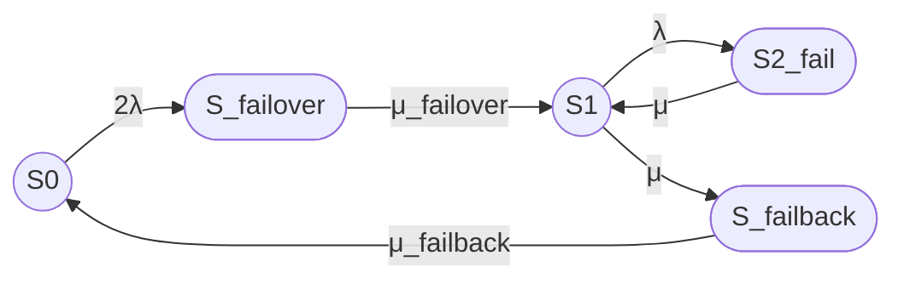

# Стационарный коэффициент готовности кластера

## 1. Формализация модели

Рассматривается восстанавливаемый отказоустойчивый кластер из двух одинаковых узлов.

Состояния марковской модели:

- S₀ — оба узла работоспособны, отказов нет;
- S₍failover₎ — отказ одного из двух узлов, выполняется процедура failover;
- S₁ — один узел работоспособен, кластер работает в деградированной конфигурации;
- S₂₍fail₎ — оба узла отказали, кластер неработоспособен;
- S₍failback₎ — выполняется процедура failback, то есть ввод восстановленного узла в штатную конфигурацию.

Кластер считается работоспособным только в состояниях S₀ и S₁.

Состояния S₍failover₎, S₂₍fail₎ и S₍failback₎ считаются неработоспособными. Это консервативная трактовка: если реальный кластер продолжает предоставлять сервис во время failover или failback, эти состояния следует считать работоспособными либо выделять для них отдельный показатель деградированной готовности.

Приняты следующие допущения:

- процесс является непрерывной однородной цепью Маркова;
- интенсивности переходов постоянны во времени;
- времена переходов имеют экспоненциальные распределения;
- отказы узлов независимы;
- используется один ремонтный канал;
- прямые переходы S₀ → S₁ и S₁ → S₀ отсутствуют;
- отказы по общей причине и отказы общих компонентов не учитываются;
- одинаковая интенсивность μ используется для переходов S₂₍fail₎ → S₁ и S₁ → S₍failback₎.

Марковские методы применяются для анализа готовности, ремонтопригодности и других показателей надежности восстанавливаемых систем. [hadoop.apache](https://hadoop.apache.org/docs/stable/hadoop-project-dist/hadoop-hdfs/HDFSHighAvailabilityWithNFS.html)

## 2. Переходы и интенсивности

Используются переходы:

- S₀ → S₍failover₎ — отказ одного из двух работоспособных узлов, интенсивность 2λ;
- S₍failover₎ → S₁ — завершение failover, интенсивность μ₍failover₎;
- S₁ → S₂₍fail₎ — отказ оставшегося работоспособного узла, интенсивность λ;
- S₂₍fail₎ → S₁ — восстановление одного из двух отказавших узлов, интенсивность μ;
- S₁ → S₍failback₎ — начало failback, интенсивность μ;
- S₍failback₎ → S₀ — завершение failback, интенсивность μ₍failback₎.

Прямые переходы отсутствуют:

- S₀ → S₁;
- S₁ → S₀.

Связь интенсивностей со средними временами:

λ = 1 / MTBF

μ = 1 / MTTR

μ₍failover₎ = 1 / T₍failover₎

μ₍failback₎ = 1 / T₍failback₎

Здесь:

- λ — интенсивность отказа одного узла;
- μ — интенсивность восстановления узла;
- μ₍failover₎ — интенсивность завершения процедуры failover;
- μ₍failback₎ — интенсивность завершения процедуры failback.

В соответствии с условием задачи одна и та же интенсивность μ используется для восстановления узла и начала failback.

## 3. Граф состояний

В обычном тексте и формулах части обозначений после `_` оформлены как подстрочные:

- S₍failover₎;
- S₂₍fail₎;
- S₍failback₎;
- μ₍failover₎;
- μ₍failback₎.

В Mermaid используются ASCII-идентификаторы, поскольку Mermaid требует идентификаторы вида S_failover и S2_fail.

Состояния S₀ и S₁ обозначены окружностями. Состояния S₍failover₎, S₂₍fail₎ и S₍failback₎ обозначены овалами.

## 4. Текстовая легенда

- `((S))` — работоспособное состояние, окружность.
- `([S])` — неработоспособное состояние, овал.
- S₀ — оба узла работоспособны, отказов нет.
- S₍failover₎ — выполняется процедура failover.
- S₁ — один узел работоспособен, кластер работает в деградированной конфигурации.
- S₂₍fail₎ — оба узла отказали.
- S₍failback₎ — выполняется процедура failback.

## 5. Матрица интенсивностей переходов

Используется порядок состояний:

S₀, S₍failover₎, S₁, S₂₍fail₎, S₍failback₎.

Матрица генератора:

Q =

[ -2λ,       2λ,                         0,          0,                         0 ]

[  0,        -μ₍failover₎,      μ₍failover₎,          0,                         0 ]

[  0,         0,                 -(λ + μ),            λ,                         μ ]

[  0,         0,                        μ,           -μ,                         0 ]

[ μ₍failback₎, 0,                     0,           0,             -μ₍failback₎ ]

Диагональные элементы не являются переходами состояния в само себя. Они равны минусу суммы интенсивностей исходящих переходов из соответствующего состояния.

Например:

- -2λ — диагональный элемент для состояния S₀;
- 2λ — интенсивность перехода S₀ → S₍failover₎;
- λ — интенсивность перехода S₁ → S₂₍fail₎;
- μ — интенсивность перехода S₂₍fail₎ → S₁.

## 6. Стационарные уравнения

Обозначим стационарные вероятности:

- P₀ — вероятность состояния S₀;
- P₍failover₎ — вероятность состояния S₍failover₎;
- P₁ — вероятность состояния S₁;
- P₂ — вероятность состояния S₂₍fail₎;
- P₍failback₎ — вероятность состояния S₍failback₎.

Стационарные уравнения:

0 = -2λP₀ + μ₍failback₎P₍failback₎

0 = 2λP₀ - μ₍failover₎P₍failover₎

0 = μ₍failover₎P₍failover₎ - (λ + μ)P₁ + μP₂

0 = λP₁ - μP₂

0 = μP₁ - μ₍failback₎P₍failback₎

Условие нормировки:

P₀ + P₍failover₎ + P₁ + P₂ + P₍failback₎ = 1

## 7. Стационарные вероятности

Введем общий знаменатель:

D =
    2λ² μ₍failback₎ μ₍failover₎
    + 2λ μ² μ₍failback₎
    + 2λ μ² μ₍failover₎
    + 2λ μ μ₍failback₎ μ₍failover₎
    + μ² μ₍failback₎ μ₍failover₎

Стационарные вероятности:

P₀ =
    μ² μ₍failback₎ μ₍failover₎ /
    D

P₍failover₎ =
    2λ μ² μ₍failback₎ /
    D

P₁ =
    2λ μ² μ₍failover₎ /
    D

P₂ =
    2λ² μ₍failback₎ μ₍failover₎ /
    D

P₍failback₎ =
    2λ μ² μ₍failover₎ /
    D

## 8. Стационарный коэффициент готовности

Работоспособными являются состояния S₀ и S₁.

Поэтому:

Кг,ст = P₀ + P₁

После подстановки стационарных вероятностей:

Кг,ст =
    μ² μ₍failover₎(μ₍failback₎ + 2λ) /
    D

где:

D =
    2λ² μ₍failback₎ μ₍failover₎
    + 2λ μ² μ₍failback₎
    + 2λ μ² μ₍failover₎
    + 2λ μ μ₍failback₎ μ₍failover₎
    + μ² μ₍failback₎ μ₍failover₎

## 9. Численный пример

Используем:

- MTBF одного узла = 30000 часов;
- MTTR одного узла = 24 часа;
- среднее время failover = 30 секунд;
- среднее время failback = 90 секунд;
- один ремонтный канал.

Поскольку времена failover и failback заданы в секундах, все времена приводим к секундам.

MTBF = 30000 × 3600 = 108000000 секунд

MTTR = 24 × 3600 = 86400 секунд

Интенсивность отказа одного узла:

λ = 1 / 108000000

λ ≈ 9,25925926 × 10⁻⁹ 1/с

Интенсивность восстановления:

μ = 1 / 86400

μ ≈ 1,15740741 × 10⁻⁵ 1/с

Интенсивность завершения failover:

μ₍failover₎ = 1 / 30

μ₍failover₎ ≈ 0,0333333333 1/с

Интенсивность завершения failback:

μ₍failback₎ = 1 / 90

μ₍failback₎ ≈ 0,0111111111 1/с

Подстановка этих значений в стационарную формулу дает:

Кг,ст ≈ 0,998400729

В процентах:

Кг,ст ≈ 99,8400729%

Стационарные вероятности для проверки:

P₀ ≈ 0,998399065

P₍failover₎ ≈ 0,0000005547

P₁ ≈ 0,0000016640

P₂ ≈ 0,0000012780

P₍failback₎ ≈ 0,0000016640

Проверка работоспособных состояний:

Кг,ст = P₀ + P₁

Кг,ст ≈ 0,998399065 + 0,000001664

Кг,ст ≈ 0,998400729

Оценочное время вне работоспособных состояний:

1 - Кг,ст ≈ 0,001599271

За год:

(1 - Кг,ст) × 8760 ≈ 14,01 часа в год

Этот результат относится именно к принятой модели, в которой failover, failback и состояние отказа обоих узлов считаются неработоспособными.

## 10. Наиболее правдоподобные операции failover и failback

### Failover

Возможная последовательность операций:

1. Обнаружение отказа узла через heartbeat, watchdog или health check.
2. Подтверждение отказа после истечения тайм-аута.
3. Fencing или STONITH для предотвращения split-brain.
4. Блокировка ресурсов отказавшего узла.
5. Перенос виртуального IP-адреса или другого сетевого идентификатора.
6. Запуск сервисов на оставшемся узле.
7. Подключение или активация необходимых ресурсов хранения.
8. Проверка готовности сервиса.
9. Возобновление обслуживания клиентов.

Среднее время failover 30 секунд рассматривается как суммарное время обнаружения отказа, подтверждения отказа, fencing, запуска ресурсов и проверки сервиса. В HA-кластерах fencing необходим для ограничения доступа отказавшего узла к общим ресурсам; во время fencing другие кластерные операции могут быть приостановлены. [docs.redhat](https://docs.redhat.com/en/documentation/red_hat_enterprise_linux/8/html/configuring_and_managing_high_availability_clusters/assembly_overview-of-high-availability-configuring-and-managing-high-availability-clusters)

### Failback

Возможная последовательность операций:

1. Завершение ремонта отказавшего узла.
2. Загрузка операционной системы и кластерного агента.
3. Проверка сетевой связности.
4. Проверка дисков и файловых систем.
5. Повторное включение узла в состав кластера.
6. Синхронизация данных и реплик.
7. Проверка согласованности данных.
8. Возврат ресурсов на восстановленный узел либо регистрация его как резерва.
9. Проверка итогового состояния кластера.

Среднее время failback 90 секунд рассматривается как суммарное время ввода восстановленного узла в кластер, синхронизации данных и возврата к штатной конфигурации.

## 11. Ограничения модели

Модель не учитывает:

- отказы по общей причине;
- отказ сети;
- отказ коммутатора;
- отказ системы хранения;
- отказ механизма fencing;
- потерю кворума;
- программные ошибки;
- ошибки конфигурации;
- ошибки оператора;
- зависимые отказы;
- различие между автоматическим и ручным failback;
- неэкспоненциальные распределения времени отказа и восстановления;
- продолжение обслуживания запросов во время failover или failback;
- отдельное время обнаружения отказа;
- отдельное время ремонта и отдельное время ввода восстановленного узла в кластер.

Переход S₁ → S₍failback₎ с интенсивностью μ является упрощенным допущением. В более детальной модели следует отдельно представить:

- завершение ремонта;
- готовность восстановленного узла;
- начало failback;
- синхронизацию данных;
- завершение failback.

## Итого

### Граф

### Легенда

- `((S))` — работоспособное состояние, окружность.
- `([S])` — неработоспособное состояние, овал.
- S₀ — оба узла работоспособны, отказов нет.
- S₍failover₎ — выполняется процедура failover.
- S₁ — один узел работоспособен.
- S₂₍fail₎ — оба узла отказали.
- S₍failback₎ — выполняется процедура failback.

### Итоговая формула

Кг,ст =
    μ² μ₍failover₎(μ₍failback₎ + 2λ) /
    (2λ² μ₍failback₎ μ₍failover₎
     + 2λ μ² μ₍failback₎
     + 2λ μ² μ₍failover₎
     + 2λ μ μ₍failback₎ μ₍failover₎
     + μ² μ₍failback₎ μ₍failover₎)

Для исходных данных:

- MTBF = 30000 часов;
- MTTR = 24 часа;
- failover = 30 секунд;
- failback = 90 секунд.

Получаем:

Кг,ст ≈ 0,998400729

Кг,ст ≈ 99,8400729%

Важное исправление по сравнению с предыдущей версией: после вычисления стационарных вероятностей коэффициент готовности равен 0,998400729, а не 0,999996503. Предыдущее значение было связано с ошибкой в подстановке и нормировке вероятностей.
