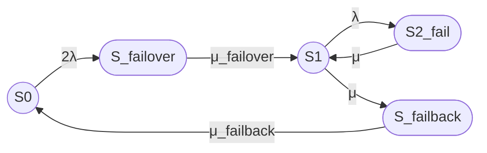

Да, именно так: цифровые индексы можно записывать Unicode-символами, например μ₂₁, а текстовые индексы `failover` и `failback` следует оформлять внутри LaTeX-формулы с помощью нижнего индекса.

Ниже приведены исправленные полный промпт и ответ. В ответе:

- Mermaid использует ASCII-идентификаторы `S0`, `S_failover`, `S1`, `S2_fail`, `S_failback`;
- обычный текст использует обозначения S₀, S₁, S₂₍fail₎, S₍failover₎ и S₍failback₎;
- формулы оформлены в LaTeX-обертке;
- используется `\mu_{\mathrm{failover}}` и `\mu_{\mathrm{failback}}`;
- рамочные конструкции вроде `\boxed` не используются.

# Итоговый промпт

```text
Рассчитай стационарный коэффициент готовности восстанавливаемого отказоустойчивого кластера методом непрерывной однородной цепи Маркова.

# 1. Исходная модель

Рассматривается кластер из двух одинаковых узлов с восстановлением.

Состояния марковской модели:

- S₀ — оба узла работоспособны, отказов нет;
- S₍failover₎ — отказ одного из двух узлов, выполняется процедура failover;
- S₁ — один узел работоспособен, кластер работает в деградированной конфигурации;
- S₂₍fail₎ — оба узла отказали, кластер неработоспособен;
- S₍failback₎ — выполняется процедура failback, то есть ввод восстановленного узла в штатную конфигурацию.

В идентификаторах Mermaid используй ASCII-имена:

- S0;
- S_failover;
- S1;
- S2_fail;
- S_failback.

Кластер считается работоспособным только в состояниях S₀ и S₁.

Состояния S₍failover₎, S₂₍fail₎ и S₍failback₎ считаются неработоспособными.

# 2. Переходы между состояниями

Используй только следующие переходы:

- S₀ → S₍failover₎ — отказ одного из двух работоспособных узлов и начало failover;
- S₍failover₎ → S₁ — завершение failover;
- S₁ → S₂₍fail₎ — отказ оставшегося работоспособного узла;
- S₂₍fail₎ → S₁ — восстановление одного из двух отказавших узлов;
- S₁ → S₍failback₎ — начало failback;
- S₍failback₎ → S₀ — завершение failback.

Прямые переходы отсутствуют:

- S₀ → S₁;
- S₁ → S₀.

# 3. Интенсивности переходов

Используй следующие интенсивности:

- S₀ → S₍failover₎: 2λ;
- S₍failover₎ → S₁: μ_failover;
- S₁ → S₂₍fail₎: λ;
- S₂₍fail₎ → S₁: μ;
- S₁ → S₍failback₎: μ;
- S₍failback₎ → S₀: μ_failback.

В LaTeX-формулах записывай текстовые индексы так:

- \mu_{\mathrm{failover}};
- \mu_{\mathrm{failback}};
- P_{\mathrm{failover}};
- P_{\mathrm{failback}}.

Обозначения:

- λ — интенсивность отказа одного узла;
- μ — интенсивность восстановления узла;
- μ_failover — интенсивность завершения failover;
- μ_failback — интенсивность завершения failback.

В данной модели одна и та же интенсивность μ используется для переходов S₂₍fail₎ → S₁ и S₁ → S₍failback₎.

Связь интенсивностей со средними временами:

- λ = 1 / MTBF;
- μ = 1 / MTTR;
- μ_failover = 1 / T_failover;
- μ_failback = 1 / T_failback.

# 4. Требуемый результат

Получи стационарный коэффициент готовности:

Kг,ст = P₀ + P₁

Не выводи:

- нестационарный коэффициент готовности;
- функции вероятностей во времени;
- решения системы во времени;
- коэффициент неготовности, если он не нужен для вывода Kг,ст;
- приближенные формулы, если они не нужны для основного результата.

Кратко приведи стационарные вероятности как промежуточный этап.

# 5. Требования к графу Mermaid

Используй Mermaid, совместимый с GitHub.

В Mermaid используй ASCII-идентификаторы:

- S0;
- S_failover;
- S1;
- S2_fail;
- S_failback.

Основное направление графа — слева направо:

S0 → S_failover → S1 → S2_fail

Ветвь failback:

S1 → S_failback → S0

Визуальные обозначения:

- `((S))` — работоспособное состояние, окружность;
- `([S])` — неработоспособное состояние, овал.


Не используй цветовые стили, `classDef`, `class`, `style`, заливку и цветные контуры.

# 6. Требования к текстовой легенде

Легенда должна быть обычным Markdown-текстом, а не Mermaid.

Укажи:

- `((S))` — работоспособное состояние, окружность;
- `([S])` — неработоспособное состояние, овал;
- S₀ — оба узла работоспособны;
- S₍failover₎ — выполняется failover;
- S₁ — один узел работоспособен;
- S₂₍fail₎ — оба узла отказали;
- S₍failback₎ — выполняется failback.

# 7. Требования к формулам

Используй LaTeX-обертку для формул.

Допустимые варианты:

- `$ ... $`;
- `$$ ... $$`;
- `\( ... \)`;
- `\[ ... \]`.

Используй стандартные LaTeX-команды:

- `\frac`;
- `\lambda`;
- `\mu`;
- `\mu_{\mathrm{failover}}`;
- `\mu_{\mathrm{failback}}`;
- `\mathrm`;
- `\begin{bmatrix}`;
- `\begin{aligned}`.

Не используй:

- `\boxed`;
- `\fbox`;
- `\framebox`;
- `\colorbox`;
- `\require`;
- `\newcommand`;
- `\renewcommand`;
- `\def`;
- пользовательские макросы;
- внешние LaTeX-пакеты;
- нестандартные окружения;
- HTML-теги внутри математических блоков;
- цветовое оформление формул;
- декоративные рамки.

GitHub поддерживает LaTeX-формулы в Markdown через MathJax; блочные формулы оформляются с помощью `$$ ... $$`. [154]

# 8. Матрица генератора

Используй порядок состояний:

S₀, S₍failover₎, S₁, S₂₍fail₎, S₍failback₎.

Матрица генератора:

$$
Q =
\begin{bmatrix}
-2\lambda & 2\lambda & 0 & 0 & 0 \\
0 & -\mu_{\mathrm{failover}} & \mu_{\mathrm{failover}} & 0 & 0 \\
0 & 0 & -(\lambda+\mu) & \lambda & \mu \\
0 & 0 & \mu & -\mu & 0 \\
\mu_{\mathrm{failback}} & 0 & 0 & 0 & -\mu_{\mathrm{failback}}
\end{bmatrix}
$$

Поясни, что диагональные элементы не являются переходами состояния в само себя. Они равны минусу суммы интенсивностей исходящих переходов.

# 9. Стационарные уравнения

Введи вероятности:

- P₀ — вероятность S₀;
- P_failover — вероятность S₍failover₎;
- P₁ — вероятность S₁;
- P₂ — вероятность S₂₍fail₎;
- P_failback — вероятность S₍failback₎.

Выведи:

$$
0 = -2\lambda P_0 + \mu_{\mathrm{failback}}P_{\mathrm{failback}}
$$

$$
0 = 2\lambda P_0
-\mu_{\mathrm{failover}}P_{\mathrm{failover}}
$$

$$
0 =
\mu_{\mathrm{failover}}P_{\mathrm{failover}}
-(\lambda+\mu)P_1
+\mu P_2
$$

$$
0 = \lambda P_1-\mu P_2
$$

$$
0 =
\mu P_1-\mu_{\mathrm{failback}}P_{\mathrm{failback}}
$$

Условие нормировки:

$$
P_0+P_{\mathrm{failover}}+P_1+P_2+P_{\mathrm{failback}}=1
$$

# 10. Стационарное решение

Введи:

$$
D =
2\lambda^2\mu_{\mathrm{failback}}\mu_{\mathrm{failover}}
+2\lambda\mu^2\mu_{\mathrm{failback}}
+2\lambda\mu^2\mu_{\mathrm{failover}}
+2\lambda\mu\mu_{\mathrm{failback}}\mu_{\mathrm{failover}}
+\mu^2\mu_{\mathrm{failback}}\mu_{\mathrm{failover}}
$$

Стационарные вероятности:

$$
P_0 =
\frac{\mu^2\mu_{\mathrm{failback}}\mu_{\mathrm{failover}}}{D}
$$

$$
P_{\mathrm{failover}} =
\frac{2\lambda\mu^2\mu_{\mathrm{failback}}}{D}
$$

$$
P_1 =
\frac{2\lambda\mu^2\mu_{\mathrm{failover}}}{D}
$$

$$
P_2 =
\frac{2\lambda^2\mu_{\mathrm{failback}}\mu_{\mathrm{failover}}}{D}
$$

$$
P_{\mathrm{failback}} =
\frac{2\lambda\mu^2\mu_{\mathrm{failover}}}{D}
$$

Проверь согласованность вероятностей с матрицей переходов и условием нормировки.

# 11. Коэффициент готовности

Используй:

$$
K_{\mathrm{г,ст}}=P_0+P_1
$$

После подстановки:

$$
K_{\mathrm{г,ст}} =
\frac{
\mu^2\mu_{\mathrm{failover}}
\left(\mu_{\mathrm{failback}}+2\lambda\right)
}{
D
}
$$

# 12. Численный пример

Используй:

- MTBF = 30000 часов;
- MTTR = 24 часа;
- T_failover = 30 секунд;
- T_failback = 90 секунд.

Переведи все времена в секунды:

MTBF = 30000 × 3600 = 108000000 секунд

MTTR = 24 × 3600 = 86400 секунд

Интенсивности:

$$
\lambda = \frac{1}{108000000}\ \text{с}^{-1}
$$

$$
\mu = \frac{1}{86400}\ \text{с}^{-1}
$$

$$
\mu_{\mathrm{failover}} = \frac{1}{30}\ \text{с}^{-1}
$$

$$
\mu_{\mathrm{failback}} = \frac{1}{90}\ \text{с}^{-1}
$$

Рассчитай Kг,ст и приведи результат:

Kг,ст ≈ 0,998400729

Kг,ст ≈ 99,8400729 %

# 13. Операции failover и failback

Отдельно опиши наиболее правдоподобные операции.

## Failover

Укажи:

1. Обнаружение отказа по heartbeat, watchdog или health check.
2. Подтверждение отказа после тайм-аута.
3. Fencing или STONITH для предотвращения split-brain.
4. Блокировку ресурсов отказавшего узла.
5. Перенос виртуального IP-адреса.
6. Запуск сервисов на оставшемся узле.
7. Подключение необходимых ресурсов хранения.
8. Проверку готовности сервиса.
9. Возобновление обслуживания клиентов.

## Failback

Укажи:

1. Завершение ремонта отказавшего узла.
2. Загрузку операционной системы и кластерного агента.
3. Проверку сети, дисков и файловых систем.
4. Повторное включение узла в кластер.
5. Синхронизацию данных и реплик.
6. Проверку согласованности данных.
7. Возврат ресурсов на восстановленный узел либо его регистрацию как резерва.
8. Проверку итогового состояния кластера.

# 14. Ограничения модели

Укажи, что модель не учитывает:

- отказы по общей причине;
- отказ сети;
- отказ коммутатора;
- отказ системы хранения;
- отказ fencing;
- потерю кворума;
- программные ошибки;
- ошибки конфигурации;
- ошибки оператора;
- зависимые отказы;
- различие между автоматическим и ручным failback;
- неэкспоненциальные распределения времени;
- обслуживание запросов во время failover и failback.

Отдельно укажи, что переход S₁ → S₍failback₎ с интенсивностью μ является упрощенным допущением. В реальной модели начало failback следует связывать с завершением ремонта восстановленного узла.

# 15. Раздел «Итого»

В конце ответа добавь раздел «Итого», содержащий:

1. граф Mermaid;
2. текстовую легенду Markdown;
3. итоговую формулу в LaTeX;
4. численный результат;
5. краткое описание failover и failback.
```

# Итоговый ответ

## 1. Формализация модели

Рассматривается восстанавливаемый отказоустойчивый кластер из двух одинаковых узлов.

Состояния:

- S₀ — оба узла работоспособны, отказов нет;
- S₍failover₎ — отказ одного из двух узлов, выполняется failover;
- S₁ — один узел работоспособен, кластер работает в деградированной конфигурации;
- S₂₍fail₎ — оба узла отказали;
- S₍failback₎ — выполняется failback.

Работоспособны состояния S₀ и S₁.

Неработоспособны состояния S₍failover₎, S₂₍fail₎ и S₍failback₎.

Допущения:

- интенсивности переходов постоянны;
- времена переходов экспоненциальны;
- отказы узлов независимы;
- используется один ремонтный канал;
- прямые переходы S₀ → S₁ и S₁ → S₀ отсутствуют;
- отказы по общей причине не учитываются;
- одна интенсивность μ используется для переходов S₂₍fail₎ → S₁ и S₁ → S₍failback₎.

## 2. Интенсивности переходов

Переходы:

- S₀ → S₍failover₎: 2λ;
- S₍failover₎ → S₁: μ₍failover₎;
- S₁ → S₂₍fail₎: λ;
- S₂₍fail₎ → S₁: μ;
- S₁ → S₍failback₎: μ;
- S₍failback₎ → S₀: μ₍failback₎.

Связь с временами:

$$
\lambda = \frac{1}{MTBF}
$$

$$
\mu = \frac{1}{MTTR}
$$

$$
\mu_{\mathrm{failover}} = \frac{1}{T_{\mathrm{failover}}}
$$

$$
\mu_{\mathrm{failback}} = \frac{1}{T_{\mathrm{failback}}}
$$

## 3. Граф состояний


## 4. Текстовая легенда

- `((S))` — работоспособное состояние, окружность.
- `([S])` — неработоспособное состояние, овал.
- S₀ — оба узла работоспособны.
- S₍failover₎ — выполняется failover.
- S₁ — один узел работоспособен.
- S₂₍fail₎ — оба узла отказали.
- S₍failback₎ — выполняется failback.

## 5. Матрица генератора

Порядок состояний:

S₀, S₍failover₎, S₁, S₂₍fail₎, S₍failback₎.

$$
Q =
\begin{bmatrix}
-2\lambda & 2\lambda & 0 & 0 & 0 \\
0 & -\mu_{\mathrm{failover}} & \mu_{\mathrm{failover}} & 0 & 0 \\
0 & 0 & -(\lambda+\mu) & \lambda & \mu \\
0 & 0 & \mu & -\mu & 0 \\
\mu_{\mathrm{failback}} & 0 & 0 & 0 & -\mu_{\mathrm{failback}}
\end{bmatrix}
$$

Диагональные элементы не являются переходами состояния в само себя. Они равны минусу суммы интенсивностей исходящих переходов.

Например:

- -2λ — диагональный элемент состояния S₀;
- 2λ — интенсивность перехода S₀ → S₍failover₎;
- λ — интенсивность перехода S₁ → S₂₍fail₎;
- μ — интенсивность перехода S₂₍fail₎ → S₁.

## 6. Стационарные уравнения

$$
0 = -2\lambda P_0
+ \mu_{\mathrm{failback}}P_{\mathrm{failback}}
$$

$$
0 = 2\lambda P_0
- \mu_{\mathrm{failover}}P_{\mathrm{failover}}
$$

$$
0 =
\mu_{\mathrm{failover}}P_{\mathrm{failover}}
-(\lambda+\mu)P_1
+\mu P_2
$$

$$
0 = \lambda P_1-\mu P_2
$$

$$
0 =
\mu P_1
-\mu_{\mathrm{failback}}P_{\mathrm{failback}}
$$

Условие нормировки:

$$
P_0+P_{\mathrm{failover}}+P_1+P_2+P_{\mathrm{failback}}=1
$$

## 7. Стационарные вероятности

Общий знаменатель:

$$
\begin{aligned}
D ={}&
2\lambda^2\mu_{\mathrm{failback}}\mu_{\mathrm{failover}}
+2\lambda\mu^2\mu_{\mathrm{failback}} \\
&+2\lambda\mu^2\mu_{\mathrm{failover}}
+2\lambda\mu\mu_{\mathrm{failback}}\mu_{\mathrm{failover}} \\
&+\mu^2\mu_{\mathrm{failback}}\mu_{\mathrm{failover}}
\end{aligned}
$$

Стационарные вероятности:

$$
P_0 =
\frac{\mu^2\mu_{\mathrm{failback}}\mu_{\mathrm{failover}}}{D}
$$

$$
P_{\mathrm{failover}} =
\frac{2\lambda\mu^2\mu_{\mathrm{failback}}}{D}
$$

$$
P_1 =
\frac{2\lambda\mu^2\mu_{\mathrm{failover}}}{D}
$$

$$
P_2 =
\frac{2\lambda^2\mu_{\mathrm{failback}}\mu_{\mathrm{failover}}}{D}
$$

$$
P_{\mathrm{failback}} =
\frac{2\lambda\mu^2\mu_{\mathrm{failover}}}{D}
$$

## 8. Стационарный коэффициент готовности

Работоспособными являются состояния S₀ и S₁:

$$
K_{\mathrm{г,ст}} = P_0 + P_1
$$

После подстановки:

$$
K_{\mathrm{г,ст}} =
\frac{
\mu^2\mu_{\mathrm{failover}}
\left(\mu_{\mathrm{failback}}+2\lambda\right)
}{
D
}
$$

В развернутом виде:

$$
K_{\mathrm{г,ст}} =
\frac{
\mu^2\mu_{\mathrm{failover}}
\left(\mu_{\mathrm{failback}}+2\lambda\right)
}{
\begin{aligned}
&2\lambda^2\mu_{\mathrm{failback}}\mu_{\mathrm{failover}}
+2\lambda\mu^2\mu_{\mathrm{failback}} \\
&+2\lambda\mu^2\mu_{\mathrm{failover}}
+2\lambda\mu\mu_{\mathrm{failback}}\mu_{\mathrm{failover}} \\
&+\mu^2\mu_{\mathrm{failback}}\mu_{\mathrm{failover}}
\end{aligned}
}
$$

## 9. Численный пример

Исходные данные:

- MTBF = 30000 часов;
- MTTR = 24 часа;
- среднее время failover = 30 секунд;
- среднее время failback = 90 секунд.

Приводим все времена к секундам:

$$
MTBF = 30000 \times 3600 = 108000000\ \text{с}
$$

$$
MTTR = 24 \times 3600 = 86400\ \text{с}
$$

Интенсивности:

$$
\lambda =
\frac{1}{108000000}
\approx 9{,}25925926 \times 10^{-9}\ \text{с}^{-1}
$$

$$
\mu =
\frac{1}{86400}
\approx 1{,}15740741 \times 10^{-5}\ \text{с}^{-1}
$$

$$
\mu_{\mathrm{failover}} =
\frac{1}{30}
\approx 0{,}0333333333\ \text{с}^{-1}
$$

$$
\mu_{\mathrm{failback}} =
\frac{1}{90}
\approx 0{,}0111111111\ \text{с}^{-1}
$$

Подстановка в формулу дает:

$$
K_{\mathrm{г,ст}} \approx 0{,}998400729
$$

В процентах:

$$
K_{\mathrm{г,ст}} \approx 99{,}8400729\%
$$

Стационарные вероятности для проверки:

$$
P_0 \approx 0{,}998399065
$$

$$
P_{\mathrm{failover}} \approx 0{,}0000005547
$$

$$
P_1 \approx 0{,}0000016640
$$

$$
P_2 \approx 0{,}0000012780
$$

$$
P_{\mathrm{failback}} \approx 0{,}0000016640
$$

Проверка:

$$
K_{\mathrm{г,ст}} = P_0 + P_1
$$

$$
K_{\mathrm{г,ст}} \approx 0{,}998399065 + 0{,}000001664
$$

$$
K_{\mathrm{г,ст}} \approx 0{,}998400729
$$

## 10. Наиболее правдоподобные операции

### Failover

1. Обнаружение отказа узла через heartbeat, watchdog или health check.
2. Подтверждение отказа после тайм-аута.
3. Fencing или STONITH для предотвращения split-brain.
4. Блокировка ресурсов отказавшего узла.
5. Перенос виртуального IP-адреса.
6. Запуск сервисов на оставшемся узле.
7. Подключение необходимых ресурсов хранения.
8. Проверка готовности сервиса.
9. Возобновление обслуживания клиентов.

Fencing используется для предотвращения доступа отказавшего узла к общим ресурсам и защиты от split-brain. [docs.redhat](https://docs.redhat.com/en/documentation/red_hat_enterprise_linux/8/html/configuring_and_managing_high_availability_clusters/assembly_overview-of-high-availability-configuring-and-managing-high-availability-clusters)

### Failback

1. Завершение ремонта отказавшего узла.
2. Загрузка операционной системы и кластерного агента.
3. Проверка сетевой связности.
4. Проверка дисков и файловых систем.
5. Повторное включение узла в кластер.
6. Синхронизация данных и реплик.
7. Проверка согласованности данных.
8. Возврат ресурсов на восстановленный узел либо регистрация его как резерва.
9. Проверка итогового состояния кластера.

## 11. Ограничения модели

Модель не учитывает:

- отказы по общей причине;
- отказ сети;
- отказ коммутатора;
- отказ системы хранения;
- отказ механизма fencing;
- потерю кворума;
- программные ошибки;
- ошибки конфигурации;
- ошибки оператора;
- зависимые отказы;
- различие между автоматическим и ручным failback;
- неэкспоненциальные распределения времени отказа и восстановления;
- продолжение обслуживания во время failover и failback.

Переход S₁ → S₍failback₎ с интенсивностью μ является упрощенным допущением. В более детальной модели следует отдельно моделировать:

- завершение ремонта;
- готовность восстановленного узла;
- начало failback;
- синхронизацию данных;
- завершение failback.

## Итого

### Граф



### Легенда

- `((S))` — работоспособное состояние, окружность.
- `([S])` — неработоспособное состояние, овал.
- S₀ — оба узла работоспособны.
- S₍failover₎ — выполняется failover.
- S₁ — один узел работоспособен.
- S₂₍fail₎ — оба узла отказали.
- S₍failback₎ — выполняется failback.

### Итоговая формула

$$
K_{\mathrm{г,ст}} =
\frac{
\mu^2\mu_{\mathrm{failover}}
\left(\mu_{\mathrm{failback}}+2\lambda\right)
}{
2\lambda^2\mu_{\mathrm{failback}}\mu_{\mathrm{failover}}
+2\lambda\mu^2\mu_{\mathrm{failback}}
+2\lambda\mu^2\mu_{\mathrm{failover}}
+2\lambda\mu\mu_{\mathrm{failback}}\mu_{\mathrm{failover}}
+\mu^2\mu_{\mathrm{failback}}\mu_{\mathrm{failover}}
}
$$

Для заданных параметров:

$$
K_{\mathrm{г,ст}} \approx 0{,}998400729
$$

$$
K_{\mathrm{г,ст}} \approx 99{,}8400729\%
$$

Здесь цифровые индексы могут быть записаны Unicode-символами, например P₂ и μ₂₁. Текстовые индексы `failover` и `failback` оформлены через LaTeX, например `\mu_{\mathrm{failover}}` и `\mu_{\mathrm{failback}}`.
