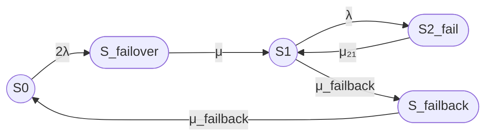

# Расчет с учетом failover и failback

## 1. Уточнение модели

Рассматривается восстанавливаемый отказоустойчивый кластер из двух одинаковых узлов.

Состояния:

- S0 — оба узла работоспособны, отказов нет;
- S_failover — отказ одного узла и выполняется переключение на резерв;
- S1 — один узел работоспособен, кластер работает в деградированном режиме;
- S2_fail — оба узла отказали, кластер неработоспособен;
- S_failback — выполняется возврат восстановленного узла в рабочую конфигурацию.

Работоспособными являются состояния:

- S0;
- S1.

Неработоспособными являются:

- S_failover;
- S2_fail;
- S_failback.

Такое отнесение означает, что во время failover и failback кластер не считается способным выполнять требуемую функцию. Это консервативная трактовка. В реальной системе failover или failback могут быть безостановочными, и тогда соответствующие состояния следует считать работоспособными либо выделить для них отдельный показатель деградированной готовности.

В данной модели нет прямых переходов:

- S0 → S1;
- S1 → S0.

Переход между полной и деградированной конфигурациями выполняется через состояния S_failover и S_failback.

## 2. Интенсивности переходов

Переходы модели:

- S0 → S_failover — отказ одного из двух работоспособных узлов и начало failover;
- S_failover → S1 — завершение failover, интенсивность μ;
- S1 → S2_fail — отказ оставшегося работоспособного узла;
- S1 → S_failback — начало failback, интенсивность μ_failback;
- S_failback → S0 — завершение failback, интенсивность μ_failback;
- S2_fail → S1 — восстановление одного из двух отказавших узлов.

Для двух одинаковых независимых узлов:

λ₀_failover = 2λ

λ₁₂ = λ

Время восстановления узла зададим через MTTR:

μ = 1 / MTTR

Для перехода S2_fail → S1 обозначим интенсивность восстановления через μ₂₁.

Если используется один ремонтный канал:

μ₂₁ = μ

Для failback введем:

μ_failback = 1 / MTTR_failback

## 3. Выбор времени failover и failback

Единого универсального значения времени failover или failback для всех кластеров не существует. Оно зависит от:

- технологии кластера;
- способа обнаружения отказа;
- тайм-аутов;
- типа приложения;
- наличия общей системы хранения;
- необходимости синхронизации данных;
- автоматического или ручного запуска;
- необходимости возврата IP-адреса, виртуального IP или файловой системы;
- процедуры fencing и восстановления кворума.

Опубликованные результаты показывают большой диапазон значений:

- для OpenDayLight-кластера сообщалось среднее время failover и failback около 17 секунд;
- для Heartbeat-DRBD указывался диапазон 23–45 секунд в зависимости от числа узлов и хостов;
- для некоторых конфигураций серверного failover сообщались средние значения failover около 0,826 секунды и failback около 0,865 секунды;
- для SQL Server Always On в одной из публикаций приводились значения failover порядка 15–78 секунд и failback порядка 14–27 секунд в зависимости от архитектуры.

Источники показывают, что значения являются платформозависимыми, поэтому их нельзя автоматически переносить на любой кластер. [ejournal.ittelkom-pwt.ac](https://ejournal.ittelkom-pwt.ac.id/index.php/infotel/article/view/389)

Для численного примера примем:

- среднее время failover: 17 секунд;
- среднее время failback: 17 секунд.

Тогда:

μ_failover = 1 / 17 1/с

μ_failback = 1 / 17 1/с

В расчетах все интенсивности необходимо привести к одной единице времени. Далее используем секунды.

## 4. Граф состояний Mermaid

Состояния S0 и S1 обозначены окружностями как работоспособные.

Состояния S_failover, S2_fail и S_failback обозначены овалами как неработоспособные.

## 5. Матрица интенсивностей переходов

Для удобства используем порядок состояний:

S0, S_failover, S1, S2_fail, S_failback.

Обозначим:

- λ — интенсивность отказа одного узла;
- μ — интенсивность завершения failover;
- μ₂₁ — интенсивность восстановления из S2_fail в S1;
- μ_failback — интенсивность начала и завершения failback.

Матрица генератора:

Q =

[ -2λ,       2λ,           0,          0,              0 ]

[  0,        -μ,            μ,          0,              0 ]

[  0,         0,    -(λ + μ_failback), λ,     μ_failback ]

[  0,         0,          μ₂₁,      -μ₂₁,              0 ]

[ μ_failback, 0,           0,          0,      -μ_failback ]

Диагональные элементы матрицы не являются самостоятельными переходами в то же состояние. Они равны минусу суммы интенсивностей всех исходящих переходов из соответствующего состояния.

Например:

- элемент строки S0, столбца S0 равен -2λ;
- элемент строки S0, столбца S_failover равен 2λ;
- элемент строки S1, столбца S2_fail равен λ;
- элемент строки S1, столбца S_failback равен μ_failback.

## 6. Стационарные вероятности

Обозначим стационарные вероятности:

- P₀ — вероятность состояния S0;
- P_failover — вероятность состояния S_failover;
- P₁ — вероятность состояния S1;
- P₂ — вероятность состояния S2_fail;
- P_failback — вероятность состояния S_failback.

Стационарные уравнения:

0 = -2λP₀ + μ_failback P_failback

0 = 2λP₀ - μP_failover

0 = μP_failover + μ₂₁P₂ - (λ + μ_failback)P₁

0 = λP₁ - μ₂₁P₂

0 = μ_failback P₁ - μ_failback P_failback

Условие нормировки:

P₀ + P_failover + P₁ + P₂ + P_failback = 1

Из первого и последнего уравнений:

P_failback = P₁

P₀ = μ_failback P₁ / (2λ)

Из второго уравнения:

P_failover = 2λP₀ / μ

Из четвертого уравнения:

P₂ = λP₁ / μ₂₁

После нормировки:

P₀ =
    μ μ_failback μ₂₁ /
    D

P_failover =
    2λ μ_failback μ₂₁ /
    D

P₁ =
    2λ μ μ₂₁ /
    D

P₂ =
    2λ² μ /
    D

P_failback =
    2λ μ μ₂₁ /
    D

где:

D =
    λ² μ
    + 2λ μ μ₂₁
    + 2λ μ_failback μ₂₁
    + μ μ_failback μ₂₁

## 7. Стационарный коэффициент готовности

По принятой классификации работоспособными являются только состояния S0 и S1.

Поэтому:

Кг,ст = P₀ + P₁

Подставляя стационарные вероятности:

Кг,ст =
    μ₂₁(μ μ_failback + 2λμ) /
    D

где:

D =
    λ² μ
    + 2λ μ μ₂₁
    + 2λ μ_failback μ₂₁
    + μ μ_failback μ₂₁

Итоговая формула общего случая:

Кг,ст =
    μ₂₁ μ (μ_failback + 2λ) /
    (λ² μ
     + 2λ μ μ₂₁
     + 2λ μ_failback μ₂₁
     + μ μ_failback μ₂₁)

Если μ₂₁ = μ, то:

Кг,ст =
    μ²(μ_failback + 2λ) /
    (λ² μ
     + 2λ μ²
     + 2λ μ_failback μ
     + μ² μ_failback)

## 8. Пример с MTBF, MTTR и временем переключений

Примем исходные данные:

- MTBF одного узла = 30000 часов;
- MTTR одного узла = 24 часа;
- среднее время failover = 17 секунд;
- среднее время failback = 17 секунд;
- один ремонтный канал.

Переведем MTBF и MTTR в секунды, поскольку времена failover и failback заданы в секундах:

MTBF = 30000 × 3600 = 108000000 секунд

MTTR = 24 × 3600 = 86400 секунд

Интенсивность отказа одного узла:

λ = 1 / 108000000 1/с

Интенсивность завершения failover:

μ = 1 / 17 1/с

Интенсивность восстановления из состояния S2_fail:

μ₂₁ = 1 / 86400 1/с

Интенсивность failback:

μ_failback = 1 / 17 1/с

Подстановка этих значений в формулу дает:

Кг,ст ≈ 0,998635519

В процентах:

Кг,ст ≈ 99,8635519%

Ожидаемое время неготовности в пересчете на календарный год:

(1 - Кг,ст) × 8760 ≈ 11,95 часа в год

## 9. Интерпретация результата

Полученный результат существенно ниже результата исходной модели без состояний failover и failback:

- исходная модель: примерно 99,9998722%;
- модель с failover и failback: примерно 99,8635519%.

Причина — в принятой классификации состояний.

В новой модели состояния S_failover и S_failback считаются неработоспособными. При этом:

- каждое переключение после отказа узла занимает в среднем 17 секунд;
- каждый возврат восстановленного узла в полную конфигурацию также занимает 17 секунд;
- переход S1 → S_failback моделируется как операция failback с интенсивностью 1 / 17 1/с;
- S_failback → S0 также имеет интенсивность 1 / 17 1/с.

Однако в заданной структуре переходов S1 → S_failback запускается самопроизвольно с интенсивностью μ_failback. Это означает, что failback происходит в среднем каждые 17 секунд пребывания в состоянии S1, а не только после завершения ремонта ранее отказавшего узла. Такое толкование физически некорректно.

Кроме того, состояние S_failback в заданной схеме не имеет перехода, связанного с фактическим завершением ремонта узла. Поэтому формально заданная модель смешивает:

- начало процедуры failback;
- завершение процедуры failback;
- восстановление ранее отказавшего узла.

Для физически корректной модели следует добавить отдельное состояние «узел отремонтирован и готов к failback» либо связать переход S1 → S_failback с завершением ремонта конкретного узла. Иначе значение 99,8635519% нельзя считать надежной оценкой реального кластера.

В частности, при MTBF = 30000 часов вероятность отказа узла мала, а время пребывания в деградированном состоянии S1 после отказа узла должно быть связано с фактическим временем ремонта и возврата узла, а не с самостоятельным таймером, который запускается постоянно.

## Итого

### Граф

### Легенда

- `((S))` — работоспособное состояние, окружность.
- `([S])` — отказавшее состояние, овал.
- S0 — оба узла работоспособны.
- S_failover — выполняется аварийное переключение на резерв.
- S1 — один узел работоспособен, кластер работает в деградированном режиме.
- S2_fail — оба узла отказали.
- S_failback — выполняется возврат восстановленного узла в рабочую конфигурацию.

### Итоговая формула

Кг,ст =
    μ₂₁ μ (μ_failback + 2λ) /
    (λ² μ
     + 2λ μ μ₂₁
     + 2λ μ_failback μ₂₁
     + μ μ_failback μ₂₁)

Для примера:

- MTBF = 30000 часов;
- MTTR = 24 часа;
- время failover = 17 секунд;
- время failback = 17 секунд;
- один ремонтный канал.

Получается:

Кг,ст ≈ 0,998635519

Кг,ст ≈ 99,8635519%

Но это значение следует рассматривать только как результат формально заданной схемы. Для реалистичного расчета необходимо уточнить причинную связь между восстановлением узла, переходом в S_failback и завершением failback.
