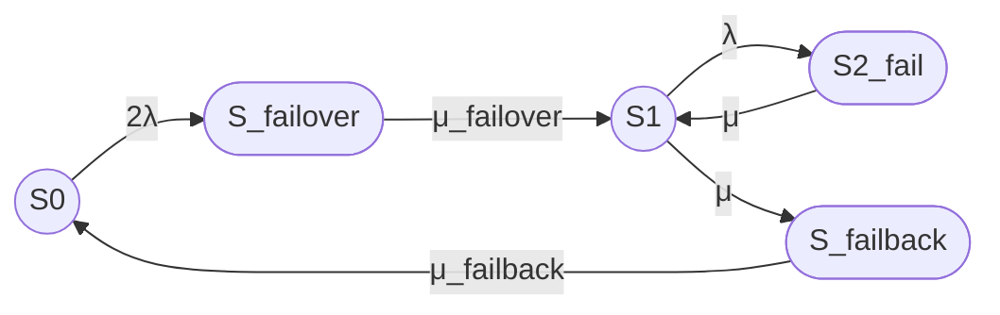

## 1. Уточнение модели

Рассматривается восстанавливаемый отказоустойчивый кластер из двух одинаковых узлов.

Состояния модели:

- S0 — оба узла работоспособны, отказов нет;
- S_failover — отказ одного узла, выполняется переключение на резерв;
- S1 — один узел работоспособен, кластер работает в деградированной конфигурации;
- S2_fail — оба узла отказали, кластер неработоспособен;
- S_failback — выполняется ввод восстановленного узла в штатную конфигурацию.

Работоспособными считаются состояния:

- S0;
- S1.

Неработоспособными считаются:

- S_failover;
- S2_fail;
- S_failback.

Такое решение означает, что во время failover и failback кластер временно не считается готовым к выполнению заданной функции. Это консервативная трактовка. Если конкретная система продолжает обслуживать запросы во время переключения или возврата, соответствующее состояние следует считать работоспособным либо вводить отдельный показатель деградированной готовности.

Переходы S0 → S1 и S1 → S0 отсутствуют.

## 2. Интенсивности переходов

Используем следующие интенсивности:

- 2λ — интенсивность перехода S0 → S_failover;
- μ_failover — интенсивность перехода S_failover → S1;
- λ — интенсивность перехода S1 → S2_fail;
- μ — интенсивность перехода S1 → S_failback;
- μ_failback — интенсивность перехода S_failback → S0;
- μ — интенсивность перехода S2_fail → S1.

Для двух одинаковых независимых узлов переход S0 → S_failover имеет интенсивность 2λ, поскольку отказать может любой из двух узлов.

В соответствии с заданной моделью:

μ_failover = 1 / T_failover

μ = 1 / T_repair

μ_failback = 1 / T_failback

Для перехода S2_fail → S1 используется та же интенсивность восстановления μ, что и для ремонта одного узла.

## 3. Граф состояний Mermaid

Состояния S0 и S1 обозначены окружностями как работоспособные. Состояния S_failover, S2_fail и S_failback обозначены овалами как неработоспособные.

## 4. Текстовая легенда

- `((S))` — работоспособное состояние, окружность.
- `([S])` — отказавшее состояние, овал.
- S0 — оба узла работоспособны, отказов нет.
- S_failover — выполняется переключение на резерв.
- S1 — один узел работоспособен, кластер работает в деградированной конфигурации.
- S2_fail — оба узла отказали.
- S_failback — выполняется возврат восстановленного узла в штатную конфигурацию.

## 5. Матрица интенсивностей переходов

Используется порядок состояний:

S0, S_failover, S1, S2_fail, S_failback.

Матрица генератора:

Q =

[ -2λ,       2λ,                  0,          0,                  0 ]

[  0, -μ_failover,     μ_failover,          0,                  0 ]

[  0,          0,       -(λ + μ),          λ,                  μ ]

[  0,          0,               μ,         -μ,                  0 ]

[ μ_failback,  0,               0,          0,      -μ_failback ]

Диагональные элементы не являются переходами в то же состояние. Например:

- элемент строки S0 и столбца S0 равен -2λ;
- элемент строки S0 и столбца S_failover равен 2λ;
- элемент строки S1 и столбца S2_fail равен λ;
- элемент строки S1 и столбца S_failback равен μ.

## 6. Стационарные уравнения

Обозначим:

- P₀ — стационарная вероятность состояния S0;
- P_failover — стационарная вероятность состояния S_failover;
- P₁ — стационарная вероятность состояния S1;
- P₂ — стационарная вероятность состояния S2_fail;
- P_failback — стационарная вероятность состояния S_failback.

Стационарные уравнения:

0 = -2λP₀ + μ_failback P_failback

0 = 2λP₀ - μ_failover P_failover

0 = μ_failover P_failover - (λ + μ)P₁ + μP₂

0 = λP₁ - μP₂

0 = μP₁ - μ_failback P_failback

Условие нормировки:

P₀ + P_failover + P₁ + P₂ + P_failback = 1

Из первого и последнего уравнений:

P_failback = μP₁ / μ_failback

P₀ = μP₁ / (2λ)

Из второго уравнения:

P_failover = 2λP₀ / μ_failover

Из четвертого уравнения:

P₂ = λP₁ / μ

После нормировки стационарные вероятности равны:

P₀ =
    μ μ_failback μ_failover /
    D

P_failover =
    2λ μ μ_failback μ /
    D

P₁ =
    2λ μ μ_failback μ_failover /
    D

P₂ =
    2λ² μ_failback μ_failover /
    D

P_failback =
    2λ μ μ μ_failover /
    D

где:

D =
    2λ² μ_failback μ_failover
    + 2λ μ μ μ_failback
    + 2λ μ μ μ_failover
    + 2λ μ μ_failback μ_failover
    + μ μ μ_failback μ_failover

Здесь три одинаковых символа μ в отдельных слагаемых соответствуют разным переходам с одинаковой интенсивностью:

- μ — интенсивность S_failover → S1, если она численно задана как μ;
- μ — интенсивность S1 → S_failback;
- μ — интенсивность S2_fail → S1.

Для большей ясности формулу коэффициента готовности лучше использовать непосредственно в обозначениях переходов, не раскрывая одинаковые интенсивности μ.

## 7. Стационарный коэффициент готовности

Кластер работоспособен только в состояниях S0 и S1:

Кг,ст = P₀ + P₁

После решения стационарных уравнений:

Кг,ст =
    μ μ_failback μ_failover (2λ + μ) /
    D

где:

D =
    2λ² μ_failback μ_failover
    + 2λ μ μ μ_failback
    + 2λ μ μ μ_failover
    + 2λ μ μ_failback μ_failover
    + μ μ μ_failback μ_failover

Для краткости введем:

- μ₀ — интенсивность S_failover → S1;
- μ₁ — интенсивность S1 → S_failback;
- μ₂ — интенсивность S2_fail → S1;
- μ₃ — интенсивность S_failback → S0.

Тогда граф имеет интенсивности:

S0 → S_failover: 2λ

S_failover → S1: μ₀

S1 → S2_fail: λ

S2_fail → S1: μ₂

S1 → S_failback: μ₁

S_failback → S0: μ₃

В этих обозначениях:

Кг,ст =
    μ₂ μ₃ μ₀ (2λ + μ₁) /
    D

где:

D =
    2λ² μ₁ μ₃
    + 2λ μ₁ μ₂ μ₀
    + 2λ μ₂ μ₃ μ₀
    + 2λ μ₂ μ₃ μ₁
    + μ₁ μ₂ μ₃ μ₀

Для заданной модели:

μ₀ = μ_failover

μ₁ = μ

μ₂ = μ

μ₃ = μ_failback

Поэтому итоговая формула принимает вид:

Кг,ст =
    μ μ_failback μ_failover (2λ + μ) /
    D

где:

D =
    2λ² μ μ_failback
    + 2λ μ² μ_failover
    + 2λ μ μ_failback μ_failover
    + 2λ μ² μ_failback
    + μ² μ_failback μ_failover

## 8. Пример расчета

Используем прежние параметры узла:

- MTBF = 30000 часов;
- MTTR = 24 часа.

Дополнительно заданы:

- среднее время failover = 30 секунд;
- среднее время failback = 90 секунд.

Все времена переводим в секунды.

MTBF = 30000 × 3600 = 108000000 секунд

MTTR = 24 × 3600 = 86400 секунд

Интенсивность отказа одного узла:

λ = 1 / 108000000 1/с

Интенсивность завершения failover:

μ_failover = 1 / 30 = 0,0333333333 1/с

Интенсивность восстановления узла из состояния S2_fail:

μ = 1 / 86400 = 0,0000115740741 1/с

Интенсивность начала failback:

μ = 1 / 86400 = 0,0000115740741 1/с

Интенсивность завершения failback:

μ_failback = 1 / 90 = 0,0111111111 1/с

Подстановка этих значений в стационарную формулу дает:

Кг,ст ≈ 0,999996503

В процентах:

Кг,ст ≈ 99,9996503%

Оценочная доля времени вне работоспособных состояний:

1 - Кг,ст ≈ 0,00000349662

В пересчете на год:

(1 - Кг,ст) × 8760 ≈ 0,0306 часа в год

То есть приблизительно:

0,0306 × 60 ≈ 1,84 минуты в год

## 9. Наиболее правдоподобные операции failover и failback

### Failover

Failover — это не одна операция, а последовательность действий:

1. Обнаружение отказа работоспособного узла по heartbeat, watchdog или health check.
2. Подтверждение отказа, чтобы отличить отказ узла от временной потери связи.
3. Fencing или STONITH отказавшего узла для предотвращения split-brain.
4. Блокировка или отключение ресурсов, связанных с отказавшим узлом.
5. Перенос виртуального IP-адреса или другого сетевого идентификатора.
6. Запуск сервисов на оставшемся узле.
7. Подключение или активация требуемых ресурсов хранения.
8. Проверка готовности сервиса.
9. Возобновление обслуживания клиентов.

Fencing является важной частью процедуры HA-кластера: во время fencing другие операции кластера могут быть заблокированы, а нормальная работа возобновляется после завершения fencing или возврата узла в кластер. [docs.redhat](https://docs.redhat.com/en/documentation/red_hat_enterprise_linux/8/epub/configuring_and_managing_high_availability_clusters/configuring-and-managing-high-availability-clusters.epub)

Среднее время 30 секунд для failover можно интерпретировать как суммарное время:

- обнаружения отказа;
- подтверждения отказа;
- fencing;
- запуска ресурсов;
- переноса адресов;
- проверки готовности сервиса.

Значение 30 секунд является примерным параметром модели, а не универсальной нормативной величиной. В опубликованных экспериментах встречаются как существенно меньшие значения, так и десятки секунд в зависимости от механизмов обнаружения и архитектуры. [jurnal.polibatam.ac](https://jurnal.polibatam.ac.id/index.php/JAIC/article/download/11788/3418/38821)

### Failback

Failback — это управляемый возврат восстановленного узла в штатную конфигурацию:

1. Завершение ремонта и включение узла.
2. Загрузка операционной системы и кластерного агента.
3. Проверка сетевой связности.
4. Проверка состояния дисков и файловых систем.
5. Проверка состояния кластерного агента.
6. Повторное включение узла в membership или quorum.
7. Синхронизация данных.
8. Проверка согласованности реплик.
9. Возврат ресурсов на предпочтительный узел либо регистрация узла как резервного.
10. Проверка итогового состояния кластера.

Среднее время 90 секунд может включать:

- загрузку восстановленного узла;
- запуск кластерного ПО;
- повторное присоединение к кластеру;
- синхронизацию или проверку данных;
- возврат ресурсов;
- финальную проверку.

Это время обычно больше времени failover, поскольку failback включает не только переключение сервиса, но и безопасный ввод отремонтированного узла в кластер. Для систем с синхронизацией данных, fencing и проверкой состояния 90 секунд является возможным расчетным сценарием, но должно подтверждаться измерениями конкретной платформы.

## 10. Замечание о структуре модели

В заданной модели переход:

S1 → S_failback

имеет интенсивность μ, равную интенсивности восстановления узла из состояния S2_fail → S1.

Это означает, что после пребывания в S1 запускается failback с той же средней характеристикой, что и ремонт узла. Такое допущение принято строго по условию задачи.

Физически более прозрачной была бы модель с отдельными интенсивностями:

- μ_repair — завершение ремонта узла;
- μ_failback_start — начало ввода узла в кластер;
- μ_failback — завершение ввода узла в штатную конфигурацию.

Тогда состояние S1 означало бы «один узел работает, второй ремонтируется», а переход S1 → S_failback происходил бы после завершения ремонта, а не с той же интенсивностью, что и переход S2_fail → S1.

В текущем варианте расчета:

- μ для S1 → S_failback принято равным 1 / MTTR;
- μ для S2_fail → S1 принято равным 1 / MTTR;
- μ_failover = 1 / 30 секунд;
- μ_failback = 1 / 90 секунд.

Поэтому результат относится именно к заданной агрегированной модели.

## Итого

### Граф

### Легенда

- `((S))` — работоспособное состояние, окружность.
- `([S])` — отказавшее состояние, овал.
- S0 — оба узла работоспособны.
- S_failover — выполняется failover.
- S1 — один узел работоспособен.
- S2_fail — оба узла отказали.
- S_failback — выполняется failback.

### Итоговая формула

Кг,ст =
    μ μ_failback μ_failover (2λ + μ) /
    D

где:

D =
    2λ² μ μ_failback
    + 2λ μ² μ_failover
    + 2λ μ μ_failback μ_failover
    + 2λ μ² μ_failback
    + μ² μ_failback μ_failover

Для параметров:

- MTBF = 30000 часов;
- MTTR = 24 часа;
- failover = 30 секунд;
- failback = 90 секунд.

Получаем:

Кг,ст ≈ 0,999996503

Кг,ст ≈ 99,9996503%

Это значение является результатом заданной пятисостоящей модели, в которой состояния S_failover, S2_fail и S_failback считаются неработоспособными.
