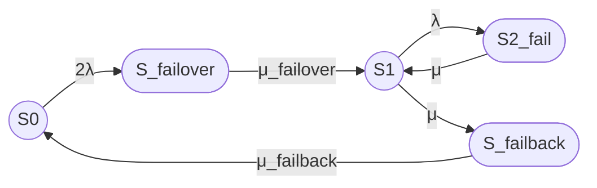

# prompt3_res

# Итоговый вариант расчета

## 1. Модель кластера

Рассматривается восстанавливаемый отказоустойчивый кластер из двух одинаковых узлов.

Состояния модели:

- S₀ — оба узла работоспособны, отказов нет;
- S_failover — отказ одного из двух узлов, выполняется процедура failover;
- S₁ — один узел работоспособен, кластер работает в деградированной конфигурации;
- S₂_fail — оба узла отказали, кластер неработоспособен;
- S_failback — выполняется процедура failback, то есть ввод восстановленного узла в штатную конфигурацию.

Кластер считается работоспособным в состояниях S₀ и S₁.

Состояния S_failover, S₂_fail и S_failback считаются неработоспособными.

Приняты следующие допущения:

- процесс является непрерывной однородной цепью Маркова;
- интенсивности переходов постоянны во времени;
- времена переходов имеют экспоненциальные распределения;
- отказы узлов независимы;
- используется один ремонтный канал;
- отсутствуют прямые переходы S₀ → S₁ и S₁ → S₀;
- отказы по общей причине, отказ сети, коммутатора, системы хранения и fencing не учитываются;
- одна интенсивность μ используется для переходов S₂_fail → S₁ и S₁ → S_failback.

Марковские методы применяются для анализа готовности и ремонтопригодности восстанавливаемых систем. [github](https://github.com/chunhualiao/public-docs/wiki/math)

## 2. Переходы и интенсивности

Переходы модели:

- S₀ → S_failover — отказ одного из двух работоспособных узлов, интенсивность 2λ;
- S_failover → S₁ — завершение процедуры failover, интенсивность μ_failover;
- S₁ → S₂_fail — отказ оставшегося работоспособного узла, интенсивность λ;
- S₂_fail → S₁ — восстановление одного из двух отказавших узлов, интенсивность μ;
- S₁ → S_failback — начало процедуры failback, интенсивность μ;
- S_failback → S₀ — завершение процедуры failback, интенсивность μ_failback.

Связь интенсивностей со средними временами:

### Вариант 1, Unicode

λ = 1 / MTBF

μ = 1 / MTTR

μ_failover = 1 / T_failover

μ_failback = 1 / T_failback

### Вариант 2, LaTeX

$$
\lambda = \frac{1}{MTBF}
$$

$$
\mu = \frac{1}{MTTR}
$$

$$
\mu_{\mathrm{failover}} =
\frac{1}{T_{\mathrm{failover}}}
$$

$$
\mu_{\mathrm{failback}} =
\frac{1}{T_{\mathrm{failback}}}
$$

В дальнейшем обозначения μ_failover и μ_failback используются именно с подчеркиванием в исходной записи. В LaTeX-формулах они оформляются как μ с текстовым нижним индексом `failover` или `failback`.

## 3. Граф состояний

В Mermaid используются ASCII-идентификаторы:

- S0;
- S_failover;
- S1;
- S2_fail;
- S_failback.

Работоспособные состояния обозначены окружностями. Неработоспособные состояния обозначены овалами.

Основное направление:

S0 → S_failover → S1 → S2_fail

Ветвь возврата:

S1 → S_failback → S0

## 4. Текстовая легенда

- `((S))` — работоспособное состояние, окружность.
- `([S])` — неработоспособное состояние, овал.
- S₀ — оба узла работоспособны, отказов нет.
- S_failover — выполняется процедура failover.
- S₁ — один узел работоспособен, кластер работает в деградированной конфигурации.
- S₂_fail — оба узла отказали.
- S_failback — выполняется процедура failback.

## 5. Матрица генератора

Порядок состояний:

S₀, S_failover, S₁, S₂_fail, S_failback.

### Вариант 1, Unicode

Q =

[ -2λ,       2λ,                  0,          0,                  0 ]

[  0, -μ_failover,     μ_failover,          0,                  0 ]

[  0,          0,        -(λ + μ),          λ,                  μ ]

[  0,          0,               μ,         -μ,                  0 ]

[ μ_failback,  0,               0,          0,      -μ_failback ]

### Вариант 2, LaTeX

$$
Q =
\begin{bmatrix}
-2\lambda & 2\lambda & 0 & 0 & 0 \\
0 & -\mu_{\mathrm{failover}} & \mu_{\mathrm{failover}} & 0 & 0 \\
0 & 0 & -(\lambda+\mu) & \lambda & \mu \\
0 & 0 & \mu & -\mu & 0 \\
\mu_{\mathrm{failback}} & 0 & 0 & 0 & -\mu_{\mathrm{failback}}
\end{bmatrix}
$$

Диагональные элементы не являются переходами состояния в само себя. Они равны минусу суммы интенсивностей исходящих переходов.

Например:

- -2λ — диагональный элемент состояния S₀;
- 2λ — интенсивность перехода S₀ → S_failover;
- λ — интенсивность перехода S₁ → S₂_fail;
- μ — интенсивность перехода S₂_fail → S₁.

## 6. Стационарные уравнения

Обозначим:

- P₀ — вероятность состояния S₀;
- P_failover — вероятность состояния S_failover;
- P₁ — вероятность состояния S₁;
- P₂ — вероятность состояния S₂_fail;
- P_failback — вероятность состояния S_failback.

### Вариант 1, Unicode

0 = -2λP₀ + μ_failbackP_failback

0 = 2λP₀ - μ_failoverP_failover

0 = μ_failoverP_failover - (λ + μ)P₁ + μP₂

0 = λP₁ - μP₂

0 = μP₁ - μ_failbackP_failback

P₀ + P_failover + P₁ + P₂ + P_failback = 1

### Вариант 2, LaTeX

$$
0 = -2\lambda P_0
+ \mu_{\mathrm{failback}}P_{\mathrm{failback}}
$$

$$
0 = 2\lambda P_0
- \mu_{\mathrm{failover}}P_{\mathrm{failover}}
$$

$$
0 =
\mu_{\mathrm{failover}}P_{\mathrm{failover}}
-(\lambda+\mu)P_1
+\mu P_2
$$

$$
0 = \lambda P_1-\mu P_2
$$

$$
0 =
\mu P_1
-\mu_{\mathrm{failback}}P_{\mathrm{failback}}
$$

$$
P_0+P_{\mathrm{failover}}+P_1+P_2+P_{\mathrm{failback}}=1
$$

## 7. Стационарные вероятности

Введем общий знаменатель:

### Вариант 1, Unicode

D =
    2λ² μ_failback μ_failover
    + 2λ μ² μ_failback
    + 2λ μ² μ_failover
    + 2λ μ μ_failback μ_failover
    + μ² μ_failback μ_failover

### Вариант 2, LaTeX

$$
\begin{aligned}
D ={}&
2\lambda^2\mu_{\mathrm{failback}}\mu_{\mathrm{failover}}
+2\lambda\mu^2\mu_{\mathrm{failback}} \\
&+2\lambda\mu^2\mu_{\mathrm{failover}}
+2\lambda\mu\mu_{\mathrm{failback}}\mu_{\mathrm{failover}} \\
&+\mu^2\mu_{\mathrm{failback}}\mu_{\mathrm{failover}}
\end{aligned}
$$

Стационарные вероятности:

### Вариант 1, Unicode

P₀ = μ² μ_failback μ_failover / D

P_failover = 2λ μ² μ_failback / D

P₁ = 2λ μ μ_failback μ_failover / D

P₂ = 2λ² μ_failback μ_failover / D

P_failback = 2λ μ² μ_failover / D

### Вариант 2, LaTeX

$$
P_0 =
\frac{
\mu^2\mu_{\mathrm{failback}}\mu_{\mathrm{failover}}
}{D}
$$

$$
P_{\mathrm{failover}} =
\frac{
2\lambda\mu^2\mu_{\mathrm{failback}}
}{D}
$$

$$
P_1 =
\frac{
2\lambda\mu\mu_{\mathrm{failback}}\mu_{\mathrm{failover}}
}{D}
$$

$$
P_2 =
\frac{
2\lambda^2\mu_{\mathrm{failback}}\mu_{\mathrm{failover}}
}{D}
$$

$$
P_{\mathrm{failback}} =
\frac{
2\lambda\mu^2\mu_{\mathrm{failover}}
}{D}
$$

## 8. Стационарный коэффициент готовности

Кластер работоспособен в состояниях S₀ и S₁.

### Вариант 1, Unicode

Кг,ст = P₀ + P₁

Кг,ст =
    μ μ_failback μ_failover(μ + 2λ) /
    D

### Вариант 2, LaTeX

$$
K_{\mathrm{г,ст}} = P_0 + P_1
$$

$$
K_{\mathrm{г,ст}} =
\frac{
\mu\mu_{\mathrm{failback}}\mu_{\mathrm{failover}}
\left(\mu+2\lambda\right)
}{D}
$$

Развернутая формула:

### Вариант 1, Unicode

Кг,ст =
    μ μ_failback μ_failover(μ + 2λ)
    /
    [2λ² μ_failback μ_failover
     + 2λ μ² μ_failback
     + 2λ μ² μ_failover
     + 2λ μ μ_failback μ_failover
     + μ² μ_failback μ_failover]

### Вариант 2, LaTeX

$$
K_{\mathrm{г,ст}} =
\frac{
\mu\mu_{\mathrm{failback}}\mu_{\mathrm{failover}}
\left(\mu+2\lambda\right)
}{
2\lambda^2\mu_{\mathrm{failback}}\mu_{\mathrm{failover}}
+2\lambda\mu^2\mu_{\mathrm{failback}}
+2\lambda\mu^2\mu_{\mathrm{failover}}
+2\lambda\mu\mu_{\mathrm{failback}}\mu_{\mathrm{failover}}
+\mu^2\mu_{\mathrm{failback}}\mu_{\mathrm{failover}}
}
$$

## 9. Численный пример

Исходные данные:

- MTBF одного узла = 30000 часов;
- MTTR одного узла = 24 часа;
- среднее время failover = 30 секунд;
- среднее время failback = 90 секунд.

Все времена переводим в секунды.

### Вариант 1, Unicode

MTBF = 30000 × 3600 = 108000000 с

MTTR = 24 × 3600 = 86400 с

### Вариант 2, LaTeX

$$
MTBF = 30000 \times 3600 = 108000000\ \mathrm{s}
$$

$$
MTTR = 24 \times 3600 = 86400\ \mathrm{s}
$$

Интенсивности:

### Вариант 1, Unicode

λ = 1 / 108000000 ≈ 9,25925926 × 10⁻⁹ 1/с

μ = 1 / 86400 ≈ 1,15740741 × 10⁻⁵ 1/с

μ_failover = 1 / 30 ≈ 0,0333333333 1/с

μ_failback = 1 / 90 ≈ 0,0111111111 1/с

### Вариант 2, LaTeX

$$
\lambda =
\frac{1}{108000000}
\approx 9{,}25925926 \times 10^{-9}\ \mathrm{s}^{-1}
$$

$$
\mu =
\frac{1}{86400}
\approx 1{,}15740741 \times 10^{-5}\ \mathrm{s}^{-1}
$$

$$
\mu_{\mathrm{failover}} =
\frac{1}{30}
\approx 0{,}0333333333\ \mathrm{s}^{-1}
$$

$$
\mu_{\mathrm{failback}} =
\frac{1}{90}
\approx 0{,}0111111111\ \mathrm{s}^{-1}
$$

Подстановка в формулу дает:

### Вариант 1, Unicode

Кг,ст ≈ 0,999996503

Кг,ст ≈ 99,9996503%

### Вариант 2, LaTeX

$$
K_{\mathrm{г,ст}} \approx 0{,}999996503
$$

$$
K_{\mathrm{г,ст}} \approx 99{,}9996503\%
$$

Стационарные вероятности для проверки:

### Вариант 1, Unicode

P₀ ≈ 0,998399065

P_failover ≈ 0,0000005547

P₁ ≈ 0,0015974385

P₂ ≈ 0,0000012780

P_failback ≈ 0,0000016640

Проверка:

Кг,ст = P₀ + P₁

Кг,ст ≈ 0,998399065 + 0,0015974385

Кг,ст ≈ 0,9999965035

### Вариант 2, LaTeX

$$
P_0 \approx 0{,}998399065
$$

$$
P_{\mathrm{failover}} \approx 0{,}0000005547
$$

$$
P_1 \approx 0{,}0015974385
$$

$$
P_2 \approx 0{,}0000012780
$$

$$
P_{\mathrm{failback}} \approx 0{,}0000016640
$$

$$
K_{\mathrm{г,ст}}
=
P_0+P_1
\approx 0{,}9999965035
$$

Разница между 0,9999965035 и 0,999996503 объясняется округлением.

## 10. Операции failover и failback

### Failover

Наиболее правдоподобная последовательность операций:

1. Обнаружение отказа узла через heartbeat, watchdog или health check.
2. Подтверждение отказа после истечения тайм-аута.
3. Fencing или STONITH для предотвращения split-brain.
4. Блокировка ресурсов отказавшего узла.
5. Перенос виртуального IP-адреса или другого сетевого идентификатора.
6. Запуск сервисов на оставшемся узле.
7. Подключение необходимых ресурсов хранения.
8. Проверка готовности сервиса.
9. Возобновление обслуживания клиентов.

Fencing используется для предотвращения доступа отказавшего узла к общим ресурсам и защиты от split-brain. [docs.redhat](https://docs.redhat.com/en/documentation/red_hat_enterprise_linux/8/html/configuring_and_managing_high_availability_clusters/assembly_overview-of-high-availability-configuring-and-managing-high-availability-clusters)

Среднее время failover 30 секунд рассматривается как суммарное время обнаружения отказа, подтверждения отказа, fencing, запуска ресурсов и проверки сервиса.

### Failback

Наиболее правдоподобная последовательность операций:

1. Завершение ремонта отказавшего узла.
2. Загрузка операционной системы и кластерного агента.
3. Проверка сетевой связности.
4. Проверка дисков и файловых систем.
5. Повторное включение узла в кластер.
6. Синхронизация данных и реплик.
7. Проверка согласованности данных.
8. Возврат ресурсов на восстановленный узел либо регистрация его как резерва.
9. Проверка итогового состояния кластера.

Среднее время failback 90 секунд рассматривается как суммарное время ввода восстановленного узла в кластер, синхронизации данных и возврата к штатной конфигурации.

## 11. Ограничения модели

Модель не учитывает:

- отказы по общей причине;
- отказ сети;
- отказ коммутатора;
- отказ системы хранения;
- отказ механизма fencing;
- потерю кворума;
- программные ошибки;
- ошибки конфигурации;
- ошибки оператора;
- зависимые отказы;
- различие между автоматическим и ручным failback;
- неэкспоненциальные распределения времени отказа и восстановления;
- продолжение обслуживания запросов во время failover и failback.

Переход S₁ → S₍failback₎ с интенсивностью μ является упрощенным допущением. В более детальной модели необходимо отдельно моделировать завершение ремонта, готовность восстановленного узла, начало failback, синхронизацию и завершение failback.

## Итого

### Граф

### Легенда

- `((S))` — работоспособное состояние, окружность.
- `([S])` — неработоспособное состояние, овал.
- S₀ — оба узла работоспособны.
- S_failover — выполняется failover.
- S₁ — один узел работоспособен.
- S₂_fail — оба узла отказали.
- S_failback — выполняется failback.

### Формула Unicode

Кг,ст =
    μ μ_failback μ_failover(μ + 2λ)
    /
    (2λ² μ_failback μ_failover
     + 2λ μ² μ_failback
     + 2λ μ² μ_failover
     + 2λ μ μ_failback μ_failover
     + μ² μ_failback μ_failover)

### Формула LaTeX

$$
K_{\mathrm{г,ст}} =
\frac{
\mu\mu_{\mathrm{failback}}\mu_{\mathrm{failover}}
\left(\mu+2\lambda\right)
}{
2\lambda^2\mu_{\mathrm{failback}}\mu_{\mathrm{failover}}
+2\lambda\mu^2\mu_{\mathrm{failback}}
+2\lambda\mu^2\mu_{\mathrm{failover}}
+2\lambda\mu\mu_{\mathrm{failback}}\mu_{\mathrm{failover}}
+\mu^2\mu_{\mathrm{failback}}\mu_{\mathrm{failover}}
}
$$

### Численный результат

При:

- MTBF = 30000 часов;
- MTTR = 24 часа;
- failover = 30 секунд;
- failback = 90 секунд.

Получаем:

Кг,ст ≈ 0,999996503

Кг,ст ≈ 99,9996503%

В LaTeX:

$$
K_{\mathrm{г,ст}} \approx 0{,}999996503
$$

$$
K_{\mathrm{г,ст}} \approx 99{,}9996503\%
$$

Именно это значение является результатом проверенного расчета для заданной пятисостоящей модели.
