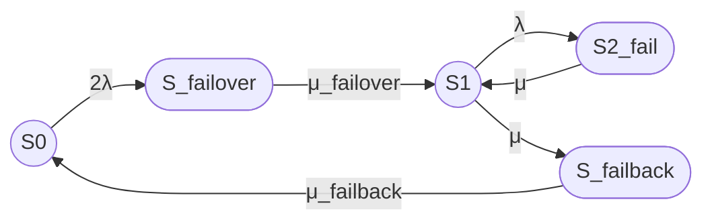

# 3

# Промпт для расчета надежности кластера

```text
# Часть 1. Постановка задачи и расчетная модель

Рассчитай стационарный коэффициент готовности восстанавливаемого отказоустойчивого кластера методом непрерывной однородной цепи Маркова.

## 1.1. Структура кластера

Рассматривается кластер из двух одинаковых узлов с восстановлением.

Состояния марковской модели:

- S₀ — оба узла работоспособны, отказов нет;
- S_failover — отказ одного из двух узлов, выполняется процедура failover;
- S₁ — один узел работоспособен, кластер работает в деградированной конфигурации;
- S₂_fail — оба узла отказали, кластер неработоспособен;
- S_failback — выполняется процедура failback, то есть ввод восстановленного узла в штатную конфигурацию.

Кластер считается работоспособным только в состояниях S₀ и S₁.

Состояния S_failover, S₂_fail и S_failback считаются неработоспособными.

Для идентификаторов Mermaid используй ASCII-имена:

- S0;
- S_failover;
- S1;
- S2_fail;
- S_failback.

## 1.2. Переходы между состояниями

Используй следующие переходы:

- S₀ → S_failover — отказ одного из двух работоспособных узлов и начало процедуры failover;
- S_failover → S₁ — завершение failover и переход в работоспособную конфигурацию с одним рабочим узлом;
- S₁ → S₂_fail — отказ оставшегося работоспособного узла;
- S₂_fail → S₁ — восстановление одного из двух отказавших узлов;
- S₁ → S_failback — начало процедуры failback;
- S_failback → S₀ — завершение процедуры failback и переход к полной работоспособности.

Прямые переходы отсутствуют:

- S₀ → S₁;
- S₁ → S₀.

Не добавляй другие переходы без отдельного обоснования.

## 1.3. Интенсивности переходов

Используй следующие интенсивности:

- S₀ → S_failover: 2λ;
- S_failover → S₁: μ_failover;
- S₁ → S₂_fail: λ;
- S₂_fail → S₁: μ;
- S₁ → S_failback: μ;
- S_failback → S₀: μ_failback.

Обозначения:

- λ — интенсивность отказа одного узла;
- μ — интенсивность восстановления узла;
- μ_failover — интенсивность завершения процедуры failover;
- μ_failback — интенсивность завершения процедуры failback.

В данной модели одна и та же интенсивность μ используется для переходов S₂_fail → S₁ и S₁ → S_failback. Это упрощающее допущение следует явно указать.

Связь интенсивностей со средними временами:

- λ = 1 / MTBF;
- μ = 1 / MTTR;
- μ_failover = 1 / T_failover;
- μ_failback = 1 / T_failback.

## 1.4. Допущения

Укажи, что:

- процесс является непрерывной однородной цепью Маркова;
- интенсивности переходов постоянны во времени;
- времена переходов имеют экспоненциальные распределения;
- узлы одинаковы;
- отказы узлов независимы;
- используется один ремонтный канал;
- отказы по общей причине не учитываются;
- отказы сети, коммутатора, системы хранения, кворума и fencing не учитываются;
- обслуживание во время failover и failback не учитывается;
- состояния S_failover, S₂_fail и S_failback считаются неработоспособными.

## 1.5. Требуемый расчет

Выполни следующие действия:

1. Кратко сформулируй модель в терминах теории надежности.
2. Построй граф состояний.
3. Составь матрицу генератора в порядке состояний:
   S₀, S_failover, S₁, S₂_fail, S_failback.
4. Выведи стационарные уравнения.
5. Укажи условие нормировки вероятностей.
6. Найди стационарные вероятности:
   - P₀;
   - P_failover;
   - P₁;
   - P₂;
   - P_failback.
7. Рассчитай стационарный коэффициент готовности:

   Kг,ст = P₀ + P₁.

8. Проверь согласованность стационарных вероятностей и коэффициента готовности.
9. Выполни численный расчет для:
   - MTBF = 30000 часов;
   - MTTR = 24 часа;
   - T_failover = 30 секунд;
   - T_failback = 90 секунд.
10. Если единицы времени различаются, приведи все параметры к секундам.
11. Отдельно опиши наиболее правдоподобные операции failover и failback.
12. Укажи ограничения и область применимости модели.

# Часть 2. Требования к оформлению

## 2.1. Общий формат

Оформи ответ как GitHub Markdown.

Используй:

- заголовки Markdown;
- маркированные списки;
- таблицы Markdown;
- блоки Mermaid;
- формулы в двух вариантах.

## 2.2. Mermaid

Используй Mermaid, совместимый с GitHub.

В Mermaid используй только следующие ASCII-идентификаторы:

- S0;
- S_failover;
- S1;
- S2_fail;
- S_failback.

Основной граф должен иметь направление слева направо.

Работоспособные состояния обозначай окружностями:

- `((S))` — окружность.

Неработоспособные состояния обозначай овалами:

- `([S])` — овал.

Используй следующий граф:



Не используй:

- цветовые стили;
- `classDef`;
- `class`;
- `style`;
- заливку;
- цветные контуры;
- дополнительные Mermaid-узлы для легенды;
- текстовые описания внутри узлов.

## 2.3. Текстовая легенда

Легенда должна быть обычным Markdown-текстом, а не Mermaid.

Укажи:

- `((S))` — работоспособное состояние, окружность;
- `([S])` — неработоспособное состояние, овал;
- S₀ — оба узла работоспособны;
- S_failover — выполняется failover;
- S₁ — один узел работоспособен;
- S₂_fail — оба узла отказали;
- S_failback — выполняется failback.

## 2.4. Формулы: обязательные два варианта

Каждую формулу выводи дважды:

1. вариант 1 — линейный текст с Unicode-обозначениями;
2. вариант 2 — формула в LaTeX-обертке.

Оба варианта должны быть математически эквивалентны.

Для каждой формулы используй порядок:

```text
Вариант 1, Unicode:

[линейная формула]

Вариант 2, LaTeX:

[LaTeX-формула]
```

Повтори в двух вариантах все формулы, включая:

- связь MTBF и MTTR с интенсивностями;
- матрицу генератора;
- стационарные уравнения;
- условие нормировки;
- стационарные вероятности;
- коэффициент готовности;
- численные подстановки;
- итоговый численный результат.

## 2.5. Вариант 1: Unicode

Вариант 1 записывай линейным текстом без LaTeX-обертки.

Не используй:

- `$$`;
- `$...$`;
- `\(...\)`;
- `\[...\]`;
- `\frac`;
- `\boxed`;
- другие LaTeX-команды;
- LaTeX-обертки.

Используй:

- λ;
- μ;
- ₀;
- ₁;
- ₂;
- ₃;
- ₄;
- ₅.

Примеры:

```text
Кг,ст = P₀ + P₁

λ = 1 / MTBF

μ = 1 / MTTR

μ_failover = 1 / T_failover

μ_failback = 1 / T_failback
```

В линейном варианте сохраняй исходные обозначения с подчеркиванием:

- μ_failover;
- μ_failback;
- P_failover;
- P_failback;
- S_failover;
- S2_fail.

Цифровые индексы можно записывать Unicode-символами:

- P₀;
- P₁;
- P₂;
- μ₂₁;
- λ₀₁.

## 2.6. Вариант 2: LaTeX

Вариант 2 оформляй в LaTeX-обертке, совместимой с GitHub Markdown.

Допустимые обертки:

- `$ ... $`;
- `$$ ... $$`;
- `\( ... \)`;
- `\[ ... \]`.

Используй стандартные LaTeX-команды:

- `\frac`;
- `\lambda`;
- `\mu`;
- `\mu_{\mathrm{failover}}`;
- `\mu_{\mathrm{failback}}`;
- `P_{\mathrm{failover}}`;
- `P_{\mathrm{failback}}`;
- `\mathrm`;
- `\begin{bmatrix}`;
- `\begin{aligned}`.

Не используй:

- `\boxed`;
- `\fbox`;
- `\framebox`;
- `\colorbox`;
- `\require`;
- `\newcommand`;
- `\renewcommand`;
- `\def`;
- пользовательские макросы;
- внешние LaTeX-пакеты;
- нестандартные окружения;
- HTML-теги внутри математических блоков;
- декоративные рамки;
- цветовое оформление формул.

## 2.7. Матрица генератора

Вариант 1, Unicode:

```text
Q =

[ -2λ,       2λ,                  0,          0,                  0 ]

[  0, -μ_failover,     μ_failover,          0,                  0 ]

[  0,          0,        -(λ + μ),          λ,                  μ ]

[  0,          0,               μ,         -μ,                  0 ]

[ μ_failback,  0,               0,          0,      -μ_failback ]
```

Вариант 2, LaTeX:

```markdown
$$
Q =
\begin{bmatrix}
-2\lambda & 2\lambda & 0 & 0 & 0 \\
0 & -\mu_{\mathrm{failover}} & \mu_{\mathrm{failover}} & 0 & 0 \\
0 & 0 & -(\lambda+\mu) & \lambda & \mu \\
0 & 0 & \mu & -\mu & 0 \\
\mu_{\mathrm{failback}} & 0 & 0 & 0 & -\mu_{\mathrm{failback}}
\end{bmatrix}
$$
```

Поясни, что диагональные элементы матрицы не являются переходами состояния в само себя. Они равны минусу суммы интенсивностей исходящих переходов.

## 2.8. Обязательная итоговая формула

В конце ответа добавь раздел:

# Итого

В нем приведи:

1. граф Mermaid;
2. текстовую легенду;
3. итоговую формулу в варианте Unicode;
4. ту же итоговую формулу в варианте LaTeX;
5. численный результат.

Итоговая формула должна быть математически эквивалентна следующему выражению.

Вариант 1, Unicode:

Кг,ст =
    μ μ_failback μ_failover(μ + 2λ)
    /
    (2λ² μ_failback μ_failover
     + 2λ μ² μ_failback
     + 2λ μ² μ_failover
     + 2λ μ μ_failback μ_failover
     + μ² μ_failback μ_failover)

Вариант 2, LaTeX:

```markdown
$$
K_{\mathrm{г,ст}} =
\frac{
\mu\mu_{\mathrm{failback}}\mu_{\mathrm{failover}}
\left(\mu+2\lambda\right)
}{
2\lambda^2\mu_{\mathrm{failback}}\mu_{\mathrm{failover}}
+2\lambda\mu^2\mu_{\mathrm{failback}}
+2\lambda\mu^2\mu_{\mathrm{failover}}
+2\lambda\mu\mu_{\mathrm{failback}}\mu_{\mathrm{failover}}
+\mu^2\mu_{\mathrm{failback}}\mu_{\mathrm{failover}}
}
$$
```

Для заданных параметров ожидаемый результат:

Вариант 1, Unicode:

Кг,ст ≈ 0,999996503

Кг,ст ≈ 99,9996503 %

Вариант 2, LaTeX:

```markdown
$$
K_{\mathrm{г,ст}} \approx 0{,}999996503
$$
```

```markdown
$$
K_{\mathrm{г,ст}} \approx 99{,}9996503\%
$$
```
```
