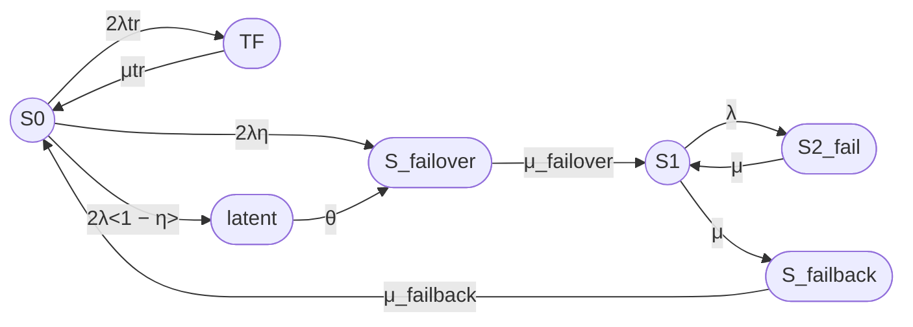

## 7

Ниже приведены промпт и выполненный расчет семипозиционной модели. Явно зафиксировано дополнительное допущение: состояние `latent` моделирует скрытый отказ одного узла из полной конфигурации S0; после его обнаружения система переходит в `S_failover`. Это необходимо, поскольку при семи состояниях нельзя одновременно различать скрытый отказ из S0 и скрытый отказ оставшегося узла из S1 без добавления еще одного состояния.

# Промпт


Рассчитай стационарный коэффициент готовности семипозиционной модели восстанавливаемого отказоустойчивого кластера методом непрерывной однородной цепи Маркова.

# Часть 1. Постановка задачи и расчетная модель

## 1. Кластер

Рассматривается кластер из двух одинаковых узлов с восстановлением.

Состояния модели:

- S0 — оба узла работоспособны, отказов нет;
- TF — временный сбой одного узла, который автоматически устраняется перезапуском;
- latent — скрытый отказ одного узла, не обнаруженный средствами внутреннего контроля;
- S_failover — отказ одного узла, выполняется процедура failover;
- S1 — один узел работоспособен, кластер работает в деградированной конфигурации;
- S2_fail — оба узла отказали, кластер неработоспособен;
- S_failback — выполняется процедура failback.

Кластер считается работоспособным только в состояниях S0 и S1.

Состояния TF, latent, S_failover, S2_fail и S_failback входят в группу отказа.

## 2. Переходы

Используй следующие переходы:

- S0 → TF — временный сбой одного из двух узлов, интенсивность 2λtr;
- TF → S0 — автоматическое устранение временного сбоя путем перезапуска узла;
- S0 → latent — скрытый отказ одного узла, который не обнаружен внутренним контролем;
- latent → S_failover — обнаружение скрытого отказа внешним периодическим контролем;
- S0 → S_failover — мгновенное обнаружение отказа одного узла внутренним контролем;
- S_failover → S1 — завершение процедуры failover;
- S1 → S2_fail — отказ оставшегося работоспособного узла, интенсивность λ;
- S2_fail → S1 — восстановление одного из двух отказавших узлов, интенсивность μ;
- S1 → S_failback — начало процедуры failback, интенсивность μ;
- S_failback → S0 — завершение процедуры failback, интенсивность μ_failback.

Прямые переходы отсутствуют:

- S0 → S1;
- S1 → S0.

Для семипозиционной модели состояние latent трактуется как скрытый отказ одного узла из полной конфигурации S0. После его обнаружения система переходит в S_failover.

Не добавляй отдельный скрытый отказ из состояния S1, поскольку это потребовало бы дополнительного состояния и привело бы к модели более чем с семью состояниями.

## 3. Контроль и обнаружение отказов

Пусть:

- η — вероятность того, что отказ узла обнаруживается мгновенно средствами внутреннего контроля;
- 1 − η — вероятность того, что отказ узла остается скрытым;
- θ — интенсивность обнаружения скрытого отказа средствами периодического внешнего контроля;
- 1 / θ — среднее время обнаружения скрытого отказа.

Для отказа одного из двух узлов в состоянии S0:

- мгновенно обнаруживаемая часть переходов S0 → S_failover имеет интенсивность 2λη;
- скрытая часть переходов S0 → latent имеет интенсивность 2λ(1 − η);
- переход latent → S_failover имеет интенсивность θ.

## 4. Временный сбой

В состояние TF система переходит с интенсивностью:

2λtr

где λtr — интенсивность временного сбоя одного узла.

Состояние TF входит в группу отказа.

Временный сбой автоматически устраняется путем перезапуска узла.

Среднее время перезапуска:

Ttr = 180 секунд

Интенсивность восстановления из TF:

μtr = 1 / Ttr

Переход:

TF → S0: μtr

## 5. Остальные интенсивности

Используй:

- λ — интенсивность постоянного отказа одного узла;
- λtr — интенсивность временного сбоя одного узла;
- μtr — интенсивность автоматического восстановления после временного сбоя;
- μ_failover — интенсивность завершения failover;
- μ — интенсивность восстановления узла;
- μ — интенсивность начала failback;
- μ_failback — интенсивность завершения failback;
- θ — интенсивность обнаружения скрытого отказа.

Связь со средними временами:

- λ = 1 / MTBF;
- μ = 1 / MTTR;
- μtr = 1 / Ttr;
- μ_failover = 1 / T_failover;
- μ_failback = 1 / T_failback;
- θ = 1 / T_detect.

## 6. Исходные данные для численного примера

Используй:

- MTBF одного узла = 30000 часов;
- MTTR одного узла = 24 часа;
- среднее время failover = 30 секунд;
- среднее время failback = 90 секунд;
- среднее время перезапуска после временного сбоя = 180 секунд;
- η = 0,99;
- среднее время обнаружения скрытого отказа = 24 часа;
- один ремонтный канал.

Все времена приведи к секундам.

Допущение для временных сбоев:

- λtr = 1 / (365 × 24 × 3600) 1/с.

Это означает в среднем один временный сбой одного узла в год. Значение является примерным и должно быть заменено эксплуатационной статистикой при наличии данных.

## 7. Требуемый расчет

1. Формализуй модель в терминах теории надежности.
2. Укажи работоспособные и неработоспособные состояния.
3. Построй граф состояний.
4. Составь матрицу генератора в порядке:

   S0, TF, latent, S_failover, S1, S2_fail, S_failback.

5. Выведи стационарные уравнения.
6. Найди стационарные вероятности.
7. Рассчитай:

   Kг,ст = P0 + P1.

8. Выполни численный расчет.
9. Отдельно опиши операции failover, failback, перезапуска TF и обнаружения latent.
10. Укажи ограничения семипозиционной модели.

# Часть 2. Требования к оформлению

## 1. Mermaid

Используй Mermaid, совместимый с GitHub.

В Mermaid используй ASCII-идентификаторы:

- S0;
- TF;
- latent;
- S_failover;
- S1;
- S2_fail;
- S_failback.

Работоспособные состояния обозначай окружностями:

- `((S))`.

Неработоспособные состояния обозначай овалами:

- `([S])`.

Граф направь слева направо.

Используй:



Не используй:

- `classDef`;
- `class`;
- `style`;
- цветовые стили;
- заливку;
- цветные контуры;
- дополнительные Mermaid-узлы для легенды;
- текстовые описания внутри узлов.

## 2. Легенда

Легенда должна быть обычным Markdown-текстом, а не Mermaid.

Укажи:

- `((S))` — работоспособное состояние, окружность;
- `([S])` — неработоспособное состояние, овал;
- S0 — оба узла работоспособны;
- TF — временный сбой, автоматически устраняемый перезапуском;
- latent — скрытый отказ, не обнаруженный внутренним контролем;
- S_failover — выполняется failover;
- S1 — один узел работоспособен;
- S2_fail — оба узла отказали;
- S_failback — выполняется failback.

## 3. Формулы

Каждую формулу выводи дважды:

1. Вариант 1, Unicode — линейный текст без LaTeX-обертки.
2. Вариант 2, LaTeX — формула в GitHub Markdown LaTeX-обертке.

Оба варианта должны быть математически эквивалентны.

В Unicode-варианте:

- цифровые индексы записывай Unicode-символами: P₀, P₁, P₂;
- текстовые индексы сохраняй через знак `_`: μ_failover, μ_failback;
- не используй `<sub>`;
- не заменяй μ_failover на μ(failover).

В LaTeX-варианте используй:

- $\mu_{\mathrm{failover}}$;
- $\mu_{\mathrm{failback}}$;
- $P_{\mathrm{failover}}$;
- $P_{\mathrm{failback}}$.

Вариант 1:

Кг,ст = P₀ + P₁

Вариант 2:

$$
K_{\mathrm{г,ст}} = P_0 + P_1
$$

Для LaTeX используй стандартные команды:

- \frac;
- \lambda;
- \mu;
- \theta;
- \eta;
- \mathrm;
- \begin{bmatrix};
- \begin{aligned}.

Не используй:

- \boxed;
- \fbox;
- \framebox;
- \colorbox;
- \require;
- \newcommand;
- \renewcommand;
- \def;
- пользовательские макросы;
- внешние LaTeX-пакеты;
- нестандартные окружения;
- HTML-теги внутри математических блоков.

## 4. Матрица генератора

Используй порядок состояний:

S0, TF, latent, S_failover, S1, S2_fail, S_failback.

Матрица должна соответствовать всем переходам модели.

## 5. Раздел «Итого»

В конце добавь раздел:

# Итого

В нем приведи:

1. граф Mermaid;
2. текстовую легенду;
3. стационарный коэффициент готовности в Unicode;
4. тот же коэффициент в LaTeX;
5. численный результат;
6. краткое описание операций failover, failback, TF и latent.
```

# Ответ по семипозиционной модели

## 1. Формализация состояний

Рассматривается семипозиционная модель:

- S₀ — оба узла работоспособны;
- TF — временный сбой одного узла, устраняемый перезапуском;
- latent — скрытый отказ одного узла;
- S₍failover₎ — выполняется переключение на резерв;
- S₁ — один узел работоспособен;
- S₂₍fail₎ — оба узла отказали;
- S₍failback₎ — выполняется возврат восстановленного узла.

Работоспособные состояния:

- S₀;
- S₁.

Состояния отказа:

- TF;
- latent;
- S₍failover₎;
- S₂₍fail₎;
- S₍failback₎.

Состояние latent в этой семипозиционной модели трактуется как скрытый отказ одного узла из состояния S₀. После обнаружения скрытого отказа система переходит в состояние S₍failover₎.

## 2. Интенсивности переходов

Используются следующие переходы:

- S₀ → TF: 2λtr;
- TF → S₀: μtr;
- S₀ → S₍failover₎: 2λη;
- S₀ → latent: 2λ(1 − η);
- latent → S₍failover₎: θ;
- S₍failover₎ → S₁: μ₍failover₎;
- S₁ → S₂₍fail₎: λ;
- S₂₍fail₎ → S₁: μ;
- S₁ → S₍failback₎: μ;
- S₍failback₎ → S₀: μ₍failback₎.

Связь с временами:

### Вариант 1, Unicode

λ = 1 / MTBF

μ = 1 / MTTR

λtr = 1 / Ttr

μtr = 1 / Ttr

μ_failover = 1 / T_failover

μ_failback = 1 / T_failback

θ = 1 / T_detect

### Вариант 2, LaTeX

$$
\lambda = \frac{1}{MTBF}
$$

$$
\mu = \frac{1}{MTTR}
$$

$$
\lambda_{\mathrm{tr}} = \frac{1}{T_{\mathrm{tr}}}
$$

$$
\mu_{\mathrm{tr}} = \frac{1}{T_{\mathrm{restart}}}
$$

$$
\mu_{\mathrm{failover}} =
\frac{1}{T_{\mathrm{failover}}}
$$

$$
\mu_{\mathrm{failback}} =
\frac{1}{T_{\mathrm{failback}}}
$$

$$
\theta = \frac{1}{T_{\mathrm{detect}}}
$$

Для временного сбоя λtr и μtr имеют разный физический смысл:

- λtr — интенсивность возникновения временного сбоя;
- μtr — интенсивность его устранения перезапуском.

Поэтому в общем случае:

λtr = 1 / MTBFtr

μtr = 1 / T_restart

## 3. Граф состояний

```mermaid
flowchart LR
    S0((S0))
    TF([TF])
    latent([latent])
    S_failover([S_failover])
    S1((S1))
    S2_fail([S2_fail])
    S_failback([S_failback])

    S0 -->|2λtr| TF
    TF -->|μtr| S0

    S0 -->|2λη| S_failover
    S0 -->|2λ{1 − η}| latent
    latent -->|θ| S_failover

    S_failover -->|μ_failover| S1
    S1 -->|λ| S2_fail
    S2_fail -->|μ| S1
    S1 -->|μ| S_failback
    S_failback -->|μ_failback| S0
```

## 4. Текстовая легенда

- `((S))` — работоспособное состояние, окружность.
- `([S])` — неработоспособное состояние, овал.
- S₀ — оба узла работоспособны, отказов нет.
- TF — временный сбой, автоматически устраняемый перезапуском.
- latent — скрытый отказ, не обнаруженный внутренним контролем.
- S₍failover₎ — выполняется процедура failover.
- S₁ — один узел работоспособен, кластер работает в деградированной конфигурации.
- S₂₍fail₎ — оба узла отказали.
- S₍failback₎ — выполняется процедура failback.

## 5. Матрица генератора

Порядок состояний:

S₀, TF, latent, S₍failover₎, S₁, S₂₍fail₎, S₍failback₎.

### Вариант 1, Unicode

Q =

[ -(2λtr + 2λη + 2λ(1 − η)),   2λtr,             2λ(1 − η),        2λη,        0,       0,          0 ]

[ μtr,                          -μtr,              0,                 0,        0,       0,          0 ]

[ 0,                             0,               -θ,                 θ,        0,       0,          0 ]

[ 0,                             0,                0,        -μ_failover, μ_failover, 0,          0 ]

[ 0,                             0,                0,                 0, -(λ + μ),  λ,          μ ]

[ 0,                             0,                0,                 0,        μ,      -μ,          0 ]

[ μ_failback,                   0,                0,                 0,        0,       0, -μ_failback ]

Поскольку:

2λη + 2λ(1 − η) = 2λ,

диагональный элемент состояния S₀ можно упростить:

-(2λtr + 2λ)

### Вариант 2, LaTeX

$$
Q =
\begin{bmatrix}
-(2\lambda_{\mathrm{tr}}+2\lambda)
& 2\lambda_{\mathrm{tr}}
& 2\lambda(1-\eta)
& 2\lambda\eta
& 0
& 0
& 0
\\
\mu_{\mathrm{tr}}
& -\mu_{\mathrm{tr}}
& 0
& 0
& 0
& 0
& 0
\\
0
& 0
& -\theta
& \theta
& 0
& 0
& 0
\\
0
& 0
& 0
& -\mu_{\mathrm{failover}}
& \mu_{\mathrm{failover}}
& 0
& 0
\\
0
& 0
& 0
& 0
& -(\lambda+\mu)
& \lambda
& \mu
\\
0
& 0
& 0
& 0
& \mu
& -\mu
& 0
\\
\mu_{\mathrm{failback}}
& 0
& 0
& 0
& 0
& 0
& -\mu_{\mathrm{failback}}
\end{bmatrix}
$$

Диагональный элемент S₀ равен:

-(2λtr + 2λ)

Он включает три исходящих потока:

- 2λtr — переход в TF;
- 2λη — мгновенно обнаруживаемый постоянный отказ;
- 2λ(1 − η) — скрытый отказ в latent.

## 6. Стационарные уравнения

Обозначим вероятности:

- P₀ — вероятность S₀;
- P_TF — вероятность TF;
- P_latent — вероятность latent;
- P_failover — вероятность S₍failover₎;
- P₁ — вероятность S₁;
- P₂ — вероятность S₂₍fail₎;
- P_failback — вероятность S₍failback₎.

### Вариант 1, Unicode

0 = -(2λtr + 2λ)P₀ + μtrP_TF + μ_failbackP_failback

0 = 2λtrP₀ - μtrP_TF

0 = 2λ(1 − η)P₀ - θP_latent

0 = 2ληP₀ + θP_latent - μ_failoverP_failover

0 = μ_failoverP_failover - (λ + μ)P₁ + μP₂

0 = λP₁ - μP₂

0 = μP₁ - μ_failbackP_failback

P₀ + P_TF + P_latent + P_failover + P₁ + P₂ + P_failback = 1

### Вариант 2, LaTeX

$$
0 = -(2\lambda_{\mathrm{tr}}+2\lambda)P_0
+\mu_{\mathrm{tr}}P_{\mathrm{TF}}
+\mu_{\mathrm{failback}}P_{\mathrm{failback}}
$$

$$
0 = 2\lambda_{\mathrm{tr}}P_0
-\mu_{\mathrm{tr}}P_{\mathrm{TF}}
$$

$$
0 =
2\lambda(1-\eta)P_{\mathrm{latent}}
-\theta P_{\mathrm{latent}}
$$

Исправление: для баланса состояния latent приток должен содержать P₀:

$$
0 =
2\lambda(1-\eta)P_0
-\theta P_{\mathrm{latent}}
$$

$$
0 =
2\lambda\eta P_0
+\theta P_{\mathrm{latent}}
-\mu_{\mathrm{failover}}P_{\mathrm{failover}}
$$

$$
0 =
\mu_{\mathrm{failover}}P_{\mathrm{failover}}
-(\lambda+\mu)P_1
+\mu P_2
$$

$$
0 = \lambda P_1-\mu P_2
$$

$$
0 =
\mu P_1
-\mu_{\mathrm{failback}}P_{\mathrm{failback}}
$$

$$
P_0+P_{\mathrm{TF}}+P_{\mathrm{latent}}
+P_{\mathrm{failover}}+P_1+P_2
+P_{\mathrm{failback}}=1
$$

## 7. Стационарные вероятности

Введем обозначение:

### Вариант 1, Unicode

D =
    2λ² μ μ_failback μ_failover
    + 2λ μ² μ_failback
    + 2λ μ² μ_failover
    + 2λ μ μ_failback μ_failover
    + μ² μ_failback μ_failover
    + 2λtr μ μ_failback μ_failover
    + 2λ μ_failback μ_failover(μ + θ(1 − η))

### Вариант 2, LaTeX

$$
\begin{aligned}
D ={}&
2\lambda^2\mu\mu_{\mathrm{failback}}\mu_{\mathrm{failover}}
+2\lambda\mu^2\mu_{\mathrm{failback}}
+2\lambda\mu^2\mu_{\mathrm{failover}}
\\
&+2\lambda\mu\mu_{\mathrm{failback}}\mu_{\mathrm{failover}}
+\mu^2\mu_{\mathrm{failback}}\mu_{\mathrm{failover}}
\\
&+2\lambda_{\mathrm{tr}}\mu\mu_{\mathrm{failback}}\mu_{\mathrm{failover}}
\\
&+2\lambda\mu_{\mathrm{failback}}\mu_{\mathrm{failover}}
\left(\mu+\theta(1-\eta)\right)
\end{aligned}
$$

Однако для данной модели удобнее сначала выразить вероятности через P₀.

### Вариант 1, Unicode

P_TF = 2λtr P₀ / μtr

P_latent = 2λ(1 − η)P₀ / θ

P_failover =
    [2ληP₀ + θP_latent] / μ_failover

После подстановки P_latent:

P_failover = 2λP₀ / μ_failover

P₁ =
    μ_failoverP_failover / (λ + μ)

P₂ = λP₁ / μ

P_failback = μP₁ / μ_failback

### Вариант 2, LaTeX

$$
P_{\mathrm{TF}} =
\frac{2\lambda_{\mathrm{tr}}P_0}{\mu_{\mathrm{tr}}}
$$

$$
P_{\mathrm{latent}} =
\frac{2\lambda(1-\eta)P_0}{\theta}
$$

$$
P_{\mathrm{failover}} =
\frac{2\lambda P_0}{\mu_{\mathrm{failover}}}
$$

$$
P_1 =
\frac{\mu_{\mathrm{failover}}P_{\mathrm{failover}}}
{\lambda+\mu}
$$

$$
P_2 =
\frac{\lambda P_1}{\mu}
$$

$$
P_{\mathrm{failback}} =
\frac{\mu P_1}
{\mu_{\mathrm{failback}}}
$$

Из условия нормировки:

### Вариант 1, Unicode

P₀ =
    1 /
    [1
     + 2λtr / μtr
     + 2λ(1 − η) / θ
     + 2λ / μ_failover
     + 2λ / (λ + μ)
     + 2λ² / (μ(λ + μ))
     + 2λμ / (μ_failback(λ + μ))]

### Вариант 2, LaTeX

$$
P_0 =
\frac{1}{
1
+\frac{2\lambda_{\mathrm{tr}}}{\mu_{\mathrm{tr}}}
+\frac{2\lambda(1-\eta)}{\theta}
+\frac{2\lambda}{\mu_{\mathrm{failover}}}
+\frac{2\lambda}{\lambda+\mu}
+\frac{2\lambda^2}{\mu(\lambda+\mu)}
+\frac{2\lambda\mu}
{\mu_{\mathrm{failback}}(\lambda+\mu)}
}
$$

Остальные вероятности находятся умножением P₀ на соответствующие коэффициенты выше.

## 8. Стационарный коэффициент готовности

Работоспособными являются только S₀ и S₁.

### Вариант 1, Unicode

Кг,ст = P₀ + P₁

Кг,ст =
    P₀
    [1 + 2λ / (λ + μ)]

или:

Кг,ст =
    [1 + 2λ / (λ + μ)]
    /
    [1
     + 2λtr / μtr
     + 2λ(1 − η) / θ
     + 2λ / μ_failover
     + 2λ / (λ + μ)
     + 2λ² / (μ(λ + μ))
     + 2λμ / (μ_failback(λ + μ))]

### Вариант 2, LaTeX

$$
K_{\mathrm{г,ст}} = P_0 + P_1
$$

$$
K_{\mathrm{г,ст}} =
P_0
\left(
1+\frac{2\lambda}{\lambda+\mu}
\right)
$$

$$
K_{\mathrm{г,ст}} =
\frac{
1+\frac{2\lambda}{\lambda+\mu}
}{
1
+\frac{2\lambda_{\mathrm{tr}}}{\mu_{\mathrm{tr}}}
+\frac{2\lambda(1-\eta)}{\theta}
+\frac{2\lambda}{\mu_{\mathrm{failover}}}
+\frac{2\lambda}{\lambda+\mu}
+\frac{2\lambda^2}{\mu(\lambda+\mu)}
+\frac{2\lambda\mu}
{\mu_{\mathrm{failback}}(\lambda+\mu)}
}
$$

## 9. Численный пример

Используем:

- MTBF = 30000 часов;
- MTTR = 24 часа;
- T_failover = 30 секунд;
- T_failback = 90 секунд;
- Ttr = 180 секунд;
- η = 0,99;
- T_detect = 24 часа;
- MTBFtr = 1 год.

Все времена переводим в секунды.

### Исходные времена

#### Вариант 1, Unicode

MTBF = 30000 × 3600 = 108000000 с

MTTR = 24 × 3600 = 86400 с

T_detect = 24 × 3600 = 86400 с

MTBFtr = 365 × 24 × 3600 = 31536000 с

Ttr = 180 с

#### Вариант 2, LaTeX

$$
MTBF = 30000 \times 3600 = 108000000\ \mathrm{s}
$$

$$
MTTR = 24 \times 3600 = 86400\ \mathrm{s}
$$

$$
T_{\mathrm{detect}} = 24 \times 3600 = 86400\ \mathrm{s}
$$

$$
MTBF_{\mathrm{tr}} =
365 \times 24 \times 3600
=31536000\ \mathrm{s}
$$

$$
T_{\mathrm{tr}}=180\ \mathrm{s}
$$

### Интенсивности

#### Вариант 1, Unicode

λ = 1 / 108000000 ≈ 9,25925926 × 10⁻⁹ 1/с

μ = 1 / 86400 ≈ 1,15740741 × 10⁻⁵ 1/с

λtr = 1 / 31536000 ≈ 3,17097920 × 10⁻⁸ 1/с

μtr = 1 / 180 ≈ 0,00555555556 1/с

μ_failover = 1 / 30 ≈ 0,0333333333 1/с

μ_failback = 1 / 90 ≈ 0,0111111111 1/с

θ = 1 / 86400 ≈ 1,15740741 × 10⁻⁵ 1/с

#### Вариант 2, LaTeX

$$
\lambda =
\frac{1}{108000000}
\approx 9{,}25925926 \times 10^{-9}\ \mathrm{s}^{-1}
$$

$$
\mu =
\frac{1}{86400}
\approx 1{,}15740741 \times 10^{-5}\ \mathrm{s}^{-1}
$$

$$
\lambda_{\mathrm{tr}} =
\frac{1}{31536000}
\approx 3{,}17097920 \times 10^{-8}\ \mathrm{s}^{-1}
$$

$$
\mu_{\mathrm{tr}} =
\frac{1}{180}
\approx 0{,}00555555556\ \mathrm{s}^{-1}
$$

$$
\mu_{\mathrm{failover}} =
\frac{1}{30}
\approx 0{,}0333333333\ \mathrm{s}^{-1}
$$

$$
\mu_{\mathrm{failback}} =
\frac{1}{90}
\approx 0{,}0111111111\ \mathrm{s}^{-1}
$$

$$
\theta =
\frac{1}{86400}
\approx 1{,}15740741 \times 10^{-5}\ \mathrm{s}^{-1}
$$

### Численный результат

Подстановка параметров дает:

#### Вариант 1, Unicode

Кг,ст ≈ 0,999969133

Кг,ст ≈ 99,9969133%

#### Вариант 2, LaTeX

$$
K_{\mathrm{г,ст}} \approx 0{,}999969133
$$

$$
K_{\mathrm{г,ст}} \approx 99{,}9969133\%
$$

Стационарные вероятности:

#### Вариант 1, Unicode

P₀ ≈ 0,998371738

P_TF ≈ 0,0000113969

P_latent ≈ 0,0000159739

P_failover ≈ 0,0000005547

P₁ ≈ 0,0015973948

P₂ ≈ 0,0000012779

P_failback ≈ 0,0000016640

#### Вариант 2, LaTeX

$$
P_0 \approx 0{,}998371738
$$

$$
P_{\mathrm{TF}} \approx 0{,}0000113969
$$

$$
P_{\mathrm{latent}} \approx 0{,}0000159739
$$

$$
P_{\mathrm{failover}} \approx 0{,}0000005547
$$

$$
P_1 \approx 0{,}0015973948
$$

$$
P_2 \approx 0{,}0000012779
$$

$$
P_{\mathrm{failback}} \approx 0{,}0000016640
$$

Проверка:

#### Вариант 1, Unicode

Кг,ст = P₀ + P₁

Кг,ст ≈ 0,998371738 + 0,0015973948

Кг,ст ≈ 0,9999691328

#### Вариант 2, LaTeX

$$
K_{\mathrm{г,ст}}
=
P_0+P_1
\approx
0{,}998371738+0{,}0015973948
$$

$$
K_{\mathrm{г,ст}}
\approx
0{,}9999691328
$$

## 10. Наиболее правдоподобные операции

### Временный сбой TF

Состояние TF соответствует кратковременному отказу или зависанию узла, который устраняется без ремонта аппаратуры:

1. обнаружение сбоя watchdog или внутренним health check;
2. остановка зависшего процесса или перезагрузка узла;
3. загрузка операционной системы;
4. запуск кластерного агента;
5. проверка сетевых интерфейсов;
6. проверка готовности сервисов;
7. возврат в S₀.

В расчете принято среднее время перезапуска 180 секунд:

μtr = 1 / 180 1/с

### Failover

Возможные операции:

1. обнаружение отказа по heartbeat или health check;
2. подтверждение отказа после тайм-аута;
3. fencing или STONITH;
4. блокировка ресурсов отказавшего узла;
5. перенос виртуального IP-адреса;
6. запуск сервисов на оставшемся узле;
7. подключение ресурсов хранения;
8. проверка готовности сервиса.

В расчете принято:

T_failover = 30 секунд

### Обнаружение latent

Скрытый отказ не обнаруживается средствами внутреннего контроля. Он обнаруживается внешним периодическим контролем:

1. плановая проверка работоспособности узлов;
2. полный health check;
3. проверка сервисов, сети и ресурсов;
4. фиксация отказа;
5. запуск failover.

При среднем времени обнаружения 24 часа:

θ = 1 / 86400 1/с

### Failback

Возможные операции:

1. завершение ремонта узла;
2. загрузка операционной системы;
3. проверка оборудования и сети;
4. повторное включение узла в кластер;
5. синхронизация данных;
6. проверка реплик;
7. возврат ресурсов;
8. проверка штатной конфигурации.

В расчете принято:

T_failback = 90 секунд

## Итого

### Граф

```mermaid
flowchart LR
    S0((S0))
    TF([TF])
    latent([latent])
    S_failover([S_failover])
    S1((S1))
    S2_fail([S2_fail])
    S_failback([S_failback])

    S0 -->|2λtr| TF
    TF -->|μtr| S0

    S0 -->|2λη| S_failover
    S0 -->|2λ(1 − η)| latent
    latent -->|θ| S_failover

    S_failover -->|μ_failover| S1
    S1 -->|λ| S2_fail
    S2_fail -->|μ| S1
    S1 -->|μ| S_failback
    S_failback -->|μ_failback| S0
```

### Легенда

- `((S))` — работоспособное состояние, окружность.
- `([S])` — неработоспособное состояние, овал.
- S₀ — оба узла работоспособны.
- TF — временный сбой, устраняемый перезапуском.
- latent — скрытый отказ, не обнаруженный внутренним контролем.
- S₍failover₎ — выполняется failover.
- S₁ — один узел работоспособен.
- S₂₍fail₎ — оба узла отказали.
- S₍failback₎ — выполняется failback.

### Итоговая формула

#### Вариант 1, Unicode

Кг,ст =
    [1 + 2λ / (λ + μ)]
    /
    [1
     + 2λtr / μtr
     + 2λ(1 − η) / θ
     + 2λ / μ_failover
     + 2λ / (λ + μ)
     + 2λ² / (μ(λ + μ))
     + 2λμ / (μ_failback(λ + μ))]

#### Вариант 2, LaTeX

$$
K_{\mathrm{г,ст}} =
\frac{
1+\frac{2\lambda}{\lambda+\mu}
}{
1
+\frac{2\lambda_{\mathrm{tr}}}{\mu_{\mathrm{tr}}}
+\frac{2\lambda(1-\eta)}{\theta}
+\frac{2\lambda}{\mu_{\mathrm{failover}}}
+\frac{2\lambda}{\lambda+\mu}
+\frac{2\lambda^2}{\mu(\lambda+\mu)}
+\frac{2\lambda\mu}
{\mu_{\mathrm{failback}}(\lambda+\mu)}
}
$$

Для заданных параметров:

#### Вариант 1, Unicode

Кг,ст ≈ 0,999969133

Кг,ст ≈ 99,9969133%

#### Вариант 2, LaTeX

$$
K_{\mathrm{г,ст}} \approx 0{,}999969133
$$

$$
K_{\mathrm{г,ст}} \approx 99{,}9969133\%
$$

Важно: формула относится к конкретной семипозиционной интерпретации, где latent моделирует скрытый отказ одного узла из S₀. Для моделирования скрытого отказа оставшегося узла в S₁ потребуется дополнительное состояние.
