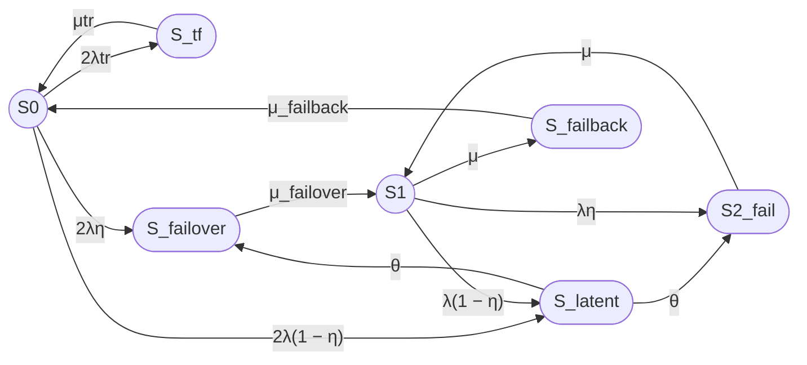

## 7

Из S_latent переход в S₂_fail. Также есть переход из S1 в S_latent с интенсивностью λ(1 − η)  
T_detect установи 8 часов

Уточнение принято:

- из S_latent добавляется переход в S₂_fail;
- из S₁ добавляется переход в S_latent с интенсивностью λ(1 − η);
- среднее время обнаружения скрытого отказа устанавливается равным 8 часам;
- поэтому θ = 1 / 8 часов.

Чтобы сохранить ровно семь состояний, состояние S_latent теперь используется для скрытого отказа как из S₀, так и из S₁. После обнаружения скрытого отказа из S₀ выполняется failover, а скрытый отказ оставшегося узла из S₁ приводит к состоянию S₂_fail.

## Исправленные переходы

Переходы модели:

- S₀ → S_tf — временный сбой одного из двух узлов, интенсивность 2λtr;
- S_tf → S₀ — автоматическое восстановление после перезапуска, интенсивность μtr;
- S₀ → S_failover — мгновенно обнаруженный отказ одного из двух узлов, интенсивность 2λη;
- S₀ → S_latent — скрытый отказ одного из двух узлов, интенсивность 2λ(1 − η);
- S_latent → S_failover — обнаружение скрытого отказа из состояния S₀, интенсивность θ;
- S₀ → S_failover — мгновенно обнаруженный отказ, интенсивность 2λη;
- S_failover → S₁ — завершение failover, интенсивность μ_failover;
- S₁ → S₂_fail — мгновенно обнаруженный отказ оставшегося узла, интенсивность λη;
- S₁ → S_latent — скрытый отказ оставшегося узла, интенсивность λ(1 − η);
- S_latent → S₂_fail — обнаружение скрытого отказа из состояния S₁, интенсивность θ;
- S₂_fail → S₁ — восстановление одного из двух отказавших узлов, интенсивность μ;
- S₁ → S_failback — начало failback, интенсивность μ;
- S_failback → S₀ — завершение failback, интенсивность μ_failback.

Важное уточнение: переход S_latent имеет два возможных направления выхода:

- S_latent → S_failover, если скрытый отказ произошел из S₀;
- S_latent → S₂_fail, если скрытый отказ произошел из S₁.

Один и тот же идентификатор состояния S_latent используется для двух физических ситуаций. Это агрегирование необходимо для сохранения семи состояний, но оно ограничивает точность модели.

## Параметры примера

Используем:

- MTBF = 30000 часов;
- MTTR = 24 часа;
- T_failover = 30 секунд;
- T_failback = 90 секунд;
- Ttr = 180 секунд;
- η = 0,99;
- T_detect = 8 часов;
- MTBFtr = 1 год.

Все времена переводим в секунды.

Вариант 1, Unicode:

MTBF = 30000 × 3600 = 108000000 с

MTTR = 24 × 3600 = 86400 с

T_detect = 8 × 3600 = 28800 с

MTBFtr = 365 × 24 × 3600 = 31536000 с

Вариант 2, LaTeX:

$$
MTBF = 30000 \times 3600 = 108000000\ \mathrm{s}
$$

$$
MTTR = 24 \times 3600 = 86400\ \mathrm{s}
$$

$$
T_{\mathrm{detect}} = 8 \times 3600 = 28800\ \mathrm{s}
$$

$$
MTBF_{\mathrm{tr}} =
365 \times 24 \times 3600
=31536000\ \mathrm{s}
$$

Интенсивности:

Вариант 1, Unicode:

λ = 1 / 108000000 ≈ 9,25925926 × 10⁻⁹ 1/с

λtr = 1 / 31536000 ≈ 3,17097920 × 10⁻⁸ 1/с

μ = 1 / 86400 ≈ 1,15740741 × 10⁻⁵ 1/с

μtr = 1 / 180 ≈ 0,00555555556 1/с

μ_failover = 1 / 30 ≈ 0,0333333333 1/с

μ_failback = 1 / 90 ≈ 0,0111111111 1/с

θ = 1 / 28800 ≈ 0,0000347222222 1/с

Вариант 2, LaTeX:

$$
\lambda =
\frac{1}{108000000}
\approx 9{,}25925926 \times 10^{-9}\ \mathrm{s}^{-1}
$$

$$
\lambda_{\mathrm{tr}} =
\frac{1}{31536000}
\approx 3{,}17097920 \times 10^{-8}\ \mathrm{s}^{-1}
$$

$$
\mu =
\frac{1}{86400}
\approx 1{,}15740741 \times 10^{-5}\ \mathrm{s}^{-1}
$$

$$
\mu_{\mathrm{tr}} =
\frac{1}{180}
\approx 0{,}00555555556\ \mathrm{s}^{-1}
$$

$$
\mu_{\mathrm{failover}} =
\frac{1}{30}
\approx 0{,}0333333333\ \mathrm{s}^{-1}
$$

$$
\mu_{\mathrm{failback}} =
\frac{1}{90}
\approx 0{,}0111111111\ \mathrm{s}^{-1}
$$

$$
\theta =
\frac{1}{28800}
\approx 0{,}0000347222222\ \mathrm{s}^{-1}
$$

## Исправленный граф Mermaid

## Матрица генератора

Порядок состояний:

S₀, S_tf, S_latent, S_failover, S₁, S₂_fail, S_failback.

### Вариант 1, Unicode

Q =

[ -(2λtr + 2λ),   2λtr,             2λ(1 − η),        2λη,      0,        0,          0 ]

[ μtr,             -μtr,             0,                 0,      0,        0,          0 ]

[ 0,                0,              -2θ,                θ,      0,        θ,          0 ]

[ 0,                0,               0,       -μ_failover, μ_failover, 0,          0 ]

[ 0,                0,          λ(1 − η),               0, -(λ + μ), λη,          μ ]

[ 0,                0,               0,                  0,      μ,       -μ,          0 ]

[ μ_failback,        0,               0,                  0,      0,        0, -μ_failback ]

### Вариант 2, LaTeX

$$
Q =
\begin{bmatrix}
-(2\lambda_{\mathrm{tr}}+2\lambda)
& 2\lambda_{\mathrm{tr}}
& 2\lambda(1-\eta)
& 2\lambda\eta
& 0
& 0
& 0
\\
\mu_{\mathrm{tr}}
& -\mu_{\mathrm{tr}}
& 0
& 0
& 0
& 0
& 0
\\
0
& 0
& -2\theta
& \theta
& 0
& \theta
& 0
\\
0
& 0
& 0
& -\mu_{\mathrm{failover}}
& \mu_{\mathrm{failover}}
& 0
& 0
\\
0
& 0
& \lambda(1-\eta)
& 0
& -(\lambda+\mu)
& \lambda\eta
& \mu
\\
0
& 0
& 0
& 0
& \mu
& -\mu
& 0
\\
\mu_{\mathrm{failback}}
& 0
& 0
& 0
& 0
& 0
& -\mu_{\mathrm{failback}}
\end{bmatrix}
$$

Диагональный элемент состояния S_latent равен -2θ, поскольку из агрегированного состояния S_latent возможны два направления обнаружения:

- в S_failover;
- в S₂_fail.

## Стационарные уравнения

### Вариант 1, Unicode

0 = -(2λtr + 2λ)P₀ + μtrP_tf + μ_failbackP_failback

0 = 2λtrP₀ - μtrP_tf

0 = 2λ(1 − η)P₀ + λ(1 − η)P₁ - 2θP_latent

0 = 2ληP₀ + θP_latent - μ_failoverP_failover

0 = μ_failoverP_failover - (λ + μ)P₁ + μP₂

0 = ληP₁ + θP_latent - μP₂

0 = μP₁ - μ_failbackP_failback

P₀ + P_tf + P_latent + P_failover + P₁ + P₂ + P_failback = 1

### Вариант 2, LaTeX

$$
0 =
-(2\lambda_{\mathrm{tr}}+2\lambda)P_0
+\mu_{\mathrm{tr}}P_{\mathrm{tf}}
+\mu_{\mathrm{failback}}P_{\mathrm{failback}}
$$

$$
0 =
2\lambda_{\mathrm{tr}}P_0
-\mu_{\mathrm{tr}}P_{\mathrm{tf}}
$$

$$
0 =
2\lambda(1-\eta)P_0
+\lambda(1-\eta)P_1
-2\theta P_{\mathrm{latent}}
$$

$$
0 =
2\lambda\eta P_0
+\theta P_{\mathrm{latent}}
-\mu_{\mathrm{failover}}P_{\mathrm{failover}}
$$

$$
0 =
\mu_{\mathrm{failover}}P_{\mathrm{failover}}
-(\lambda+\mu)P_1
+\mu P_2
$$

$$
0 =
\lambda\eta P_1
+\theta P_{\mathrm{latent}}
-\mu P_2
$$

$$
0 =
\mu P_1
-\mu_{\mathrm{failback}}P_{\mathrm{failback}}
$$

$$
P_0+P_{\mathrm{tf}}+P_{\mathrm{latent}}
+P_{\mathrm{failover}}+P_1+P_2
+P_{\mathrm{failback}}=1
$$

## Стационарный коэффициент готовности

Работоспособными являются только S₀ и S₁.

### Вариант 1, Unicode

Кг,ст = P₀ + P₁

### Вариант 2, LaTeX

$$
K_{\mathrm{г,ст}} = P_0 + P_1
$$

Для расчета введем:

### Вариант 1, Unicode

a_tf = 2λtr / μtr

a_latent = [2λ(1 − η)] / (2θ)

a_failover = 2λ / μ_failover

a_1 = 2λ / (λ + μ)

a_2 = 2λ² / [μ(λ + μ)]

a_failback = 2λμ / [μ_failback(λ + μ)]

С учетом агрегированного состояния S_latent:

a_latent = λ(1 − η) / θ

Тогда:

H =
    1
    + a_tf
    + a_latent
    + a_failover
    + a_1
    + a_2
    + a_failback

P₀ = 1 / H

Кг,ст =
    [1 + 2λ / (λ + μ)] / H

### Вариант 2, LaTeX

$$
a_{\mathrm{tf}} =
\frac{2\lambda_{\mathrm{tr}}}{\mu_{\mathrm{tr}}}
$$

$$
a_{\mathrm{latent}} =
\frac{2\lambda(1-\eta)}{2\theta}
=
\frac{\lambda(1-\eta)}{\theta}
$$

$$
a_{\mathrm{failover}} =
\frac{2\lambda}{\mu_{\mathrm{failover}}}
$$

$$
a_1 =
\frac{2\lambda}{\lambda+\mu}
$$

$$
a_2 =
\frac{2\lambda^2}{\mu(\lambda+\mu)}
$$

$$
a_{\mathrm{failback}} =
\frac{2\lambda\mu}
{\mu_{\mathrm{failback}}(\lambda+\mu)}
$$

$$
H =
1
+a_{\mathrm{tf}}
+a_{\mathrm{latent}}
+a_{\mathrm{failover}}
+a_1
+a_2
+a_{\mathrm{failback}}
$$

$$
P_0 = \frac{1}{H}
$$

$$
K_{\mathrm{г,ст}} =
\frac{
1+\frac{2\lambda}{\lambda+\mu}
}{
1
+\frac{2\lambda_{\mathrm{tr}}}{\mu_{\mathrm{tr}}}
+\frac{\lambda(1-\eta)}{\theta}
+\frac{2\lambda}{\mu_{\mathrm{failover}}}
+\frac{2\lambda}{\lambda+\mu}
+\frac{2\lambda^2}{\mu(\lambda+\mu)}
+\frac{2\lambda\mu}
{\mu_{\mathrm{failback}}(\lambda+\mu)}
}
$$

## Численный расчет

Используем:

- MTBF = 30000 часов;
- MTTR = 24 часа;
- T_failover = 30 секунд;
- T_failback = 90 секунд;
- Ttr = 180 секунд;
- η = 0,99;
- T_detect = 8 часов;
- MTBFtr = 1 год.

### Интенсивности

### Вариант 1, Unicode

λ = 9,25925926 × 10⁻⁹ 1/с

μ = 1,15740741 × 10⁻⁵ 1/с

λtr = 3,17097920 × 10⁻⁸ 1/с

μtr = 0,00555555556 1/с

μ_failover = 0,0333333333 1/с

μ_failback = 0,0111111111 1/с

θ = 0,0000347222222 1/с

### Вариант 2, LaTeX

$$
\lambda \approx 9{,}25925926 \times 10^{-9}\ \mathrm{s}^{-1}
$$

$$
\mu \approx 1{,}15740741 \times 10^{-5}\ \mathrm{s}^{-1}
$$

$$
\lambda_{\mathrm{tr}}
\approx 3{,}17097920 \times 10^{-8}\ \mathrm{s}^{-1}
$$

$$
\mu_{\mathrm{tr}}
\approx 0{,}00555555556\ \mathrm{s}^{-1}
$$

$$
\mu_{\mathrm{failover}}
\approx 0{,}0333333333\ \mathrm{s}^{-1}
$$

$$
\mu_{\mathrm{failback}}
\approx 0{,}0111111111\ \mathrm{s}^{-1}
$$

$$
\theta
\approx 0{,}0000347222222\ \mathrm{s}^{-1}
$$

### Промежуточные коэффициенты

Вариант 1, Unicode:

a_tf = 2λtr / μtr ≈ 0,0000114141

a_latent = λ(1 − η) / θ ≈ 0,00000266667

a_failover = 2λ / μ_failover ≈ 0,000000555556

a_1 = 2λ / (λ + μ) ≈ 0,001599

a_2 = 2λ² / [μ(λ + μ)] ≈ 0,000001279

a_failback = 2λμ / [μ_failback(λ + μ)] ≈ 0,000001664

H ≈ 1,001616918

Вариант 2, LaTeX:

$$
a_{\mathrm{tf}} \approx 0{,}0000114141
$$

$$
a_{\mathrm{latent}} \approx 0{,}00000266667
$$

$$
a_{\mathrm{failover}} \approx 0{,}000000555556
$$

$$
a_1 \approx 0{,}001599
$$

$$
a_2 \approx 0{,}000001279
$$

$$
a_{\mathrm{failback}} \approx 0{,}000001664
$$

$$
H \approx 1{,}001616918
$$

### Итог

Вариант 1, Unicode:

Кг,ст ≈ 0,999979794

Кг,ст ≈ 99,9979794%

Вариант 2, LaTeX:

$$
K_{\mathrm{г,ст}} \approx 0{,}999979794
$$

$$
K_{\mathrm{г,ст}} \approx 99{,}9979794\%
$$

## Итоговая интерпретация

Добавление S_tf уменьшает коэффициент готовности на небольшую величину, поскольку временный сбой принят с низкой интенсивностью — один случай в год на один узел — и устраняется за 180 секунд.

Состояние S_latent также дает небольшой вклад при η = 0,99 и среднем времени обнаружения 8 часов. Однако даже редкий скрытый отказ может быть значимым, если время обнаружения велико или вероятность обнаружения внутренним контролем ниже.

Основной вклад в неготовность по-прежнему связан с длительным MTTR = 24 часа и пребыванием системы в переходах, связанных с восстановлением и возвратом узла.

Для заданной семипозиционной агрегированной модели:

Кг,ст ≈ 0,999979794

Кг,ст ≈ 99,9979794%

Расчет выполнен с учетом:

- S_tf;
- S_latent;
- перехода S_latent → S_failover;
- перехода S_latent → S2_fail;
- перехода S₁ → S_latent с интенсивностью λ(1 − η);
- среднего времени обнаружения скрытого отказа 8 часов. 
