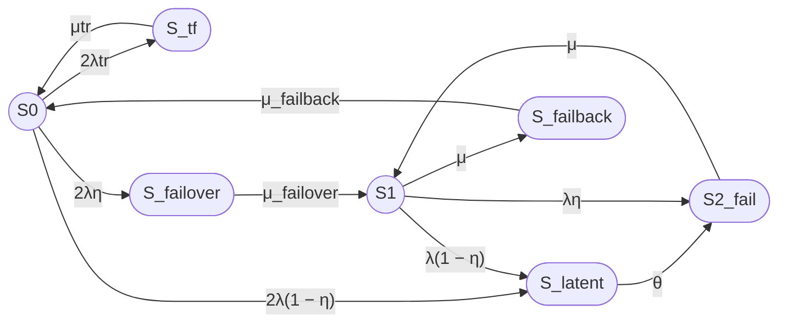

## 3

Принято. Из состояния S_latent должен быть только один переход:

S_latent → S₂_fail

с интенсивностью θ.

Переход S_latent → S_failover исключается.

Это означает следующую интерпретацию: S_latent — агрегированное скрытое неработоспособное состояние, которое при внешнем обнаружении переводит кластер непосредственно в состояние полного отказа S₂_fail. После этого один узел восстанавливается, и система возвращается в S₁.

## Исправленные переходы

- S₀ → S_tf: 2λtr;
- S_tf → S₀: μtr;
- S₀ → S_failover: 2λη;
- S₀ → S_latent: 2λ(1 − η);
- S_latent → S₂_fail: θ;
- S_failover → S₁: μ_failover;
- S₁ → S₂_fail: λη;
- S₁ → S_latent: λ(1 − η);
- S₂_fail → S₁: μ;
- S₁ → S_failback: μ;
- S_failback → S₀: μ_failback.

Переходов S_latent → S_failover и S₀ → S₁ нет.

## Исправленный граф Mermaid

Скобки в подписи `2λ(1 − η)` заключены в двойные кавычки, чтобы Mermaid не интерпретировал их как синтаксис диаграммы. [mermaid](https://mermaid.ai/docs/build-and-edit/write-diagram-syntax)

## Исправленная матрица генератора

Порядок состояний:

S₀, S_tf, S_latent, S_failover, S₁, S₂_fail, S_failback.

### Вариант 1, Unicode

Q =

[ -(2λtr + 2λ),   2λtr,     2λ(1 − η),        2λη,          0,       0,          0 ]

[ μtr,             -μtr,      0,                0,            0,       0,          0 ]

[ 0,                0,       -θ,                0,            0,       θ,          0 ]

[ 0,                0,        0,       -μ_failover, μ_failover, 0,          0 ]

[ 0,                0,   λ(1 − η),             0,      -(λ + μ), λη,        μ ]

[ 0,                0,        0,                0,            μ,      -μ,         0 ]

[ μ_failback,        0,        0,                0,            0,       0, -μ_failback ]

### Вариант 2, LaTeX

$$
Q =
\begin{bmatrix}
-(2\lambda_{\mathrm{tr}}+2\lambda)
& 2\lambda_{\mathrm{tr}}
& 2\lambda(1-\eta)
& 2\lambda\eta
& 0
& 0
& 0
\\
\mu_{\mathrm{tr}}
& -\mu_{\mathrm{tr}}
& 0
& 0
& 0
& 0
& 0
\\
0
& 0
& -\theta
& 0
& 0
& \theta
& 0
\\
0
& 0
& 0
& -\mu_{\mathrm{failover}}
& \mu_{\mathrm{failover}}
& 0
& 0
\\
0
& 0
& \lambda(1-\eta)
& 0
& -(\lambda+\mu)
& \lambda\eta
& \mu
\\
0
& 0
& 0
& 0
& \mu
& -\mu
& 0
\\
\mu_{\mathrm{failback}}
& 0
& 0
& 0
& 0
& 0
& -\mu_{\mathrm{failback}}
\end{bmatrix}
$$

## Исправленные стационарные уравнения

### Вариант 1, Unicode

0 = -(2λtr + 2λ)P₀ + μtrP_tf + μ_failbackP_failback

0 = 2λtrP₀ - μtrP_tf

0 = 2λ(1 − η)P₀ + λ(1 − η)P₁ - θP_latent

0 = 2ληP₀ - μ_failoverP_failover

0 = μ_failoverP_failover - (λ + μ)P₁ + μP₂

0 = θP_latent + ληP₁ - μP₂

0 = μP₁ - μ_failbackP_failback

P₀ + P_tf + P_latent + P_failover + P₁ + P₂ + P_failback = 1

### Вариант 2, LaTeX

$$
0 =
-(2\lambda_{\mathrm{tr}}+2\lambda)P_0
+\mu_{\mathrm{tr}}P_{\mathrm{tf}}
+\mu_{\mathrm{failback}}P_{\mathrm{failback}}
$$

$$
0 =
2\lambda_{\mathrm{tr}}P_0
-\mu_{\mathrm{tr}}P_{\mathrm{tf}}
$$

$$
0 =
2\lambda(1-\eta)P_0
+\lambda(1-\eta)P_1
-\theta P_{\mathrm{latent}}
$$

$$
0 =
2\lambda\eta P_0
-\mu_{\mathrm{failover}}P_{\mathrm{failover}}
$$

$$
0 =
\mu_{\mathrm{failover}}P_{\mathrm{failover}}
-(\lambda+\mu)P_1
+\mu P_2
$$

$$
0 =
\theta P_{\mathrm{latent}}
+\lambda\eta P_1
-\mu P_2
$$

$$
0 =
\mu P_1
-\mu_{\mathrm{failback}}P_{\mathrm{failback}}
$$

$$
P_0+P_{\mathrm{tf}}+P_{\mathrm{latent}}
+P_{\mathrm{failover}}+P_1+P_2
+P_{\mathrm{failback}}=1
$$

## Численный результат

Использованы параметры:

- MTBF = 30000 часов;
- MTTR = 24 часа;
- T_failover = 30 секунд;
- T_failback = 90 секунд;
- Ttr = 180 секунд;
- MTBFtr = 1 год;
- η = 0,99;
- T_detect = 8 часов.

Вариант 1, Unicode:

λ = 1 / 108000000 1/с

μ = 1 / 86400 1/с

λtr = 1 / 31536000 1/с

μtr = 1 / 180 1/с

μ_failover = 1 / 30 1/с

μ_failback = 1 / 90 1/с

θ = 1 / 28800 1/с

Решение стационарной системы дает:

P₀ ≈ 0,998366423

P_tf ≈ 0,0000113969

P_latent ≈ 0,0000053289

P_failover ≈ 0,0000005491

P₁ ≈ 0,0015973863

P₂ ≈ 0,0000172518

P_failback ≈ 0,0000016639

Кг,ст = P₀ + P₁

Кг,ст ≈ 0,999963809

Кг,ст ≈ 99,9963809%

Вариант 2, LaTeX:

$$
K_{\mathrm{г,ст}} = P_0 + P_1
$$

$$
K_{\mathrm{г,ст}} \approx 0{,}999963809
$$

$$
K_{\mathrm{г,ст}} \approx 99{,}9963809\%
$$

Оценочная неготовность составляет около 0,0000361906, что соответствует примерно 0,317 часа, или 19 минут, в год.

## Интерпретация изменения результата

После замены перехода S_latent → S_failover на S_latent → S₂_fail коэффициент готовности уменьшается:

- предыдущая версия с S_latent → S_failover: около 99,9979794%;
- текущая версия с S_latent → S₂_fail: около 99,9963809%.

Падение ожидаемо: при обнаружении скрытого отказа система переводится непосредственно в полное неработоспособное состояние S₂_fail и остается в нем в среднем на время ремонта одного узла, то есть MTTR = 24 часа.

Скрытый отказ, произошедший в S₀, при такой схеме больше не обрабатывается failover. Поэтому после периода внешнего обнаружения он приводит к полному отказу модели, что является существенно более консервативным предположением.
