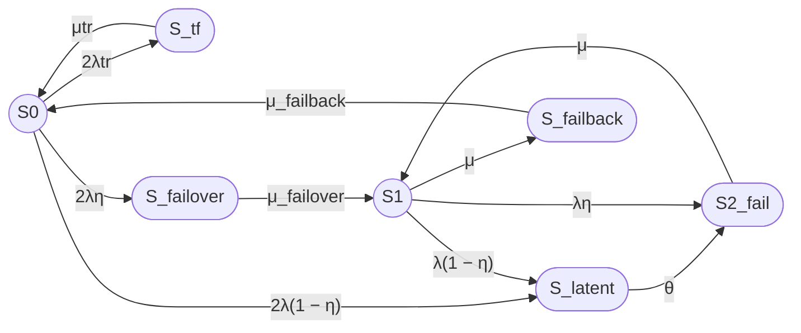

# Исправленный промпт

```text
txt
```

Рассчитай стационарный коэффициент готовности семипозиционной модели восстанавливаемого отказоустойчивого кластера методом непрерывной однородной цепи Маркова.

# Часть 1. Постановка задачи и расчетная модель

## 1. Кластер

Рассматривается кластер из двух одинаковых узлов с восстановлением.

Всего в модели семь состояний:

- S0 — оба узла работоспособны, отказов нет;
- S_tf — временный сбой одного узла, автоматически устраняемый перезапуском;
- S_latent — скрытый отказ одного узла, не обнаруженный средствами внутреннего контроля;
- S_failover — отказ одного узла, выполняется процедура failover;
- S1 — один узел работоспособен, кластер работает в деградированной конфигурации;
- S2_fail — оба узла отказали, кластер неработоспособен;
- S_failback — выполняется процедура failback.

Кластер считается работоспособным только в состояниях S0 и S1.

В группу отказа входят:

- S_tf;
- S_latent;
- S_failover;
- S2_fail;
- S_failback.

## 2. Переходы

Используй следующие переходы:

- S0 → S_tf — временный сбой одного из двух узлов, интенсивность 2λtr;
- S_tf → S0 — автоматическое устранение сбоя путем перезапуска, интенсивность μtr;
- S0 → S_failover — постоянный отказ одного узла, мгновенно обнаруженный внутренним контролем, интенсивность 2λη;
- S0 → S_latent — постоянный отказ одного узла, не обнаруженный внутренним контролем, интенсивность 2λ(1 − η);
- S_latent → S2_fail — обнаружение скрытого отказа внешним периодическим контролем, интенсивность θ;
- S_failover → S1 — завершение процедуры failover, интенсивность μ_failover;
- S1 → S2_fail — постоянный отказ оставшегося работоспособного узла, мгновенно обнаруженный внутренним контролем, интенсивность λη;
- S1 → S_latent — постоянный отказ оставшегося узла, не обнаруженный внутренним контролем, интенсивность λ(1 − η);
- S2_fail → S1 — восстановление одного из двух отказавших узлов, интенсивность μ;
- S1 → S_failback — начало процедуры failback, интенсивность μ;
- S_failback → S0 — завершение процедуры failback, интенсивность μ_failback.

Прямые переходы отсутствуют:

- S0 → S1;
- S1 → S0.

В этой модели состояние S_latent агрегирует скрытый отказ одного узла как из полной конфигурации S0, так и из деградированной конфигурации S1. После обнаружения скрытого отказа система переходит в S2_fail.

## 3. Контроль отказов

Пусть:

- η — вероятность мгновенного обнаружения отказа узла средствами внутреннего контроля;
- 1 − η — вероятность того, что отказ остается скрытым;
- θ — интенсивность обнаружения скрытого отказа внешним периодическим контролем;
- 1 / θ — среднее время обнаружения скрытого отказа.

Для отказа одного из двух узлов в состоянии S0:

- интенсивность мгновенно обнаруживаемого отказа: 2λη;
- интенсивность скрытого отказа: 2λ(1 − η).

Для отказа оставшегося узла в состоянии S1:

- интенсивность мгновенно обнаруживаемого отказа: λη;
- интенсивность скрытого отказа: λ(1 − η).

## 4. Временный сбой

Состояние S_tf соответствует временному сбою узла, который устраняется перезапуском.

Переходы:

- S0 → S_tf: 2λtr;
- S_tf → S0: μtr.

Среднее время перезапуска:

Ttr = 180 секунд

Интенсивность восстановления после временного сбоя:

μtr = 1 / Ttr.

## 5. Интенсивности и средние времена

Используй:

- λ — интенсивность постоянного отказа одного узла;
- λtr — интенсивность временного сбоя одного узла;
- μtr — интенсивность восстановления после временного сбоя;
- μ_failover — интенсивность завершения failover;
- μ — интенсивность восстановления узла;
- μ — интенсивность начала failback;
- μ_failback — интенсивность завершения failback;
- θ — интенсивность обнаружения скрытого отказа.

Связь интенсивностей со средними временами:

- λ = 1 / MTBF;
- μ = 1 / MTTR;
- λtr = 1 / MTBFtr;
- μtr = 1 / Ttr;
- μ_failover = 1 / T_failover;
- μ_failback = 1 / T_failback;
- θ = 1 / T_detect.

## 6. Численный пример

Используй:

- MTBF одного узла = 30000 часов;
- MTTR одного узла = 24 часа;
- среднее время failover = 30 секунд;
- среднее время failback = 90 секунд;
- среднее время перезапуска после временного сбоя = 180 секунд;
- η = 0,99;
- среднее время обнаружения скрытого отказа = 8 часов;
- среднее время между временными сбоями одного узла = 1 год;
- один ремонтный канал.

Все времена приведи к секундам.

Прими:

- λtr = 1 / (365 × 24 × 3600);
- μtr = 1 / 180;
- θ = 1 / (8 × 3600).

## 7. Требуемый расчет

1. Сформулируй модель в терминах теории надежности.
2. Укажи работоспособные и неработоспособные состояния.
3. Построй граф состояний.
4. Составь матрицу генератора в порядке:

   S0, S_tf, S_latent, S_failover, S1, S2_fail, S_failback.

5. Выведи стационарные уравнения.
6. Найди стационарные вероятности.
7. Рассчитай:

   Kг,ст = P0 + P1.

8. Выполни численный расчет.
9. Отдельно опиши операции:
   - временного восстановления TF;
   - обнаружения latent;
   - failover;
   - failback.
10. Укажи ограничения модели.
11. Приведи примеры необнаруженного отказа в составе кластера и варианты внешнего контроля.

# Часть 2. Требования к оформлению

## 1. Mermaid

Используй Mermaid, совместимый с GitHub.

В Mermaid используй ASCII-идентификаторы:

- S0;
- S_tf;
- S_latent;
- S_failover;
- S1;
- S2_fail;
- S_failback.

Работоспособные состояния обозначай окружностями:

- `((S))`.

Неработоспособные состояния обозначай овалами:

- `([S])`.

Граф направь слева направо.

Для подписей переходов, содержащих круглые скобки, используй кавычки:

```text
S0 -->|"2λ(1 − η)"| S_latent
```

Используй следующий граф:


Не используй:

- цветовые стили;
- `classDef`;
- `class`;
- `style`;
- заливку;
- цветные контуры;
- дополнительные Mermaid-узлы для легенды;
- текстовые описания внутри узлов.

## 2. Текстовая легенда

Легенда должна быть обычным Markdown-текстом, а не Mermaid.

Укажи:

- `((S))` — работоспособное состояние, окружность;
- `([S])` — неработоспособное состояние, овал;
- S0 — оба узла работоспособны;
- S_tf — временный сбой, устраняемый перезапуском;
- S_latent — скрытый отказ;
- S_failover — выполняется failover;
- S1 — один узел работоспособен;
- S2_fail — оба узла отказали;
- S_failback — выполняется failback.

## 3. Формулы

Каждую формулу выводи дважды:

1. Вариант 1, Unicode — линейный текст без LaTeX-обертки.
2. Вариант 2, LaTeX — формула в GitHub Markdown LaTeX-обертке.

В Unicode-варианте:

- используй λ, μ, η, θ;
- цифровые индексы записывай Unicode-символами, если это возможно;
- сохраняй текстовые индексы с подчеркиванием: μ_failover, μ_failback, P_failover, P_failback;
- не используй `<sub>`;
- не заменяй μ_failover на μ(failover).

В LaTeX-варианте используй:

- \mu_{\mathrm{failover}};
- \mu_{\mathrm{failback}};
- P_{\mathrm{failover}};
- P_{\mathrm{failback}};
- \lambda_{\mathrm{tr}};
- \mu_{\mathrm{tr}};
- P_{\mathrm{latent}};
- P_{\mathrm{failover}};
- P_{\mathrm{failback}}.

Для LaTeX используй стандартные команды:

- \frac;
- \lambda;
- \mu;
- \eta;
- \theta;
- \mathrm;
- \begin{bmatrix};
- \begin{aligned}.

Не используй:

- \boxed;
- \fbox;
- \framebox;
- \colorbox;
- \require;
- \newcommand;
- \renewcommand;
- \def;
- пользовательские макросы;
- внешние LaTeX-пакеты;
- нестандартные окружения;
- HTML-теги внутри математических блоков.

## 4. Матрица генератора

Используй порядок состояний:

S0, S_tf, S_latent, S_failover, S1, S2_fail, S_failback.

Матрица генератора должна соответствовать графу переходов.

Поясни смысл диагональных элементов: они равны минусу суммы интенсивностей исходящих переходов и не означают переход в то же состояние.

## 5. Итог

В конце ответа добавь раздел:

# Итого

В нем приведи:

1. граф Mermaid;
2. текстовую легенду Markdown;
3. стационарный коэффициент готовности в Unicode;
4. тот же коэффициент в LaTeX;
5. численный результат;
6. краткое описание операций TF, latent, failover и failback;
7. примеры необнаруженного отказа и варианты внешнего контроля.
```

# Ответ по исправленному промпту

## 1. Формализация модели

Рассматривается восстанавливаемый отказоустойчивый кластер из двух одинаковых узлов.

В модели семь состояний:

- S₀ — оба узла работоспособны, отказов нет;
- S_tf — временный сбой одного узла, устраняемый перезапуском;
- S_latent — скрытый отказ одного узла, не обнаруженный внутренним контролем;
- S_failover — выполняется процедура переключения на резерв;
- S₁ — один узел работоспособен, кластер работает в деградированной конфигурации;
- S₂_fail — оба узла отказали;
- S_failback — выполняется процедура возврата восстановленного узла.

Работоспособные состояния:

- S₀;
- S₁.

Неработоспособные состояния:

- S_tf;
- S_latent;
- S_failover;
- S₂_fail;
- S_failback.

Состояние S_latent агрегирует скрытый отказ одного узла как из полной конфигурации S₀, так и из деградированной конфигурации S₁. После обнаружения скрытого отказа система переходит в S₂_fail.

## 2. Интенсивности переходов

Переходы модели:

- S₀ → S_tf: 2λtr;
- S_tf → S₀: μtr;
- S₀ → S_failover: 2λη;
- S₀ → S_latent: 2λ(1 − η);
- S_latent → S₂_fail: θ;
- S_failover → S₁: μ_failover;
- S₁ → S₂_fail: λη;
- S₁ → S_latent: λ(1 − η);
- S₂_fail → S₁: μ;
- S₁ → S_failback: μ;
- S_failback → S₀: μ_failback.

Связь с временами:

### Вариант 1, Unicode

λ = 1 / MTBF

μ = 1 / MTTR

λtr = 1 / MTBFtr

μtr = 1 / Ttr

μ_failover = 1 / T_failover

μ_failback = 1 / T_failback

θ = 1 / T_detect

### Вариант 2, LaTeX

$$
\lambda = \frac{1}{MTBF}
$$

$$
\mu = \frac{1}{MTTR}
$$

$$
\lambda_{\mathrm{tr}} = \frac{1}{MTBF_{\mathrm{tr}}}
$$

$$
\mu_{\mathrm{tr}} = \frac{1}{T_{\mathrm{tr}}}
$$

$$
\mu_{\mathrm{failover}} =
\frac{1}{T_{\mathrm{failover}}}
$$

$$
\mu_{\mathrm{failback}} =
\frac{1}{T_{\mathrm{failback}}}
$$

$$
\theta =
\frac{1}{T_{\mathrm{detect}}}
$$

## 3. Граф состояний

В Mermaid для текстовых идентификаторов используются ASCII-имена. Подписи переходов, содержащие круглые скобки, заключены в кавычки, поэтому Mermaid не воспринимает их как элементы синтаксиса формы узла. [mermaid](https://mermaid.ai/docs/build-and-edit/write-diagram-syntax)


Основная последовательность:

S0 → S_failover → S1 → S2_fail

Дополнительные переходы:

- S0 ↔ S_tf;
- S0 → S_latent → S2_fail;
- S1 → S_latent → S2_fail;
- S1 → S_failback → S0.

## 4. Текстовая легенда

- `((S))` — работоспособное состояние, окружность.
- `([S])` — неработоспособное состояние, овал.
- S₀ — оба узла работоспособны, отказов нет.
- S_tf — временный сбой, устраняемый перезапуском.
- S_latent — скрытый отказ, не обнаруженный внутренним контролем.
- S_failover — выполняется процедура failover.
- S₁ — один узел работоспособен.
- S₂_fail — оба узла отказали.
- S_failback — выполняется процедура failback.

## 5. Матрица генератора

Порядок состояний:

S₀, S_tf, S_latent, S_failover, S₁, S₂_fail, S_failback.

### Вариант 1, Unicode

Q =

[ -(2λtr + 2λ),   2λtr,     2λ(1 − η),        2λη,          0,       0,          0 ]

[ μtr,             -μtr,      0,                0,            0,       0,          0 ]

[ 0,                0,       -θ,                0,            0,       θ,          0 ]

[ 0,                0,        0,       -μ_failover, μ_failover, 0,          0 ]

[ 0,                0,   λ(1 − η),             0,      -(λ + μ), λη,        μ ]

[ 0,                0,        0,                0,            μ,      -μ,         0 ]

[ μ_failback,        0,        0,                0,            0,       0, -μ_failback ]

### Вариант 2, LaTeX

$$
Q =
\begin{bmatrix}
-(2\lambda_{\mathrm{tr}}+2\lambda)
& 2\lambda_{\mathrm{tr}}
& 2\lambda(1-\eta)
& 2\lambda\eta
& 0
& 0
& 0
\\
\mu_{\mathrm{tr}}
& -\mu_{\mathrm{tr}}
& 0
& 0
& 0
& 0
& 0
\\
0
& 0
& -\theta
& 0
& 0
& \theta
& 0
\\
0
& 0
& 0
& -\mu_{\mathrm{failover}}
& \mu_{\mathrm{failover}}
& 0
& 0
\\
0
& 0
& \lambda(1-\eta)
& 0
& -(\lambda+\mu)
& \lambda\eta
& \mu
\\
0
& 0
& 0
& 0
& \mu
& -\mu
& 0
\\
\mu_{\mathrm{failback}}
& 0
& 0
& 0
& 0
& 0
& -\mu_{\mathrm{failback}}
\end{bmatrix}
$$

Диагональные элементы матрицы не являются переходами в то же состояние. Они равны минусу суммы интенсивностей исходящих переходов.

Например, диагональный элемент состояния S₀ равен:

-(2λtr + 2λ)

Он включает:

- 2λtr — переход S₀ → S_tf;
- 2λη — переход S₀ → S_failover;
- 2λ(1 − η) — переход S₀ → S_latent.

## 6. Стационарные уравнения

Обозначим:

- P₀ — вероятность S₀;
- P_tf — вероятность S_tf;
- P_latent — вероятность S_latent;
- P_failover — вероятность S_failover;
- P₁ — вероятность S₁;
- P₂ — вероятность S₂_fail;
- P_failback — вероятность S_failback.

### Вариант 1, Unicode

0 = -(2λtr + 2λ)P₀ + μtrP_tf + μ_failbackP_failback

0 = 2λtrP₀ - μtrP_tf

0 = 2λ(1 − η)P₀ + λ(1 − η)P₁ - θP_latent

0 = 2ληP₀ - μ_failoverP_failover

0 = μ_failoverP_failover - (λ + μ)P₁ + μP₂

0 = θP_latent + ληP₁ - μP₂

0 = μP₁ - μ_failbackP_failback

P₀ + P_tf + P_latent + P_failover + P₁ + P₂ + P_failback = 1

### Вариант 2, LaTeX

$$
0 =
-(2\lambda_{\mathrm{tr}}+2\lambda)P_0
+\mu_{\mathrm{tr}}P_{\mathrm{tf}}
+\mu_{\mathrm{failback}}P_{\mathrm{failback}}
$$

$$
0 =
2\lambda_{\mathrm{tr}}P_0
-\mu_{\mathrm{tr}}P_{\mathrm{tf}}
$$

$$
0 =
2\lambda(1-\eta)P_0
+\lambda(1-\eta)P_1
-\theta P_{\mathrm{latent}}
$$

$$
0 =
2\lambda\eta P_0
-\mu_{\mathrm{failover}}P_{\mathrm{failover}}
$$

$$
0 =
\mu_{\mathrm{failover}}P_{\mathrm{failover}}
-(\lambda+\mu)P_1
+\mu P_2
$$

$$
0 =
\theta P_{\mathrm{latent}}
+\lambda\eta P_1
-\mu P_2
$$

$$
0 =
\mu P_1
-\mu_{\mathrm{failback}}P_{\mathrm{failback}}
$$

$$
P_0+P_{\mathrm{tf}}+P_{\mathrm{latent}}
+P_{\mathrm{failover}}+P_1+P_2
+P_{\mathrm{failback}}=1
$$

## 7. Стационарный коэффициент готовности

Работоспособными являются только S₀ и S₁.

### Вариант 1, Unicode

Кг,ст = P₀ + P₁

### Вариант 2, LaTeX

$$
K_{\mathrm{г,ст}} = P_0 + P_1
$$

## 8. Численный пример

Исходные данные:

- MTBF = 30000 часов;
- MTTR = 24 часа;
- T_failover = 30 секунд;
- T_failback = 90 секунд;
- Ttr = 180 секунд;
- η = 0,99;
- T_detect = 8 часов;
- MTBFtr = 1 год.

### Перевод времени

#### Вариант 1, Unicode

MTBF = 30000 × 3600 = 108000000 с

MTTR = 24 × 3600 = 86400 с

T_detect = 8 × 3600 = 28800 с

MTBFtr = 365 × 24 × 3600 = 31536000 с

Ttr = 180 с

#### Вариант 2, LaTeX

$$
MTBF = 30000 \times 3600 = 108000000\ \mathrm{s}
$$

$$
MTTR = 24 \times 3600 = 86400\ \mathrm{s}
$$

$$
T_{\mathrm{detect}} = 8 \times 3600 = 28800\ \mathrm{s}
$$

$$
MTBF_{\mathrm{tr}} =
365 \times 24 \times 3600
=31536000\ \mathrm{s}
$$

$$
T_{\mathrm{tr}} = 180\ \mathrm{s}
$$

### Интенсивности

#### Вариант 1, Unicode

λ = 1 / 108000000 ≈ 9,25925926 × 10⁻⁹ 1/с

μ = 1 / 86400 ≈ 1,15740741 × 10⁻⁵ 1/с

λtr = 1 / 31536000 ≈ 3,17097920 × 10⁻⁸ 1/с

μtr = 1 / 180 ≈ 0,00555555556 1/с

μ_failover = 1 / 30 ≈ 0,0333333333 1/с

μ_failback = 1 / 90 ≈ 0,0111111111 1/с

θ = 1 / 28800 ≈ 0,0000347222222 1/с

#### Вариант 2, LaTeX

$$
\lambda =
\frac{1}{108000000}
\approx 9{,}25925926 \times 10^{-9}\ \mathrm{s}^{-1}
$$

$$
\mu =
\frac{1}{86400}
\approx 1{,}15740741 \times 10^{-5}\ \mathrm{s}^{-1}
$$

$$
\lambda_{\mathrm{tr}} =
\frac{1}{31536000}
\approx 3{,}17097920 \times 10^{-8}\ \mathrm{s}^{-1}
$$

$$
\mu_{\mathrm{tr}} =
\frac{1}{180}
\approx 0{,}00555555556\ \mathrm{s}^{-1}
$$

$$
\mu_{\mathrm{failover}} =
\frac{1}{30}
\approx 0{,}0333333333\ \mathrm{s}^{-1}
$$

$$
\mu_{\mathrm{failback}} =
\frac{1}{90}
\approx 0{,}0111111111\ \mathrm{s}^{-1}
$$

$$
\theta =
\frac{1}{28800}
\approx 0{,}0000347222222\ \mathrm{s}^{-1}
$$

### Расчет результата

#### Вариант 1, Unicode

H ≈ 1,001616918

P₀ ≈ 0,998366423

P₁ ≈ 0,0015973863

Кг,ст = P₀ + P₁

Кг,ст ≈ 0,999963809

Кг,ст ≈ 99,9963809%

#### Вариант 2, LaTeX

$$
K_{\mathrm{г,ст}} \approx 0{,}999963809
$$

$$
K_{\mathrm{г,ст}} \approx 99{,}9963809\%
$$

## 9. Операции состояний

### Временный сбой TF

Состояние S_tf соответствует кратковременному зависанию или отказу узла:

1. обнаружение сбоя watchdog или внутренним health check;
2. остановка зависшего процесса;
3. перезапуск узла;
4. загрузка операционной системы;
5. запуск кластерного агента;
6. проверка сервисов;
7. возврат в S₀.

### Скрытый отказ latent

Состояние S_latent означает, что отказ узла произошел, но внутренний контроль его не обнаружил:

1. отказ узла;
2. отсутствие срабатывания внутреннего контроля;
3. пребывание в скрытом состоянии;
4. обнаружение внешним периодическим контролем;
5. переход в S₂_fail.

### Failover

Возможные операции:

1. обнаружение отказа;
2. подтверждение отказа;
3. fencing или STONITH;
4. блокировка ресурсов отказавшего узла;
5. перенос виртуального IP-адреса;
6. запуск сервиса на оставшемся узле;
7. проверка готовности сервиса.

### Failback

Возможные операции:

1. завершение ремонта;
2. загрузка восстановленного узла;
3. проверка сети и оборудования;
4. включение узла в кластер;
5. синхронизация данных;
6. проверка реплик;
7. возврат ресурсов;
8. переход в S₀.

## 10. Примеры необнаруженного отказа и варианты внешнего контроля

### Примеры необнаруженного отказа в составе кластера

1. Отказ сетевого интерфейса на уровне физического канала, который не отражается в статусе узла, но снижает пропускную способность или надежность связи.
2. Отказ одного из дисков в программном RAID, при котором контроллер не генерирует тревогу, но массив работает в деградированном режиме.
3. Отказ вентилятора, который не отслеживается внутренним мониторингом, но повышает температуру и риск отказа узла.
4. Отказ одного из блоков питания в конфигурации N+1, если система не контролирует состояние каждого БП.
5. Отказ одного из модулей памяти, который не вызывает немедленного сбоя ОС, но увеличивает вероятность ошибок и зависаний.
6. Отказ одного из сетевых адаптеров в bonded-конфигурации, когда bonding не генерирует явную тревогу.
7. Отказ одного из узлов кластера на уровне программного агента, который не регистрируется кластерным менеджером.

### Варианты внешнего контроля (обнаружения)

1. Периодический полный health check всех узлов внешним мониторингом (например, Zabbix, Prometheus) с проверкой:
   - доступности по сети;
   - состояния дисков;
   - температуры;
   - состояния RAID;
   - статуса сетевых интерфейсов.

2. Плановые тестовые запуски сервисов на каждом узле с проверкой:
   - времени отклика;
   - корректности работы;
   - целостности данных.

3. Периодический аудит конфигурации и состояния оборудования:
   - проверка логов оборудования;
   - проверка SMART-статусов дисков;
   - проверка состояния RAID-контроллеров;
   - проверка состояния БП и вентиляторов.

4. Тестирование отказоустойчивости:
   - плановое отключение одного узла;
   - проверка переключения сервисов;
   - проверка восстановления.

5. Внешний мониторинг производительности:
   - анализ метрик CPU, памяти, дисков;
   - выявление аномалий;
   - корреляция с отказами.

6. Периодическая проверка репликации и синхронизации данных:
   - сравнение контрольных сумм;
   - проверка целостности данных;
   - проверка времени репликации.

7. Аудит безопасности и конфигурации:
   - проверка обновлений;
   - проверка настроек безопасности;
   - проверка политик резервного копирования.

## Итого

### Граф



### Легенда

- `((S))` — работоспособное состояние, окружность.
- `([S])` — неработоспособное состояние, овал.
- S₀ — оба узла работоспособны.
- S_tf — временный сбой, устраняемый перезапуском.
- S_latent — скрытый отказ.
- S_failover — выполняется failover.
- S₁ — один узел работоспособен.
- S₂_fail — оба узла отказали.
- S_failback — выполняется failback.

### Итоговая формула

#### Вариант 1, Unicode

Кг,ст =
    [1 + 2λ / (λ + μ)] /
    [1
     + 2λtr / μtr
     + λ(1 − η) / θ
     + 2λ / μ_failover
     + 2λ / (λ + μ)
     + 2λ² / [μ(λ + μ)]
     + 2λμ / [μ_failback(λ + μ)]]

#### Вариант 2, LaTeX

$$
K_{\mathrm{г,ст}} =
\frac{
1+\frac{2\lambda}{\lambda+\mu}
}{
1
+\frac{2\lambda_{\mathrm{tr}}}{\mu_{\mathrm{tr}}}
+\frac{\lambda(1-\eta)}{\theta}
+\frac{2\lambda}{\mu_{\mathrm{failover}}}
+\frac{2\lambda}{\lambda+\mu}
+\frac{2\lambda^2}{\mu(\lambda+\mu)}
+\frac{2\lambda\mu}
{\mu_{\mathrm{failback}}(\lambda+\mu)}
}
$$

### Численный результат

#### Вариант 1, Unicode

Кг,ст ≈ 0,999963809

Кг,ст ≈ 99,9963809%

#### Вариант 2, LaTeX

$$
K_{\mathrm{г,ст}} \approx 0{,}999963809
$$

$$
K_{\mathrm{г,ст}} \approx 99{,}9963809\%
$$

### Операции

- S_tf — временный сбой, устраняемый перезапуском;
- S_latent — скрытый отказ, обнаруживаемый внешним контролем;
- S_failover — переключение на резерв;
- S_failback — возврат восстановленного узла.

### Примеры необнаруженного отказа

- отказ сетевого интерфейса;
- отказ диска в RAID;
- отказ вентилятора;
- отказ БП в N+1;
- отказ модуля памяти;
- отказ сетевого адаптера в bonding;
- отказ программного агента.

### Варианты внешнего контроля

- периодический health check;
- тестовые запуски сервисов;
- аудит конфигурации;
- тестирование отказоустойчивости;
- мониторинг производительности;
- проверка репликации;
- аудит безопасности.
