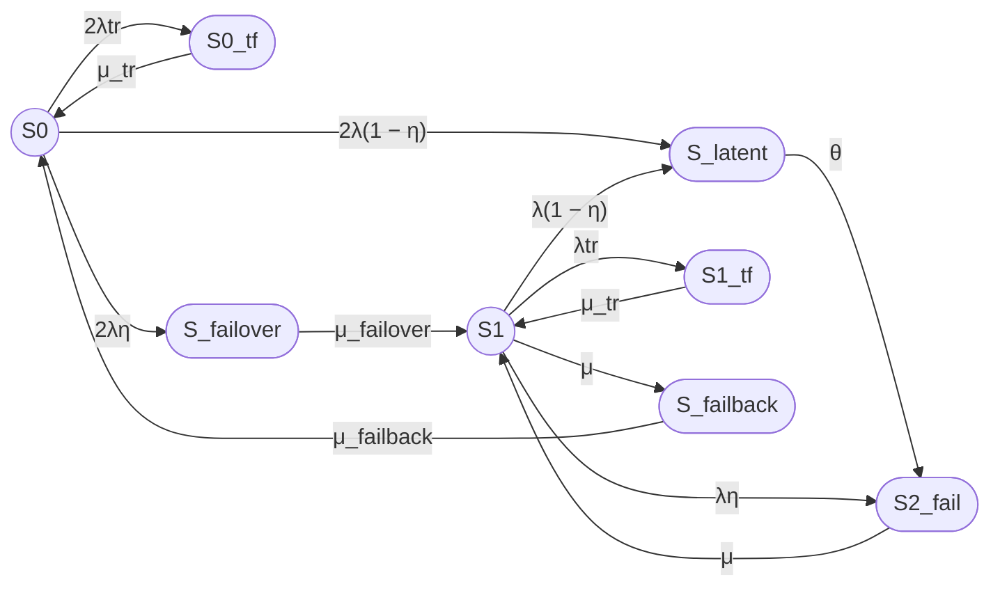

Вы правы. Если временный сбой может произойти не только из полной конфигурации S₀, но и из деградированной конфигурации S₁, то одного состояния S_tf недостаточно. Нужны два отдельных состояния:

- S0_tf — временный сбой одного узла, когда второй узел работоспособен;
- S1_tf — временный сбой работоспособного узла, когда второй узел уже находится в ремонте.

Ниже — исправленный граф и описание состояний семипозиционной модели с учетом этого уточнения.

## Исправленный граф состояний

## Описание состояний

1. **S₀** — оба узла работоспособны, отказов нет. Работоспособное состояние.

2. **S0_tf** — временный сбой одного из двух узлов, второй узел работоспособен. Состояние отказа, устраняемое перезапуском.

3. **S_latent** — скрытый отказ одного узла, не обнаруженный внутренним контролем. Состояние отказа.

4. **S_failover** — отказ одного узла, обнаруженный внутренним контролем, выполняется процедура failover. Состояние отказа.

5. **S₁** — один узел работоспособен, второй узел находится в ремонте или восстановлении. Работоспособное состояние.

6. **S1_tf** — временный сбой работоспособного узла, когда второй узел уже находится в ремонте. Состояние отказа.

7. **S₂_fail** — оба узла отказали, кластер неработоспособен. Состояние отказа.

8. **S_failback** — выполняется процедура возврата восстановленного узла в штатную конфигурацию. Состояние отказа.

## Проблема с количеством состояний

С учетом разделения временного сбоя на S0_tf и S1_tf количество состояний увеличивается до **восьми**, а не семи.

Если требуется сохранить ровно семь состояний, необходимо агрегировать какие-либо состояния. Возможные варианты:

1. Агрегировать S0_tf и S1_tf в одно состояние S_tf, но это скрывает различие между временным сбоем из полной и деградированной конфигурации.

2. Агрегировать S_failover и S_failback в одно переходное состояние, но это смешивает два разных процесса.

3. Исключить одно из состояний, например S_latent, но это устраняет моделирование скрытых отказов.

## Дополнительные неточности модели

Кроме разделения S_tf на S0_tf и S1_tf, в схеме могут быть следующие неточности:

1. **Отсутствие перехода S_failover → S0**. В некоторых моделях failover может завершаться непосредственно возвратом в S₀, если восстановление второго узла происходит одновременно с переключением.

2. **Отсутствие перехода S_failback → S1**. В некоторых сценариях failback может завершаться переходом в S₁, если восстановленный узел еще не полностью интегрирован.

3. **Агрегирование S_latent**. Состояние S_latent одновременно моделирует скрытый отказ из S₀ и из S₁. Это упрощение может искажать динамику, поскольку последствия скрытого отказа из S₀ и S₁ различны.

4. **Отсутствие отдельного состояния для ремонта**. Состояние S₂_fail объединяет полный отказ и ремонт. В более детальной модели можно выделить отдельное состояние ремонта.

5. **Одинаковая интенсивность μ для S₂_fail → S₁ и S₁ → S_failback**. Это упрощение, которое может не соответствовать реальной логике восстановления.

6. **Отсутствие учета времени обнаружения отказа**. В модели предполагается мгновенное обнаружение отказа с вероятностью η, но реальное время обнаружения может быть конечным.

7. **Отсутствие учета зависимых отказов**. Модель предполагает независимые отказы узлов, что может быть некорректным для систем с общими компонентами.

Для точного моделирования рекомендуется явно указать, какие упрощения допустимы в рамках конкретной задачи, и при необходимости расширить модель дополнительными состояниями.
