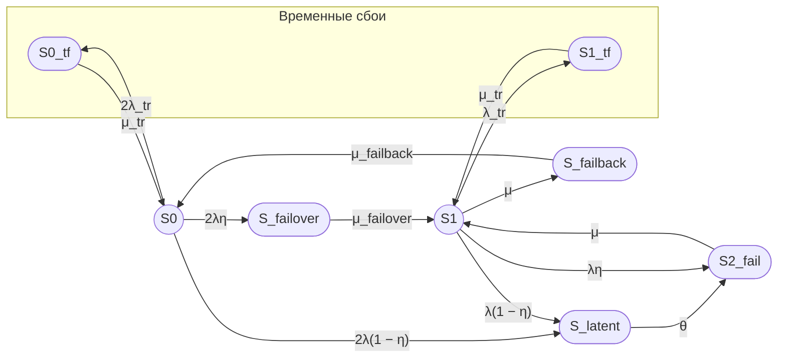
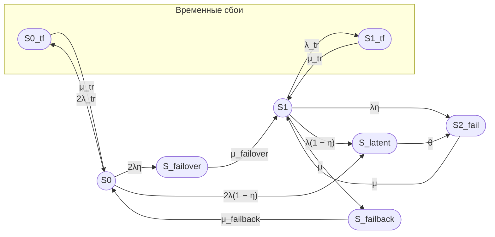

# 1 S_tf x2

Если временный сбой может произойти не только из полной конфигурации S₀, но и из деградированной конфигурации S₁, то одного состояния S_tf недостаточно. Нужны два отдельных состояния:

- S0_tf — временный сбой одного узла, когда второй узел работоспособен;
- S1_tf — временный сбой работоспособного узла, когда второй узел уже находится в ремонте.

Ниже — исправленный граф и описание состояний семипозиционной модели с учетом этого уточнения.

## Исправленный граф состояний


## Описание состояний

1. **S₀** — оба узла работоспособны, отказов нет. Работоспособное состояние.

2. **S0_tf** — временный сбой одного из двух узлов, второй узел работоспособен. Состояние отказа, устраняемое перезапуском.

3. **S_latent** — скрытый отказ одного узла, не обнаруженный внутренним контролем. Состояние отказа.

4. **S_failover** — отказ одного узла, обнаруженный внутренним контролем, выполняется процедура failover. Состояние отказа.

5. **S₁** — один узел работоспособен, второй узел находится в ремонте или восстановлении. Работоспособное состояние.

6. **S1_tf** — временный сбой работоспособного узла, когда второй узел уже находится в ремонте. Состояние отказа.

7. **S₂_fail** — оба узла отказали, кластер неработоспособен. Состояние отказа.

8. **S_failback** — выполняется процедура возврата восстановленного узла в штатную конфигурацию. Состояние отказа.

## Проблема с количеством состояний

С учетом разделения временного сбоя на S0_tf и S1_tf количество состояний увеличивается до **восьми**, а не семи.

Если требуется сохранить ровно семь состояний, необходимо агрегировать какие-либо состояния. Возможные варианты:

1. Агрегировать S0_tf и S1_tf в одно состояние S_tf, но это скрывает различие между временным сбоем из полной и деградированной конфигурации.

2. Агрегировать S_failover и S_failback в одно переходное состояние, но это смешивает два разных процесса.

3. Исключить одно из состояний, например S_latent, но это устраняет моделирование скрытых отказов.

## Дополнительные неточности модели

Кроме разделения S_tf на S0_tf и S1_tf, в схеме могут быть следующие неточности:

1. **Отсутствие перехода S_failover → S0**. В некоторых моделях failover может завершаться непосредственно возвратом в S₀, если восстановление второго узла происходит одновременно с переключением.

2. **Отсутствие перехода S_failback → S1**. В некоторых сценариях failback может завершаться переходом в S₁, если восстановленный узел еще не полностью интегрирован.

3. **Агрегирование S_latent**. Состояние S_latent одновременно моделирует скрытый отказ из S₀ и из S₁. Это упрощение может искажать динамику, поскольку последствия скрытого отказа из S₀ и S₁ различны.

4. **Отсутствие отдельного состояния для ремонта**. Состояние S₂_fail объединяет полный отказ и ремонт. В более детальной модели можно выделить отдельное состояние ремонта.

5. **Одинаковая интенсивность μ для S₂_fail → S₁ и S₁ → S_failback**. Это упрощение, которое может не соответствовать реальной логике восстановления.

6. **Отсутствие учета времени обнаружения отказа**. В модели предполагается мгновенное обнаружение отказа с вероятностью η, но реальное время обнаружения может быть конечным.

7. **Отсутствие учета зависимых отказов**. Модель предполагает независимые отказы узлов, что может быть некорректным для систем с общими компонентами.


# 2  S0_tf & S1_tf rank

# Подробное описание ситуации с обнаружением отказа

## Сценарий обнаружения отказа через keep-alive

В отказоустойчивом кластере узлы обмениваются периодическими сигналами жизнеспособности (keep-alive, heartbeat). Эти сигналы передаются по выделенной сети или по основной сети управления.

### Техническая реализация

1. **Период отправки keep-alive**:
   - типичный интервал: 1–5 секунд;
   - каждый узел отправляет пакеты heartbeat другим узлам кластера;
   - пакеты содержат идентификатор узла, временную метку, статус сервисов.

2. **Тайм-аут обнаружения**:
   - если узел не получает heartbeat от соседа в течение заданного времени (timeout), он считается отказавшим;
   - типичный timeout: 3–10 секунд (3–10 пропущенных интервалов);
   - после истечения timeout инициируется процедура failover.

3. **Механизм обнаружения**:
   - на уровне ядра ОС: watchdog-таймер, который перезагружает узел при зависании;
   - на уровне кластерного ПО: corosync, pacemaker, keepalived, которые отслеживают heartbeat;
   - на уровне приложения: health check эндпоинты, которые опрашиваются другими узлами.

4. **Сигнал об отказе**:
   - при отсутствии heartbeat в течение timeout кластерное ПО генерирует событие «node failed»;
   - это событие триггерит процедуру failover;
   - виртуальный IP-адрес и ресурсы перемещаются на резервный узел;
   - клиенты переподключаются к новому активному узлу.

5. **Влияние на модель**:
   - в модели это отражается как мгновенный переход с вероятностью η;
   - η — вероятность того, что отказ будет обнаружен по heartbeat;
   - 1 − η — вероятность того, что отказ не будет обнаружен (скрытый отказ);
   - время обнаружения в модели пренебрежимо мало по сравнению с MTTR и другими временами.

### Почему это важно

Если heartbeat не работает корректно (например, из-за проблем с сетью, неправильной конфигурации timeout, ложных срабатываний), то:

- отказ может быть обнаружен с задержкой;
- failover может произойти слишком поздно;
- клиенты могут потерять соединение;
- в худшем случае может произойти split-brain, если оба узла считают себя активными.

Поэтому в модели η должна быть близка к 1 (например, 0,99), а время обнаружения должно быть значительно меньше MTTR.

## Исправленный граф с учетом требований



## Требование к оформлению Mermaid


## Требования к Mermaid

Используй Mermaid, совместимый с GitHub.

В Mermaid используй ASCII-идентификаторы:

- S0;
- S0_tf;
- S1_tf;
- S_latent;
- S_failover;
- S1;
- S2_fail;
- S_failback.

Работоспособные состояния обозначай окружностями:

- `((S))`.

Неработоспособные состояния обозначай овалами:

- `([S])`.

Граф направь слева направо.

Расположи состояния S0, S1 и S2_fail на одной горизонтальной линии (в одном ранге). Для этого используй явное указание ранга в Mermaid:

```text
S0 ~~~ S1 ~~~ S2_fail
```

или:

```text
{ rank=same; S0; S1; S2_fail; }
```

Состояния S0_tf и S1_tf расположи вместе в виде подграфа (кластера) с заголовком «Временные сбои».

Для подписей переходов, содержащих круглые скобки, используй кавычки:

```text
S0 -->|"2λ(1 − η)"| S_latent
```

Используй следующий граф:



Не используй:

- цветовые стили;
- `classDef`;
- `class`;
- `style`;
- заливку;
- цветные контуры;
- дополнительные Mermaid-узлы для легенды;
- текстовые описания внутри узлов.

## Исправленные обозначения интенсивностей

Во всех формулах и графе замени:

- λtr на λ_tr;
- μtr на μ_tr.

Это обеспечивает единообразие обозначений и соответствие требованиям к оформлению.

## Дополнительные уточнения для модели

1. **Временные сбои из S₀ и S₁**:
   - S0 → S0_tf: 2λ_tr (сбой одного из двух узлов);
   - S1 → S1_tf: λ_tr (сбой единственного работоспособного узла).

2. **Восстановление после временного сбоя**:
   - S0_tf → S0: μ_tr;
   - S1_tf → S1: μ_tr.

3. **Скрытые отказы**:
   - S0 → S_latent: 2λ(1 − η);
   - S1 → S_latent: λ(1 − η);
   - S_latent → S2_fail: θ.

4. **Мгновенно обнаруженные отказы**:
   - S0 → S_failover: 2λη;
   - S1 → S2_fail: λη.

Эти уточнения обеспечивают корректность модели и соответствие технической реализации кластера.
