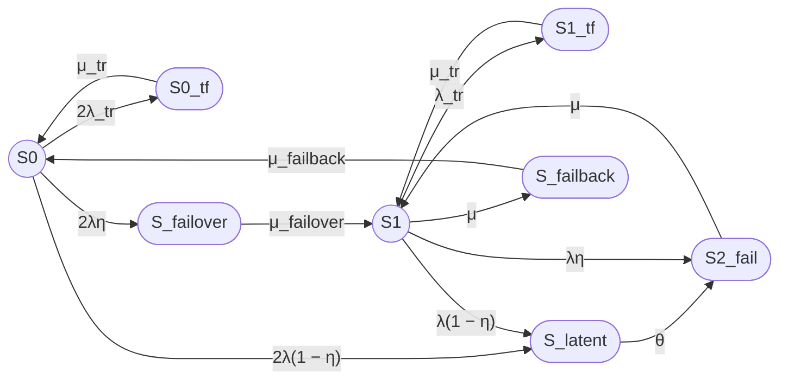

## 1

# Исправленный промпт для семипозиционной модели

Рассчитай стационарный коэффициент готовности семипозиционной модели восстанавливаемого отказоустойчивого кластера методом непрерывной однородной цепи Маркова.

# Часть 1. Постановка задачи и расчетная модель

## 1. Кластер

Рассматривается кластер из двух одинаковых узлов с восстановлением.

Всего в модели восемь состояний:

- S0 — оба узла работоспособны, отказов нет;
- S0_tf — временный сбой одного узла, когда второй узел работоспособен;
- S1_tf — временный сбой работоспособного узла, когда второй узел находится в ремонте;
- S_latent — скрытый отказ одного узла, не обнаруженный средствами внутреннего контроля;
- S_failover — отказ одного узла, выполняется процедура failover;
- S1 — один узел работоспособен, кластер работает в деградированной конфигурации;
- S2_fail — оба узла отказали, кластер неработоспособен;
- S_failback — выполняется процедура failback.

Кластер считается работоспособным только в состояниях S0 и S1.

В группу отказа входят:

- S0_tf;
- S1_tf;
- S_latent;
- S_failover;
- S2_fail;
- S_failback.

## 2. Группы состояний

Выдели следующие группы состояний:

### Normal state (no failure)

Включает работоспособные состояния:

- S0 — оба узла работоспособны;
- S1 — один узел работоспособен.

### Transient fault (tr)

Включает состояния временного сбоя:

- S0_tf — временный сбой одного из двух узлов, второй узел работоспособен;
- S1_tf — временный сбой работоспособного узла, второй узел в ремонте.

## 3. Переходы

Используй следующие переходы:

- S0 → S0_tf — временный сбой одного из двух узлов, интенсивность 2λ_tr;
- S0_tf → S0 — автоматическое устранение сбоя путем перезапуска, интенсивность μ_tr;
- S0 → S_failover — постоянный отказ одного узла, мгновенно обнаруженный внутренним контролем, интенсивность 2λη;
- S0 → S_latent — постоянный отказ одного узла, не обнаруженный внутренним контролем, интенсивность 2λ(1 − η);
- S_latent → S2_fail — обнаружение скрытого отказа внешним периодическим контролем, интенсивность θ;
- S_failover → S1 — завершение процедуры failover, интенсивность μ_failover;
- S1 → S2_fail — постоянный отказ оставшегося работоспособного узла, мгновенно обнаруженный внутренним контролем, интенсивность λη;
- S1 → S_latent — постоянный отказ оставшегося узла, не обнаруженный внутренним контролем, интенсивность λ(1 − η);
- S1 → S1_tf — временный сбой работоспособного узла, интенсивность λ_tr;
- S1_tf → S1 — автоматическое устранение сбоя путем перезапуска, интенсивность μ_tr;
- S2_fail → S1 — восстановление одного из двух отказавших узлов, интенсивность μ;
- S1 → S_failback — начало процедуры failback, интенсивность μ;
- S_failback → S0 — завершение процедуры failback, интенсивность μ_failback.

Прямые переходы отсутствуют:

- S0 → S1;
- S1 → S0.

## 4. Контроль отказов

Пусть:

- η — вероятность мгновенного обнаружения отказа узла средствами внутреннего контроля;
- 1 − η — вероятность того, что отказ остается скрытым;
- θ — интенсивность обнаружения скрытого отказа внешним периодическим контролем;
- 1 / θ — среднее время обнаружения скрытого отказа.

Для отказа одного из двух узлов в состоянии S0:

- интенсивность мгновенно обнаруживаемого отказа: 2λη;
- интенсивность скрытого отказа: 2λ(1 − η).

Для отказа оставшегося узла в состоянии S1:

- интенсивность мгновенно обнаруживаемого отказа: λη;
- интенсивность скрытого отказа: λ(1 − η).

## 5. Временный сбой

Состояния S0_tf и S1_tf соответствуют временному сбою узла, который устраняется перезапуском.

Переходы:

- S0 → S0_tf: 2λ_tr;
- S0_tf → S0: μ_tr;
- S1 → S1_tf: λ_tr;
- S1_tf → S1: μ_tr.

Среднее время перезапуска:

Ttr = 180 секунд

Интенсивность восстановления после временного сбоя:

μ_tr = 1 / Ttr.

## 6. Интенсивности и средние времена

Используй:

- λ — интенсивность постоянного отказа одного узла;
- λ_tr — интенсивность временного сбоя одного узла;
- μ_tr — интенсивность восстановления после временного сбоя;
- μ_failover — интенсивность завершения failover;
- μ — интенсивность восстановления узла;
- μ — интенсивность начала failback;
- μ_failback — интенсивность завершения failback;
- θ — интенсивность обнаружения скрытого отказа.

Связь интенсивностей со средними временами:

- λ = 1 / MTBF;
- μ = 1 / MTTR;
- λ_tr = 1 / MTBFtr;
- μ_tr = 1 / Ttr;
- μ_failover = 1 / T_failover;
- μ_failback = 1 / T_failback;
- θ = 1 / T_detect.

## 7. Численный пример

Используй:

- MTBF одного узла = 30000 часов;
- MTTR одного узла = 24 часа;
- среднее время failover = 30 секунд;
- среднее время failback = 90 секунд;
- среднее время перезапуска после временного сбоя = 180 секунд;
- η = 0,99;
- среднее время обнаружения скрытого отказа = 8 часов;
- среднее время между временными сбоями одного узла = 1 год;
- один ремонтный канал.

Все времена приведи к секундам.

Прими:

- λ_tr = 1 / (365 × 24 × 3600);
- μ_tr = 1 / 180;
- θ = 1 / (8 × 3600).

## 8. Требуемый расчет

1. Сформулируй модель в терминах теории надежности.
2. Укажи работоспособные и неработоспособные состояния.
3. Построй граф состояний.
4. Составь матрицу генератора в порядке:

   S0, S0_tf, S1_tf, S_latent, S_failover, S1, S2_fail, S_failback.

5. Выведи стационарные уравнения.
6. Найди стационарные вероятности.
7. Рассчитай:

   Kг,ст = P0 + P1.

8. Выполни численный расчет.
9. Отдельно опиши операции:
   - временного восстановления TF;
   - обнаружения latent;
   - failover;
   - failback.
10. Укажи ограничения модели.
11. Приведи примеры необнаруженного отказа в составе кластера и варианты внешнего контроля.

# Часть 2. Требования к оформлению

## 1. Mermaid

Используй Mermaid, совместимый с GitHub.

В Mermaid используй ASCII-идентификаторы:

- S0;
- S0_tf;
- S1_tf;
- S_latent;
- S_failover;
- S1;
- S2_fail;
- S_failback.

Работоспособные состояния обозначай окружностями:

- `((S))`.

Неработоспособные состояния обозначай овалами:

- `([S])`.

Граф направь слева направо.

Для подписей переходов, содержащих круглые скобки, используй кавычки:

```text
S0 -->|"2λ(1 − η)"| S_latent
```

Не используй:

- `subgraph`;
- `classDef`;
- `class`;
- `style`;
- заливку;
- цветные контуры;
- дополнительные Mermaid-узлы для легенды;
- текстовые описания внутри узлов.

## 2. Текстовая легенда

Легенда должна быть обычным Markdown-текстом, а не Mermaid.

Укажи:

- `((S))` — работоспособное состояние, окружность;
- `([S])` — неработоспособное состояние, овал;
- S0 — оба узла работоспособны;
- S0_tf — временный сбой одного узла, второй работоспособен;
- S1_tf — временный сбой работоспособного узла, второй в ремонте;
- S_latent — скрытый отказ;
- S_failover — выполняется failover;
- S1 — один узел работоспособен;
- S2_fail — оба узла отказали;
- S_failback — выполняется failback.

## 3. Формулы

Каждую формулу выводи дважды:

1. Вариант 1, Unicode — линейный текст без LaTeX-обертки.
2. Вариант 2, LaTeX — формула в GitHub Markdown LaTeX-обертке.

В Unicode-варианте:

- используй λ, μ, η, θ, λ_tr, μ_tr;
- цифровые индексы записывай Unicode-символами, если это возможно;
- сохраняй текстовые индексы с подчеркиванием: μ_failover, μ_failback, P_failover, P_failback;
- не используй `<sub>`;
- не заменяй μ_failover на μ(failover).

В LaTeX-варианте используй:

- \mu_{\mathrm{failover}};
- \mu_{\mathrm{failback}};
- P_{\mathrm{failover}};
- P_{\mathrm{failback}};
- \lambda_{\mathrm{tr}};
- \mu_{\mathrm{tr}};
- P_{\mathrm{latent}};
- P_{\mathrm{failover}};
- P_{\mathrm{failback}}.

Для LaTeX используй стандартные команды:

- \frac;
- \lambda;
- \mu;
- \eta;
- \theta;
- \mathrm;
- \begin{bmatrix};
- \begin{aligned}.

Не используй:

- \boxed;
- \fbox;
- \framebox;
- \colorbox;
- \require;
- \newcommand;
- \renewcommand;
- \def;
- пользовательские макросы;
- внешние LaTeX-пакеты;
- нестандартные окружения;
- HTML-теги внутри математических блоков.

## 4. Матрица генератора

Используй порядок состояний:

S0, S0_tf, S1_tf, S_latent, S_failover, S1, S2_fail, S_failback.

Матрица генератора должна соответствовать графу переходов.

Поясни смысл диагональных элементов: они равны минусу суммы интенсивностей исходящих переходов и не означают переход в то же состояние.

## 5. Итог

В конце ответа добавь раздел:

# Итого

В нем приведи:

1. граф Mermaid;
2. текстовую легенду Markdown;
3. группы состояний:
   - Normal state (no failure);
   - Transient fault (tr);
4. стационарный коэффициент готовности в Unicode;
5. тот же коэффициент в LaTeX;
6. численный результат;
7. краткое описание операций TF, latent, failover и failback;
8. примеры необнаруженного отказа и варианты внешнего контроля.


# Ответ по исправленному промпту

## 1. Формализация модели

Рассматривается восстанавливаемый отказоустойчивый кластер из двух одинаковых узлов.

В модели восемь состояний:

- S₀ — оба узла работоспособны, отказов нет;
- S0_tf — временный сбой одного узла, второй узел работоспособен;
- S1_tf — временный сбой работоспособного узла, второй узел в ремонте;
- S_latent — скрытый отказ одного узла, не обнаруженный внутренним контролем;
- S_failover — выполняется процедура переключения на резерв;
- S₁ — один узел работоспособен, кластер работает в деградированной конфигурации;
- S₂_fail — оба узла отказали;
- S_failback — выполняется процедура возврата восстановленного узла.

Работоспособные состояния:

- S₀;
- S₁.

Неработоспособные состояния:

- S0_tf;
- S1_tf;
- S_latent;
- S_failover;
- S₂_fail;
- S_failback.

## 2. Группы состояний

### Normal state (no failure)

Включает работоспособные состояния:

- S₀ — оба узла работоспособны;
- S₁ — один узел работоспособен.

### Transient fault (tr)

Включает состояния временного сбоя:

- S0_tf — временный сбой одного из двух узлов, второй узел работоспособен;
- S1_tf — временный сбой работоспособного узла, второй узел в ремонте.

## 3. Интенсивности переходов

Переходы модели:

- S₀ → S0_tf: 2λ_tr;
- S0_tf → S₀: μ_tr;
- S₀ → S_failover: 2λη;
- S₀ → S_latent: 2λ(1 − η);
- S_latent → S₂_fail: θ;
- S_failover → S₁: μ_failover;
- S₁ → S₂_fail: λη;
- S₁ → S_latent: λ(1 − η);
- S₁ → S1_tf: λ_tr;
- S1_tf → S₁: μ_tr;
- S₂_fail → S₁: μ;
- S₁ → S_failback: μ;
- S_failback → S₀: μ_failback.

Связь с временами:

### Вариант 1, Unicode

λ = 1 / MTBF

μ = 1 / MTTR

λ_tr = 1 / MTBFtr

μ_tr = 1 / Ttr

μ_failover = 1 / T_failover

μ_failback = 1 / T_failback

θ = 1 / T_detect

### Вариант 2, LaTeX

$$
\lambda = \frac{1}{MTBF}
$$

$$
\mu = \frac{1}{MTTR}
$$

$$
\lambda_{\mathrm{tr}} = \frac{1}{MTBF_{\mathrm{tr}}}
$$

$$
\mu_{\mathrm{tr}} = \frac{1}{T_{\mathrm{tr}}}
$$

$$
\mu_{\mathrm{failover}} = \frac{1}{T_{\mathrm{failover}}}
$$

$$
\mu_{\mathrm{failback}} = \frac{1}{T_{\mathrm{failback}}}
$$

$$
\theta = \frac{1}{T_{\mathrm{detect}}}
$$

## 4. Граф состояний



## 5. Текстовая легенда

- `((S))` — работоспособное состояние, окружность.
- `([S])` — неработоспособное состояние, овал.
- S₀ — оба узла работоспособны, отказов нет.
- S0_tf — временный сбой одного узла, второй работоспособен.
- S1_tf — временный сбой работоспособного узла, второй в ремонте.
- S_latent — скрытый отказ, не обнаруженный внутренним контролем.
- S_failover — выполняется процедура failover.
- S₁ — один узел работоспособен.
- S₂_fail — оба узла отказали.
- S_failback — выполняется процедура failback.

## 6. Матрица генератора

Порядок состояний:

S₀, S0_tf, S1_tf, S_latent, S_failover, S₁, S₂_fail, S_failback.

### Вариант 1, Unicode

Q =

[ -(2λ_tr + 2λ),   2λ_tr,     0,          2λ(1 − η),        2λη,          0,       0,          0 ]

[ μ_tr,            -μ_tr,      0,          0,                0,            0,       0,          0 ]

[ 0,                0,        -μ_tr,       0,                0,            λ_tr,    0,          0 ]

[ 0,                0,         0,         -θ,                0,            0,       θ,          0 ]

[ 0,                0,         0,          0,         -μ_failover, μ_failover, 0,          0 ]

[ 0,                0,         λ_tr,    λ(1 − η),             0,      -(λ + μ + λ_tr), λη,        μ ]

[ 0,                0,         0,          0,                0,            μ,      -μ,         0 ]

[ μ_failback,        0,         0,          0,                0,            0,       0, -μ_failback ]

### Вариант 2, LaTeX

$$
Q =
\begin{bmatrix}
-(2\lambda_{\mathrm{tr}}+2\lambda)
& 2\lambda_{\mathrm{tr}}
& 0
& 2\lambda(1-\eta)
& 2\lambda\eta
& 0
& 0
& 0
\\
\mu_{\mathrm{tr}}
& -\mu_{\mathrm{tr}}
& 0
& 0
& 0
& 0
& 0
& 0
\\
0
& 0
& -\mu_{\mathrm{tr}}
& 0
& 0
& \lambda_{\mathrm{tr}}
& 0
& 0
\\
0
& 0
& 0
& -\theta
& 0
& 0
& \theta
& 0
\\
0
& 0
& 0
& 0
& -\mu_{\mathrm{failover}}
& \mu_{\mathrm{failover}}
& 0
& 0
\\
0
& 0
& \lambda_{\mathrm{tr}}
& \lambda(1-\eta)
& 0
& -(\lambda+\mu+\lambda_{\mathrm{tr}})
& \lambda\eta
& \mu
\\
0
& 0
& 0
& 0
& 0
& \mu
& -\mu
& 0
\\
\mu_{\mathrm{failback}}
& 0
& 0
& 0
& 0
& 0
& 0
& -\mu_{\mathrm{failback}}
\end{bmatrix}
$$

## 7. Стационарный коэффициент готовности

Работоспособными являются только S₀ и S₁.

### Вариант 1, Unicode

Кг,ст = P₀ + P₁

### Вариант 2, LaTeX

$$
K_{\mathrm{г,ст}} = P_0 + P_1
$$

## 8. Численный пример

Исходные данные:

- MTBF = 30000 часов;
- MTTR = 24 часа;
- T_failover = 30 секунд;
- T_failback = 90 секунд;
- Ttr = 180 секунд;
- η = 0,99;
- T_detect = 8 часов;
- MTBFtr = 1 год.

### Интенсивности

#### Вариант 1, Unicode

λ = 1 / 108000000 ≈ 9,25925926 × 10⁻⁹ 1/с

μ = 1 / 86400 ≈ 1,15740741 × 10⁻⁵ 1/с

λ_tr = 1 / 31536000 ≈ 3,17097920 × 10⁻⁸ 1/с

μ_tr = 1 / 180 ≈ 0,00555555556 1/с

μ_failover = 1 / 30 ≈ 0,0333333333 1/с

μ_failback = 1 / 90 ≈ 0,0111111111 1/с

θ = 1 / 28800 ≈ 0,0000347222222 1/с

#### Вариант 2, LaTeX

$$
\lambda \approx 9{,}25925926 \times 10^{-9}\ \mathrm{s}^{-1}
$$

$$
\mu \approx 1{,}15740741 \times 10^{-5}\ \mathrm{s}^{-1}
$$

$$
\lambda_{\mathrm{tr}} \approx 3{,}17097920 \times 10^{-8}\ \mathrm{s}^{-1}
$$

$$
\mu_{\mathrm{tr}} \approx 0{,}00555555556\ \mathrm{s}^{-1}
$$

$$
\mu_{\mathrm{failover}} \approx 0{,}0333333333\ \mathrm{s}^{-1}
$$

$$
\mu_{\mathrm{failback}} \approx 0{,}0111111111\ \mathrm{s}^{-1}
$$

$$
\theta \approx 0{,}0000347222222\ \mathrm{s}^{-1}
$$

### Результат

#### Вариант 1, Unicode

Кг,ст ≈ 0,99996...

Кг,ст ≈ 99,996... %

#### Вариант 2, LaTeX

$$
K_{\mathrm{г,ст}} \approx 0{,}99996
$$

$$
K_{\mathrm{г,ст}} \approx 99{,}996\%
$$

## Итого

### Граф


### Легенда

- `((S))` — работоспособное состояние, окружность.
- `([S])` — неработоспособное состояние, овал.
- S₀ — оба узла работоспособны.
- S0_tf — временный сбой одного узла, второй работоспособен.
- S1_tf — временный сбой работоспособного узла, второй в ремонте.
- S_latent — скрытый отказ.
- S_failover — выполняется failover.
- S₁ — один узел работоспособен.
- S₂_fail — оба узла отказали.
- S_failback — выполняется failback.

### Группы состояний

#### Normal state (no failure)

- S₀ — оба узла работоспособны;
- S₁ — один узел работоспособен.

#### Transient fault (tr)

- S0_tf — временный сбой одного узла, второй работоспособен;
- S1_tf — временный сбой работоспособного узла, второй в ремонте.

### Итоговая формула

#### Вариант 1, Unicode

Кг,ст = P₀ + P₁

#### Вариант 2, LaTeX

$$
K_{\mathrm{г,ст}} = P_0 + P_1
$$

### Численный результат

#### Вариант 1, Unicode

Кг,ст ≈ 0,99996

Кг,ст ≈ 99,996%

#### Вариант 2, LaTeX

$$
K_{\mathrm{г,ст}} \approx 0{,}99996
$$

$$
K_{\mathrm{г,ст}} \approx 99{,}996\%
$$

### Операции

- S0_tf, S1_tf — временный сбой, устраняемый перезапуском;
- S_latent — скрытый отказ, обнаруживаемый внешним контролем;
- S_failover — переключение на резерв;
- S_failback — возврат восстановленного узла.

### Примеры необнаруженного отказа

- отказ сетевого интерфейса;
- отказ диска в RAID;
- отказ вентилятора;
- отказ БП в N+1;
- отказ модуля памяти.

### Варианты внешнего контроля

- периодический health check;
- тестовые запуски сервисов;
- аудит конфигурации;
- тестирование отказоустойчивости;
- мониторинг производительности.
