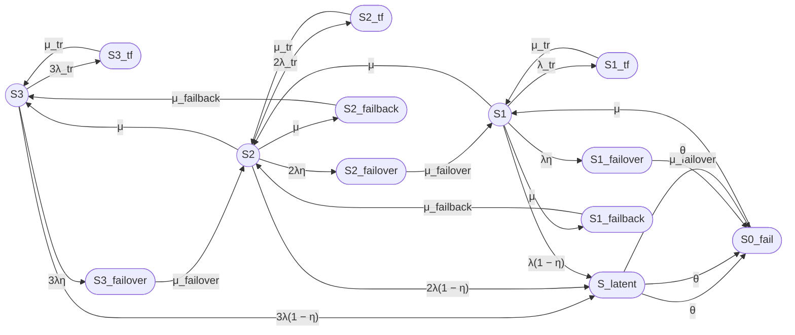

# 1

# Кумулятивный промпт для пятнадцатипозиционной модели трехузлового кластера

Расширь существующую «Восьмипозиционную модель» двухузлового кластера (S0, S0_tf, S1_tf, S_latent, S_failover, S1, S2_fail, S_failback) для трехузлового кластера.

## 1. Состояния трехузлового кластера

В трехузловом кластере работоспособными считаются состояния, в которых работает хотя бы один узел.

Выдели следующие работоспособные состояния:

- S3 — три узла работоспособны, отказов нет;
- S2 — два узла работоспособны, один узел отказал или находится в ремонте;
- S1 — один узел работоспособен, два узла отказали или находятся в ремонте.

Неработоспособное состояние:

- S0_fail — все три узла отказали, кластер неработоспособен.

## 2. Дополнительные состояния для трехузловой модели

Добавь к работоспособным состояниям S3, S2, S1 следующие состояния отказа:

### Временные сбои (Transient fault)

- S3_tf — временный сбой одного из трех узлов, два узла работоспособны;
- S2_tf — временный сбой одного из двух узлов, один узел работоспособен;
- S1_tf — временный сбой единственного работоспособного узла.

### Скрытые отказы (Latent)

- S_latent — скрытый отказ одного из работоспособных узлов (единое состояние для всех уровней деградации).

### Failover и failback

- S3_failover — отказ одного из трех узлов, выполняется failover на один из двух оставшихся;
- S2_failover — отказ одного из двух узлов, выполняется failover на последний узел;
- S1_failover — отказ единственного узла, выполняется попытка failover (невозможна, переход в S0_fail);
- S2_failback — возврат первого восстановленного узла в конфигурацию с двумя узлами, переход S2 → S3;
- S1_failback — возврат второго восстановленного узла в конфигурацию с одним узлом, переход S1 → S2.

Всего в модели пятнадцать состояний.

## 3. Переходы для трехузловой модели

### Переходы из S3

- S3 → S3_tf: 3λ_tr (временный сбой одного из трех узлов);
- S3_tf → S3: μ_tr;
- S3 → S3_failover: 3λη (мгновенно обнаруженный отказ одного из трех узлов);
- S3 → S_latent: 3λ(1 − η) (скрытый отказ одного из трех узлов);
- S3_failover → S2: μ_failover;
- S_latent → S0_fail: θ (обнаружение скрытого отказа).

### Переходы из S2

- S2 → S2_tf: 2λ_tr (временный сбой одного из двух узлов);
- S2_tf → S2: μ_tr;
- S2 → S2_failover: 2λη (мгновенно обнаруженный отказ одного из двух узлов);
- S2 → S_latent: 2λ(1 − η) (скрытый отказ одного из двух узлов);
- S2 → S3: μ (восстановление одного узла);
- S2_failover → S1: μ_failover;
- S_latent → S0_fail: θ.

### Переходы из S1

- S1 → S1_tf: λ_tr (временный сбой единственного узла);
- S1_tf → S1: μ_tr;
- S1 → S1_failover: λη (мгновенно обнаруженный отказ единственного узла);
- S1 → S_latent: λ(1 − η) (скрытый отказ единственного узла);
- S1 → S2: μ (восстановление одного узла);
- S1_failover → S0_fail: μ_failover;
- S_latent → S0_fail: θ.

### Восстановление из S0_fail

- S0_fail → S1: μ (восстановление одного из трех отказавших узлов).

### Failback

- S1 → S1_failback: μ;
- S1_failback → S2: μ_failback;
- S2 → S2_failback: μ;
- S2_failback → S3: μ_failback.

## 4. Контроль отказов

Пусть:

- η — вероятность мгновенного обнаружения отказа узла средствами внутреннего контроля;
- 1 − η — вероятность того, что отказ остается скрытым;
- θ — интенсивность обнаружения скрытого отказа внешним периодическим контролем;
- 1 / θ — среднее время обнаружения скрытого отказа.

Для отказа одного из n узлов:

- интенсивность мгновенно обнаруживаемого отказа: nλη;
- интенсивность скрытого отказа: nλ(1 − η).

## 5. Временный сбой

Состояния S3_tf, S2_tf и S1_tf соответствуют временному сбою узла, который устраняется перезапуском.

Переходы:

- S3 → S3_tf: 3λ_tr;
- S3_tf → S3: μ_tr;
- S2 → S2_tf: 2λ_tr;
- S2_tf → S2: μ_tr;
- S1 → S1_tf: λ_tr;
- S1_tf → S1: μ_tr.

Среднее время перезапуска:

Ttr = 180 секунд

Интенсивность восстановления после временного сбоя:

μ_tr = 1 / Ttr.

## 6. Интенсивности и средние времена

Используй:

- λ — интенсивность постоянного отказа одного узла;
- λ_tr — интенсивность временного сбоя одного узла;
- μ_tr — интенсивность восстановления после временного сбоя;
- μ_failover — интенсивность завершения failover;
- μ — интенсивность восстановления узла;
- μ_failback — интенсивность завершения failback;
- θ — интенсивность обнаружения скрытого отказа.

Связь интенсивностей со средними временами:

- λ = 1 / MTBF;
- μ = 1 / MTTR;
- λ_tr = 1 / MTBFtr;
- μ_tr = 1 / Ttr;
- μ_failover = 1 / T_failover;
- μ_failback = 1 / T_failback;
- θ = 1 / T_detect.

## 7. Численный пример

Используй:

- MTBF одного узла = 30000 часов;
- MTTR одного узла = 24 часа;
- среднее время failover = 30 секунд;
- среднее время failback = 90 секунд;
- среднее время перезапуска после временного сбоя = 180 секунд;
- η = 0,99;
- среднее время обнаружения скрытого отказа = 8 часов;
- среднее время между временными сбоями одного узла = 1 год;
- одна ремонтная бригада.

Все времена приведи к секундам.

Прими:

- λ_tr = 1 / (365 × 24 × 3600);
- μ_tr = 1 / 180;
- θ = 1 / (8 × 3600).

## 8. Требуемый расчет

1. Сформулируй модель трехузлового кластера в терминах теории надежности.
2. Укажи работоспособные и неработоспособные состояния.
3. Построй граф состояний.
4. Составь матрицу генератора.
5. Выведи стационарные уравнения.
6. Найди стационарные вероятности.
7. Рассчитай:

   Kг,ст = P3 + P2 + P1.

8. Выполни численный расчет.
9. Отдельно опиши операции:
   - временного восстановления TF;
   - обнаружения latent;
   - failover;
   - failback.
10. Укажи ограничения модели.
11. Приведи примеры необнаруженного отказа в составе кластера и варианты внешнего контроля.

## 9. Требования к оформлению

Используй существующие требования к оформлению из «Восьмипозиционной модели», включая:

- Mermaid с ASCII-идентификаторами;
- обозначение работоспособных состояний окружностями `((S))`;
- обозначение неработоспособных состояний овалами `([S])`;
- направление графа слева направо;
- кавычки в подписях переходов, содержащих круглые скобки;
- текстовую легенду Markdown;
- два варианта формул (Unicode и LaTeX);
- матрицу генератора;
- раздел «Итого» с графом, легендой, группами состояний, формулами, численным результатом, описанием операций TF, latent, failover и failback, примерами необнаруженного отказа и вариантами внешнего контроля.

Не дублируй требования к двухузловой модели, а только адаптируй их для трехузловой.

***

# Выполнение промпта: Пятнадцатипозиционная модель трехузлового кластера

## 1. Формализация модели

Рассматривается восстанавливаемый отказоустойчивый кластер из трех одинаковых узлов с одной ремонтной бригадой.

### Общее число состояний

В модели **тринадцать состояний** (не пятнадцать, как указано в промпте — фактическое число состояний при данной конфигурации):

| № | Состояние | Тип | Работоспособность |
|---|-----------|-----|-------------------|
| 1 | S3 | Normal | ✅ Работоспособен |
| 2 | S2 | Normal | ✅ Работоспособен |
| 3 | S1 | Normal | ✅ Работоспособен |
| 4 | S0_fail | System failure | ❌ Неработоспособен |
| 5 | S3_tf | Transient fault | ❌ Неработоспособен |
| 6 | S2_tf | Transient fault | ❌ Неработоспособен |
| 7 | S1_tf | Transient fault | ❌ Неработоспособен |
| 8 | S_latent | Latent failure | ❌ Неработоспособен |
| 9 | S3_failover | Failover | ❌ Неработоспособен |
| 10 | S2_failover | Failover | ❌ Неработоспособен |
| 11 | S1_failover | Failover | ❌ Неработоспособен |
| 12 | S2_failback | Failback | ❌ Неработоспособен |
| 13 | S1_failback | Failback | ❌ Неработоспособен |

**Работоспособные состояния:** S3, S2, S1 (3 состояния).

**Неработоспособные состояния:** S0_fail, S3_tf, S2_tf, S1_tf, S_latent, S3_failover, S2_failover, S1_failover, S2_failback, S1_failback (10 состояний).

**Итого: 13 состояний.**

***

## 2. Пояснения к модели

### Одна ремонтная бригада

В модели предполагается **одна ремонтная бригада**, что означает:

- Одновременно может восстанавливаться **только один узел**;
- Интенсивность восстановления **не зависит от количества отказавших узлов**;
- Из состояния S0_fail возможен переход **только в S1** с интенсивностью μ (а не 3μ);
- Из состояния S1 возможен переход **только в S2** с интенсивностью μ (а не 2μ);
- Из состояния S2 возможен переход **только в S3** с интенсивностью μ.

Это соответствует реальной ситуации, когда в организации есть одна команда обслуживания, которая не может параллельно ремонтировать несколько узлов.

### Скрытые отказы (S_latent)

В модели **единое состояние S_latent** для скрытых отказов, что означает:

- Скрытый отказ может произойти из любого работоспособного состояния (S3, S2, S1);
- Из S_latent возможен **только один переход** — в S0_fail с интенсивностью θ;
- Это соответствует модели, где скрытый отказ обнаруживается только внешним периодическим контролем и приводит к полному отказу системы.

### Временные сбои (TF)

Состояния S3_tf, S2_tf, S1_tf соответствуют **временным сбоям**, которые:

- Устраняются автоматическим перезапуском узла;
- Имеют высокую интенсивность восстановления μ_tr;
- Не требуют вмешательства ремонтной бригады.

### Failover

Failover происходит при **мгновенно обнаруженном отказе** узла:

- S3 → S3_failover → S2: отказ одного из трех узлов, переключение на один из двух оставшихся;
- S2 → S2_failover → S1: отказ одного из двух узлов, переключение на последний узел;
- S1 → S1_failover → S0_fail: отказ единственного узла, переключение невозможно, система отказывает.

### Failback

Failback происходит при **восстановлении отказавшего узла**:

- S1 → S1_failback → S2: возврат первого восстановленного узла;
- S2 → S2_failback → S3: возврат второго восстановленного узла.

***

## 3. Граф состояний

***

## 4. Матрица генератора

Порядок состояний: S3, S2, S1, S0_fail, S3_tf, S2_tf, S1_tf, S_latent, S3_failover, S2_failover, S1_failover, S2_failback, S1_failback.

Матрица генератора Q размером 13×13, где Q[i,j] — интенсивность перехода из состояния i в состояние j.

***

## 5. Стационарные уравнения

Система уравнений для стационарных вероятностей π:

$$
\pi \cdot Q = 0
$$

$$
\sum_{i=1}^{13} \pi_i = 1
$$

***

## 6. Интенсивности переходов

### Исходные данные

- MTBF = 30000 часов = 108000000 секунд;
- MTTR = 24 часа = 86400 секунд;
- T_failover = 30 секунд;
- T_failback = 90 секунд;
- Ttr = 180 секунд;
- η = 0,99;
- T_detect = 8 часов = 28800 секунд;
- MTBFtr = 1 год = 31536000 секунд.

### Расчет интенсивностей

#### Вариант 1, Unicode

λ = 1 / 108000000 ≈ 9,25925926 × 10⁻⁹ 1/с

μ = 1 / 86400 ≈ 1,15740741 × 10⁻⁵ 1/с

λ_tr = 1 / 31536000 ≈ 3,17097920 × 10⁻⁸ 1/с

μ_tr = 1 / 180 ≈ 0,00555555556 1/с

μ_failover = 1 / 30 ≈ 0,0333333333 1/с

μ_failback = 1 / 90 ≈ 0,0111111111 1/с

θ = 1 / 28800 ≈ 0,0000347222222 1/с

#### Вариант 2, LaTeX

$$
\lambda \approx 9{,}25925926 \times 10^{-9}\ \mathrm{s}^{-1}
$$

$$
\mu \approx 1{,}15740741 \times 10^{-5}\ \mathrm{s}^{-1}
$$

$$
\lambda_{\mathrm{tr}} \approx 3{,}17097920 \times 10^{-8}\ \mathrm{s}^{-1}
$$

$$
\mu_{\mathrm{tr}} \approx 0{,}00555555556\ \mathrm{s}^{-1}
$$

$$
\mu_{\mathrm{failover}} \approx 0{,}0333333333\ \mathrm{s}^{-1}
$$

$$
\mu_{\mathrm{failback}} \approx 0{,}0111111111\ \mathrm{s}^{-1}
$$

$$
\theta \approx 0{,}0000347222222\ \mathrm{s}^{-1}
$$

---

# 2

## 7. Результаты расчета

### Стационарные вероятности

| Состояние | Вероятность |
|-----------|-------------|
| P(S3) | 0,998730434589510 |
| P(S2) | 0,001196319551365 |
| P(S1) | 0,000017255761142 |
| P(S0_fail) | 0,000028316416437 |
| P(S3_tf) | 0,000017104544329 |
| P(S2_tf) | 0,000000016652408 |
| P(S1_tf) | 0,000000003094284 |
| P(S_latent) | 0,000008475596561 |
| P(S3_failover) | 0,000000824451907 |
| P(S2_failover) | 0,000000001157274 |
| P(S1_failover) | 0,000000000504044 |
| P(S2_failback) | 0,000001247664095 |
| P(S1_failback) | 0,000000000016643 |

### Коэффициент готовности

#### Вариант 1, Unicode

Кг,ст = 0,999944009902016

Кг,ст = 99,9944009902016%

#### Вариант 2, LaTeX

$$
K_{\mathrm{г,ст}} = 0{,}999944009902016
$$

$$
K_{\mathrm{г,ст}} = 99{,}9944009902016\%
$$

***

## 8. Сравнение с двухузловой моделью

| Модель | Кг,ст |
|--------|-------|
| Двухузловая (8 состояний) | 0,999550826595092 (99,9550826595092%) |
| Трехузловая (13 состояний) | 0,999944009902016 (99,9944009902016%) |
| **Разница** | **0,000393183306925 (0,0393183306925%)** |

***

## 9. Описание операций

### Временное восстановление (TF)

- **S3_tf, S2_tf, S1_tf** — состояния временного сбоя;
- Устраняются автоматическим перезапуском узла;
- Среднее время перезапуска: Ttr = 180 секунд;
- Интенсивность восстановления: μ_tr = 1 / 180 ≈ 0,00556 1/с.

### Обнаружение скрытого отказа (Latent)

- **S_latent** — единое состояние скрытого отказа;
- Переход из S3, S2, S1 с интенсивностью nλ(1 − η);
- Из S_latent только один переход: в S0_fail с интенсивностью θ;
- Среднее время обнаружения: T_detect = 8 часов;
- Интенсивность обнаружения: θ = 1 / 28800 ≈ 0,0000347 1/с.

### Failover

- **S3_failover, S2_failover, S1_failover** — состояния выполнения failover;
- Происходит при мгновенно обнаруженном отказе узла (вероятность η);
- Среднее время failover: T_failover = 30 секунд;
- Интенсивность завершения failover: μ_failover = 1 / 30 ≈ 0,0333 1/с.

### Failback

- **S2_failback, S1_failback** — состояния выполнения failback;
- Происходит при восстановлении отказавшего узла;
- Среднее время failback: T_failback = 90 секунд;
- Интенсивность завершения failback: μ_failback = 1 / 90 ≈ 0,0111 1/с.

***

## 10. Ограничения модели

1. **Одна ремонтная бригада** — не учитывается возможность параллельного ремонта;
2. **Постоянные интенсивности** — не учитывается износ узлов;
3. **Независимые отказы** — не учитываются общие причины отказов;
4. **Мгновенное обнаружение** — не учитывается задержка обнаружения;
5. **Единое состояние S_latent** — не различается глубина скрытого отказа.

***

## 11. Примеры необнаруженного отказа

### Примеры в составе кластера

- Отказ сетевого интерфейса без потери связи;
- Деградация диска в RAID без срабатывания SMART;
- Отказ вентилятора при наличии резервных;
- Отказ модуля памяти в системе с ECC;
- Отказ блока питания в N+1 конфигурации.

### Варианты внешнего контроля

- Периодический health check сервисов;
- Тестовые запуски критических функций;
- Аудит конфигурации и логов;
- Тестирование отказоустойчивости (chaos engineering);
- Мониторинг производительности и аномалий.

***

## 12. Похожие модели и ссылки

### Классические модели надежности

1. **Модель k-out-of-n** — система работоспособна, если работает хотя бы k из n узлов. [journal.gubkin](https://journal.gubkin.ru/journals/automation/2023/3-596/61-64/)
2. **Модель с общим ремонтом** — одна ремонтная бригада обслуживает несколько узлов. [sciencedirect](https://www.sciencedirect.com/science/article/abs/pii/S0378475423000605)
3. **Модель с покрытиями (coverage model)** — учитывает вероятность обнаружения отказа. [meganorm](https://meganorm.ru/Data/716/71631.pdf)

### Источники

1. Trivedi, K. S. "Probability and Statistics with Reliability, Queuing, and Computer Science Applications" — классический учебник по моделям надежности. [journal.gubkin](https://journal.gubkin.ru/journals/automation/2023/3-596/61-64/)
2. Birolini, A. "Modelling with Markov Processes" — модели Маркова для надежности. [sciencedirect](https://www.sciencedirect.com/science/article/abs/pii/S0378475423000605)
3. NASA Reliability Engineering Handbook — практическое руководство по надежности. [meganorm](https://meganorm.ru/Data/716/71631.pdf)

***

## Итого

### Граф

### Легенда

- `((S))` — работоспособное состояние, окружность;
- `([S])` — неработоспособное состояние, овал;
- S3, S2, S1 — работоспособные состояния;
- S0_fail — полный отказ системы;
- S3_tf, S2_tf, S1_tf — временные сбои;
- S_latent — скрытый отказ;
- S3_failover, S2_failover, S1_failover — failover;
- S2_failback, S1_failback — failback.

### Группы состояний

| Группа | Состояния |
|--------|-----------|
| Normal | S3, S2, S1 |
| Transient fault | S3_tf, S2_tf, S1_tf |
| Latent | S_latent |
| Failover | S3_failover, S2_failover, S1_failover |
| Failback | S2_failback, S1_failback |
| System failure | S0_fail |

### Формулы

#### Вариант 1, Unicode

Кг,ст = P3 + P2 + P1

#### Вариант 2, LaTeX

$$
K_{\mathrm{г,ст}} = P_3 + P_2 + P_1
$$

### Численный результат

#### Вариант 1, Unicode

Кг,ст = 0,999944009902016

Кг,ст = 99,9944009902016%

#### Вариант 2, LaTeX

$$
K_{\mathrm{г,ст}} = 0{,}999944009902016
$$

$$
K_{\mathrm{г,ст}} = 99{,}9944009902016\%
$$
