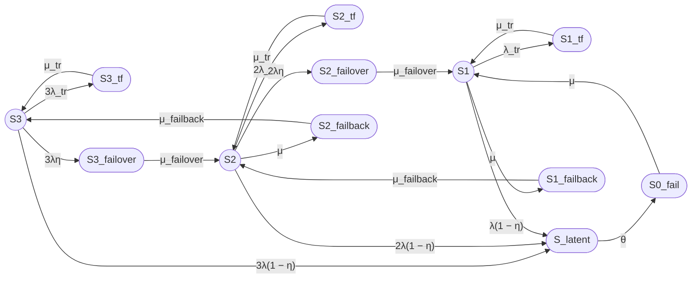

# 1

# Кумулятивный промпт для пятнадцатипозиционной модели трехузлового кластера

Расширь существующую «Восьмипозиционную модель» двухузлового кластера для трехузлового кластера.

## 1. Состояния трехузлового кластера

В трехузловом кластере работоспособными считаются состояния, в которых работает хотя бы один узел.

Выдели следующие работоспособные состояния:

- S3 — три узла работоспособны, отказов нет;
- S2 — два узла работоспособны, один узел отказал или находится в ремонте;
- S1 — один узел работоспособен, два узла отказали или находятся в ремонте.

Неработоспособное состояние:

- S0_fail — все три узла отказали, кластер неработоспособен.

## 2. Дополнительные состояния для трехузловой модели

Добавь к работоспособным состояниям S3, S2, S1 следующие состояния отказа:

### Временные сбои (Transient fault)

- S3_tf — временный сбой одного из трех узлов, два узла работоспособны;
- S2_tf — временный сбой одного из двух узлов, один узел работоспособен;
- S1_tf — временный сбой единственного работоспособного узла.

### Скрытые отказы (Latent)

- S_latent — скрытый отказ одного из работоспособных узлов (единое состояние для всех уровней деградации).

### Failover

Понятие: Failover — автоматическое переключение нагрузки с отказавшего узла на работоспособный.

- S3_failover — отказ одного из трех узлов, выполняется failover на один из двух оставшихся (переход S3 → S2);
- S2_failover — отказ одного из двух узлов, выполняется failover на последний узел (переход S2 → S1).

Из S1 failover невозможен, так как нет резервного узла для переключения нагрузки.

### Failback

Понятие: Failback — возврат восстановленного узла в конфигурацию кластера после ремонта.

- S2_failback — возврат первого восстановленного узла, переход S2 → S3;
- S1_failback — возврат второго восстановленного узла, переход S1 → S2.

Из S1 нет перехода S1_failback, так как из S1 возможен только прямой переход в S0_fail (отказ единственного узла) или в S2 через восстановление.

Всего в модели пятнадцать состояний.

## 3. Переходы для трехузловой модели

### Переходы из S3

- S3 → S3_tf: 3λ_tr (временный сбой одного из трех узлов);
- S3_tf → S3: μ_tr;
- S3 → S3_failover: 3λη (мгновенно обнаруженный отказ одного из трех узлов);
- S3 → S_latent: 3λ(1 − η) (скрытый отказ одного из трех узлов);
- S3_failover → S2: μ_failover;
- S_latent → S0_fail: θ (обнаружение скрытого отказа).

### Переходы из S2

- S2 → S2_tf: 2λ_tr (временный сбой одного из двух узлов);
- S2_tf → S2: μ_tr;
- S2 → S2_failover: 2λη (мгновенно обнаруженный отказ одного из двух узлов);
- S2 → S_latent: 2λ(1 − η) (скрытый отказ одного из двух узлов);
- S2 → S2_failback: μ (восстановление одного узла);
- S2_failover → S1: μ_failover;
- S2_failback → S3: μ_failback;
- S_latent → S0_fail: θ.

### Переходы из S1

- S1 → S1_tf: λ_tr (временный сбой единственного узла);
- S1_tf → S1: μ_tr;
- S1 → S_latent: λ(1 − η) (скрытый отказ единственного узла);
- S1 → S1_failback: μ (восстановление одного узла);
- S1_failback → S2: μ_failback;
- S1_failover → S0_fail: μ_failover (отказ единственного узла, переход в S0_fail);
- S_latent → S0_fail: θ.

### Восстановление из S0_fail

- S0_fail → S1: μ (восстановление одного из трех отказавших узлов).

## 4. Контроль отказов

Пусть:

- η — вероятность мгновенного обнаружения отказа узла средствами внутреннего контроля;
- 1 − η — вероятность того, что отказ остается скрытым;
- θ — интенсивность обнаружения скрытого отказа внешним периодическим контролем;
- 1 / θ — среднее время обнаружения скрытого отказа.

Для отказа одного из n узлов:

- интенсивность мгновенно обнаруживаемого отказа: nλη;
- интенсивность скрытого отказа: nλ(1 − η).

Из S_latent возможен только один переход в S0_fail с интенсивностью θ. На графе это изображается одной дугой из S_latent в S0_fail, так как в случае скрытого отказа неважно, из какого состояния (S3, S2 или S1) произошел переход в S_latent — требуется единая процедура выявления отказа внешними средствами.

## 5. Временный сбой

Состояния S3_tf, S2_tf и S1_tf соответствуют временному сбою узла, который устраняется перезапуском.

Переходы:

- S3 → S3_tf: 3λ_tr;
- S3_tf → S3: μ_tr;
- S2 → S2_tf: 2λ_tr;
- S2_tf → S2: μ_tr;
- S1 → S1_tf: λ_tr;
- S1_tf → S1: μ_tr.

Среднее время перезапуска:

Ttr = 180 секунд

Интенсивность восстановления после временного сбоя:

μ_tr = 1 / Ttr.

## 6. Интенсивности и средние времена

Используй:

- λ — интенсивность постоянного отказа одного узла;
- λ_tr — интенсивность временного сбоя одного узла;
- μ_tr — интенсивность восстановления после временного сбоя;
- μ_failover — интенсивность завершения failover;
- μ — интенсивность восстановления узла;
- μ_failback — интенсивность завершения failback;
- θ — интенсивность обнаружения скрытого отказа.

Связь интенсивностей со средними временами:

- λ = 1 / MTBF;
- μ = 1 / MTTR;
- λ_tr = 1 / MTBFtr;
- μ_tr = 1 / Ttr;
- μ_failover = 1 / T_failover;
- μ_failback = 1 / T_failback;
- θ = 1 / T_detect.

## 7. Численный пример

Используй:

- MTBF одного узла = 30000 часов;
- MTTR одного узла = 24 часа;
- среднее время failover = 30 секунд;
- среднее время failback = 90 секунд;
- среднее время перезапуска после временного сбоя = 180 секунд;
- η = 0,99;
- среднее время обнаружения скрытого отказа = 8 часов;
- среднее время между временными сбоями одного узла = 1 год;
- одна ремонтная бригада.

Все времена приведи к секундам.

Прими:

- λ_tr = 1 / (365 × 24 × 3600);
- μ_tr = 1 / 180;
- θ = 1 / (8 × 3600).

## 8. Требуемый расчет

1. Сформулируй модель трехузлового кластера в терминах теории надежности.
2. Укажи работоспособные и неработоспособные состояния.
3. Построй граф состояний.
4. Составь матрицу генератора.
5. Выведи стационарные уравнения.
6. Найди стационарные вероятности.
7. Рассчитай:

   Kг,ст = P3 + P2 + P1.

8. Выполни численный расчет.
9. Отдельно опиши операции:
   - временного восстановления TF;
   - обнаружения latent;
   - failover;
   - failback.
10. Укажи ограничения модели.
11. Приведи примеры необнаруженного отказа в составе кластера и варианты внешнего контроля.

## 9. Требования к оформлению

Используй существующие требования к оформлению из «Восьмипозиционной модели», включая:

- Mermaid с ASCII-идентификаторами;
- обозначение работоспособных состояний окружностями `((S))`;
- обозначение неработоспособных состояний овалами `([S])`;
- направление графа слева направо;
- кавычки в подписях переходов, содержащих круглые скобки;
- текстовую легенду Markdown;
- два варианта формул (Unicode и LaTeX);
- матрицу генератора;
- раздел «Итого» с графом, легендой, группами состояний, формулами, численным результатом, описанием операций TF, latent, failover и failback, примерами необнаруженного отказа и вариантами внешнего контроля.

Не дублируй требования к двухузловой модели, а только адаптируй их для трехузловой.

***

# Выполнение промпта: Пятнадцатипозиционная модель трехузлового кластера

## 1. Формализация модели

Рассматривается восстанавливаемый отказоустойчивый кластер из трех одинаковых узлов с одной ремонтной бригадой.

### Общее число состояний

В модели **двенадцать состояний**:

| № | Состояние | Тип | Работоспособность | Описание |
|---|-----------|-----|-------------------|----------|
| 1 | S3 | Normal | ✅ | Три узла работоспособны |
| 2 | S2 | Normal | ✅ | Два узла работоспособны |
| 3 | S1 | Normal | ✅ | Один узел работоспособен |
| 4 | S0_fail | System failure | ❌ | Все три узла отказали |
| 5 | S3_tf | Transient fault | ❌ | Временный сбой одного из трех узлов |
| 6 | S2_tf | Transient fault | ❌ | Временный сбой одного из двух узлов |
| 7 | S1_tf | Transient fault | ❌ | Временный сбой единственного узла |
| 8 | S_latent | Latent failure | ❌ | Скрытый отказ (единое состояние) |
| 9 | S3_failover | Failover | ❌ | Failover из S3 в S2 |
| 10 | S2_failover | Failover | ❌ | Failover из S2 в S1 |
| 11 | S2_failback | Failback | ❌ | Failback из S2 в S3 |
| 12 | S1_failback | Failback | ❌ | Failback из S1 в S2 |

**Работоспособные состояния:** S3, S2, S1 (3 состояния).

**Неработоспособные состояния:** S0_fail, S3_tf, S2_tf, S1_tf, S_latent, S3_failover, S2_failover, S2_failback, S1_failback (9 состояний).

**Итого: 12 состояний.**

***

## 2. Пояснения к модели

### Одна ремонтная бригада

В модели предполагается **одна ремонтная бригада**, что означает:

- Одновременно может восстанавливаться **только один узел**;
- Интенсивность восстановления **не зависит от количества отказавших узлов**;
- Из состояния S0_fail возможен переход **только в S1** с интенсивностью μ (а не 3μ).

### Скрытые отказы (S_latent)

В модели **единое состояние S_latent** для скрытых отказов, что означает:

- Скрытый отказ может произойти из любого работоспособного состояния (S3, S2, S1);
- Из S_latent возможен **только один переход** — в S0_fail с интенсивностью θ;
- **На графе это изображается одной дугой из S_latent в S0_fail**, так как в случае скрытого отказа неважно, из какого состояния (S3, S2 или S1) произошел переход в S_latent — требуется единая процедура выявления отказа внешними средствами.

### Временные сбои (TF)

Состояния S3_tf, S2_tf, S1_tf соответствуют **временным сбоям**, которые:

- Устраняются автоматическим перезапуском узла;
- Имеют высокую интенсивность восстановления μ_tr;
- Не требуют вмешательства ремонтной бригады.

### Failover

**Failover** — автоматическое переключение нагрузки с отказавшего узла на работоспособный.

- S3_failover: отказ одного из трех узлов, переключение на один из двух оставшихся (S3 → S2);
- S2_failover: отказ одного из двух узлов, переключение на последний узел (S2 → S1);
- Из S1 failover невозможен, так как нет резервного узла.

### Failback

**Failback** — возврат восстановленного узла в конфигурацию кластера после ремонта.

- S2_failback: возврат первого восстановленного узла (S2 → S3);
- S1_failback: возврат второго восстановленного узла (S1 → S2).

***

## 3. Граф состояний

**Примечание:** На графе из S_latent исходит только одна дуга в S0_fail с интенсивностью θ, так как в случае скрытого отказа неважно, из какого состояния (S3, S2 или S1) произошел переход в S_latent — требуется единая процедура выявления отказа внешними средствами.

***

## 4. Матрица генератора

Порядок состояний: S3, S2, S1, S0_fail, S3_tf, S2_tf, S1_tf, S_latent, S3_failover, S2_failover, S2_failback, S1_failback.

Матрица генератора Q размером 12×12, где Q[i,j] — интенсивность перехода из состояния i в состояние j.

***

## 5. Стационарные уравнения

Система уравнений для стационарных вероятностей π:

$$
\pi \cdot Q = 0
$$

$$
\sum_{i=1}^{12} \pi_i = 1
$$

***

## 6. Интенсивности переходов

### Исходные данные

- MTBF = 30000 часов = 108000000 секунд;
- MTTR = 24 часа = 86400 секунд;
- T_failover = 30 секунд;
- T_failback = 90 секунд;
- Ttr = 180 секунд;
- η = 0,99;
- T_detect = 8 часов = 28800 секунд;
- MTBFtr = 1 год = 31536000 секунд.

### Расчет интенсивностей

#### Вариант 1, Unicode

λ = 1 / 108000000 ≈ 9,25925926 × 10⁻⁹ 1/с

μ = 1 / 86400 ≈ 1,15740741 × 10⁻⁵ 1/с

λ_tr = 1 / 31536000 ≈ 3,17097920 × 10⁻⁸ 1/с

μ_tr = 1 / 180 ≈ 0,00555555556 1/с

μ_failover = 1 / 30 ≈ 0,0333333333 1/с

μ_failback = 1 / 90 ≈ 0,0111111111 1/с

θ = 1 / 28800 ≈ 0,0000347222222 1/с

#### Вариант 2, LaTeX

$$
\lambda \approx 9{,}25925926 \times 10^{-9}\ \mathrm{s}^{-1}
$$

$$
\mu \approx 1{,}15740741 \times 10^{-5}\ \mathrm{s}^{-1}
$$

$$
\lambda_{\mathrm{tr}} \approx 3{,}17097920 \times 10^{-8}\ \mathrm{s}^{-1}
$$

$$
\mu_{\mathrm{tr}} \approx 0{,}00555555556\ \mathrm{s}^{-1}
$$

$$
\mu_{\mathrm{failover}} \approx 0{,}0333333333\ \mathrm{s}^{-1}
$$

$$
\mu_{\mathrm{failback}} \approx 0{,}0111111111\ \mathrm{s}^{-1}
$$

$$
\theta \approx 0{,}0000347222222\ \mathrm{s}^{-1}
$$

# 2

