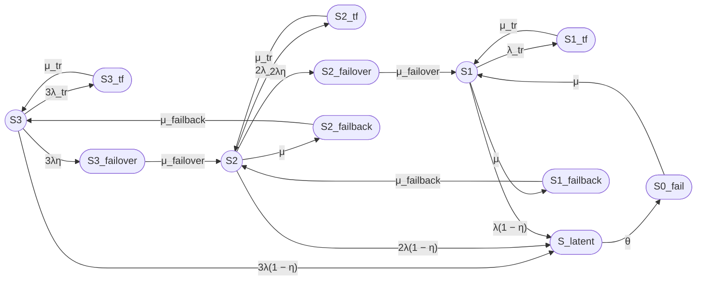
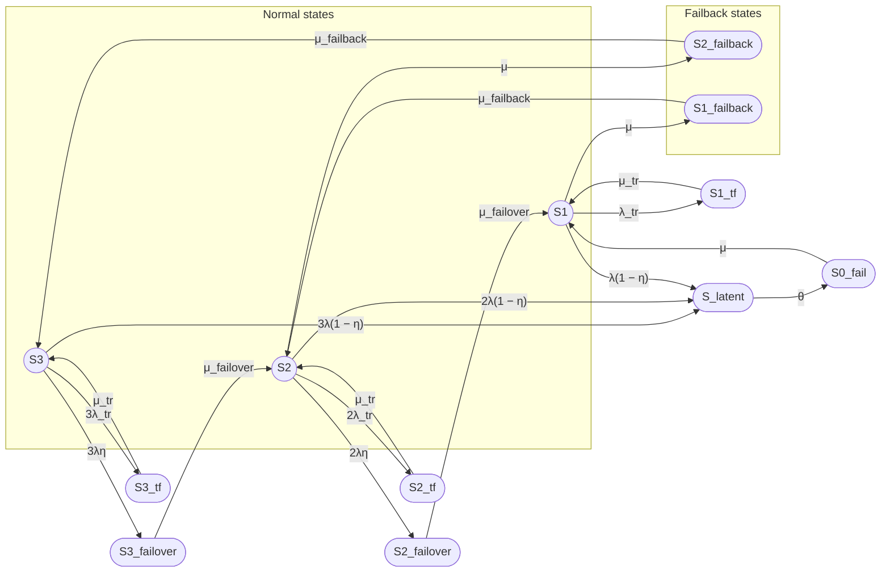
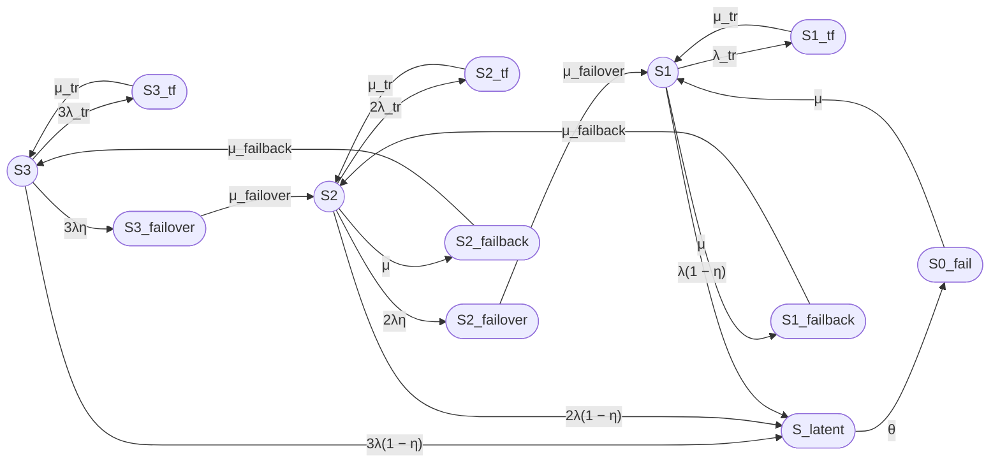
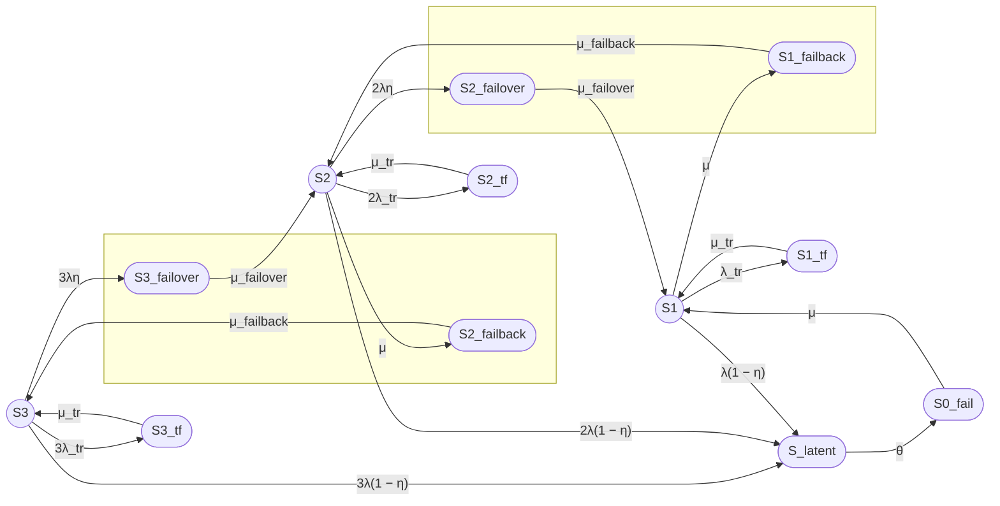
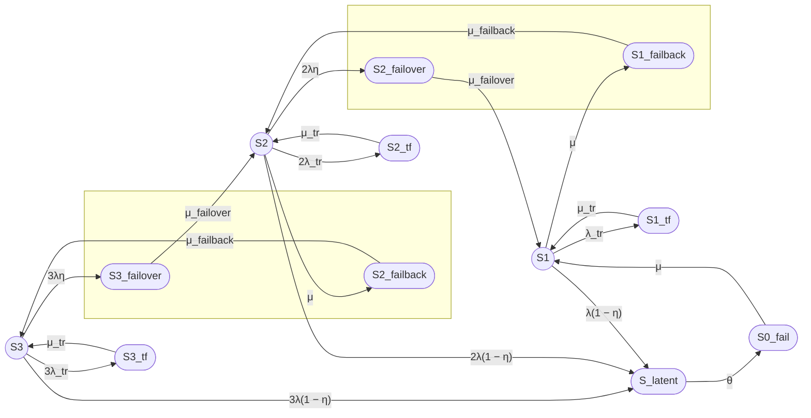

# 1
# Полный промпт для двенадцатипозиционной модели трехузлового кластера

## Задача

Построй модель надежности восстанавливаемого отказоустойчивого трехузлового кластера с одной ремонтной бригадой, временными сбоями, скрытыми отказами, операциями failover и failback.

---

## 1. Состояния модели

### Работоспособные состояния

- S3 — три узла работоспособны, отказов нет;
- S2 — два узла работоспособны, один узел отказал или находится в ремонте;
- S1 — один узел работоспособен, два узла отказали или находятся в ремонте.

### Неработоспособное состояние

- S0_fail — все три узла отказали, кластер неработоспособен.

### Временные сбои (Transient fault)

- S3_tf — временный сбой одного из трех узлов, два узла работоспособны;
- S2_tf — временный сбой одного из двух узлов, один узел работоспособен;
- S1_tf — временный сбой единственного работоспособного узла.

### Скрытые отказы (Latent)

- S_latent — скрытый отказ одного из работоспособных узлов (единое состояние для всех уровней деградации).

### Failover

**Понятие:** Failover — автоматическое переключение нагрузки с отказавшего узла на работоспособный.

- S3_failover — отказ одного из трех узлов, выполняется failover на один из двух оставшихся (переход S3 → S2);
- S2_failover — отказ одного из двух узлов, выполняется failover на последний узел (переход S2 → S1).

Из S1 failover невозможен, так как нет резервного узла для переключения нагрузки.

### Failback

**Понятие:** Failback — возврат восстановленного узла в конфигурацию кластера после ремонта.

- S2_failback — возврат первого восстановленного узла, переход S2 → S3;
- S1_failback — возврат второго восстановленного узла, переход S1 → S2.

**Всего в модели двенадцать состояний.**

---

## 2. Граф состояний


**Примечание:** Из S_latent исходит только одна дуга в S0_fail с интенсивностью θ, так как в случае скрытого отказа неважно, из какого состояния (S3, S2 или S1) произошел переход в S_latent — требуется единая процедура выявления отказа внешними средствами.

---

## 3. Переходы для трехузловой модели

### Переходы из S3

- S3 → S3_tf: 3λ_tr (временный сбой одного из трех узлов);
- S3_tf → S3: μ_tr;
- S3 → S3_failover: 3λη (мгновенно обнаруженный отказ одного из трех узлов);
- S3 → S_latent: 3λ(1 − η) (скрытый отказ одного из трех узлов);
- S3_failover → S2: μ_failover.

### Переходы из S2

- S2 → S2_tf: 2λ_tr (временный сбой одного из двух узлов);
- S2_tf → S2: μ_tr;
- S2 → S2_failover: 2λη (мгновенно обнаруженный отказ одного из двух узлов);
- S2 → S_latent: 2λ(1 − η) (скрытый отказ одного из двух узлов);
- S2 → S2_failback: μ (восстановление одного узла);
- S2_failover → S1: μ_failover;
- S2_failback → S3: μ_failback.

### Переходы из S1

- S1 → S1_tf: λ_tr (временный сбой единственного узла);
- S1_tf → S1: μ_tr;
- S1 → S_latent: λ(1 − η) (скрытый отказ единственного узла);
- S1 → S1_failback: μ (восстановление одного узла);
- S1_failback → S2: μ_failback.

### Переходы из S_latent

- S_latent → S0_fail: θ (обнаружение скрытого отказа внешним контролем).

### Восстановление из S0_fail

- S0_fail → S1: μ (восстановление одного из трех отказавших узлов).

---

## 4. Контроль отказов

Пусть:

- η — вероятность мгновенного обнаружения отказа узла средствами внутреннего контроля;
- 1 − η — вероятность того, что отказ остается скрытым;
- θ — интенсивность обнаружения скрытого отказа внешним периодическим контролем;
- 1 / θ — среднее время обнаружения скрытого отказа.

Для отказа одного из n узлов:

- интенсивность мгновенно обнаруживаемого отказа: nλη;
- интенсивность скрытого отказа: nλ(1 − η).

---

## 5. Временный сбой

Состояния S3_tf, S2_tf и S1_tf соответствуют временному сбою узла, который устраняется перезапуском.

Переходы:

- S3 → S3_tf: 3λ_tr;
- S3_tf → S3: μ_tr;
- S2 → S2_tf: 2λ_tr;
- S2_tf → S2: μ_tr;
- S1 → S1_tf: λ_tr;
- S1_tf → S1: μ_tr.

Среднее время перезапуска:

Ttr = 180 секунд

Интенсивность восстановления после временного сбоя:

μ_tr = 1 / Ttr.

---

## 6. Интенсивности и средние времена

Используй:

- λ — интенсивность постоянного отказа одного узла;
- λ_tr — интенсивность временного сбоя одного узла;
- μ_tr — интенсивность восстановления после временного сбоя;
- μ_failover — интенсивность завершения failover;
- μ — интенсивность восстановления узла;
- μ_failback — интенсивность завершения failback;
- θ — интенсивность обнаружения скрытого отказа.

Связь интенсивностей со средними временами:

- λ = 1 / MTBF;
- μ = 1 / MTTR;
- λ_tr = 1 / MTBFtr;
- μ_tr = 1 / Ttr;
- μ_failover = 1 / T_failover;
- μ_failback = 1 / T_failback;
- θ = 1 / T_detect.

---

## 7. Численный пример

Используй:

- MTBF одного узла = 30000 часов;
- MTTR одного узла = 24 часа;
- среднее время failover = 30 секунд;
- среднее время failback = 90 секунд;
- среднее время перезапуска после временного сбоя = 180 секунд;
- η = 0,99;
- среднее время обнаружения скрытого отказа = 8 часов;
- среднее время между временными сбоями одного узла = 1 год;
- одна ремонтная бригада.

Все времена приведи к секундам.

Прими:

- λ_tr = 1 / (365 × 24 × 3600);
- μ_tr = 1 / 180;
- θ = 1 / (8 × 3600).

---

## 8. Требуемый расчет

1. Сформулируй модель трехузлового кластера в терминах теории надежности.
2. Укажи работоспособные и неработоспособные состояния.
3. Построй граф состояний (Mermaid).
4. Составь матрицу генератора.
5. Выведи стационарные уравнения.
6. Найди стационарные вероятности.
7. Рассчитай:

   Kг,ст = P3 + P2 + P1.

8. Выполни численный расчет.
9. Отдельно опиши операции:
   - временного восстановления TF;
   - обнаружения latent;
   - failover;
   - failback.
10. Укажи ограничения модели.
11. Приведи примеры необнаруженного отказа в составе кластера и варианты внешнего контроля.

---

## 9. Требования к оформлению

### Граф состояний (Mermaid)

Используй синтаксис Mermaid flowchart LR:

- Работоспособные состояния обозначай окружностями: `((S))`;
- Неработоспособные состояния обозначай овалами: `([S])`;
- Направление графа: слева направо (LR);
- Подписи переходов оформляй в кавычках: `"интенсивность"`;
- Из S_latent в S0_fail должна быть только одна дуга с интенсивностью θ.

### Формулы

Предоставляй формулы в двух вариантах:

**Вариант 1, Unicode:**
Кг,ст = P3 + P2 + P1

**Вариант 2, LaTeX:**

$$
K_{\mathrm{г,ст}} = P_3 + P_2 + P_1
$$

### Таблицы

Используй Markdown-таблицы для представления:
- стационарных вероятностей;
- сравнения моделей;
- групп состояний.

### Группы состояний

Оформи группы состояний в виде списка:

- **Normal:** S3, S2, S1;
- **Transient fault:** S3_tf, S2_tf, S1_tf;
- **Latent:** S_latent;
- **Failover:** S3_failover, S2_failover;
- **Failback:** S2_failback, S1_failback;
- **System failure:** S0_fail.

### Итоговый раздел

В конце ответа оформи раздел «Итого» со следующими подразделами:

- Граф состояний;
- Легенда состояний;
- Группы состояний;
- Формулы (Unicode и LaTeX);
- Численный результат;
- Описание операций (TF, latent, failover, failback);
- Примеры необнаруженного отказа;
- Варианты внешнего контроля;
- Ограничения модели.

---

## 10. Дополнительные требования

- Укажи общее число состояний модели (12 состояний).
- Поясни, что означает «одна ремонтная бригада» и как это влияет на интенсивности восстановления.
- Поясни, почему из S_latent только один переход в S0_fail.
- Приведи ссылки на похожие модели надежности (k-out-of-n, coverage model и т.п.).

# 2

# Варианты размещения S2_failback и S1_failback на графе

## Вариант 1: Вертикальное размещение (сверху)

Разместить S2_failback над дугой S2 → S3, а S1_failback над дугой S1 → S2:


***

## Вариант 2: Под основными состояниями (снизу)

Разместить S2_failback и S1_failback под основными состояниями S3, S2, S1:


***

## Вариант 3: Сбоку от основных состояний (справа)

Разместить S2_failback и S1_failback справа от основных состояний:



***

## Вариант 4: Явное указание подграфов (subgraph)

Использовать подграфы для группировки состояний:



***

## Рекомендация

**Вариант 1 (вертикальное размещение сверху)** является наиболее оптимальным, так как:

1. S2_failback визуально располагается между S2 и S3;
2. S1_failback визуально располагается между S1 и S2;
3. Граф остается компактным и читаемым;
4. Направление переходов восстановления (S2 → S2_failback → S3 и S1 → S1_failback → S2) интуитивно понятно.

# 3

# Вертикальное ранжирование с использованием rankdir

Для вертикального ранжирования в Mermaid можно использовать директиву `rankdir` внутри подграфа или явное указание рангов через невидимые связи.

## Вариант: Вертикальное ранжирование с rankdir=TB



***

## Вариант: Явное указание рангов через подграфы



***

## Вариант: Комбинированный (невидимые связи + подграфы)



***

## Описание команд Mermaid

### 1. Невидимые связи

```mermaid
A ~~~ B
```

Создает невидимую связь между узлами A и B, которая влияет на расположение, но не отображается на графе.

### 2. Подграфы с направлением

```mermaid
subgraph Name["Label"]
    direction TB
    Node1
    Node2
end
```

Создает подграф с вертикальным направлением (TB = top-to-bottom), что заставляет узлы внутри подграфа располагаться вертикально.

### 3. Комбинирование

Для вертикального ранжирования S3_failover и S2_failback на одной вертикали, а S2_failover и S1_failback на другой:

```mermaid
subgraph Rank1[" "]
    direction TB
    S3_failover
    S2_failback
end

subgraph Rank2[" "]
    direction TB
    S2_failover
    S1_failback
end
```

Это разместит S3_failover над S2_failback, а S2_failover над S1_failback.
