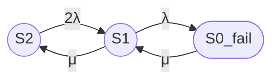

# 1
# Полный промпт для трехпозиционной модели двухузлового кластера

## Задача

Построй модель надежности восстанавливаемого отказоустойчивого двухузлового кластера с одной ремонтной бригадой.

---

## 1. Состояния модели

### Работоспособные состояния

- S2 — оба узла работоспособны, отказов нет;
- S1 — один узел работоспособен, второй узел отказал или находится в ремонте.

### Неработоспособное состояние

- S0_fail — оба узла отказали, кластер неработоспособен.

**Всего в модели три состояния.**

---

## 2. Граф состояний

---

## 3. Переходы для двухузловой модели

### Переходы из S2

- S2 → S1: 2λ (отказ одного из двух узлов).

### Переходы из S1

- S1 → S2: μ (восстановление отказавшего узла);
- S1 → S0_fail: λ (отказ единственного работоспособного узла).

### Переходы из S0_fail

- S0_fail → S1: μ (восстановление одного из двух отказавших узлов).

---

## 4. Интенсивности и средние времена

Используй:

- λ — интенсивность постоянного отказа одного узла;
- μ — интенсивность восстановления узла.

Связь интенсивностей со средними временами:

- λ = 1 / MTBF;
- μ = 1 / MTTR.

---

## 5. Численный пример

Используй:

- MTBF одного узла = 30000 часов;
- MTTR одного узла = 24 часа;
- одна ремонтная бригада.

Все времена приведи к секундам.

---

## 6. Требуемый расчет

1. Сформулируй модель двухузлового кластера в терминах теории надежности.
2. Укажи работоспособные и неработоспособные состояния.
3. Построй граф состояний (Mermaid).
4. Составь матрицу генератора.
5. Выведи стационарные уравнения.
6. Найди стационарные вероятности.
7. Рассчитай:

   Kг,ст = P2 + P1.

8. Выполни численный расчет.
9. Укажи ограничения модели.

---

## 7. Требования к оформлению

### Граф состояний (Mermaid)

Используй синтаксис Mermaid flowchart LR:

- Работоспособные состояния обозначай окружностями: `((S))`;
- Неработоспособные состояния обозначай овалами: `([S])`;
- Направление графа: слева направо (LR);
- Подписи переходов оформляй в кавычках: `"интенсивность"`.

### Формулы

Предоставляй формулы в двух вариантах:

**Вариант 1, Unicode:**
Кг,ст = P2 + P1

**Вариант 2, LaTeX:**
$$
K_{\mathrm{г,ст}} = P_2 + P_1
$$

### Таблицы

Используй Markdown-таблицы для представления:
- стационарных вероятностей;
- групп состояний.

### Группы состояний

Оформи группы состояний в виде списка:

- **Normal:** S2, S1;
- **System failure:** S0_fail.

### Итоговый раздел

В конце ответа оформи раздел «Итого» со следующими подразделами:

- Граф состояний;
- Легенда состояний;
- Группы состояний;
- Формулы (Unicode и LaTeX);
- Численный результат;
- Ограничения модели.

---

## 8. Дополнительные требования

- Укажи общее число состояний модели (3 состояния).
- Поясни, что означает «одна ремонтная бригада» и как это влияет на интенсивности восстановления.
- Приведи ссылки на похожие модели надежности (k-out-of-n и т.п.).
