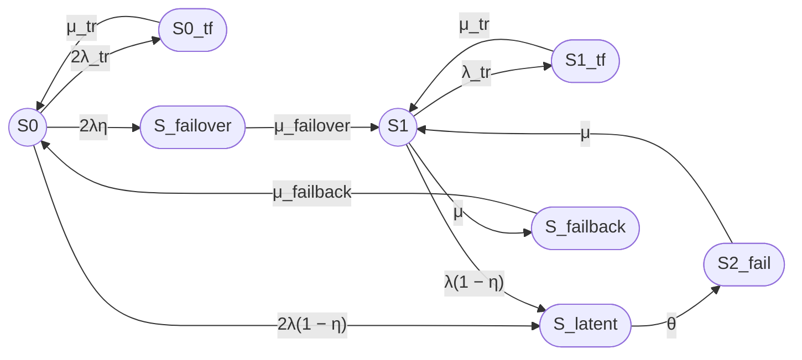

#1
Составь полный промпт для трехпозиционной модели (двухузлового кластера).
А ты составил для "для восьмипозиционной модели".  
В трехпозиционной модели - три состояния: S2 оба работают, S1 - один работает, S0_fail - 0 работают.  

Составь полный промпт для трехпозиционной модели (двухузлового кластера).
Нужен полный, т.е. без ссылок на предыдущие - т.е. с описанием условия и форматирования (с описанием формата визуализации ответа, mermaid, формул). 
Дополни промпт графом (mermaid в исходном \ простом варианте, т.к. предложенные тобой улучшения не работают).  

# Полный промпт для восьмипозиционной модели двухузлового кластера

## Задача

Построй модель надежности восстанавливаемого отказоустойчивого двухузлового кластера с одной ремонтной бригадой, временными сбоями, скрытыми отказами, операциями failover и failback.

---

## 1. Состояния модели

### Работоспособные состояния

- S0 — оба узла работоспособны, отказов нет;
- S1 — один узел работоспособен, второй узел отказал или находится в ремонте.

### Неработоспособное состояние

- S2_fail — оба узла отказали, кластер неработоспособен.

### Временные сбои (Transient fault)

- S0_tf — временный сбой одного из двух узлов, второй узел работоспособен;
- S1_tf — временный сбой единственного работоспособного узла.

### Скрытые отказы (Latent)

- S_latent — скрытый отказ одного из работоспособных узлов (единое состояние для всех уровней деградации).

### Failover

**Понятие:** Failover — автоматическое переключение нагрузки с отказавшего узла на работоспособный.

- S_failover — отказ одного из узлов, выполняется failover на оставшийся узел (переход S0 → S1).

Из S1 failover невозможен, так как нет резервного узла для переключения нагрузки.

### Failback

**Понятие:** Failback — возврат восстановленного узла в конфигурацию кластера после ремонта.

- S_failback — возврат восстановленного узла, переход S1 → S0.

**Всего в модели восемь состояний.**

---

## 2. Граф состояний

**Примечание:** Из S_latent исходит только одна дуга в S2_fail с интенсивностью θ, так как в случае скрытого отказа неважно, из какого состояния (S0 или S1) произошел переход в S_latent — требуется единая процедура выявления отказа внешними средствами.

---

## 3. Переходы для двухузловой модели

### Переходы из S0

- S0 → S0_tf: 2λ_tr (временный сбой одного из двух узлов);
- S0_tf → S0: μ_tr;
- S0 → S_failover: 2λη (мгновенно обнаруженный отказ одного из двух узлов);
- S0 → S_latent: 2λ(1 − η) (скрытый отказ одного из двух узлов);
- S_failover → S1: μ_failover.

### Переходы из S1

- S1 → S1_tf: λ_tr (временный сбой единственного узла);
- S1_tf → S1: μ_tr;
- S1 → S_latent: λ(1 − η) (скрытый отказ единственного узла);
- S1 → S_failback: μ (восстановление одного узла);
- S_failback → S0: μ_failback.

### Переходы из S_latent

- S_latent → S2_fail: θ (обнаружение скрытого отказа внешним контролем).

### Восстановление из S2_fail

- S2_fail → S1: μ (восстановление одного из двух отказавших узлов).

---

## 4. Контроль отказов

Пусть:

- η — вероятность мгновенного обнаружения отказа узла средствами внутреннего контроля;
- 1 − η — вероятность того, что отказ остается скрытым;
- θ — интенсивность обнаружения скрытого отказа внешним периодическим контролем;
- 1 / θ — среднее время обнаружения скрытого отказа.

Для отказа одного из n узлов:

- интенсивность мгновенно обнаруживаемого отказа: nλη;
- интенсивность скрытого отказа: nλ(1 − η).

---

## 5. Временный сбой

Состояния S0_tf и S1_tf соответствуют временному сбою узла, который устраняется перезапуском.

Переходы:

- S0 → S0_tf: 2λ_tr;
- S0_tf → S0: μ_tr;
- S1 → S1_tf: λ_tr;
- S1_tf → S1: μ_tr.

Среднее время перезапуска:

Ttr = 180 секунд

Интенсивность восстановления после временного сбоя:

μ_tr = 1 / Ttr.

---

## 6. Интенсивности и средние времена

Используй:

- λ — интенсивность постоянного отказа одного узла;
- λ_tr — интенсивность временного сбоя одного узла;
- μ_tr — интенсивность восстановления после временного сбоя;
- μ_failover — интенсивность завершения failover;
- μ — интенсивность восстановления узла;
- μ_failback — интенсивность завершения failback;
- θ — интенсивность обнаружения скрытого отказа.

Связь интенсивностей со средними временами:

- λ = 1 / MTBF;
- μ = 1 / MTTR;
- λ_tr = 1 / MTBFtr;
- μ_tr = 1 / Ttr;
- μ_failover = 1 / T_failover;
- μ_failback = 1 / T_failback;
- θ = 1 / T_detect.

---

## 7. Численный пример

Используй:

- MTBF одного узла = 30000 часов;
- MTTR одного узла = 24 часа;
- среднее время failover = 30 секунд;
- среднее время failback = 90 секунд;
- среднее время перезапуска после временного сбоя = 180 секунд;
- η = 0,99;
- среднее время обнаружения скрытого отказа = 8 часов;
- среднее время между временными сбоями одного узла = 1 год;
- одна ремонтная бригада.

Все времена приведи к секундам.

Прими:

- λ_tr = 1 / (365 × 24 × 3600);
- μ_tr = 1 / 180;
- θ = 1 / (8 × 3600).

---

## 8. Требуемый расчет

1. Сформулируй модель двухузлового кластера в терминах теории надежности.
2. Укажи работоспособные и неработоспособные состояния.
3. Построй граф состояний (Mermaid).
4. Составь матрицу генератора.
5. Выведи стационарные уравнения.
6. Найди стационарные вероятности.
7. Рассчитай:

   Kг,ст = P0 + P1.

8. Выполни численный расчет.
9. Отдельно опиши операции:
   - временного восстановления TF;
   - обнаружения latent;
   - failover;
   - failback.
10. Укажи ограничения модели.
11. Приведи примеры необнаруженного отказа в составе кластера и варианты внешнего контроля.

---

## 9. Требования к оформлению

### Граф состояний (Mermaid)

Используй синтаксис Mermaid flowchart LR:

- Работоспособные состояния обозначай окружностями: `((S))`;
- Неработоспособные состояния обозначай овалами: `([S])`;
- Направление графа: слева направо (LR);
- Подписи переходов оформляй в кавычках: `"интенсивность"`;
- Из S_latent в S2_fail должна быть только одна дуга с интенсивностью θ.

### Формулы

Предоставляй формулы в двух вариантах:

**Вариант 1, Unicode:**
Кг,ст = P0 + P1

**Вариант 2, LaTeX:**
$$
K_{\mathrm{г,ст}} = P_0 + P_1
$$

### Таблицы

Используй Markdown-таблицы для представления:
- стационарных вероятностей;
- сравнения моделей;
- групп состояний.

### Группы состояний

Оформи группы состояний в виде списка:

- **Normal:** S0, S1;
- **Transient fault:** S0_tf, S1_tf;
- **Latent:** S_latent;
- **Failover:** S_failover;
- **Failback:** S_failback;
- **System failure:** S2_fail.

### Итоговый раздел

В конце ответа оформи раздел «Итого» со следующими подразделами:

- Граф состояний;
- Легенда состояний;
- Группы состояний;
- Формулы (Unicode и LaTeX);
- Численный результат;
- Описание операций (TF, latent, failover, failback);
- Примеры необнаруженного отказа;
- Варианты внешнего контроля;
- Ограничения модели.

---

## 10. Дополнительные требования

- Укажи общее число состояний модели (8 состояний).
- Поясни, что означает «одна ремонтная бригада» и как это влияет на интенсивности восстановления.
- Поясни, почему из S_latent только один переход в S2_fail.
- Приведи ссылки на похожие модели надежности (k-out-of-n, coverage model и т.п.).

