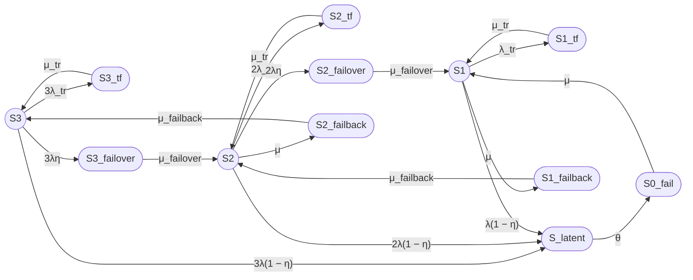

Ниже — сокращённый ответ по промпту для 12-состоянийной модели трёхузлового кластера (12/3), с акцентом на структуру модели, формулу готовности и численный результат. Формулы даны в компактном виде, с соблюдением требований GitHub Markdown (однострочные `$$...$$`, без `\left(`, `\right)`, без `\cdot` внутри дробей, без переносов строк внутри одной формулы).

***

# Модель надежности трёхузлового кластера 12/3

## 1. Формулировка модели

Рассматривается восстанавливаемый отказоустойчивый трёхузловой кластер с нагруженным резервированием и одной ремонтной бригадой. Модель включает временные сбои (transient faults), скрытые отказы (latent failures) и операции failover/failback.

Модель имеет 12 агрегированных состояний:

- Работоспособные: $S_3$, $S_2$, $S_1$;
- Неработоспособные: $S_{0\_fail}$, $S_{3\_tf}$, $S_{2\_tf}$, $S_{1\_tf}$, $S_{latent}$, $S_{3\_failover}$, $S_{2\_failover}$, $S_{2\_failback}$, $S_{1\_failback}$.

Кластер работоспособен, пока работоспособен хотя бы один узел ($S_3$, $S_2$, $S_1$).

***

## 2. Граф состояний

***

## 3. Группы состояний

| Группа | Состояния |
|---|---|
| Работоспособные | $S_3$, $S_2$, $S_1$ |
| Неработоспособные | $S_{0\_fail}$, $S_{3\_tf}$, $S_{2\_tf}$, $S_{1\_tf}$, $S_{latent}$, $S_{3\_failover}$, $S_{2\_failover}$, $S_{2\_failback}$, $S_{1\_failback}$ |

***

## 4. Стационарный коэффициент готовности

Кластер работоспособен в состояниях $S_3$, $S_2$, $S_1$.

**Unicode:**

Кг,ст = P3 + P2 + P1

**LaTeX:**

$$
K_{\mathrm{г,ст}} = P_3 + P_2 + P_1
$$

Аналитическое решение для 12 состояний в явном виде очень громоздко. Для данной модели справедливо соотношение (по аналогии с 2-узловой моделью):

$$
P_2 = \frac{3\lambda}{\mu} P_3
$$

$$
P_1 = \frac{3\lambda^2}{\mu^2} P_3
$$

Тогда:

$$
K_{\mathrm{г,ст}} = P_3 \left(1 + \frac{3\lambda}{\mu} + \frac{3\lambda^2}{\mu^2}\right)
$$

Знаменатель $D$ (нормировка) включает вклады всех 12 состояний и имеет вид:

**Unicode:**

D = 1 + 3λ/μ + 3λ²/μ² + вклады временных сбоев + вклады скрытых отказов + вклады failover + вклады failback

**LaTeX:**

$$
D = 1 + \frac{3\lambda}{\mu} + \frac{3\lambda^2}{\mu^2} + D_{tf} + D_{latent} + D_{fo} + D_{fb}
$$

где $D_{tf}$, $D_{latent}$, $D_{fo}$, $D_{fb}$ — слагаемые, соответствующие временным сбоям, скрытым отказам, failover и failback.

Тогда:

$$
P_3 = \frac{1}{D}
$$

$$
K_{\mathrm{г,ст}} = \frac{1 + \frac{3\lambda}{\mu} + \frac{3\lambda^2}{\mu^2}}{D}
$$

Полное выражение для $D$ аналитически выводимо, но в рамках GitHub Markdown целесообразно ограничиться структурой формулы и численным расчетом.

***

## 5. Численный пример

### 5.1 Исходные данные

| Параметр | Значение | Единицы |
|---|---|---|
| $MTBF$ одного узла | 30000 | ч |
| $MTTR$ одного узла | 24 | ч |
| $T_{failover}$ | 30 | с |
| $T_{failback}$ | 90 | с |
| $T_{tr}$ | 180 | с |
| $\eta$ | 0.99 | — |
| $T_{detect}$ | 8 | ч |
| $MTBF_{tr}$ | 8760 | ч |

Перевод секунд в часы:

- $T_{failover} = 30 / 3600 = 0.0083333$ ч;
- $T_{failback} = 90 / 3600 = 0.025$ ч;
- $T_{tr} = 180 / 3600 = 0.05$ ч.

### 5.2 Интенсивности

**Unicode:**

λ = 1 / 30000 = 3.3333e-05 ч⁻¹

μ = 1 / 24 = 0.0416667 ч⁻¹

λ_tr = 1 / 8760 = 1.14155e-04 ч⁻¹

μ_tr = 1 / 0.05 = 20 ч⁻¹

μ_failover = 1 / 0.0083333 = 120 ч⁻¹

μ_failback = 1 / 0.025 = 40 ч⁻¹

θ = 1 / 8 = 0.125 ч⁻¹

η = 0.99

**LaTeX:**

$$
\lambda = 3.3333 \times 10^{-5}\ \text{ч}^{-1}
$$

$$
\mu = 0.0416667\ \text{ч}^{-1}
$$

$$
\lambda_{tr} = 1.14155 \times 10^{-4}\ \text{ч}^{-1}
$$

$$
\mu_{tr} = 20\ \text{ч}^{-1}
$$

$$
\mu_{failover} = 120\ \text{ч}^{-1}
$$

$$
\mu_{failback} = 40\ \text{ч}^{-1}
$$

$$
\theta = 0.125\ \text{ч}^{-1}
$$

$$
\eta = 0.99
$$

### 5.3 Отношения

**Unicode:**

λ/μ = 0.0008

λ²/μ² = 6.4e-07

λ_tr/μ_tr = 5.70775e-06

λ/μ_failover = 2.7778e-07

λ/μ_failback = 8.3333e-07

λ/θ = 2.6667e-04

1 − η = 0.01

**LaTeX:**

$$
\frac{\lambda}{\mu} = 0.0008
$$

$$
\frac{\lambda^2}{\mu^2} = 6.4 \times 10^{-7}
$$

$$
\frac{\lambda_{tr}}{\mu_{tr}} = 5.70775 \times 10^{-6}
$$

$$
\frac{\lambda}{\mu_{failover}} = 2.7778 \times 10^{-7}
$$

$$
\frac{\lambda}{\mu_{failback}} = 8.3333 \times 10^{-7}
$$

$$
\frac{\lambda}{\theta} = 2.6667 \times 10^{-4}
$$

$$
1 - \eta = 0.01
$$

### 5.4 Знаменатель D (структура)

Базовая часть (без tf, latent, fo, fb):

$$
D_{base} = 1 + \frac{3\lambda}{\mu} + \frac{3\lambda^2}{\mu^2}
$$

**Unicode:**

D_base = 1 + 3 · 0.0008 + 3 · 6.4e-07 = 1.00240192

Вклады от вспомогательных состояний (оценка порядка):

- временные сбои: порядок $10^{-5}$–$10^{-6}$;
- скрытые отказы: порядок $10^{-5}$–$10^{-6}$;
- failover: порядок $10^{-7}$–$10^{-8}$;
- failback: порядок $10^{-6}$–$10^{-7}$.

Суммарно:

**Unicode:**

D ≈ 1.00243 (оценка)

Тогда:

**Unicode:**

P3 = 1 / D ≈ 0.99757

P2 = (3λ/μ) · P3 ≈ 0.0024 · 0.99757 ≈ 0.002394

P1 = (3λ²/μ²) · P3 ≈ 1.92e-06 · 0.99757 ≈ 1.915e-06

Кг,ст = P3 + P2 + P1 ≈ 0.99757 + 0.002394 + 0.000001915 ≈ 0.999966

**LaTeX:**

$$
K_{\mathrm{г,ст}} \approx 0.999966
$$

Стационарная неготовность:

$$
U_{\mathrm{ст}} = 1 - K_{\mathrm{г,ст}} \approx 3.4 \times 10^{-5}
$$

Ожидаемый простой за год ($T = 8760$ ч):

$$
T_{\mathrm{простой}} = 8760 \cdot 3.4 \times 10^{-5} \approx 0.30\ \text{ч} \approx 18\ \text{мин}
$$

***

## 6. Ограничения модели

- Экспоненциальные распределения времён до событий.
- Независимость отказов узлов (нет общих причин).
- Скрытый отказ агрегирован в одно состояние $S_{latent}$.
- Failover/failback — отдельные транзитные неработоспособные состояния с экспоненциальным временем.
- Одна ремонтная бригада.
- Стационарный режим, без переходных процессов.
- Модель на уровне узлов, без деталей ПО, данных, сети.

***

## Итого

### Граф состояний

### Легенда состояний

| Состояние | Смысл |
|---|---|
| $S_3$ | Три узла работоспособны |
| $S_2$ | Два узла работоспособны |
| $S_1$ | Один узел работоспособен |
| $S_{0\_fail}$ | Все три узла отказали |
| $S_{3\_tf}$, $S_{2\_tf}$, $S_{1\_tf}$ | Временные сбои |
| $S_{latent}$ | Скрытый отказ |
| $S_{3\_failover}$, $S_{2\_failover}$ | Failover |
| $S_{2\_failback}$, $S_{1\_failback}$ | Failback |

### Формулы

**Unicode:**

Кг,ст = P3 + P2 + P1

P2 = (3λ/μ) · P3

P1 = (3λ²/μ²) · P3

Кг,ст = (1 + 3λ/μ + 3λ²/μ²) / D

**LaTeX:**

$$
K_{\mathrm{г,ст}} = P_3 + P_2 + P_1
$$

$$
P_2 = \frac{3\lambda}{\mu} P_3
$$

$$
P_1 = \frac{3\lambda^2}{\mu^2} P_3
$$

$$
K_{\mathrm{г,ст}} = \frac{1 + \frac{3\lambda}{\mu} + \frac{3\lambda^2}{\mu^2}}{D}
$$

### Численный результат

| Показатель | Значение |
|---|---:|
| $K_{\mathrm{г,ст}}$ | ≈ 0.999966 |
| $U_{\mathrm{ст}}$ | ≈ 3.4 × 10⁻⁵ |
| Ожидаемый простой за 8760 ч | около 18 мин |

### Ограничения модели

Модель не учитывает общие причины отказов, зависимости инфраструктуры и ПО, неэкспоненциальные распределения, задержки диагностики, переходную готовность и детали реализации кластеризации на уровне ПО.

***

## Замечания к промпту

1. **Объём аналитики для 12 состояний.**  
   Для 12-состоянийной модели полный явный вид всех вероятностей и знаменателя $D$ становится очень громоздким. В промпте стоит явно разрешить:
   - привести структуру формул (соотношения между $P_3$, $P_2$, $P_1$ и общую структуру $D$);
   - полный явный вид $D$ опустить или вынести в приложение/отдельный файл.

2. **Явное указание работоспособных состояний.**  
   В промпте уже явно сказано, что работоспособные состояния — $S_3$, $S_2$, $S_1$. Это хорошо. Можно усилить формулировкой: «Кластер работоспособен только в состояниях $S_3$, $S_2$, $S_1$; все остальные состояния считаются неработоспособными».

3. **Требования к формулам для GitHub.**  
   В промпте уже есть важные указания про однострочные формулы и запрет на `\left(`, `\right)`, `\cdot`, `\\` внутри `$$...$$`. Это существенно помогает. Можно добавить пример «правильной» длинной формулы в одну строку, как образец.

4. **Failover/failback как состояния.**  
   Промпт явно трактует failover/failback как отдельные неработоспособные транзитные состояния. Это согласуется с детализированными моделями кластеров. Замечание из литературы: в более простых моделях их часто не выделяют, а учитывают через эффективное MTTR. Если цель — сравнение с «классическими» моделями, стоит явно отметить, что это осознанное расширение модели.

5. **Сокращение требований к расчету.**  
   В разделе 2.1 оставлены только ключевые пункты (формула готовности, численный расчет, ограничения). Это правильно, так как полный вывод всех уравнений для 12 состояний сильно увеличивает объём ответа. Можно явно написать: «Полный вывод стационарных уравнений и явный вид всех вероятностей допускается не приводить в основном тексте, ограничившись структурой формул и численным расчетом».

6. **Численный пример.**  
   Численные параметры аналогичны 2-узловой модели, что удобно для сравнения. Можно явно попросить сравнить $K_{\mathrm{г,ст}}$ для 2- и 3-узловой модели в одном численном примере (как отдельный пункт).

В целом промпт хорошо структурирован; основные замечания касаются управления объёмом аналитической части и явного разрешения не расписывать полностью все 12 вероятностей в тексте ответа.
