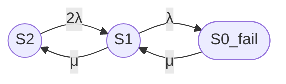

Результаты:

- \(\lambda = 3.3333 \times 10^{-5} \ \text{ч}^{-1}\);
- \(\mu = 0.0416667 \ \text{ч}^{-1}\);
- \(\rho = 0.0008\);
- \(D = 1.00160128\).

Стационарные вероятности:

| Состояние | Обозначение | Вероятность (численно) |
|-----------|-------------|-------------------------|
| Оба узла работоспособны | \(P_2\) | 0.99840128 |
| Один узел работоспособен | \(P_1\) | 0.00159744 |
| Оба узла отказали | \(P_0\) | 1.278 × 10⁻⁶ |

Стационарный коэффициент готовности:

**Вариант 1, Unicode:**  
Кг,ст ≈ 0.99999872

**Вариант 2, LaTeX:**

\[
K_{\mathrm{г,ст}} \approx 0.99999872
\]

Это соответствует недоступности (unavailability):

\[
U_{\mathrm{ст}} = 1 - K_{\mathrm{г,ст}} \approx 1.278 \times 10^{-6}.
\]

В пересчете на год (8760 часов):

\[
\text{Ожидаемое время простоя в год} \approx 8760 \cdot 1.278 \times 10^{-6} \approx 0.0112 \ \text{часа} \approx 40 \ \text{секунд}.
\]

***

## 8 Ограничения модели

1. Экспоненциальность распределений: предполагается, что времена до отказа и времена восстановления экспоненциально распределены (постоянные \(\lambda\) и \(\mu\)). [link.springer](https://link.springer.com/chapter/10.1007/978-3-662-05409-3_6)
2. Одна ремонтная бригада: одновременно восстанавливается только один узел; при двух одновременных отказах второй узел ждет окончания ремонта первого. [link.springer](https://link.springer.com/chapter/10.1007/978-3-662-05409-3_6)
3. Нагруженное резервирование: оба узла находятся под нагрузкой и имеют одинаковую интенсивность отказа \(\lambda\); модель не учитывает холодный или теплый резерв с другими параметрами отказа. [metricgate](https://metricgate.com/docs/markov-availability-repairable-system/)
4. Мгновенное обнаружение отказа и начало ремонта: не учитываются задержки на диагностику, логистику, ожидание запчастей и т.п. [link.springer](https://link.springer.com/chapter/10.1007/978-3-662-05409-3_6)
5. Независимость отказов: отказы узлов считаются независимыми событиями; не учитываются общие причины отказов (common cause failures). [link.springer](https://link.springer.com/chapter/10.1007/978-3-662-05409-3_6)
6. Стационарный режим: расчет выполнен для предельного стационарного режима (\(t \to \infty\)); переходные процессы не рассматриваются. [link.springer](https://link.springer.com/chapter/10.1007/978-3-662-05409-3_6)
7. Идентичность узлов: оба узла предполагаются идентичными по надежности и ремонтопригодности. [metricgate](https://metricgate.com/docs/markov-availability-repairable-system/)

***

## Итого

### Граф состояний

### Легенда состояний

| Обозначение | Описание | Тип состояния |
|-------------|----------|---------------|
| \(S_2\) | Оба узла работоспособны | Работоспособное |
| \(S_1\) | Один узел работоспособен, второй в ремонте | Работоспособное |
| \(S_{0\_fail}\) | Оба узла отказали, кластер неработоспособен | Неработоспособное |

### Группы состояний

| Группа | Состояния | Смысл |
|--------|-----------|-------|
| Работоспособные | \(S_2, S_1\) | Кластер выполняет функцию |
| Неработоспособные | \(S_{0\_fail}\) | Кластер не выполняет функцию |

### Формулы

**Стационарные вероятности (через \(\rho = \lambda/\mu\)):**

- Unicode:  
  P2 = 1 / (1 + 2ρ + 2ρ²)  
  P1 = 2ρ / (1 + 2ρ + 2ρ²)  
  P0 = 2ρ² / (1 + 2ρ + 2ρ²)

- LaTeX:

\[
P_2 = \frac{1}{1 + 2\rho + 2\rho^2}, \quad
P_1 = \frac{2\rho}{1 + 2\rho + 2\rho^2}, \quad
P_{0} = \frac{2\rho^2}{1 + 2\rho + 2\rho^2}.
\]

**Коэффициент готовности:**

- Unicode:  
  Кг,ст = P2 + P1 = (1 + 2ρ) / (1 + 2ρ + 2ρ²)

- LaTeX:

\[
K_{\mathrm{г,ст}} = P_2 + P_1 = \frac{1 + 2\rho}{1 + 2\rho + 2\rho^2}.
\]

### Численный результат

При MTBF = 30000 ч, MTTR = 24 ч:

- \(\lambda = 3.3333 \times 10^{-5} \ \text{ч}^{-1}\);
- \(\mu = 0.0416667 \ \text{ч}^{-1}\);
- \(\rho = 0.0008\);

Стационарные вероятности:

| Состояние | Вероятность |
|-----------|-------------|
| \(P_2\) | 0.99840128 |
| \(P_1\) | 0.00159744 |
| \(P_0\) | 1.278 × 10⁻⁶ |

Стационарный коэффициент готовности:

- Unicode:  
  Кг,ст ≈ 0.99999872

- LaTeX:

\[
K_{\mathrm{г,ст}} \approx 0.99999872.
\]

### Ограничения модели

- Экспоненциальные времена отказа и восстановления;  
- Одна ремонтная бригада, последовательный ремонт;  
- Нагруженное резервирование, идентичные узлы;  
- Мгновенное обнаружение и начало ремонта;  
- Независимость отказов, без общих причин;  
- Стационарный режим, без переходных процессов. [link.springer](https://link.springer.com/chapter/10.1007/978-3-662-05409-3_6)
