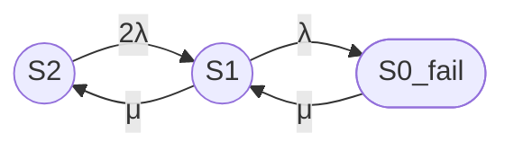
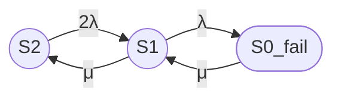

# Модель надежности двухузлового кластера 3/2

## 1. Назначение модели

Рассматривается восстанавливаемый отказоустойчивый двухузловой кластер с нагруженным резервированием и одной ремонтной бригадой.

Модель имеет три агрегированных состояния:

- $S_2$ — оба узла работоспособны;
- $S_1$ — один узел работоспособен, второй отказал и находится в ремонте;
- $S_{0\_fail}$ — оба узла отказали, кластер неработоспособен.

Кластер сохраняет работоспособность, пока работоспособен хотя бы один из двух узлов.

---

## 2. Допущения

1. Узлы идентичны по надежности и ремонтопригодности.
2. Отказы узлов независимы.
3. Время до отказа каждого узла имеет экспоненциальное распределение с постоянной интенсивностью отказа $\lambda$.
4. Время восстановления узла имеет экспоненциальное распределение с постоянной интенсивностью восстановления $\mu$.
5. Используется нагруженное резервирование: оба узла функционируют и могут отказать в состоянии $S_2$.
6. Имеется одна ремонтная бригада, поэтому одновременно восстанавливается не более одного отказавшего узла.
7. Обнаружение отказа, переключение сервиса и запуск ремонта считаются мгновенными.
8. Не учитываются отказы общей причины, ошибки ПО, сетевые отказы, отказы кворума, задержки поставки запчастей и плановые работы.

---

## 3. Интенсивности и средние времена

Обозначения:

- $\lambda$ — интенсивность отказа одного узла, $ч^{-1}$;
- $\mu$ — интенсивность восстановления одного узла, $ч^{-1}$;
- $MTBF$ — средняя наработка до отказа одного узла, ч;
- $MTTR$ — среднее время восстановления одного узла, ч.

Связь между интенсивностями и средними временами:

**Unicode:**

λ = 1 / MTBF

μ = 1 / MTTR

**LaTeX:**

$$
\lambda = \frac{1}{MTBF}
$$

$$
\mu = \frac{1}{MTTR}
$$

---

## 4. Состояния модели

| Состояние | Число работоспособных узлов | Описание | Работоспособность кластера |
|---|---:|---|---|
| $S_2$ | 2 | Оба узла исправны, отказов нет | Работоспособен |
| $S_1$ | 1 | Один узел исправен, второй отказал и ремонтируется | Работоспособен |
| $S_{0\_fail}$ | 0 | Оба узла отказали; один узел ремонтируется, второй ожидаем ремонта | Неработоспособен |

---

## 5. Группы состояний

| Группа | Состояния | Интерпретация |
|---|---|---|
| Работоспособные | $S_2$, $S_1$ | Кластер способен предоставлять требуемую функцию |
| Неработоспособные | $S_{0\_fail}$ | Кластер не способен предоставлять требуемую функцию |

---

## 6. Граф состояний

---

## 7. Переходы между состояниями

| Исходное состояние | Конечное состояние | Интенсивность | Смысл перехода |
|---|---|---:|---|
| $S_2$ | $S_1$ | $2\lambda$ | Отказ одного из двух работоспособных узлов |
| $S_1$ | $S_2$ | $\mu$ | Восстановление отказавшего узла |
| $S_1$ | $S_{0\_fail}$ | $\lambda$ | Отказ единственного оставшегося работоспособного узла |
| $S_{0\_fail}$ | $S_1$ | $\mu$ | Восстановление одного из двух отказавших узлов |

В состоянии $S_2$ суммарная интенсивность отказов равна $2\lambda$, поскольку в работе находятся два независимых узла.

В состоянии $S_{0\_fail}$ действует одна ремонтная бригада. Поэтому интенсивность перехода в $S_1$ равна $\mu$, а не $2\mu$.

---

## 8. Матрица генератора CTMC

Порядок состояний:

$$
[S_2,\ S_1,\ S_{0\_fail}]
$$

Матрица генератора непрерывной марковской цепи:

$$
Q =
\begin{pmatrix}
-2\lambda & 2\lambda & 0 \\
\mu & -(\mu + \lambda) & \lambda \\
0 & \mu & -\mu
\end{pmatrix}
$$

Элемент $q_{ij}$ при $i \ne j$ задает интенсивность перехода из состояния $i$ в состояние $j$.

Диагональный элемент определяется условием:

$$
q_{ii} = -\sum_{j \ne i} q_{ij}
$$

---

## 9. Стационарные уравнения

Обозначим стационарные вероятности:

- $P_2 = P(S_2)$;
- $P_1 = P(S_1)$;
- $P_0 = P(S_{0\_fail})$.

Условие стационарности:

$$
\boldsymbol{P}Q = 0
$$

Нормировочное условие:

$$
P_2 + P_1 + P_0 = 1
$$

Система уравнений баланса:

$$
-2\lambda P_2 + \mu P_1 = 0
$$

$$
2\lambda P_2 - (\mu + \lambda)P_1 + \mu P_0 = 0
$$

$$
\lambda P_1 - \mu P_0 = 0
$$

$$
P_2 + P_1 + P_0 = 1
$$

Из уравнений локального баланса следуют зависимости:

$$
P_1 = \frac{2\lambda}{\mu} P_2
$$

$$
P_0 = \frac{\lambda}{\mu} P_1
$$

$$
P_0 = \frac{2\lambda^2}{\mu^2} P_2
$$

---

## 10. Стационарные вероятности

Введем безразмерное отношение интенсивностей:

**Unicode:**

ρ = λ / μ

**LaTeX:**

$$
\rho = \frac{\lambda}{\mu}
$$

Тогда стационарные вероятности имеют вид:

**Unicode:**

P2 = 1 / (1 + 2ρ + 2ρ²)

P1 = 2ρ / (1 + 2ρ + 2ρ²)

P0 = 2ρ² / (1 + 2ρ + 2ρ²)

**LaTeX:**

$$
P_2 = \frac{1}{1 + 2\rho + 2\rho^2}
$$

$$
P_1 = \frac{2\rho}{1 + 2\rho + 2\rho^2}
$$

$$
P_0 = \frac{2\rho^2}{1 + 2\rho + 2\rho^2}
$$

| Состояние | Стационарная вероятность |
|---|---|
| $S_2$ | $P_2 = \dfrac{1}{1 + 2\rho + 2\rho^2}$ |
| $S_1$ | $P_1 = \dfrac{2\rho}{1 + 2\rho + 2\rho^2}$ |
| $S_{0\_fail}$ | $P_0 = \dfrac{2\rho^2}{1 + 2\rho + 2\rho^2}$ |

---

## 11. Стационарный коэффициент готовности

Работоспособными являются состояния $S_2$ и $S_1$.

**Unicode:**

Кг,ст = P2 + P1

Кг,ст = 1 - P0

Кг,ст = (1 + 2ρ) / (1 + 2ρ + 2ρ²)

**LaTeX:**

$$
K_{\mathrm{г,ст}} = P_2 + P_1
$$

$$
K_{\mathrm{г,ст}} = 1 - P_0
$$

$$
K_{\mathrm{г,ст}} =
\frac{1 + 2\rho}
{1 + 2\rho + 2\rho^2}
$$

### 11.1 Формула через $\lambda$ и $\mu$

**Unicode:**

ρ = λ / μ

Кг,ст = (1 + 2λ/μ) / (1 + 2λ/μ + 2(λ/μ)²)

Кг,ст = (μ² + 2λμ) / (μ² + 2λμ + 2λ²)

**LaTeX:**

$$
K_{\mathrm{г,ст}} =
\frac{1 + 2\dfrac{\lambda}{\mu}}
{1 + 2\dfrac{\lambda}{\mu} + 2\left(\dfrac{\lambda}{\mu}\right)^2}
$$

$$
K_{\mathrm{г,ст}} =
\frac{\mu^2 + 2\lambda\mu}
{\mu^2 + 2\lambda\mu + 2\lambda^2}
$$

Стационарная неготовность:

**Unicode:**

Uст = 1 - Кг,ст = P0

**LaTeX:**

$$
U_{\mathrm{ст}} = 1 - K_{\mathrm{г,ст}} = P_0
$$

$$
U_{\mathrm{ст}} =
\frac{2\rho^2}
{1 + 2\rho + 2\rho^2}
$$

---

## 12. Численный пример

### 12.1 Исходные данные

| Параметр | Значение |
|---|---:|
| $MTBF$ одного узла | 30000 ч |
| $MTTR$ одного узла | 24 ч |
| Число узлов | 2 |
| Число ремонтных бригад | 1 |
| Вид резервирования | Нагруженное |

### 12.2 Интенсивности

**Unicode:**

λ = 1 / 30000 = 0.0000333333 ч⁻¹

μ = 1 / 24 = 0.0416667 ч⁻¹

ρ = λ / μ = 0.0008

**LaTeX:**

$$
\lambda = \frac{1}{30000} =
3.3333 \times 10^{-5}\ \text{ч}^{-1}
$$

$$
\mu = \frac{1}{24} =
0.0416667\ \text{ч}^{-1}
$$

$$
\rho =
\frac{\lambda}{\mu} =
\frac{24}{30000} =
0.0008
$$

### 12.3 Стационарные вероятности

Знаменатель:

$$
D = 1 + 2\rho + 2\rho^2
$$

$$
D = 1 + 2 \cdot 0.0008 + 2 \cdot (0.0008)^2
$$

$$
D = 1.00160128
$$

| Состояние | Формула | Численное значение |
|---|---|---:|
| $S_2$ | $P_2 = \dfrac{1}{D}$ | 0.9984012800 |
| $S_1$ | $P_1 = \dfrac{2\rho}{D}$ | 0.0015974420 |
| $S_{0\_fail}$ | $P_0 = \dfrac{2\rho^2}{D}$ | $1.2779536 \times 10^{-6}$ |

Проверка нормировки:

$$
P_2 + P_1 + P_0 = 1
$$

### 12.4 Коэффициент готовности

**Unicode:**

Кг,ст = P2 + P1

Кг,ст = 0.9984012800 + 0.0015974420

Кг,ст = 0.9999987220

**LaTeX:**

$$
K_{\mathrm{г,ст}} = P_2 + P_1
$$

$$
K_{\mathrm{г,ст}} =
0.9984012800 + 0.0015974420
$$

$$
K_{\mathrm{г,ст}} = 0.9999987220
$$

Стационарная неготовность:

**Unicode:**

Uст = 1 - Кг,ст = 0.00000127795

**LaTeX:**

$$
U_{\mathrm{ст}} =
1 - K_{\mathrm{г,ст}} =
1.2779536 \times 10^{-6}
$$

### 12.5 Ожидаемый простой за год

При длительности года $T = 8760$ ч ожидаемая продолжительность неготовности:

$$
T_{\mathrm{простой}} =
T \cdot U_{\mathrm{ст}}
$$

$$
T_{\mathrm{простой}} =
8760 \cdot 1.2779536 \times 10^{-6}
$$

$$
T_{\mathrm{простой}} \approx 0.0112\ \text{ч}
$$

$$
T_{\mathrm{простой}} \approx 40.3\ \text{с}
$$

---

## 13. Ограничения модели

- Модель применима при экспоненциальных распределениях времени до отказа и времени восстановления.
- Интенсивности $\lambda$ и $\mu$ предполагаются постоянными во времени.
- Отказы узлов считаются статистически независимыми.
- Не учитываются отказы общей причины, например отказ электропитания, сети SAN, общей СХД, гипервизора, площадки или ошибки общей версии ПО.
- Не учитываются отказы механизма failover, split-brain, потеря кворума и ошибки переключения.
- Ремонтная бригада одна; это отражено переходом $S_{0\_fail} \rightarrow S_1$ с интенсивностью $\mu$, а не $2\mu$.
- В состоянии $S_{0\_fail}$ один узел предполагается ремонтируемым, а второй — ожидающим ремонта.
- Рассчитана стационарная, а не мгновенная готовность: модель описывает предельный режим при $t \rightarrow \infty$.
- Результат отражает техническую готовность двух узлов, но не гарантирует доступность прикладного сервиса без моделирования зависимостей уровня ПО, данных, сети и инфраструктуры.

---

## Итого

### Граф состояний

### Легенда состояний

| Состояние | Смысл |
|---|---|
| $S_2$ | Работоспособны оба узла |
| $S_1$ | Работоспособен один узел, второй находится в ремонте |
| $S_{0\_fail}$ | Оба узла отказали, кластер неработоспособен |

### Группы состояний

| Группа | Состояния |
|---|---|
| Работоспособные | $S_2$, $S_1$ |
| Неработоспособные | $S_{0\_fail}$ |

### Формулы

**Unicode:**

P2 = 1 / (1 + 2ρ + 2ρ²)

P1 = 2ρ / (1 + 2ρ + 2ρ²)

P0 = 2ρ² / (1 + 2ρ + 2ρ²)

Кг,ст = P2 + P1 = (1 + 2ρ) / (1 + 2ρ + 2ρ²)

Кг,ст = (μ² + 2λμ) / (μ² + 2λμ + 2λ²)

**LaTeX:**

$$
P_2 = \frac{1}{1 + 2\rho + 2\rho^2}
$$

$$
P_1 = \frac{2\rho}{1 + 2\rho + 2\rho^2}
$$

$$
P_0 = \frac{2\rho^2}{1 + 2\rho + 2\rho^2}
$$

$$
K_{\mathrm{г,ст}} =
\frac{1 + 2\rho}
{1 + 2\rho + 2\rho^2}
$$

$$
K_{\mathrm{г,ст}} =
\frac{\mu^2 + 2\lambda\mu}
{\mu^2 + 2\lambda\mu + 2\lambda^2}
$$

### Численный результат

| Показатель | Значение |
|---|---:|
| $\lambda$ | $3.3333 \times 10^{-5}\ \text{ч}^{-1}$ |
| $\mu$ | $0.0416667\ \text{ч}^{-1}$ |
| $\rho$ | 0.0008 |
| $P_2$ | 0.9984012800 |
| $P_1$ | 0.0015974420 |
| $P_0$ | $1.2779536 \times 10^{-6}$ |
| $K_{\mathrm{г,ст}}$ | 0.9999987220 |
| $U_{\mathrm{ст}}$ | $1.2779536 \times 10^{-6}$ |
| Ожидаемый простой за 8760 ч | около 40.3 с |

### Ограничения модели

Модель не учитывает общие причины отказов, зависимости инфраструктуры и ПО, отказы переключения, потери кворума, неэкспоненциальные распределения, задержки диагностики и ремонта, а также переходную готовность.
