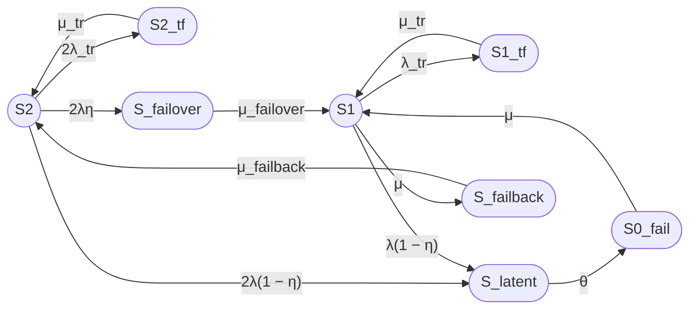

# Модель надежности двухузлового кластера 8/2

## 1. Назначение модели

Рассматривается восстанавливаемый отказоустойчивый двухузловой кластер с нагруженным резервированием, одной ремонтной бригадой, временными сбоями (transient faults), скрытыми отказами (latent failures), а также операциями failover и failback.

Модель имеет восемь агрегированных состояний:

- $S_2$ — оба узла работоспособны, отказов нет;
- $S_1$ — один узел работоспособен, второй отказал и находится в ремонте;
- $S_{0\_fail}$ — оба узла отказали, кластер неработоспособен;
- $S_{2\_tf}$ — временный сбой одного из двух узлов, второй узел работоспособен;
- $S_{1\_tf}$ — временный сбой единственного работоспособного узла;
- $S_{latent}$ — скрытый отказ одного из работоспособных узлов (единое агрегированное состояние);
- $S_{failover}$ — отказ одного из узлов, выполняется failover на оставшийся узел (переход $S_2 \rightarrow S_1$);
- $S_{failback}$ — возврат восстановленного узла в конфигурацию кластера после ремонта (переход $S_1 \rightarrow S_2$).

Кластер считается работоспособным только в состояниях $S_2$ и $S_1$. Все остальные состояния считаются неработоспособными (кластер не предоставляет требуемую функцию).

---

## 2. Допущения

1. Узлы идентичны по надежности и ремонтопригодности.
2. Отказы узлов независимы, кроме агрегированного состояния $S_{latent}$, где скрытый отказ моделируется как единое состояние.
3. Время до постоянного отказа, временного сбоя, восстановления, failover, failback и обнаружения скрытого отказа имеет экспоненциальное распределение с соответствующими постоянными интенсивностями.
4. Используется нагруженное резервирование: оба узла функционируют и могут отказать в состоянии $S_2$.
5. Имеется одна ремонтная бригада, поэтому одновременно восстанавливается не более одного отказавшего узла.
6. Временные сбои устраняются перезапуском узла без физического ремонта (восстановление с интенсивностью $\mu_{tr}$).
7. Скрытый отказ не обнаруживается внутренним контролем; его выявление происходит только внешним периодическим контролем с интенсивностью $\theta$.
8. Failover и failback рассматриваются как отдельные транзитные состояния с конечными средними временами $T_{failover}$ и $T_{failback}$.
9. Обнаружение явных отказов происходит мгновенно с вероятностью $\eta$; с вероятностью $1 - \eta$ отказ становится скрытым.
10. Переходы между состояниями описываются непрерывной марковской цепью (CTMC).

---

## 3. Параметры модели

### 3.1 Интенсивности отказов и восстановлений

Обозначения:

- $\lambda$ — интенсивность постоянного отказа одного узла, $ч^{-1}$;
- $\lambda_{tr}$ — интенсивность временного сбоя одного узла, $ч^{-1}$;
- $\mu$ — интенсивность восстановления узла после постоянного отказа, $ч^{-1}$;
- $\mu_{tr}$ — интенсивность восстановления после временного сбоя (перезапуск), $ч^{-1}$;
- $\mu_{failover}$ — интенсивность завершения failover, $ч^{-1}$;
- $\mu_{failback}$ — интенсивность завершения failback, $ч^{-1}$;
- $\theta$ — интенсивность обнаружения скрытого отказа внешним контролем, $ч^{-1}$.

### 3.2 Параметры контроля отказов

- $\eta$ — вероятность мгновенного обнаружения отказа узла средствами внутреннего контроля;
- $1 - \eta$ — вероятность того, что отказ остается скрытым;
- $\theta$ — интенсивность обнаружения скрытого отказа внешним периодическим контролем;
- $T_{detect} = 1 / \theta$ — среднее время обнаружения скрытого отказа.

Для отказа одного из $n$ узлов:

- интенсивность мгновенно обнаруживаемого отказа: $n \lambda \eta$;
- интенсивность скрытого отказа: $n \lambda (1 - \eta)$.

### 3.3 Связь интенсивностей со средними временами

**Unicode:**

λ = 1 / MTBF

μ = 1 / MTTR

λ_tr = 1 / MTBF_tr

μ_tr = 1 / T_tr

μ_failover = 1 / T_failover

μ_failback = 1 / T_failback

θ = 1 / T_detect

**LaTeX:**

$$
\lambda = \frac{1}{MTBF}
$$

$$
\mu = \frac{1}{MTTR}
$$

$$
\lambda_{tr} = \frac{1}{MTBF_{tr}}
$$

$$
\mu_{tr} = \frac{1}{T_{tr}}
$$

$$
\mu_{failover} = \frac{1}{T_{failover}}
$$

$$
\mu_{failback} = \frac{1}{T_{failback}}
$$

$$
\theta = \frac{1}{T_{detect}}
$$

---

## 4. Состояния модели

| Состояние | Описание | Работоспособность кластера |
|---|---|---|
| $S_2$ | Оба узла работоспособны, отказов нет | Работоспособен |
| $S_1$ | Один узел работоспособен, второй отказал и находится в ремонте | Работоспособен |
| $S_{0\_fail}$ | Оба узла отказали, кластер неработоспособен | Неработоспособен |
| $S_{2\_tf}$ | Временный сбой одного из двух узлов, второй узел работоспособен | Неработоспособен (на время перезагрузки) |
| $S_{1\_tf}$ | Временный сбой единственного работоспособного узла | Неработоспособен (на время перезагрузки) |
| $S_{latent}$ | Скрытый отказ одного из работоспособных узлов | Неработоспособен |
| $S_{failover}$ | Отказ одного из узлов, выполняется failover на оставшийся узел | Неработоспособен (на время failover) |
| $S_{failback}$ | Возврат восстановленного узла в конфигурацию кластера после ремонта | Неработоспособен (на время failback) |

---

## 5. Группы состояний

| Группа | Состояния | Интерпретация |
|---|---|---|
| Работоспособные | $S_2$, $S_1$ | Кластер способен предоставлять требуемую функцию |
| Неработоспособные | $S_{0\_fail}$, $S_{2\_tf}$, $S_{1\_tf}$, $S_{latent}$, $S_{failover}$, $S_{failback}$ | Кластер не способен предоставлять требуемую функцию |

---

## 6. Граф состояний

---

## 7. Переходы между состояниями

| Исходное состояние | Конечное состояние | Интенсивность | Смысл перехода |
|---|---|---:|---|
| $S_2$ | $S_{2\_tf}$ | $2\lambda_{tr}$ | Временный сбой одного из двух узлов |
| $S_{2\_tf}$ | $S_2$ | $\mu_{tr}$ | Перезапуск узла после временного сбоя |
| $S_2$ | $S_{failover}$ | $2\lambda\eta$ | Мгновенно обнаруженный отказ одного из двух узлов, запуск failover |
| $S_2$ | $S_{latent}$ | $2\lambda(1 - \eta)$ | Скрытый отказ одного из двух узлов |
| $S_{failover}$ | $S_1$ | $\mu_{failover}$ | Завершение failover, переход в деградированный режим |
| $S_{latent}$ | $S_{0\_fail}$ | $\theta$ | Обнаружение скрытого отказа внешним контролем, переход в полный отказ |
| $S_1$ | $S_{1\_tf}$ | $\lambda_{tr}$ | Временный сбой единственного работоспособного узла |
| $S_{1\_tf}$ | $S_1$ | $\mu_{tr}$ | Перезапуск узла после временного сбоя |
| $S_1$ | $S_{latent}$ | $\lambda(1 - \eta)$ | Скрытый отказ единственного работоспособного узла |
| $S_1$ | $S_{failback}$ | $\mu$ | Восстановление отказавшего узла, запуск failback |
| $S_{failback}$ | $S_2$ | $\mu_{failback}$ | Завершение failback, возврат к полной конфигурации |
| $S_{0\_fail}$ | $S_1$ | $\mu$ | Восстановление одного из двух отказавших узлов |

---

## 8. Матрица генератора CTMC

Порядок состояний:

$$
[S_2,\ S_1,\ S_{0\_fail},\ S_{2\_tf},\ S_{1\_tf},\ S_{latent},\ S_{failover},\ S_{failback}]
$$

Обозначим интенсивности:

- из $S_2$:
  - $a_1 = 2\lambda_{tr}$ (в $S_{2\_tf}$);
  - $a_2 = 2\lambda\eta$ (в $S_{failover}$);
  - $a_3 = 2\lambda(1 - \eta)$ (в $S_{latent}$);
  - сумма исходящих: $A = a_1 + a_2 + a_3 = 2\lambda_{tr} + 2\lambda\eta + 2\lambda(1 - \eta) = 2\lambda_{tr} + 2\lambda$.

- из $S_1$:
  - $b_1 = \lambda_{tr}$ (в $S_{1\_tf}$);
  - $b_2 = \lambda(1 - \eta)$ (в $S_{latent}$);
  - $b_3 = \mu$ (в $S_{failback}$);
  - сумма исходящих: $B = b_1 + b_2 + b_3 = \lambda_{tr} + \lambda(1 - \eta) + \mu$.

- из $S_{0\_fail}$:
  - $c_1 = \mu$ (в $S_1$);
  - сумма исходящих: $C = \mu$.

- из $S_{2\_tf}$:
  - $d_1 = \mu_{tr}$ (в $S_2$);
  - сумма исходящих: $D = \mu_{tr}$.

- из $S_{1\_tf}$:
  - $e_1 = \mu_{tr}$ (в $S_1$);
  - сумма исходящих: $E = \mu_{tr}$.

- из $S_{latent}$:
  - $f_1 = \theta$ (в $S_{0\_fail}$);
  - сумма исходящих: $F = \theta$.

- из $S_{failover}$:
  - $g_1 = \mu_{failover}$ (в $S_1$);
  - сумма исходящих: $G = \mu_{failover}$.

- из $S_{failback}$:
  - $h_1 = \mu_{failback}$ (в $S_2$);
  - сумма исходящих: $H = \mu_{failback}$.

Матрица генератора $Q$ (строки — из, столбцы — в):

$$
Q =
\begin{pmatrix}
-A & 0 & 0 & a_1 & 0 & a_3 & a_2 & 0 \\
0 & -B & 0 & 0 & b_1 & b_2 & 0 & b_3 \\
0 & c_1 & -C & 0 & 0 & 0 & 0 & 0 \\
d_1 & 0 & 0 & -D & 0 & 0 & 0 & 0 \\
0 & e_1 & 0 & 0 & -E & 0 & 0 & 0 \\
0 & 0 & f_1 & 0 & 0 & -F & 0 & 0 \\
0 & g_1 & 0 & 0 & 0 & 0 & -G & 0 \\
h_1 & 0 & 0 & 0 & 0 & 0 & 0 & -H
\end{pmatrix}
$$

где:

$$
A = 2\lambda_{tr} + 2\lambda
$$

$$
B = \lambda_{tr} + \lambda(1 - \eta) + \mu
$$

$$
C = \mu,\quad
D = \mu_{tr},\quad
E = \mu_{tr},\quad
F = \theta,\quad
G = \mu_{failover},\quad
H = \mu_{failback}
$$

Диагональные элементы:

$$
q_{ii} = -\sum_{j \ne i} q_{ij}
$$

---

## 9. Стационарные уравнения

Обозначим стационарные вероятности:

- $P_2 = P(S_2)$;
- $P_1 = P(S_1)$;
- $P_0 = P(S_{0\_fail})$;
- $P_{2tf} = P(S_{2\_tf})$;
- $P_{1tf} = P(S_{1\_tf})$;
- $P_{L} = P(S_{latent})$;
- $P_{FO} = P(S_{failover})$;
- $P_{FB} = P(S_{failback})$.

Условие стационарности:

$$
\boldsymbol{P}Q = 0
$$

Нормировочное условие:

$$
P_2 + P_1 + P_0 + P_{2tf} + P_{1tf} + P_{L} + P_{FO} + P_{FB} = 1
$$

Запишем уравнения баланса для каждого состояния (приток = отток).

### 9.1 Уравнение для $S_2$

Приток в $S_2$:

- из $S_{2\_tf}$: $\mu_{tr} P_{2tf}$;
- из $S_{failback}$: $\mu_{failback} P_{FB}$.

Отток из $S_2$:

- в $S_{2\_tf}$: $2\lambda_{tr} P_2$;
- в $S_{failover}$: $2\lambda\eta P_2$;
- в $S_{latent}$: $2\lambda(1 - \eta) P_2$.

Уравнение:

$$
\mu_{tr} P_{2tf} + \mu_{failback} P_{FB} - (2\lambda_{tr} + 2\lambda) P_2 = 0
$$

### 9.2 Уравнение для $S_1$

Приток в $S_1$:

- из $S_{failover}$: $\mu_{failover} P_{FO}$;
- из $S_{1\_tf}$: $\mu_{tr} P_{1tf}$;
- из $S_{0\_fail}$: $\mu P_0$.

Отток из $S_1$:

- в $S_{1\_tf}$: $\lambda_{tr} P_1$;
- в $S_{latent}$: $\lambda(1 - \eta) P_1$;
- в $S_{failback}$: $\mu P_1$.

Уравнение:

$$
\mu_{failover} P_{FO} + \mu_{tr} P_{1tf} + \mu P_0 - (\lambda_{tr} + \lambda(1 - \eta) + \mu) P_1 = 0
$$

### 9.3 Уравнение для $S_{0\_fail}$

Приток в $S_{0\_fail}$:

- из $S_{latent}$: $\theta P_{L}$.

Отток из $S_{0\_fail}$:

- в $S_1$: $\mu P_0$.

Уравнение:

$$
\theta P_{L} - \mu P_0 = 0
$$

### 9.4 Уравнение для $S_{2\_tf}$

Приток в $S_{2\_tf}$:

- из $S_2$: $2\lambda_{tr} P_2$.

Отток из $S_{2\_tf}$:

- в $S_2$: $\mu_{tr} P_{2tf}$.

Уравнение:

$$
2\lambda_{tr} P_2 - \mu_{tr} P_{2tf} = 0
$$

### 9.5 Уравнение для $S_{1\_tf}$

Приток в $S_{1\_tf}$:

- из $S_1$: $\lambda_{tr} P_1$.

Отток из $S_{1\_tf}$:

- в $S_1$: $\mu_{tr} P_{1tf}$.

Уравнение:

$$
\lambda_{tr} P_1 - \mu_{tr} P_{1tf} = 0
$$

### 9.6 Уравнение для $S_{latent}$

Приток в $S_{latent}$:

- из $S_2$: $2\lambda(1 - \eta) P_2$;
- из $S_1$: $\lambda(1 - \eta) P_1$.

Отток из $S_{latent}$:

- в $S_{0\_fail}$: $\theta P_{L}$.

Уравнение:

$$
2\lambda(1 - \eta) P_2 + \lambda(1 - \eta) P_1 - \theta P_{L} = 0
$$

### 9.7 Уравнение для $S_{failover}$

Приток в $S_{failover}$:

- из $S_2$: $2\lambda\eta P_2$.

Отток из $S_{failover}$:

- в $S_1$: $\mu_{failover} P_{FO}$.

Уравнение:

$$
2\lambda\eta P_2 - \mu_{failover} P_{FO} = 0
$$

### 9.8 Уравнение для $S_{failback}$

Приток в $S_{failback}$:

- из $S_1$: $\mu P_1$.

Отток из $S_{failback}$:

- в $S_2$: $\mu_{failback} P_{FB}$.

Уравнение:

$$
\mu P_1 - \mu_{failback} P_{FB} = 0
$$

### 9.9 Нормировочное условие

$$
P_2 + P_1 + P_0 + P_{2tf} + P_{1tf} + P_{L} + P_{FO} + P_{FB} = 1
$$

---

## 10. Стационарные вероятности (аналитические выражения)

Из уравнений 9.4–9.8 выразим «вспомогательные» вероятности через $P_2$ и $P_1$.

### 10.1 Временные сбои

Из 9.4:

$$
P_{2tf} = \frac{2\lambda_{tr}}{\mu_{tr}} P_2
$$

Из 9.5:

$$
P_{1tf} = \frac{\lambda_{tr}}{\mu_{tr}} P_1
$$

### 10.2 Failover и failback

Из 9.7:

$$
P_{FO} = \frac{2\lambda\eta}{\mu_{failover}} P_2
$$

Из 9.8:

$$
P_{FB} = \frac{\mu}{\mu_{failback}} P_1
$$

### 10.3 Скрытые отказы и полный отказ

Из 9.3:

$$
P_0 = \frac{\theta}{\mu} P_{L}
$$

Из 9.6:

$$
\theta P_{L} = 2\lambda(1 - \eta) P_2 + \lambda(1 - \eta) P_1
$$

$$
P_{L} = \frac{2\lambda(1 - \eta)}{\theta} P_2 + \frac{\lambda(1 - \eta)}{\theta} P_1
$$

Тогда:

$$
P_0 = \frac{\theta}{\mu} P_{L}
$$

$$
P_0 = \frac{2\lambda(1 - \eta)}{\mu} P_2 + \frac{\lambda(1 - \eta)}{\mu} P_1
$$

### 10.4 Связь $P_1$ и $P_2$

Используем уравнение 9.2, подставив выражения для $P_{FO}$, $P_{1tf}$, $P_0$.

Уравнение 9.2:

$$
\mu_{failover} P_{FO} + \mu_{tr} P_{1tf} + \mu P_0 - (\lambda_{tr} + \lambda(1 - \eta) + \mu) P_1 = 0
$$

Подставляем выражения для $P_{FO}$, $P_{1tf}$, $P_0$:

$$
P_{FO} = \frac{2\lambda\eta}{\mu_{failover}} P_2
$$

$$
P_{1tf} = \frac{\lambda_{tr}}{\mu_{tr}} P_1
$$

$$
P_0 = \frac{2\lambda(1 - \eta)}{\mu} P_2 + \frac{\lambda(1 - \eta)}{\mu} P_1
$$

Тогда первое слагаемое:

$$
\mu_{failover} P_{FO} = \mu_{failover} \cdot \frac{2\lambda\eta}{\mu_{failover}} P_2 = 2\lambda\eta P_2
$$

Второе слагаемое:

$$
\mu_{tr} P_{1tf} = \mu_{tr} \cdot \frac{\lambda_{tr}}{\mu_{tr}} P_1 = \lambda_{tr} P_1
$$

Третье слагаемое:

$$
\mu P_0 = \mu \cdot \left( \frac{2\lambda(1 - \eta)}{\mu} P_2 + \frac{\lambda(1 - \eta)}{\mu} P_1 \right)
$$

$$
\mu P_0 = 2\lambda(1 - \eta) P_2 + \lambda(1 - \eta) P_1
$$

Подставляем все три слагаемых в уравнение 9.2:

$$
2\lambda\eta P_2 + \lambda_{tr} P_1 + 2\lambda(1 - \eta) P_2 + \lambda(1 - \eta) P_1 - (\lambda_{tr} + \lambda(1 - \eta) + \mu) P_1 = 0
$$

Группируем члены при $P_2$:

$$
2\lambda\eta P_2 + 2\lambda(1 - \eta) P_2 = 2\lambda P_2
$$

Группируем члены при $P_1$:

$$
\lambda_{tr} P_1 + \lambda(1 - \eta) P_1 - (\lambda_{tr} + \lambda(1 - \eta) + \mu) P_1 = -\mu P_1
$$

Получаем:

$$
2\lambda P_2 - \mu P_1 = 0
$$

Отсюда:

$$
P_1 = \frac{2\lambda}{\mu} P_2
$$

Это соотношение совпадает с базовой 3-состоянийной моделью и не зависит от $\eta$, $\lambda_{tr}$, $\mu_{tr}$, $\mu_{failover}$, $\mu_{failback}$, $\theta$.

### 10.5 Нормировка

Запишем все вероятности через $P_2$:

$$
P_1 = \frac{2\lambda}{\mu} P_2
$$

$$
P_{2tf} = \frac{2\lambda_{tr}}{\mu_{tr}} P_2
$$

$$
P_{1tf} = \frac{\lambda_{tr}}{\mu_{tr}} P_1 = \frac{\lambda_{tr}}{\mu_{tr}} \cdot \frac{2\lambda}{\mu} P_2
$$

$$
P_{FO} = \frac{2\lambda\eta}{\mu_{failover}} P_2
$$

$$
P_{FB} = \frac{\mu}{\mu_{failback}} P_1 = \frac{\mu}{\mu_{failback}} \cdot \frac{2\lambda}{\mu} P_2 = \frac{2\lambda}{\mu_{failback}} P_2
$$

$$
P_{L} = \frac{2\lambda(1 - \eta)}{\theta} P_2 + \frac{\lambda(1 - \eta)}{\theta} P_1
$$

$$
P_{L} = \frac{2\lambda(1 - \eta)}{\theta} P_2 + \frac{\lambda(1 - \eta)}{\theta} \cdot \frac{2\lambda}{\mu} P_2
$$

$$
P_{L} = \frac{2\lambda(1 - \eta)}{\theta} \left(1 + \frac{\lambda}{\mu}\right) P_2
$$

$$
P_0 = \frac{2\lambda(1 - \eta)}{\mu} P_2 + \frac{\lambda(1 - \eta)}{\mu} P_1
$$

$$
P_0 = \frac{2\lambda(1 - \eta)}{\mu} P_2 + \frac{\lambda(1 - \eta)}{\mu} \cdot \frac{2\lambda}{\mu} P_2
$$

$$
P_0 = \frac{2\lambda(1 - \eta)}{\mu} \left(1 + \frac{\lambda}{\mu}\right) P_2
$$

Нормировочное условие:

$$
P_2 + P_1 + P_0 + P_{2tf} + P_{1tf} + P_{L} + P_{FO} + P_{FB} = 1
$$

Подставляем все выражения через $P_2$ и выносим $P_2$:

$$
P_2 \cdot \Bigg[
1
+ \frac{2\lambda}{\mu}
+ \frac{2\lambda(1 - \eta)}{\mu} \left(1 + \frac{\lambda}{\mu}\right)
+ \frac{2\lambda_{tr}}{\mu_{tr}}
+ \frac{2\lambda\lambda_{tr}}{\mu \mu_{tr}}
+ \frac{2\lambda(1 - \eta)}{\theta} \left(1 + \frac{\lambda}{\mu}\right)
+ \frac{2\lambda\eta}{\mu_{failover}}
+ \frac{2\lambda}{\mu_{failback}}
\Bigg] = 1
$$

Обозначим знаменатель:

$$
D =
1
+ \frac{2\lambda}{\mu}
+ \frac{2\lambda(1 - \eta)}{\mu} \left(1 + \frac{\lambda}{\mu}\right)
+ \frac{2\lambda_{tr}}{\mu_{tr}}
+ \frac{2\lambda\lambda_{tr}}{\mu \mu_{tr}}
+ \frac{2\lambda(1 - \eta)}{\theta} \left(1 + \frac{\lambda}{\mu}\right)
+ \frac{2\lambda\eta}{\mu_{failover}}
+ \frac{2\lambda}{\mu_{failback}}
$$

**Примечание**.  
Тут возникает проблмема с LaTex:  
GitHub Markdown некорректно отображает многострочные формулы с `\\` и `+` на новых строках внутри одного `$$...$$`. Решение — записывать всю формулу в одну строку без переносов.  
Устраняем:

$$
P_2 \cdot \left[ 1 + \frac{2\lambda}{\mu} + \frac{2\lambda(1 - \eta)}{\mu} \left(1 + \frac{\lambda}{\mu}\right) + \frac{2\lambda_{tr}}{\mu_{tr}} + \frac{2\lambda\lambda_{tr}}{\mu \mu_{tr}} + \frac{2\lambda(1 - \eta)}{\theta} \left(1 + \frac{\lambda}{\mu}\right) + \frac{2\lambda\eta}{\mu_{failover}} + \frac{2\lambda}{\mu_{failback}} \right] = 1
$$

Обозначим знаменатель:

$$
D = 1 + \frac{2\lambda}{\mu} + \frac{2\lambda(1 - \eta)}{\mu} \left(1 + \frac{\lambda}{\mu}\right) + \frac{2\lambda_{tr}}{\mu_{tr}} + \frac{2\lambda\lambda_{tr}}{\mu \mu_{tr}} + \frac{2\lambda(1 - \eta)}{\theta} \left(1 + \frac{\lambda}{\mu}\right) + \frac{2\lambda\eta}{\mu_{failover}} + \frac{2\lambda}{\mu_{failback}}
$$
 
Конец **Примечания**. 

Тогда:

$$
P_2 = \frac{1}{D}
$$

Остальные вероятности выражаются через $P_2$ по формулам выше.

---

## 11. Стационарный коэффициент готовности

Работоспособными являются только состояния $S_2$ и $S_1$.

**Unicode:**

Кг,ст = P2 + P1

**LaTeX:**

$$
K_{\mathrm{г,ст}} = P_2 + P_1
$$

Подставим $P_1 = \frac{2\lambda}{\mu} P_2$:

**Unicode:**

Кг,ст = P2 (1 + 2λ/μ)

Кг,ст = (1 + 2λ/μ) / D

**LaTeX:**

$$
K_{\mathrm{г,ст}} = P_2 \left(1 + \frac{2\lambda}{\mu}\right)
$$

$$
K_{\mathrm{г,ст}} = \frac{1 + \frac{2\lambda}{\mu}}{D}
$$

где $D$ — знаменатель из раздела 10.5.

### 11.1 Формула через $\lambda$ и $\mu$ (развернутая)

**Unicode:**

D = 1 + 2λ/μ + 2λ(1 − η)/μ · (1 + λ/μ) + 2λ_tr/μ_tr + 2λλ_tr/(μ μ_tr) + 2λ(1 − η)/θ · (1 + λ/μ) + 2λη/μ_failover + 2λ/μ_failback

Кг,ст = (1 + 2λ/μ) / D

**LaTeX:**

$$
D =
1
+ \frac{2\lambda}{\mu}
+ \frac{2\lambda(1 - \eta)}{\mu} \left(1 + \frac{\lambda}{\mu}\right)
+ \frac{2\lambda_{tr}}{\mu_{tr}}
+ \frac{2\lambda\lambda_{tr}}{\mu \mu_{tr}}
+ \frac{2\lambda(1 - \eta)}{\theta} \left(1 + \frac{\lambda}{\mu}\right)
+ \frac{2\lambda\eta}{\mu_{failover}}
+ \frac{2\lambda}{\mu_{failback}}
$$

**Примечание**. Снова проблема.  
Устраняем::

$$
D = 1 + \frac{2\lambda}{\mu} + \frac{2\lambda(1 - \eta)}{\mu} \left(1 + \frac{\lambda}{\mu}\right) + \frac{2\lambda_{tr}}{\mu_{tr}} + \frac{2\lambda\lambda_{tr}}{\mu \mu_{tr}} + \frac{2\lambda(1 - \eta)}{\theta} \left(1 + \frac{\lambda}{\mu}\right) + \frac{2\lambda\eta}{\mu_{failover}} + \frac{2\lambda}{\mu_{failback}}
$$

Такая запись без переносов строк внутри `$$...$$` должна корректно отображаться в GitHub Markdown.

Конец **Примечания**

$$
K_{\mathrm{г,ст}} =
\frac{1 + \frac{2\lambda}{\mu}}{D}
$$

---

## 12. Численный пример

### 12.1 Исходные данные

| Параметр | Значение | Единицы |
|---|---|---|
| $MTBF$ одного узла | 30000 | ч |
| $MTTR$ одного узла | 24 | ч |
| $T_{failover}$ | 30 | с |
| $T_{failback}$ | 90 | с |
| $T_{tr}$ | 180 | с |
| $\eta$ | 0.99 | — |
| $T_{detect}$ | 8 | ч |
| $MTBF_{tr}$ (время между временными сбоями одного узла) | 8760 | ч |

Перевод секунд в часы:

- $T_{failover} = 30\ \text{с} = 30 / 3600 = 0.0083333\ \text{ч}$;
- $T_{failback} = 90\ \text{с} = 90 / 3600 = 0.025\ \text{ч}$;
- $T_{tr} = 180\ \text{с} = 180 / 3600 = 0.05\ \text{ч}$.

### 12.2 Интенсивности

**Unicode:**

λ = 1 / 30000 = 0.0000333333 ч⁻¹

μ = 1 / 24 = 0.0416667 ч⁻¹

λ_tr = 1 / 8760 = 0.000114155 ч⁻¹

μ_tr = 1 / 0.05 = 20 ч⁻¹

μ_failover = 1 / 0.0083333 = 120 ч⁻¹

μ_failback = 1 / 0.025 = 40 ч⁻¹

θ = 1 / 8 = 0.125 ч⁻¹

η = 0.99

**LaTeX:**

$$
\lambda = \frac{1}{30000} = 3.3333 \times 10^{-5}\ \text{ч}^{-1}
$$

$$
\mu = \frac{1}{24} = 0.0416667\ \text{ч}^{-1}
$$

$$
\lambda_{tr} = \frac{1}{8760} = 1.14155 \times 10^{-4}\ \text{ч}^{-1}
$$

$$
\mu_{tr} = \frac{1}{0.05} = 20\ \text{ч}^{-1}
$$

$$
\mu_{failover} = \frac{1}{0.0083333} = 120\ \text{ч}^{-1}
$$

$$
\mu_{failback} = \frac{1}{0.025} = 40\ \text{ч}^{-1}
$$

$$
\theta = \frac{1}{8} = 0.125\ \text{ч}^{-1}
$$

$$
\eta = 0.99
$$

### 12.3 Вспомогательные отношения

Вычислим отношения, входящие в $D$.

**Unicode:**

λ/μ = 0.0008

λ_tr/μ_tr = 0.000114155 / 20 = 5.70775e-06

λ/μ_tr = 3.3333e-05 / 20 = 1.6667e-06

λ/μ_failover = 3.3333e-05 / 120 = 2.7778e-07

λ/μ_failback = 3.3333e-05 / 40 = 8.3333e-07

λ/θ = 3.3333e-05 / 0.125 = 0.00026667

1 − η = 0.01

**LaTeX:**

$$
\frac{\lambda}{\mu} = 0.0008
$$

$$
\frac{\lambda_{tr}}{\mu_{tr}} = 5.70775 \times 10^{-6}
$$

$$
\frac{\lambda}{\mu_{tr}} = 1.6667 \times 10^{-6}
$$

$$
\frac{\lambda}{\mu_{failover}} = 2.7778 \times 10^{-7}
$$

$$
\frac{\lambda}{\mu_{failback}} = 8.3333 \times 10^{-7}
$$

$$
\frac{\lambda}{\theta} = 2.6667 \times 10^{-4}
$$

$$
1 - \eta = 0.01
$$

### 12.4 Слагаемые знаменателя $D$

Запишем $D$ по слагаемым:

$$
D =
1
+ \frac{2\lambda}{\mu}
+ \frac{2\lambda(1 - \eta)}{\mu} \left(1 + \frac{\lambda}{\mu}\right)
+ \frac{2\lambda_{tr}}{\mu_{tr}}
+ \frac{2\lambda\lambda_{tr}}{\mu \mu_{tr}}
+ \frac{2\lambda(1 - \eta)}{\theta} \left(1 + \frac{\lambda}{\mu}\right)
+ \frac{2\lambda\eta}{\mu_{failover}}
+ \frac{2\lambda}{\mu_{failback}}
$$

Вычислим каждое слагаемое.

**Unicode:**

D1 = 2λ/μ = 2 · 0.0008 = 0.0016

D2 = 2λ(1 − η)/μ · (1 + λ/μ) = 2 · 3.3333e-05 · 0.01 / 0.0416667 · (1 + 0.0008) = 1.60128e-05

D3 = 2λ_tr/μ_tr = 2 · 5.70775e-06 = 1.14155e-05

D4 = 2λλ_tr/(μ μ_tr) = 2 · (λ/μ) · (λ_tr/μ_tr) = 2 · 0.0008 · 5.70775e-06 = 9.1324e-09

D5 = 2λ(1 − η)/θ · (1 + λ/μ) = 2 · 3.3333e-05 · 0.01 / 0.125 · (1 + 0.0008) = 5.3387e-06

D6 = 2λη/μ_failover = 2 · 3.3333e-05 · 0.99 / 120 = 5.5000e-07

D7 = 2λ/μ_failback = 2 · 3.3333e-05 / 40 = 1.6667e-06

Сумма:

D = 1 + D1 + D2 + D3 + D4 + D5 + D6 + D7

D = 1 + 0.0016 + 1.60128e-05 + 1.14155e-05 + 9.1324e-09 + 5.3387e-06 + 5.5000e-07 + 1.6667e-06

D ≈ 1.00163497

**LaTeX:**

$$
D_1 = \frac{2\lambda}{\mu} = 0.0016
$$

$$
D_2 = \frac{2\lambda(1 - \eta)}{\mu} \left(1 + \frac{\lambda}{\mu}\right) \approx 1.60128 \times 10^{-5}
$$

$$
D_3 = \frac{2\lambda_{tr}}{\mu_{tr}} \approx 1.14155 \times 10^{-5}
$$

$$
D_4 = \frac{2\lambda\lambda_{tr}}{\mu \mu_{tr}} \approx 9.1324 \times 10^{-9}
$$

$$
D_5 = \frac{2\lambda(1 - \eta)}{\theta} \left(1 + \frac{\lambda}{\mu}\right) \approx 5.3387 \times 10^{-6}
$$

$$
D_6 = \frac{2\lambda\eta}{\mu_{failover}} \approx 5.5000 \times 10^{-7}
$$

$$
D_7 = \frac{2\lambda}{\mu_{failback}} \approx 1.6667 \times 10^{-6}
$$

$$
D \approx 1.00163497
$$

### 12.5 Стационарные вероятности

**Unicode:**

P2 = 1 / D = 1 / 1.00163497 = 0.998367

P1 = (2λ/μ) · P2 = 0.0016 · 0.998367 = 0.0015974

P2tf = (2λ_tr/μ_tr) · P2 = 1.14155e-05 · 0.998367 = 1.1397e-05

P1tf = (λ_tr/μ_tr) · (2λ/μ) · P2 = 5.70775e-06 · 0.0016 · 0.998367 = 9.117e-09

PFO = (2λη/μ_failover) · P2 = 5.5000e-07 · 0.998367 = 5.491e-07

PFB = (2λ/μ_failback) · P2 = 1.6667e-06 · 0.998367 = 1.664e-06

PL = 2λ(1 − η)/θ · (1 + λ/μ) · P2 = 5.3387e-06 · 0.998367 = 5.330e-06

P0 = 2λ(1 − η)/μ · (1 + λ/μ) · P2 = 1.60128e-05 · 0.998367 = 1.5987e-05

Проверка нормировки (сумма всех вероятностей):

P2 + P1 + P0 + P2tf + P1tf + PL + PFO + PFB ≈ 1

**LaTeX:**

$$
P_2 = \frac{1}{D} \approx 0.998367
$$

$$
P_1 = \frac{2\lambda}{\mu} P_2 \approx 0.0015974
$$

$$
P_{2tf} = \frac{2\lambda_{tr}}{\mu_{tr}} P_2 \approx 1.1397 \times 10^{-5}
$$

$$
P_{1tf} = \frac{\lambda_{tr}}{\mu_{tr}} \cdot \frac{2\lambda}{\mu} P_2 \approx 9.117 \times 10^{-9}
$$

$$
P_{FO} = \frac{2\lambda\eta}{\mu_{failover}} P_2 \approx 5.491 \times 10^{-7}
$$

$$
P_{FB} = \frac{2\lambda}{\mu_{failback}} P_2 \approx 1.664 \times 10^{-6}
$$

$$
P_{L} = \frac{2\lambda(1 - \eta)}{\theta} \left(1 + \frac{\lambda}{\mu}\right) P_2 \approx 5.330 \times 10^{-6}
$$

$$
P_0 = \frac{2\lambda(1 - \eta)}{\mu} \left(1 + \frac{\lambda}{\mu}\right) P_2 \approx 1.5987 \times 10^{-5}
$$

### 12.6 Коэффициент готовности

**Unicode:**

Кг,ст = P2 + P1

Кг,ст = 0.998367 + 0.0015974

Кг,ст = 0.9999644

**LaTeX:**

$$
K_{\mathrm{г,ст}} = P_2 + P_1
$$

$$
K_{\mathrm{г,ст}} \approx 0.998367 + 0.0015974 = 0.9999644
$$

Стационарная неготовность:

**Unicode:**

Uст = 1 - Кг,ст = 3.56e-05

**LaTeX:**

$$
U_{\mathrm{ст}} = 1 - K_{\mathrm{г,ст}} \approx 3.56 \times 10^{-5}
$$

### 12.7 Ожидаемый простой за год

При $T = 8760$ ч:

$$
T_{\mathrm{простой}} = T \cdot U_{\mathrm{ст}}
$$

$$
T_{\mathrm{простой}} = 8760 \cdot 3.56 \times 10^{-5} \approx 0.312\ \text{ч}
$$

$$
T_{\mathrm{простой}} \approx 18.7\ \text{мин}
$$

---

## 13. Ограничения модели

- Все времена до событий предполагаются экспоненциально распределенными (постоянные интенсивности).
- Отказы узлов считаются независимыми; не учитываются общие причины отказов (питание, сеть, СХД, гипервизор, площадка, версия ПО).
- Скрытый отказ агрегирован в одно состояние $S_{latent}$ независимо от того, из какого состояния ($S_2$ или $S_1$) произошел переход.
- Failover и failback моделируются как отдельные состояния с экспоненциальным временем; реальные процедуры могут иметь детерминированные или более сложные распределения.
- Временные сбои моделируются как переходы в отдельные неработоспособные состояния с экспоненциальным восстановлением; в реальности могут быть пакеты сбоев, коррелированные во времени.
- Одна ремонтная бригада: одновременно восстанавливается только один узел.
- Модель описывает стационарный режим ($t \rightarrow \infty$), переходные процессы не рассматриваются.
- Результат отражает техническую готовность кластера на уровне узлов, но не гарантирует доступность прикладного сервиса без учета зависимостей ПО, данных, сети и инфраструктуры.

---

## Итого

### Граф состояний

### Легенда состояний

| Состояние | Смысл |
|---|---|
| $S_2$ | Оба узла работоспособны |
| $S_1$ | Один узел работоспособен, второй в ремонте |
| $S_{0\_fail}$ | Оба узла отказали, кластер неработоспособен |
| $S_{2\_tf}$ | Временный сбой одного из двух узлов |
| $S_{1\_tf}$ | Временный сбой единственного работоспособного узла |
| $S_{latent}$ | Скрытый отказ одного из узлов |
| $S_{failover}$ | Выполняется failover при отказе узла |
| $S_{failback}$ | Выполняется failback после восстановления узла |

### Основные формулы

**Unicode:**

P1 = (2λ/μ) · P2

D = 1 + 2λ/μ + 2λ(1 − η)/μ · (1 + λ/μ) + 2λ_tr/μ_tr + 2λλ_tr/(μ μ_tr) + 2λ(1 − η)/θ · (1 + λ/μ) + 2λη/μ_failover + 2λ/μ_failback

P2 = 1 / D

Кг,ст = P2 + P1 = (1 + 2λ/μ) / D

**LaTeX:**

$$
P_1 = \frac{2\lambda}{\mu} P_2
$$

$$
D =
1
+ \frac{2\lambda}{\mu}
+ \frac{2\lambda(1 - \eta)}{\mu} \left(1 + \frac{\lambda}{\mu}\right)
+ \frac{2\lambda_{tr}}{\mu_{tr}}
+ \frac{2\lambda\lambda_{tr}}{\mu \mu_{tr}}
+ \frac{2\lambda(1 - \eta)}{\theta} \left(1 + \frac{\lambda}{\mu}\right)
+ \frac{2\lambda\eta}{\mu_{failover}}
+ \frac{2\lambda}{\mu_{failback}}
$$

$$
P_2 = \frac{1}{D}
$$

$$
K_{\mathrm{г,ст}} = P_2 + P_1 = \frac{1 + \frac{2\lambda}{\mu}}{D}
$$

### Численный результат

| Показатель | Значение |
|---|---:|
| $\lambda$ | $3.3333 \times 10^{-5}\ \text{ч}^{-1}$ |
| $\mu$ | $0.0416667\ \text{ч}^{-1}$ |
| $\lambda_{tr}$ | $1.14155 \times 10^{-4}\ \text{ч}^{-1}$ |
| $\mu_{tr}$ | $20\ \text{ч}^{-1}$ |
| $\mu_{failover}$ | $120\ \text{ч}^{-1}$ |
| $\mu_{failback}$ | $40\ \text{ч}^{-1}$ |
| $\theta$ | $0.125\ \text{ч}^{-1}$ |
| $\eta$ | 0.99 |
| $P_2$ | 0.998367 |
| $P_1$ | 0.0015974 |
| $P_{0\_fail}$ | $1.5987 \times 10^{-5}$ |
| $P_{2\_tf}$ | $1.1397 \times 10^{-5}$ |
| $P_{1\_tf}$ | $9.117 \times 10^{-9}$ |
| $P_{latent}$ | $5.330 \times 10^{-6}$ |
| $P_{failover}$ | $5.491 \times 10^{-7}$ |
| $P_{failback}$ | $1.664 \times 10^{-6}$ |
| $K_{\mathrm{г,ст}}$ | 0.9999644 |
| $U_{\mathrm{ст}}$ | $3.56 \times 10^{-5}$ |
| Ожидаемый простой за 8760 ч | около 18.7 мин |

### Ограничения модели

Модель не учитывает общие причины отказов, зависимости инфраструктуры и ПО, неэкспоненциальные распределения времен failover/failback/сбоев, задержки диагностики, переходную готовность и детали реализации кластеризации на уровне ПО.
