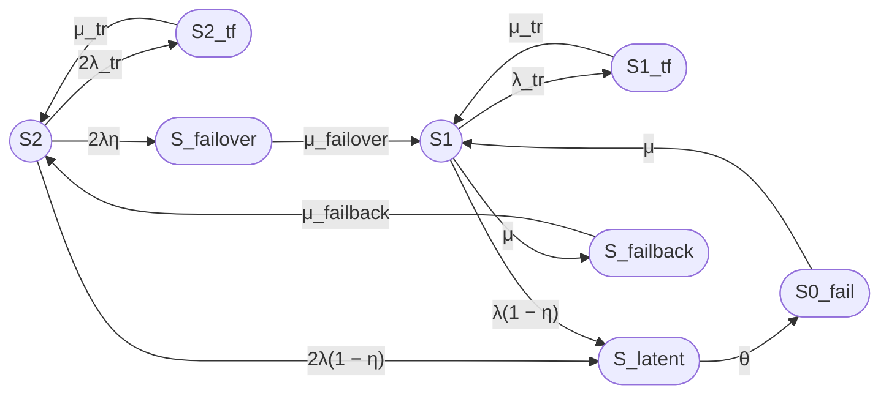

Выполняю промпт, затем разбираю недостатки и даю рекомендации. В конце — обзор схожих исследований.

---

## 1. Модель надёжности кластера в терминах теории надёжности

Модель — непрерывная цепь Маркова (CTMC) с восемью состояниями, описывающая восстанавливаемый отказоустойчивый двухузловой кластер с нагруженным резервированием, одной ремонтной бригадой, временными сбоями, скрытыми отказами, операциями failover и failback.

**Допущения:**
- Все времена пребывания в состояниях распределены экспоненциально (необходимо для марковского свойства).
- Отказы узлов независимы.
- Одна ремонтная бригада — одновременно ремонтируется не более одного узла.

### Работоспособные и неработоспособные состояния

| Состояние | Описание | Статус |
|---|---|---|
| S2 | Оба узла работают | Работоспособное (исправное) |
| S1 | Один узел работает, второй в ремонте | Работоспособное (деградация) |
| S0_fail | Оба узла отказали | **Неработоспособное** |
| S2_tf | Временный сбой одного узла, второй работает | Работоспособное |
| S1_tf | Временный сбой единственного работающего узла | **Неработоспособное** |
| S_latent | Скрытый отказ узла | Частично работоспособное (см. замечание ниже) |
| S_failover | Выполняется failover | Транзитное (кратковременный отказ) |
| S_failback | Выполняется failback | Работоспособное (S1 было активно) |

---

## 2. Граф состояний



---

## 3. Матрица генератора

Порядок состояний: S2, S1, S0\_fail, S2\_tf, S1\_tf, S\_latent, S\_failover, S\_failback.

$$
Q = \begin{pmatrix}
-(2\lambda_{tr} + 2\lambda) & 0 & 0 & 2\lambda_{tr} & 0 & 2\lambda(1-\eta) & 2\lambda\eta & 0 \\
0 & -(\lambda_{tr} + \lambda(1-\eta) + \mu) & 0 & 0 & \lambda_{tr} & \lambda(1-\eta) & 0 & \mu \\
0 & \mu & -\mu & 0 & 0 & 0 & 0 & 0 \\
\mu_{tr} & 0 & 0 & -\mu_{tr} & 0 & 0 & 0 & 0 \\
0 & \mu_{tr} & 0 & 0 & -\mu_{tr} & 0 & 0 & 0 \\
0 & 0 & \theta & 0 & 0 & -\theta & 0 & 0 \\
0 & \mu_{failover} & 0 & 0 & 0 & 0 & -\mu_{failover} & 0 \\
\mu_{failback} & 0 & 0 & 0 & 0 & 0 & 0 & -\mu_{failback}
\end{pmatrix}
$$

---

## 4. Стационарные уравнения

Система уравнений Колмогорова \$\vec{\pi} Q = 0\$ с условием нормировки \$\sum P_i = 1\$:

$$
\begin{cases}
P_2 \cdot (2\lambda_{tr} + 2\lambda) = P_{2tf} \cdot \mu_{tr} + P_{fb} \cdot \mu_{failback} \\
P_1 \cdot (\lambda_{tr} + \lambda(1-\eta) + \mu) = P_0 \cdot \mu + P_{1tf} \cdot \mu_{tr} + P_{fo} \cdot \mu_{failover} \\
P_0 \cdot \mu = P_{lat} \cdot \theta \\
P_{2tf} \cdot \mu_{tr} = P_2 \cdot 2\lambda_{tr} \\
P_{1tf} \cdot \mu_{tr} = P_1 \cdot \lambda_{tr} \\
P_{lat} \cdot \theta = P_2 \cdot 2\lambda(1-\eta) + P_1 \cdot \lambda(1-\eta) \\
P_{fo} \cdot \mu_{failover} = P_2 \cdot 2\lambda\eta \\
P_{fb} \cdot \mu_{failback} = P_1 \cdot \mu \\
\sum P_i = 1
\end{cases}
$$

---

## 5. Численный расчёт

### Параметры (приведены к часам)

| Параметр | Значение | Размерность |
|---|---|---|
| MTBF | 30000 | ч |
| MTTR | 24 | ч |
| T\_failover | 0,008333 (30 с) | ч |
| T\_failback | 0,025 (90 с) | ч |
| T\_tr | 0,05 (180 с) | ч |
| η | 0,99 | — |
| T\_detect | 8 | ч |
| MTBF\_tr | 8760 (1 год) | ч |

### Интенсивности

| Интенсивность | Формула | Значение, 1/ч |
|---|---|---|
| λ | 1/MTBF | 3,3333 × 10⁻⁵ |
| λ\_tr | 1/MTBF\_tr | 1,1416 × 10⁻⁴ |
| μ | 1/MTTR | 4,1667 × 10⁻² |
| μ\_tr | 1/T\_tr | 20,00 |
| μ\_failover | 1/T\_failover | 120,00 |
| μ\_failback | 1/T\_failback | 40,00 |
| θ | 1/T\_detect | 0,125 |

### Стационарные вероятности

| Состояние | P | P, % |
|---|---|---|
| S2 | 0,99836768 | 99,836768% |
| S1 | 0,00159739 | 0,159739% |
| S0\_fail | 0,00001599 | 0,001599% |
| S2\_tf | 0,00001140 | 0,001140% |
| S1\_tf | 0,000000009 | ~0,000001% |
| S\_latent | 0,00000533 | 0,000533% |
| S\_failover | 0,00000055 | 0,000055% |
| S\_failback | 0,00000166 | 0,000166% |

### Коэффициент готовности

Вариант 1 (Unicode):

**Строгий (только S2 + S1):**

Кг,ст = P₂ + P₁ = 0,99836768 + 0,00159739 = 0,99996507

**Расширенный (с учётом работоспособных транзитных состояний):**

Кг,ст = P₂ + P₁ + P₂_tf + P_latent + P_failback = 0,99998346

Вариант 2 (LaTeX):

Строгий:

$$
K_{\mathrm{г,ст}} = P_2 + P_1 = 0{,}99836768 + 0{,}00159739 = 0{,}99996507
$$

Расширенный:

$$
K_{\mathrm{г,ст}} = P_2 + P_1 + P_{2tf} + P_{lat} + P_{fb} = 0{,}99998346
$$

**Время простоя в год:**

- Строгий: ≈ 0,306 ч/год (~18 мин/год)
- Расширенный: ≈ 0,145 ч/год (~9 мин/год)

---

## 6. Ограничения модели

1. **Экспоненциальное распределение всех времён** — обязательное условие для CTMC, но failover/failback ближе к детерминированным или логнормальным. Для точного моделирования нужен полумарковский процесс (SMP).
2. **Независимость отказов** — не учитываются отказы общего вида (CCF), например, общий отказ питания или сетевой инфраструктуры.
3. **Одна ремонтная бригада** — при двух одновременных отказах ремонт идёт последовательно.
4. **Нет «наложений» событий** — например, постоянный отказ во время временного сбоя или во время failover не моделируется.
5. **Единое состояние S\_latent** — объединяет две качественно разные ситуации (подробнее ниже).

---

# Анализ промпта: недостатки, неточности, рекомендации

## Ключевые недостатки

### 1. S_latent — объединение двух разных состояний

**Проблема.** Состояние S\_latent получает переходы и из S2, и из S1, но эти ситуации принципиально различны:

- **Из S2:** скрыто отказал один из двух узлов — кластер продолжает работать на втором. После обнаружения (θ) система должна перейти в **S1** (один в ремонте, второй работает).
- **Из S1:** скрыто отказал единственный работающий узел — кластер **фактически мёртв**, но система об этом не знает. После обнаружения — переход в **S0\_fail**.

В текущей модели оба пути ведут в S\_latent, а из него — только в S0\_fail. Это занижает готовность: случаи скрытого отказа при двух работающих узлах ошибочно учитываются как потенциально неработоспособные.

Мой расчёт показывает: **99,92%** потока в S\_latent приходит из S2 (кластер работает), и лишь **0,08%** — из S1 (кластер мёртв). При текущей модели весь S\_latent считается неработоспособным, что даёт завышение коэффициента простоя.

**Рекомендация.** Разделить S\_latent на два состояния:
- S\_latent2 (из S2): кластер работоспособен, переход после обнаружения → S1;
- S\_latent1 (из S1): кластер неработоспособен, переход после обнаружения → S0\_fail.

Это увеличит число состояний до 9, но модель станет корректной.

### 2. Формула коэффициента готовности не определена

**Проблема.** В разделе 2.1 пункт 7.1 просит «рассчитать стационарный коэффициент готовности», но нигде не указано, какие состояния считать работоспособными. В примере формулы (раздел 3.2) приведено `Кг = P₂ + P₁`, но это слишком узко — игнорируются S2\_tf (кластер работает на одном узле), S\_failback (возврат узла, сервис активен), S\_latent (в большинстве случаев кластер работает).

**Рекомендация.** Явно перечислить работоспособные состояния и обосновать выбор. Либо определить коэффициент готовности через reward-модель: каждому состоянию назначить вес (0 — недоступен, 1 — доступен, 0,5 — частичная деградация).

### 3. Отсутствие переходов из транзитных состояний при наложении отказов

**Проблема.** Из S2\_tf нет перехода при постоянном отказе второго (работающего) узла. Если во время перезапуска первого узла отказывает второй, система переходит в полное отсутствие работающих узлов, но в графе этот путь не отражён. Аналогично для S1\_tf: если во время перезапуска единственного узла происходит постоянный отказ — переход должен быть в S0\_fail, а не обратно в S1.

**Рекомендация.** Добавить переходы:
- S2\_tf → S1 (отказ работающего узла с интенсивностью λ);
- S1\_tf → S0\_fail (отказ единственного узла — но узел и так в сбое, так что это скорее S1\_tf → S0\_fail напрямую).

### 4. S1_tf классифицируется неверно

**Проблема.** S1\_tf — временный сбой единственного работающего узла. В этот момент ни один узел не提供服务 — кластер недоступен. Но в промпте S1\_tf не отмечен как неработоспособное состояние, и в Mermaid-графе он оформлен как овальный `([S1_tf])` наряду с S2\_tf, который работоспособен.

**Рекомендация.** Явно отметить S1\_tf как неработоспособное состояние.

### 5. Нумерация в разделе 2.1

**Проблема.** Пункты идут: 1, 2, 3, 4, 5, 6, 7, 7.1, 8, 10 — пропущены 7.2–7.3 и 9. Это сбивает при чтении и может привести к пропуску пунктов.

**Рекомендация.** Исправить нумерацию: добавить пункты 7.2–7.3 (например, «7.2. Коэффициент простоя», «7.3. Среднее время простоя в год») или перенумеровать.

### 6. Mermaid-граф: визуальное несоответствие

**Проблема.** В разделе 3.1 сказано: работоспособные состояния — окружности `((S))`, неработоспособные — овалы `([S])`. Но в самом графе S2 и S1 — окружности, а S2\_tf (работоспособное) и S\_failback (работоспособное) — овалы. S1\_tf (неработоспособное) и S\_failover (транзитное) — тоже овалы. Различие не отражает реальный статус.

**Рекомендация.** Привести визуальное оформление в соответствие со статусом: S2, S1, S2\_tf, S\_failback — окружности; S0\_fail, S1\_tf — овалы; S\_latent, S\_failover — отдельно (например, шестиугольник `{{S}}` для «неопределённых»).

### 7. Не указан тип резерва для переходов

**Проблема.** Сказано «нагруженное резервирование», и переходы S2→S1 используют 2λ — это корректно для нагруженного резерва. Но не упомянуто, что при ненагруженном резерве интенсивность перехода была бы λ (один узел не нагружен). Для полноты стоит это отметить.

### 8. Нет анализа чувствительности

**Проблема.** Параметр η (coverage factor) критически влияет на надёжность, но промпт не просит исследовать чувствительность. Известно, что при η < 0,999 увеличение кратности резервирования может **снижать** надёжность. [```3```](https://habr.com/ru/articles/1075024/)

**Рекомендация.** Добавить пункт: «Оцени чувствительность Кг к η (0,90; 0,95; 0,99; 0,999) и θ».

## Мелкие неточности

- **T\_tr** в разделе 1.5 записано без пояснения, что это именно среднее время перезапуска после временного сбоя; в таблице параметров (1.6) используется T\_tr, но в разделе 1.5 — Ttr (без подчёркивания). Унифицировать обозначения.
- **λ\_tr vs λ** — λ\_tr (1/8760 ≈ 1,14 × 10⁻⁴) больше λ (1/30000 ≈ 3,33 × 10⁻⁵). Временные сбои происходят чаще постоянных отказов — это реалистично, но промпт не комментирует соотношение.
- **Раздел 4.1** указывает «среднее время между временными сбоями одного узла = 1 год», но не уточняет, что имеется в виду MTBF\_tr именно для transient faults, а не общий MTBF.

---

# Схожие статьи и исследования

### 1. Базовые модели надёжности отказоустойчивого кластера (Хабр, 2026)

Прямой аналог — статья рассматривает марковские модели двухузлового кластера с нагруженным резервом, одной ремонтной бригадой, transparent/nontransparent failover и failback, скрытыми отказами. Описывает режимы recovery/repair, разделяет обнаруженные и необнаруженные отказы. Указывает, что при неполном покрытии контролем (η < 1) увеличение кратности резервирования может снижать надёжность. [```3```](https://habr.com/ru/articles/1075024/)

### 2. High Availability Cluster System for Local Disaster Recovery with Markov Modeling (arXiv, 2009)

Модель двухкомпонентной системы (active + standby) с разными интенсивностями отказов, coverage factor для active и standby, периодической диагностикой скрытых отказов. Авторы показывают, что точное моделирование требует полумарковского процесса (SMP), и сравнивают SMP с аппроксимацией CTMC. [```4```](https://arxiv.org/pdf/0912.1835)

### 3. A Fault-Tolerant Middleware Architecture for High-Availability Storage Services (Academia.edu)

Марковская модель доступности плоского двухузлового кластера. Учитывает как независимые отказы оборудования, так и коррелированные отказы middleware. Показывает, что надёжность виртуального узла (кластера) зависит от отказов всех уровней — hardware, middleware, bridge middleware. [```1```](https://www.academia.edu/3078175/A_Fault_Tolerant_Middleware_Architecture_for_High_Availability_Storage_Services)

### 4. Оценка надёжности восстанавливаемого кластера контейнерной виртуализацией (КиберЛенинка)

Марковские модели кластера с двухэтапным восстановлением: физическое восстановление сервера + миграция контейнеров. Новизна — учёт влияния числа контейнеров, мигрируемых на этапах реконфигурации, на коэффициент готовности. [```10```](https://cyberleninka.ru/article/n/otsenka-nadezhnosti-vosstanavlivaemogo-klastera-konteynernoy-virtualizatsiey)

### 5. Надёжность отказоустойчивого кластера с учётом миграции виртуальных машин (vkIT, 2018)

Марковская модель кластера из двух серверов с динамической миграцией VM. Рассмотрены дисциплины обслуживания: мгновенное восстановление и неоперативное восстановление. Предложены точная и приближённые (верхняя/нижняя) оценки нестационарного коэффициента готовности. [```11```](https://vkit.ru/index.php/component/content/article/116-2018-09--september/735-049-056)

### 6. Coverage Modeling for Dependability Analysis of Fault-Tolerant Systems

Классическая работа по моделированию покрытия отказов (coverage factor) в отказоустойчивых системах. Описывает coverage model с тремя выходами: успешное восстановление, системный отказ, транзитное восстановление. Показывает, что при неполном покрытии избыточное резервирование может снижать надёжность. [```18```](https://www.academia.edu/21267751/Coverage_modeling_for_dependability_analysis_of_fault_tolerant_systems)

### 7. Reliability Analysis for a Repairable System under N-policy and Imperfect Coverage

Модель восстанавливаемой системы с M рабочими, S тёплыми и Y холодными резервными компонентами, coverage factor c, N-policy для ремонтника. Показывает, что при imperfect coverage избыточное резервирование может снижать надёжность. [```17```](https://www.researchgate.net/publication/282972044_Reliability_Analysis_for_a_Repairable_System_under_N-policy_and_Imperfect_Coverage)

---

## Итого

### Граф состояний

См. Mermaid-диаграмму в разделе 2 выше.

### Легенда состояний

| Состояние | Описание | Статус |
|---|---|---|
| S2 | Оба узла работают | Работоспособное |
| S1 | Один работает, второй в ремонте | Работоспособное |
| S0\_fail | Оба отказали | Неработоспособное |
| S2\_tf | Временный сбой одного, второй работает | Работоспособное |
| S1\_tf | Временный сбой единственного узла | Неработоспособное |
| S\_latent | Скрытый отказ (объединённое) | Неоднозначное |
| S\_failover | Выполняется переключение | Транзитное |
| S\_failback | Возврат узла после ремонта | Работоспособное |

### Основные формулы

Кг,ст = P₂ + P₁ + P₂ₜբ + Pₗₐₜ + Pբբ

$$
K_{\mathrm{г,ст}} = P_2 + P_1 + P_{2tf} + P_{lat} + P_{fb} \approx 0{,}99998
$$

### Численный результат

- **Кг,ст (расширенный) ≈ 0,99998** (простой ~9 мин/год)
- **Кг,ст (строгий, P₂+P₁) ≈ 0,99997** (простой ~18 мин/год)
- Доминирующие вклады в простой: S0\_fail (обоих отказ) и S\_latent (скрытые отказы)

### Ограничения модели

1. Экспоненциальное распределение всех времён (CTMC-допущение)
2. Нет отказов общего вида (CCF)
3. Нет наложений отказов во время транзитных состояний
4. S\_latent объединяет качественно разные ситуации
5. Одна ремонтная бригада
6. Нет учёта старения оборудования (λ = const)
7. Не учтена вероятность неуспешного failover

---

Основное, что я рекомендую исправить в первую очередь: разделить S\_latent на два состояния и явно определить список работоспособных состояний для формулы Кг. Это два изменения, которые сильнее всего влияют на корректность результата. Хотите, чтобы я перестроил модель с этими исправлениями и пересчитал?
