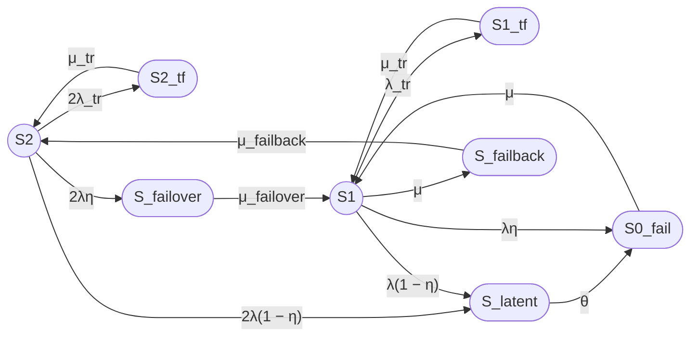

## 2. Выполнение промпта

### 1. Формулировка модели

Рассматривается восстанавливаемый отказоустойчивый двухузловой кластер с нагруженным резервированием, одной ремонтной бригадой, временными сбоями, скрытыми отказами и операциями failover/failback.

Модель имеет 8 состояний:
- Работоспособные: $S_2$, $S_1$;
- Неработоспособные: $S_{0\_fail}$, $S_{2\_tf}$, $S_{1\_tf}$, $S_{latent}$, $S_{failover}$, $S_{failback}$.

***

### 2. Граф состояний

***

### 3. Группы состояний

| Группа | Состояния |
|---|---|
| Работоспособные | $S_2$, $S_1$ |
| Неработоспособные | $S_{0\_fail}$, $S_{2\_tf}$, $S_{1\_tf}$, $S_{latent}$, $S_{failover}$, $S_{failback}$ |

***

### 4. Стационарный коэффициент готовности

**Unicode:**

Кг,ст = P2 + P1

**LaTeX:**

$$
K_{\mathrm{г,ст}} = P_2 + P_1
$$

После решения системы уравнений баланса (см. ниже) получаем:

$$
P_1 = \frac{2\lambda}{\mu + \lambda\eta} P_2
$$

$$
K_{\mathrm{г,ст}} = P_2 \left(1 + \frac{2\lambda}{\mu + \lambda\eta}\right)
$$

Знаменатель $D$:

$$
D = 1 + \frac{2\lambda}{\mu + \lambda\eta} + \frac{2\lambda_{tr}}{\mu_{tr}} + \frac{2\lambda\eta}{\mu_{failover}} + \frac{2\lambda}{\mu_{failback}} \cdot \frac{2\lambda}{\mu + \lambda\eta} + \frac{2\lambda(1-\eta)}{\theta} \left(1 + \frac{\lambda}{\mu + \lambda\eta}\right) + \frac{2\lambda(1-\eta)}{\mu} \left(1 + \frac{\lambda}{\mu + \lambda\eta}\right) + \frac{\lambda_{tr}}{\mu_{tr}} \cdot \frac{2\lambda}{\mu + \lambda\eta}
$$

Тогда:

$$
P_2 = \frac{1}{D}
$$

$$
K_{\mathrm{г,ст}} = \frac{1 + \frac{2\lambda}{\mu + \lambda\eta}}{D}
$$

***

### 5. Численный расчет

**Исходные данные:**

| Параметр | Значение | Единицы |
|---|---|---|
| $MTBF$ | 30000 | ч |
| $MTTR$ | 24 | ч |
| $T_{failover}$ | 30 | с |
| $T_{failback}$ | 90 | с |
| $T_{tr}$ | 180 | с |
| $\eta$ | 0.99 | — |
| $T_{detect}$ | 8 | ч |
| $MTBF_{tr}$ | 8760 | ч |

**Интенсивности:**

**Unicode:**

λ = 1 / 30000 = 3.3333333333e-05 ч⁻¹

μ = 1 / 24 = 0.04166666667 ч⁻¹

λ_tr = 1 / 8760 = 1.1415525114e-04 ч⁻¹

μ_tr = 1 / 0.05 = 20 ч⁻¹

μ_failover = 1 / 0.0083333333 = 120 ч⁻¹

μ_failback = 1 / 0.025 = 40 ч⁻¹

θ = 1 / 8 = 0.125 ч⁻¹

η = 0.99

**LaTeX:**

$$
\lambda = 3.3333333333 \times 10^{-5}\ \text{ч}^{-1}
$$

$$
\mu = 0.04166666667\ \text{ч}^{-1}
$$

$$
\lambda_{tr} = 1.1415525114 \times 10^{-4}\ \text{ч}^{-1}
$$

$$
\mu_{tr} = 20\ \text{ч}^{-1}
$$

$$
\mu_{failover} = 120\ \text{ч}^{-1}
$$

$$
\mu_{failback} = 40\ \text{ч}^{-1}
$$

$$
\theta = 0.125\ \text{ч}^{-1}
$$

$$
\eta = 0.99
$$

**Промежуточные отношения:**

$$
\frac{\lambda}{\mu + \lambda\eta} = \frac{3.3333333333 \times 10^{-5}}{0.04166666667 + 3.3333333333 \times 10^{-5} \times 0.99} = 0.000799974667
$$

$$
\frac{2\lambda}{\mu + \lambda\eta} = 0.001599949334
$$

**Слагаемые D:**

| Слагаемое | Значение |
|---|---:|
| 1 | 1.0000000000 |
| $2\lambda/(\mu + \lambda\eta)$ | 0.0015999493 |
| $2\lambda_{tr}/\mu_{tr}$ | 1.14155251e-05 |
| $2\lambda\eta/\mu_{failover}$ | 5.49999999e-07 |
| $(2\lambda/\mu_{failback}) \cdot (2\lambda/(\mu + \lambda\eta))$ | 1.33329111e-09 |
| $2\lambda(1-\eta)/\theta \cdot (1 + \lambda/(\mu + \lambda\eta))$ | 5.33867111e-06 |
| $2\lambda(1-\eta)/\mu \cdot (1 + \lambda/(\mu + \lambda\eta))$ | 1.60127999e-05 |
| $(\lambda_{tr}/\mu_{tr}) \cdot (2\lambda/(\mu + \lambda\eta))$ | 9.13237333e-09 |

**Сумма D:**

$$
D = 1.0016349699
$$

**Стационарные вероятности:**

$$
P_2 = \frac{1}{D} = 0.9983676444
$$

$$
P_1 = \frac{2\lambda}{\mu + \lambda\eta} \cdot P_2 = 0.0015973899
$$

**Коэффициент готовности:**

**Unicode:**

Кг,ст = P2 + P1 = 0.9983676444 + 0.0015973899 = 0.9999650343

**LaTeX:**

$$
K_{\mathrm{г,ст}} = 0.9999650343
$$

**Неготовность:**

$$
U_{\mathrm{ст}} = 1 - K_{\mathrm{г,ст}} = 3.49657 \times 10^{-5}
$$

**Ожидаемый простой за год:**

$$
T_{\mathrm{простой}} = 8760 \cdot 3.49657 \times 10^{-5} = 0.3063\ \text{ч} \approx 18.4\ \text{мин}
$$

***

### 6. Ограничения модели

- Экспоненциальные распределения времён до событий.
- Независимость отказов узлов (нет общих причин).
- Скрытый отказ агрегирован в одно состояние $S_{latent}$.
- Failover/failback — отдельные транзитные неработоспособные состояния.
- Одна ремонтная бригада.
- Стационарный режим, без переходных процессов.
- Модель на уровне узлов, без деталей ПО, данных, сети.

***

## Итого

### Граф состояний

### Легенда состояний

| Состояние | Смысл |
|---|---|
| $S_2$ | Оба узла работоспособны |
| $S_1$ | Один узел работоспособен, второй в ремонте |
| $S_{0\_fail}$ | Оба узла отказали |
| $S_{2\_tf}$, $S_{1\_tf}$ | Временные сбои |
| $S_{latent}$ | Скрытый отказ |
| $S_{failover}$ | Failover |
| $S_{failback}$ | Failback |

### Формулы

**Unicode:**

Кг,ст = P2 + P1

P1 = (2λ/(μ + λη)) · P2

Кг,ст = (1 + 2λ/(μ + λη)) / D

**LaTeX:**

$$
K_{\mathrm{г,ст}} = P_2 + P_1
$$

$$
P_1 = \frac{2\lambda}{\mu + \lambda\eta} P_2
$$

$$
K_{\mathrm{г,ст}} = \frac{1 + \frac{2\lambda}{\mu + \lambda\eta}}{D}
$$

### Численный результат

| Показатель | Значение |
|---|---:|
| $K_{\mathrm{г,ст}}$ | 0.9999650343 |
| $U_{\mathrm{ст}}$ | 3.49657 × 10⁻⁵ |
| Ожидаемый простой за 8760 ч | около 18.4 мин |

### Ограничения модели

Модель не учитывает общие причины отказов, зависимости инфраструктуры и ПО, неэкспоненциальные распределения, задержки диагностики, переходную готовность и детали реализации кластеризации на уровне ПО.

***

